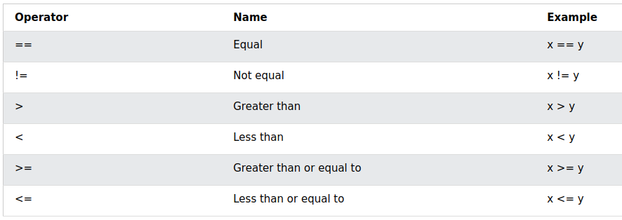
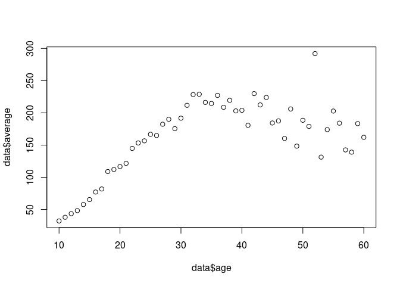

Basic Programming
================
Last Updated: 03, October, 2024 at 08:32

- [Basics of programming: variables and
  functions](#basics-of-programming-variables-and-functions)
- [Basic operations: R as a
  calculator](#basic-operations-r-as-a-calculator)
- [Logical operations](#logical-operations)
- [Storing data in variables](#storing-data-in-variables)
  - [Assigning data to a variable](#assigning-data-to-a-variable)
  - [Note on naming variables](#note-on-naming-variables)
  - [Trick 1: Using the up and down
    keys](#trick-1-using-the-up-and-down-keys)
  - [The vector](#the-vector)
- [Another trick](#another-trick)
- [Functions](#functions)
- [Flow control in R](#flow-control-in-r)
  - [Overview](#overview)
  - [The `if` statement](#the-if-statement)
  - [Overview of `if` statements](#overview-of-if-statements)
  - [The `for` loop](#the-for-loop)
  - [The `while` loop](#the-while-loop)
  - [The `break` keyword](#the-break-keyword)
- [Exercises](#exercises)
- [Note on vector preallocation](#note-on-vector-preallocation)
- [Working with text: the paste()
  function](#working-with-text-the-paste-function)
- [Solutions to exercises](#solutions-to-exercises)
  - [One](#one)
  - [Two](#two)
  - [Three](#three)
  - [Four](#four)

## Basics of programming: variables and functions

Programming is basically (1) storing data, (2) performing operations on
this data.

We will store data in so-called `variables`. We use `functions` to
perform operations on the data. We will also learn about `flow control`
which allows us to execute code depending on conditions or to repeat
code. Finally, `objects` combine data and functions.

## Basic operations: R as a calculator

R can perform the classic operations.

``` r
1 / 200 * 30
```

    ## [1] 0.15

``` r
(59 + 73 + 2) / 3
```

    ## [1] 44.66667

``` r
sin(pi / 2)
```

    ## [1] 1

## Logical operations

``` r
5 > 6
```

    ## [1] FALSE

``` r
5 + 1 == 6 #NOTE: I am using == to check equality!
```

    ## [1] TRUE

``` r
1234 != 1234
```

    ## [1] FALSE



## Storing data in variables

### Assigning data to a variable

R use `<-` to make assignments. This is a pain to type. You *could* use
`=` but it will cause confusion later on.

``` r
my_variable <- 5
```

Variables (also called values) come in many types (or classes). The very
basic ones are the following:

``` r
my_logical <- TRUE
my_character <- 'this is just a piece of text'
my_numeric <- 1.23455
```

These are very simple data types. We will often used much more complex
ones when working with actual data.

``` r
Name <- c("Jon", "Bill", "Maria", "Ben", "Tina")
Age <- c(23, 41, 32, 58, 26)
my_data_frame <- data.frame(Name, Age)
```

R studio shows `values` and `data` separately in the Environment window.
However, this is just a visualization used by R studio. **You can use
this window to inspect variables!**

### Note on naming variables

Try to use descriptive names for variables. And try to stick to a naming
convention that works for you - preferably one that makes your code easy
to read.

``` r
i_like_snake_case <- 'snake_case'
otherPeopleUseCamelCase <- 'CamelCase'
some.people.use.periods <- 'periods.are.allowed'
And_aFew.People_DONTLIKEconventions <- 'Madness, Madness, I tell you!'
```

From R for Data Science:

*There’s an implied contract between you and R: it will do the tedious
computation for you, but in return, you must be completely precise in
your instructions. Typos matter. Case matters.*

Also, it is important that you use names that are not keywords or
functions in R. For example, the following is a bad idea:

``` r
#length <- 15 ## THIS IS A BAD IDEA
```

### Trick 1: Using the up and down keys

You can use the up and down keys to navigate through the history of
commands you’ve entered. This is a very useful feature.

### The vector

R is another basic variable in R. It’s the simplest type of variable
that actually allows you to store something recognizable as ‘data’. We
will spend some time on vectors as they are a good place to start to
work with relatively simple data. Also, understanding how to work with
vectors makes working with more complex data easier. Much of the
operations you can do on vectors, which are 1D, can also be done on 2D
data frames.

#### Creating a vector manually

``` r
a_vector <- c(1, 5, 4, 9, 0) # Technically an atomic vector
another_one <- c(1, 5.4, TRUE, "hello") # Technically, this is a list
```

#### Creating a vector using the `:` operator

``` r
x <- 1:7
y <- 2:-2
```

#### Using `seq` to make a vector

``` r
step_size <- seq(1, 10, by=0.25)
length_specified <- seq(1, 10, length.out = 20)
```

#### Indexing vectors

Every item in a vector has an index. Vector indices in R start from 1,
unlike most programming languages where index start from 0.

``` r
my_longer_vector <- c(1, 2, 'three', '4', 'V', 6, 7, 8)
```

You can use the `[]` to select (multiple) elements from a vector.

``` r
my_single_element <- my_longer_vector[5]
the_start <- my_longer_vector[1:3]
my_part_of_vector <- my_longer_vector[c(1, 2, 5)] # I'm using a vector to select parts of a vector. Life is funny.
```

You can also use `[]` to overwrite a part of a vector

``` r
my_longer_vector[1:3] <- c('replace', 'this', 'now')
```

#### Logical vectors

``` r
vector1 <- c(1,5,6,7,2,3,5,4,6,8,1,9,0,1)
binary_vector <- vector1 > 5
binary_vector
```

    ##  [1] FALSE FALSE  TRUE  TRUE FALSE FALSE FALSE FALSE  TRUE  TRUE FALSE  TRUE
    ## [13] FALSE FALSE

``` r
some_other_vector <- seq(from = 0, to = 100, length.out = length(vector1))
selected <- some_other_vector[binary_vector]
selected
```

    ## [1] 15.38462 23.07692 61.53846 69.23077 84.61538

## Another trick

Before we go on, I want to share a simple trick. Using an IDE like
Rstudio makes life easier (or at least it should). One of the benefits
of the IDE is tab-completion.

\[DEMO GOES HERE\]

## Functions

Now we know how to store data, we can start manipulating the data using
functions.

Functions take 0 or more inputs (also called arguments), perform some
operation (i.e., the function of the function), and return some output.
This output can be complex and consist of multiple parts. This are
generic ways in which functions are used:

    output <- function_name(arg1 = val1, arg2 = val2, ...)
    output <- function_name(val1, val2, ...)

We’ve already encountered a function:

``` r
output<-seq(from = 1, to= 123, by = 0.123)
```

How do we know which arguments a function can take? Using the help:

``` r
?seq
```

Some very simple functions that might be useful.

``` r
a <- max(output)
b <- mean(output)
c <- min(output)
d <- ceiling(output)
e <- sd(output)
```

Here is a function which returns more complex data. At this point,
you’re not supposed to know what this function does (it fits a
regression line). The point is that it returns complex data with
multiple fields.

``` r
x <- runif(100)
y <- 10 + 5 * x + rnorm(100)
result <- lm(y ~ x)
print(result)
```

    ## 
    ## Call:
    ## lm(formula = y ~ x)
    ## 
    ## Coefficients:
    ## (Intercept)            x  
    ##       9.980        5.175

## Flow control in R

You could write all R scripts as a serial statements of functions.
However, to fully exploit the power of programming, you would need to
learn about flow control. Flow control refers to (1) executing bits of
code depending on a condition, and (2) iteratively executing pieces of
code.

This is a short script which does one thing after another.

``` r
data <- read.csv('data/wages1833.csv')
data$average <- ((data$mnum * data$mwage) + (data$fnum * data$fwage)) / (data$mnum + data$fnum)
model <- lm(data$average ~ data$age)
result <- summary(model)
plot(data$age, data$average )
```

<!-- -->

### Overview

<table style="width:99%;">
<caption>Uses of the different flow commands</caption>
<colgroup>
<col style="width: 8%" />
<col style="width: 25%" />
<col style="width: 32%" />
<col style="width: 31%" />
</colgroup>
<thead>
<tr class="header">
<th>Keyword</th>
<th>Use</th>
<th>Example 1</th>
<th>Example 2</th>
</tr>
</thead>
<tbody>
<tr class="odd">
<td><strong>if (or, else if)</strong></td>
<td>Execute some steps if a condition is true (or false)</td>
<td>If the value of a variable is larger than 5, print it to the
screen.</td>
<td>If the result of a statistical test is significant, add a symbol to
the graph.</td>
</tr>
<tr class="even">
<td><strong>For</strong></td>
<td>Repeat some steps for each item in collection, such as a
vector.</td>
<td>For each value in a vector, print the value to the screen.</td>
<td><strong><em>Repeat something exactly n times.</em></strong></td>
</tr>
<tr class="odd">
<td>While</td>
<td>Repeat some steps as long as something is true (or false).</td>
<td>As long as the value of a variable is smaller than 5, generate a new
value for it.</td>
<td><p>While your data has outliers, remove them.</p>
<p><br />
</p></td>
</tr>
</tbody>
</table>

Uses of the different flow commands

### The `if` statement

This is the basic anatomy of an if statement

    if (expression) {
       #statement to execute if condition is true
    }

Example:

``` r
my_number <-12

if (my_number < 20){
  x <- sprintf('%i is less than 20', my_number)
  print(x)
}
```

    ## [1] "12 is less than 20"

#### The `if else` statement

There is also an if-else variant of this,

``` r
a  <- -5
 
# condition
if(a > 0)
{
    print("Positive Number")
}else{
    print("negative number")
}
```

    ## [1] "negative number"

Rewriting the previous one on 1 line (maybe that makes it easier to
read?)

``` r
a  <- -5
 
# condition
if(a > 0){print("Positive Number")}else{print("negative number")}
```

    ## [1] "negative number"

#### The `else if` statement

``` r
a <- 200
b <- 33

if (b > a) {
  print("b is greater than a")
} else if (a == b) {
  print("a and b are equal")
} else {
  print("a is greater than b")
} 
```

    ## [1] "a is greater than b"

### Overview of `if` statements

- `if` Statement: use it to execute a block of code, if a specified
  condition is true
- `else` Statement: use it to execute a block of code, if the same
  condition is false
- `else if` Statement: use it to specify a new condition to test, if the
  first condition is

### The `for` loop

The `for` loop iterates over a sequence.

``` r
my_vector <- runif(5)
for (x in my_vector) {
  y <- x * 3
  print(y)
}
```

    ## [1] 1.235448
    ## [1] 2.440518
    ## [1] 2.75267
    ## [1] 0.2427084
    ## [1] 0.7390109

Just to drive the point home, another example:

``` r
fruits <- list("apple", "banana", "cherry")
for (x in fruits) {
  print(x)
} 
```

    ## [1] "apple"
    ## [1] "banana"
    ## [1] "cherry"

One very common use of the `for` loop is to iterate a bit of code
exactly n times.

``` r
number_of_time_i_want_to_repeat_this <-10
for (x in 1:10) {
  print('This is being repeated!')
} 
```

    ## [1] "This is being repeated!"
    ## [1] "This is being repeated!"
    ## [1] "This is being repeated!"
    ## [1] "This is being repeated!"
    ## [1] "This is being repeated!"
    ## [1] "This is being repeated!"
    ## [1] "This is being repeated!"
    ## [1] "This is being repeated!"
    ## [1] "This is being repeated!"
    ## [1] "This is being repeated!"

You can use a `break` statement to break the loop at any point.

``` r
number_of_time_i_want_to_repeat_this <-10
for (x in 1:10) {
  print('This is being repeated!')
  if (x > 7){
    print('I quit!')
    break
  }
} 
```

    ## [1] "This is being repeated!"
    ## [1] "This is being repeated!"
    ## [1] "This is being repeated!"
    ## [1] "This is being repeated!"
    ## [1] "This is being repeated!"
    ## [1] "This is being repeated!"
    ## [1] "This is being repeated!"
    ## [1] "This is being repeated!"
    ## [1] "I quit!"

### The `while` loop

The while repeats a piece of code if something is true and as long as it
is true.

``` r
i <- 1
while (i < 6) {
  print(i)
  i <- i + 1
} 
```

    ## [1] 1
    ## [1] 2
    ## [1] 3
    ## [1] 4
    ## [1] 5

### The `break` keyword

You can use `break` to exit a loop at any time

``` r
i <- 1
while (i < 100000) {
  print(i)
  i <- i + 1
  if (i > 5){break}
} 
```

    ## [1] 1
    ## [1] 2
    ## [1] 3
    ## [1] 4
    ## [1] 5

## Exercises

- Write a for loop that iterates over the numbers 1 to 7 and prints the
  cube of each number using `print()`.
- Write a while loop that prints out standard random normal numbers (use
  `rnorm()`) but stops (breaks) if you get a number bigger than 1.
- Using a for loop simulate the flip a coin twenty times, keeping track
  of the individual outcomes (1 = heads, 0 = tails) in a vector.
- Use a while loop to investigate the number of terms required before
  the series $1 \times 2 \times 3 \times ,\ldots$ reaches above 10
  million.

## Note on vector preallocation

This piece of code builds a vector by appending numbers to the end of
it.

``` r
repeats <- 10000
startTime <- Sys.time()
my_vector <- c()
for (i in 0:repeats){
  x <- runif(1)
  vector <- append(vector, x)
}
endTime <- Sys.time()
print(sprintf('Duration: %.2f', endTime - startTime))
```

    ## [1] "Duration: 0.47"

This piece of code preallocates a vector and is more efficient.

``` r
repeats <- 10000
startTime <- Sys.time()
my_vector <- numeric(repeats)
for (i in 0:repeats){
  x <- runif(1)
  vector[i] <- x
  }
endTime <- Sys.time()
print(sprintf('Duration: %.2f', endTime - startTime))
```

    ## [1] "Duration: 0.04"

# Working with text: the paste() function

``` r
x <- runif(100)
y <- 10 + 5 * x + rnorm(100)
result <- lm(y ~ x)
summary(result)
```

    ## 
    ## Call:
    ## lm(formula = y ~ x)
    ## 
    ## Residuals:
    ##      Min       1Q   Median       3Q      Max 
    ## -2.67839 -0.78987 -0.00973  0.65513  2.77230 
    ## 
    ## Coefficients:
    ##             Estimate Std. Error t value Pr(>|t|)    
    ## (Intercept)   9.9546     0.1904   52.27   <2e-16 ***
    ## x             5.1485     0.3640   14.15   <2e-16 ***
    ## ---
    ## Signif. codes:  0 '***' 0.001 '**' 0.01 '*' 0.05 '.' 0.1 ' ' 1
    ## 
    ## Residual standard error: 0.9903 on 98 degrees of freedom
    ## Multiple R-squared:  0.6713, Adjusted R-squared:  0.6679 
    ## F-statistic: 200.1 on 1 and 98 DF,  p-value: < 2.2e-16

``` r
test1 <- paste(10000)
test2<-paste(result$coefficients[1], result$coefficients[2], sep = ', ')
test3<-paste('The coefficients are: ', result$coefficients[1],  ', ', result$coefficients[2], sep='')
print(test1)
```

    ## [1] "10000"

``` r
print(test2)
```

    ## [1] "9.95460400492017, 5.14847844263705"

``` r
print(test3)
```

    ## [1] "The coefficients are: 9.95460400492017, 5.14847844263705"

``` r
for (x in 1:10) {print(test3)}
```

    ## [1] "The coefficients are: 9.95460400492017, 5.14847844263705"
    ## [1] "The coefficients are: 9.95460400492017, 5.14847844263705"
    ## [1] "The coefficients are: 9.95460400492017, 5.14847844263705"
    ## [1] "The coefficients are: 9.95460400492017, 5.14847844263705"
    ## [1] "The coefficients are: 9.95460400492017, 5.14847844263705"
    ## [1] "The coefficients are: 9.95460400492017, 5.14847844263705"
    ## [1] "The coefficients are: 9.95460400492017, 5.14847844263705"
    ## [1] "The coefficients are: 9.95460400492017, 5.14847844263705"
    ## [1] "The coefficients are: 9.95460400492017, 5.14847844263705"
    ## [1] "The coefficients are: 9.95460400492017, 5.14847844263705"

# Solutions to exercises

## One

Write a for loop that iterates over the numbers 1 to 7 and prints the
cube of each number using print().

``` r
for(i in 1:7){
  print(i^2)
  }
```

    ## [1] 1
    ## [1] 4
    ## [1] 9
    ## [1] 16
    ## [1] 25
    ## [1] 36
    ## [1] 49

## Two

Write a while loop that prints out standard random normal numbers (use
rnorm()) but stops (breaks) if you get a number bigger than 1.

Option 1

``` r
value <- 0
counter <-0
while(value < 1)
{
  value <- rnorm(1)
  counter <- counter + 1
}
print(value)
```

    ## [1] 1.657132

``` r
print(counter)
```

    ## [1] 1

Option 2

``` r
counter <-0
while(TRUE)
{
  value <- rnorm(1)
  counter <- counter + 1
  if (value > 1){break}
}
print(value)
```

    ## [1] 1.233584

``` r
print(counter)
```

    ## [1] 7

## Three

Using a for loop simulate the flip a coin twenty times, keeping track of
the individual outcomes (1 = heads, 0 = tails) in a vector.

``` r
repeats <- 20
outcomes <- character(repeats)
for(i in 1:repeats)
{
  outcome <- sample(c('H','T'), 1)
  outcomes[i] <- outcome
}
outcomes
```

    ##  [1] "H" "T" "T" "H" "T" "T" "H" "T" "T" "H" "H" "H" "H" "H" "T" "H" "T" "H" "H"
    ## [20] "T"

You could do this in one line (but that was not the exercise).

``` r
repeats <- 20
outcomes <- sample(c('H','T'), repeats, replace = TRUE)
outcomes
```

    ##  [1] "H" "T" "T" "H" "T" "H" "T" "H" "T" "T" "T" "H" "T" "T" "T" "H" "T" "T" "H"
    ## [20] "H"

## Four

Use a while loop to investigate the number of terms required before the
series 1 ,reaches above 10 million.

``` r
product <- 1
term <- 0

while(product < 10000000)
{
  term <- term + 1
  product <- product * term
  
}
print(term)
```

    ## [1] 11

``` r
# Check
1:term
```

    ##  [1]  1  2  3  4  5  6  7  8  9 10 11

``` r
cumprod(1:term)>10000000
```

    ##  [1] FALSE FALSE FALSE FALSE FALSE FALSE FALSE FALSE FALSE FALSE  TRUE
