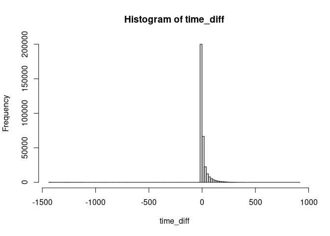

Cleaning Data
================
Last Updated: 24, October, 2024 at 08:45

- [Before we start…](#before-we-start)
- [Loading the tidyverse](#loading-the-tidyverse)
- [Some Simple Operations](#some-simple-operations)
  - [Opening Large Text Files](#opening-large-text-files)
  - [Detecting Errors in Data](#detecting-errors-in-data)
  - [Missing Data](#missing-data)
  - [Separating a column](#separating-a-column)
  - [Combining columns](#combining-columns)
- [Strings using `stringr`](#strings-using-stringr)
- [Time using `lubridate`](#time-using-lubridate)
  - [Creating a date from parts](#creating-a-date-from-parts)
  - [Specifying the time zone](#specifying-the-time-zone)
  - [Extracting parts of a date or
    time](#extracting-parts-of-a-date-or-time)
  - [Calculating Differences Between
    Dates/Times](#calculating-differences-between-datestimes)
- [Reorganizing data](#reorganizing-data)
  - [Loading some data](#loading-some-data)
  - [Grouping and summarizing data](#grouping-and-summarizing-data)
  - [Further processing](#further-processing)
  - [Note on dropping non-existing
    levels](#note-on-dropping-non-existing-levels)
  - [Converting to wide format](#converting-to-wide-format)
  - [Example: Titanic data](#example-titanic-data)
  - [Making data longer (melting
    data)](#making-data-longer-melting-data)
- [Merging data](#merging-data)
  - [Reading in the data](#reading-in-the-data)
  - [Merging the data](#merging-the-data)
- [Example: Global Health Data](#example-global-health-data)
  - [Questions A](#questions-a)
  - [Questions B](#questions-b)
  - [Solutions A](#solutions-a)
  - [Solutions B](#solutions-b)
- [Example: Social Security
  Applications](#example-social-security-applications)
  - [A reminder on `pivot_longer()`](#a-reminder-on-pivot_longer)
  - [Using `pivot_longer()`](#using-pivot_longer)
  - [Using `separate()`](#using-separate)
  - [Creating an `Other` column](#creating-an-other-column)
  - [Convert `Fiscal_Year` to year](#convert-fiscal_year-to-year)
  - [Create a date variable](#create-a-date-variable)
  - [Plots](#plots)
- [Example: Coal data](#example-coal-data)
  - [Change the first variable name](#change-the-first-variable-name)
  - [Convert to a long data format](#convert-to-a-long-data-format)
  - [Separate regions and countries](#separate-regions-and-countries)
- [Further exercises](#further-exercises)
  - [Voice-onset data](#voice-onset-data)
  - [Airline safety data](#airline-safety-data)

## Before we start…

Download the following data sets:

- `raw_depression.csv`
- `cars.txt`
- `DEMO_J.XPT`
- `INQ_J.XPT`
- `DUQ_J.XPT`
- `ssadisability.csv`
- `coal.csv`
- `vot.csv`
- `airline-safety.csv`
- `Titanic.csv`
- `adult.csv`

## Loading the tidyverse

Let’s load the tidyverse…

``` r
library(tidyverse)
```

    ## ── Attaching packages ─────────────────────────────────────── tidyverse 1.3.2 ──
    ## ✔ ggplot2 3.4.0      ✔ purrr   1.0.2 
    ## ✔ tibble  3.1.8      ✔ dplyr   1.0.10
    ## ✔ tidyr   1.2.1      ✔ stringr 1.4.1 
    ## ✔ readr   2.1.3      ✔ forcats 0.5.2 
    ## ── Conflicts ────────────────────────────────────────── tidyverse_conflicts() ──
    ## ✖ dplyr::filter() masks stats::filter()
    ## ✖ dplyr::lag()    masks stats::lag()

``` r
library(skimr)
```

## Some Simple Operations

### Opening Large Text Files

One of the most simple things you can do is inspect your data using a
text editor. When text files are large, it’s a good idea to get an
editor that can handle large files. I suggest [Sublime Text
Editor](https://www.sublimetext.com/). This editor can handle much
larger files than you can open (as text) in Rstudio. Keep the file open
while you’re cleaning it!

### Detecting Errors in Data

Errors can be most easily identified using graphs (See later). However,
some textual output might be useful as well.

Let’s read in some data (see `codebook.txt` for info about the
variables).

``` r
depression_data <- read_tsv('data/raw_depression.csv')
```

    ## Rows: 39775 Columns: 172
    ## ── Column specification ────────────────────────────────────────────────────────
    ## Delimiter: "\t"
    ## chr   (2): country, major
    ## dbl (170): Q1A, Q1I, Q1E, Q2A, Q2I, Q2E, Q3A, Q3I, Q3E, Q4A, Q4I, Q4E, Q5A, ...
    ## 
    ## ℹ Use `spec()` to retrieve the full column specification for this data.
    ## ℹ Specify the column types or set `show_col_types = FALSE` to quiet this message.

People have clearly made errors when entering their ages:

``` r
skim(depression_data$age)
```

|                                                  |                      |
|:-------------------------------------------------|:---------------------|
| Name                                             | depression_data\$age |
| Number of rows                                   | 39775                |
| Number of columns                                | 1                    |
| \_\_\_\_\_\_\_\_\_\_\_\_\_\_\_\_\_\_\_\_\_\_\_   |                      |
| Column type frequency:                           |                      |
| numeric                                          | 1                    |
| \_\_\_\_\_\_\_\_\_\_\_\_\_\_\_\_\_\_\_\_\_\_\_\_ |                      |
| Group variables                                  | None                 |

Data summary

**Variable type: numeric**

| skim_variable | n_missing | complete_rate |  mean |    sd |  p0 | p25 | p50 | p75 | p100 | hist  |
|:--------------|----------:|--------------:|------:|------:|----:|----:|----:|----:|-----:|:------|
| data          |         0 |             1 | 23.61 | 21.58 |  13 |  18 |  21 |  25 | 1998 | ▇▁▁▁▁ |

The histogram looks weird because of the very few, very high ages. We
*could* try to fix these by assuming, for example, that `1998` is the
birth year and not the age. For now, let’s just remove these entries.

``` r
hist(depression_data$age)
```

<!-- -->

``` r
dim(depression_data) # Get the dimensions of the data before filtering
```

    ## [1] 39775   172

``` r
filtered_depression_data <- filter(depression_data, age < 120)
dim(filtered_depression_data) # Get the dimensions of the data after filtering
```

    ## [1] 39770   172

``` r
hist(filtered_depression_data$age, breaks=100)
```

<!-- -->

Here is another visualization.

``` r
par(mfcol=c(1,2))
boxplot(depression_data$age)
boxplot(filtered_depression_data$age)
```

<!-- -->

Here is another problem with the data. We could try to fix this by
assuming that people have made mistakes when entering their family size.
Just as before, we could remove these entries.

``` r
hist(filtered_depression_data$familysize, breaks=100)
```

<!-- -->

``` r
summary(filtered_depression_data$familysize)
```

    ##    Min. 1st Qu.  Median    Mean 3rd Qu.    Max. 
    ##    0.00    2.00    3.00    3.51    4.00  133.00

``` r
filtered_depression_data <- filter(filtered_depression_data, familysize < 20)
hist(filtered_depression_data$familysize)
```

<!-- -->

``` r
summary(filtered_depression_data$familysize)
```

    ##    Min. 1st Qu.  Median    Mean 3rd Qu.    Max. 
    ##   0.000   2.000   3.000   3.498   4.000  19.000

Categorical data can also be messy. People entered their majors as free
text. And this is the result:

``` r
library(janitor)
```

    ## 
    ## Attaching package: 'janitor'

    ## The following objects are masked from 'package:stats':
    ## 
    ##     chisq.test, fisher.test

``` r
result <- tabyl(depression_data$major)
head(result, 50)
```

    ##                          depression_data$major  n      percent valid_percent
    ##                                              _  1 2.514142e-05  3.513827e-05
    ##                                              - 34 8.548083e-04  1.194701e-03
    ##                                             --  1 2.514142e-05  3.513827e-05
    ##                                            ---  1 2.514142e-05  3.513827e-05
    ##                                          -nil-  1 2.514142e-05  3.513827e-05
    ##                                            ???  1 2.514142e-05  3.513827e-05
    ##                                              .  1 2.514142e-05  3.513827e-05
    ##                                              /  2 5.028284e-05  7.027654e-05
    ##  &#1055;&#1089;&#1080;&#1093;&#1086;&#1083;&#1  1 2.514142e-05  3.513827e-05
    ##    &#1593;&#1604;&#1605; &#1606;&#1601;&#1587;  1 2.514142e-05  3.513827e-05
    ##       &#22810;&#23186;&#39636;&#35373;&#35336;  1 2.514142e-05  3.513827e-05
    ##                               &#28888;&#22521;  1 2.514142e-05  3.513827e-05
    ##                                  &#304;lahiyat  1 2.514142e-05  3.513827e-05
    ##                                              0  2 5.028284e-05  7.027654e-05
    ##                         1. Social work, 2. Law  1 2.514142e-05  3.513827e-05
    ##                                      12th arts  1 2.514142e-05  3.513827e-05
    ##                                             18  1 2.514142e-05  3.513827e-05
    ##                                             19  1 2.514142e-05  3.513827e-05
    ##  2 majors: Computer science and industrial eng  1 2.514142e-05  3.513827e-05
    ##                                   2D animation  1 2.514142e-05  3.513827e-05
    ##                                         2D Art  1 2.514142e-05  3.513827e-05
    ##                                   3D Animation  1 2.514142e-05  3.513827e-05
    ##                     3d animation, architecture  1 2.514142e-05  3.513827e-05
    ##                                             75  1 2.514142e-05  3.513827e-05
    ##                                        a level  1 2.514142e-05  3.513827e-05
    ##                                      A Teacher  1 2.514142e-05  3.513827e-05
    ##                                             AA  1 2.514142e-05  3.513827e-05
    ##                                           AADT  1 2.514142e-05  3.513827e-05
    ##                                       academic  1 2.514142e-05  3.513827e-05
    ##                                            Acc  1 2.514142e-05  3.513827e-05
    ##                                      Acc maybe  1 2.514142e-05  3.513827e-05
    ##                                           acca  1 2.514142e-05  3.513827e-05
    ##                                           Acca  2 5.028284e-05  7.027654e-05
    ##                                           ACCA  2 5.028284e-05  7.027654e-05
    ##     ACCA Professional Accounting Qualification  1 2.514142e-05  3.513827e-05
    ##                                    Accaountant  1 2.514142e-05  3.513827e-05
    ##                                     accauntant  1 2.514142e-05  3.513827e-05
    ##                                     Accontancy  1 2.514142e-05  3.513827e-05
    ##                                      accontant  1 2.514142e-05  3.513827e-05
    ##                               Acconting degree  1 2.514142e-05  3.513827e-05
    ##                                        Accoung  1 2.514142e-05  3.513827e-05
    ##                                     Accounring  1 2.514142e-05  3.513827e-05
    ##                                        account 22 5.531113e-04  7.730419e-04
    ##                                        Account 78 1.961031e-03  2.740785e-03
    ##                                        ACCOUNT  1 2.514142e-05  3.513827e-05
    ##                            account and finance  1 2.514142e-05  3.513827e-05
    ##                            Account and finance  2 5.028284e-05  7.027654e-05
    ##                                    Account ing  1 2.514142e-05  3.513827e-05
    ##                                     Accountacy  1 2.514142e-05  3.513827e-05
    ##                                      accountan  2 5.028284e-05  7.027654e-05

Cleaning this would be more laborious and will require text processing.
We will cover some of this later.

### Missing Data

R encodes missing values as `NA`. Missing values are contagious:
performing calculations on data that contains missing values often leads
to an `NA` result. Some functions are robust against missing values
(they simply ignore them). However, when a result comes back as `NA`
it’s often because the data contained missing values in the first place.

``` r
some_data <- c(1,2,3,4, NA)
mean(some_data)
```

    ## [1] NA

``` r
max(some_data)
```

    ## [1] NA

In the section on Filtering Data, we have covered how to filter out
missing values.

Tips from the field:

- When reading in a file, it’s a good idea to know how missing values
  are encoded so you can tell R which values to interpret as missing. We
  have covered this under “Reading Data”.
- Sometime people will use absurd values to indicate missing data. For
  example, they might enter -1 or 99999 when an age value is missing.
  These are then read by R as numbers and your calculations end up being
  nonsense. One way to catch this it by looking for outliers!

Here is an example of the last case.

``` r
income_data <- read_csv('data/adult.csv')
```

    ## Rows: 48842 Columns: 15
    ## ── Column specification ────────────────────────────────────────────────────────
    ## Delimiter: ","
    ## chr (9): workclass, education, marital-status, occupation, relationship, rac...
    ## dbl (6): age, fnlwgt, educational-num, capital-gain, capital-loss, hours-per...
    ## 
    ## ℹ Use `spec()` to retrieve the full column specification for this data.
    ## ℹ Specify the column types or set `show_col_types = FALSE` to quiet this message.

``` r
colnames(income_data) <- make.names(colnames(income_data))
```

It seems the value `9999` is used to indicate missing data for the
variable `capital gain`.

``` r
# Create a table for the various values for the variable 'capital-gain'
tbl<-tabyl(income_data$capital.gain)
# Show the last ten rows of tbl
tail(tbl)
```

    ##  income_data$capital.gain   n      percent
    ##                     25124   6 1.228451e-04
    ##                     25236  14 2.866385e-04
    ##                     27828  58 1.187503e-03
    ##                     34095   6 1.228451e-04
    ##                     41310   3 6.142255e-05
    ##                     99999 244 4.995700e-03

Likewise, the value `?` seems to be used to indicate missing data for
the variable `occupation`.

``` r
# Create a table for the various values for the variable 'occupation'
tbl <- tabyl(income_data$occupation)
head(tbl)
```

    ##  income_data$occupation    n      percent
    ##                       ? 2809 0.0575119774
    ##            Adm-clerical 5611 0.1148806355
    ##            Armed-Forces   15 0.0003071127
    ##            Craft-repair 6112 0.1251382007
    ##         Exec-managerial 6086 0.1246058720
    ##         Farming-fishing 1490 0.0305065313

### Separating a column

It happens more often that you would exspect that variables are combined
in one column. For example, the column
`Hospital.Referral.Region.Description` in the `inpatient` data set
combines the state and city of the hospital. We can separate this column
into two columns.

``` r
patient_data <-read_tsv('data/inpatient.tsv')
```

    ## Rows: 163065 Columns: 12
    ## ── Column specification ────────────────────────────────────────────────────────
    ## Delimiter: "\t"
    ## chr (10): DRG Definition, Provider Name, Provider Street Address, Provider C...
    ## dbl  (2): Provider Id, Total Discharges
    ## 
    ## ℹ Use `spec()` to retrieve the full column specification for this data.
    ## ℹ Specify the column types or set `show_col_types = FALSE` to quiet this message.

``` r
colnames(patient_data) <- make.names(colnames(patient_data))
head(patient_data, 5)
```

    ## # A tibble: 5 × 12
    ##   DRG.Definition Provi…¹ Provi…² Provi…³ Provi…⁴ Provi…⁵ Provi…⁶ Hospi…⁷ Total…⁸
    ##   <chr>            <dbl> <chr>   <chr>   <chr>   <chr>   <chr>   <chr>     <dbl>
    ## 1 039 - EXTRACR…   10001 SOUTHE… 1108 R… DOTHAN  AL      36301   AL - D…      91
    ## 2 039 - EXTRACR…   10005 MARSHA… 2505 U… BOAZ    AL      35957   AL - B…      14
    ## 3 039 - EXTRACR…   10006 ELIZA … 205 MA… FLOREN… AL      35631   AL - B…      24
    ## 4 039 - EXTRACR…   10011 ST VIN… 50 MED… BIRMIN… AL      35235   AL - B…      25
    ## 5 039 - EXTRACR…   10016 SHELBY… 1000 F… ALABAS… AL      35007   AL - B…      18
    ## # … with 3 more variables: Average.Covered.Charges <chr>,
    ## #   Average.Total.Payments <chr>, Average.Medicare.Payments <chr>, and
    ## #   abbreviated variable names ¹​Provider.Id, ²​Provider.Name,
    ## #   ³​Provider.Street.Address, ⁴​Provider.City, ⁵​Provider.State,
    ## #   ⁶​Provider.Zip.Code, ⁷​Hospital.Referral.Region.Description,
    ## #   ⁸​Total.Discharges

``` r
result <- tabyl(patient_data$Hospital.Referral.Region.Description)
head(result, 5)
```

    ##  patient_data$Hospital.Referral.Region.Description    n     percent
    ##                                     AK - Anchorage  231 0.001416613
    ##                                    AL - Birmingham 1881 0.011535277
    ##                                        AL - Dothan  340 0.002085058
    ##                                    AL - Huntsville  407 0.002495937
    ##                                        AL - Mobile  552 0.003385153

Let’s separate this column into two columns.

``` r
test <- separate(patient_data, Hospital.Referral.Region.Description, into=c('state', 'city'), sep='-')
```

    ## Warning: Expected 2 pieces. Additional pieces discarded in 791 rows [710, 711,
    ## 718, 830, 853, 1918, 1921, 1927, 1930, 1940, 2055, 2086, 3398, 3401, 3411, 3415,
    ## 3594, 3630, 5424, 5425, ...].

This resulted in some warnings in certain rows. Let’s look at some of
those rows.

``` r
patient_data$Hospital.Referral.Region.Description[710]
```

    ## [1] "NC - Winston-Salem"

``` r
patient_data$Hospital.Referral.Region.Description[711]
```

    ## [1] "NC - Winston-Salem"

``` r
patient_data$Hospital.Referral.Region.Description[1930]
```

    ## [1] "NC - Winston-Salem"

The problem seems to be that these rows contain values with more than
one `-`. Let’s look at an example of the results.

``` r
test$state[710]
```

    ## [1] "NC "

``` r
test$city[710]
```

    ## [1] " Winston"

It turns out that R has remove the second part of the city name. We can
fix this setting the `remove` argument to `FALSE`.

``` r
test <- separate(patient_data, Hospital.Referral.Region.Description, into=c('state', 'city'), sep=' - ', remove = FALSE)
```

No warnings anymore! Let’s look at an example of the results again.

``` r
test$state[710]
```

    ## [1] "NC"

``` r
test$city[710]
```

    ## [1] "Winston-Salem"

Note, you can use regular expression for the `sep` argument: [see
here.](https://cran.r-project.org/web/packages/stringr/vignettes/regular-expressions.html).
This allows you to separate columns based on more complex patterns.

### Combining columns

The opposite operation!

The remove argument in the `unite()` function specifies whether the
original columns should be removed after creating the new combined
column. So, the `remove` argument does something different than in the
`separate()` function.

- `remove = TRUE` (default): The original columns are removed from the
  data frame after combining them.
- `remove = FALSE`: The original columns are retained alongside the new
  combined column.

``` r
test <- unite(test, 'combined', c(Provider.Id, Provider.Name), sep='_+_', remove = FALSE)
head(test$combined, 3)
```

    ## [1] "10001_+_SOUTHEAST ALABAMA MEDICAL CENTER"
    ## [2] "10005_+_MARSHALL MEDICAL CENTER SOUTH"   
    ## [3] "10006_+_ELIZA COFFEE MEMORIAL HOSPITAL"

## Strings using `stringr`

It does happen that you need to clean textual data. The `stringr`
package has a bunch of functions to make your life easier (but not
easy). I will run through some examples but do have a look at the
[cheatsheet](https://evoldyn.gitlab.io/evomics-2018/ref-sheets/R_strings.pdf)
as well.

Remember this data? We will try to clean the `major` column to a certain
extent. We will convert the majors to lower case and try to find biology
majors. Fully cleaning this data would require a lot more work. But
perhaps it can now also be done using AI tools.

``` r
depression_data <- read_tsv('data/raw_depression.csv')
```

    ## Rows: 39775 Columns: 172
    ## ── Column specification ────────────────────────────────────────────────────────
    ## Delimiter: "\t"
    ## chr   (2): country, major
    ## dbl (170): Q1A, Q1I, Q1E, Q2A, Q2I, Q2E, Q3A, Q3I, Q3E, Q4A, Q4I, Q4E, Q5A, ...
    ## 
    ## ℹ Use `spec()` to retrieve the full column specification for this data.
    ## ℹ Specify the column types or set `show_col_types = FALSE` to quiet this message.

We have to load `stringr` separately.

``` r
library(stringr)
```

Let’s convert the majors to lower case.

``` r
head(depression_data$major, 10)
```

    ##  [1] NA                          NA                         
    ##  [3] NA                          "biology"                  
    ##  [5] "Psychology"                NA                         
    ##  [7] "Mechatronics engeenerieng" "Music"                    
    ##  [9] "Psychology"                "computer programming"

``` r
depression_data$major <- str_to_lower(depression_data$major)
head(depression_data$major, 10)
```

    ##  [1] NA                          NA                         
    ##  [3] NA                          "biology"                  
    ##  [5] "psychology"                NA                         
    ##  [7] "mechatronics engeenerieng" "music"                    
    ##  [9] "psychology"                "computer programming"

Let’s try to find biology majors. The code below creates a variable that
is `TRUE` if the major contains the string `bio`. Next, we filter the
data to only include biology students using this new variable.

``` r
depression_data$bio <- str_detect(depression_data$major, 'bio')
bio_students <- filter(depression_data, bio)
tabyl(bio_students$major)
```

    ##                             bio_students$major   n      percent
    ##                     agricultural biotechnology   1 0.0009615385
    ##                              animal biologists   1 0.0009615385
    ##                                 animal biology   2 0.0019230769
    ##                          anthropology, biology   1 0.0009615385
    ##                           applied biochemistry   1 0.0009615385
    ##              applied sciences in biotechnology   1 0.0009615385
    ##                                aquatic biology   1 0.0009615385
    ##                                            bio   3 0.0028846154
    ##                                bio engineering   3 0.0028846154
    ##                                      bio medic   1 0.0009615385
    ##                                   bio medicine   1 0.0009615385
    ##                                    bio pre-med   2 0.0019230769
    ##                                      bio psych   1 0.0009615385
    ##                                    bio science   1 0.0009615385
    ##                                  bio-composite   1 0.0009615385
    ##                       bio-composite technology   1 0.0009615385
    ##                                       bio-tech   1 0.0009615385
    ##                                        biochem   1 0.0009615385
    ##                                   biochemestry   1 0.0009615385
    ##                                    biochemical   1 0.0009615385
    ##                        biochemical engineering   4 0.0038461538
    ##          biochemical-biotechnology engineering   1 0.0009615385
    ##                                   biochemistry  64 0.0615384615
    ##                  biochemistry and cell biology   1 0.0009615385
    ##              biochemistry and computer science   1 0.0009615385
    ##                 biochemistry, physical therapy   1 0.0009615385
    ##                     biochemistry/biotechnology   1 0.0009615385
    ##                                    biochemisty   1 0.0009615385
    ##                        biochemisty and spanish   1 0.0009615385
    ##                        biocomposite technology   1 0.0009615385
    ##                                   biodiversity   2 0.0019230769
    ##                    biodiversity & conservation   1 0.0009615385
    ##                  biodiversity and conservation   2 0.0019230769
    ##                                 bioengineering   3 0.0028846154
    ##                              biohealth science   1 0.0009615385
    ##                                       bioilogy   1 0.0009615385
    ##                         bioindustry technology   1 0.0009615385
    ##                                 bioinformatics   5 0.0048076923
    ##                                          biolo   1 0.0009615385
    ##                                        biolofy   1 0.0009615385
    ##                      biological animal science   1 0.0009615385
    ##                        biological anthropology   2 0.0019230769
    ##                             biological science   4 0.0038461538
    ##                            biological sciences  13 0.0125000000
    ##                                      biologist   1 0.0009615385
    ##                                     biologists   1 0.0009615385
    ##                                        biology 459 0.4413461538
    ##                       biology & administrative   1 0.0009615385
    ##                        biology and archaeology   1 0.0009615385
    ##                          biology and chemistry   2 0.0019230769
    ##               biology and french, double-major   1 0.0009615385
    ##                            biology and history   1 0.0009615385
    ##              biology and philosophy dual major   1 0.0009615385
    ##                         biology and psychology   2 0.0019230769
    ##                              biology education   2 0.0019230769
    ##                           biology in education   1 0.0009615385
    ##                                 biology marine   1 0.0009615385
    ##                                biology science   2 0.0019230769
    ##                   biology w/ med lab specifics   1 0.0009615385
    ##                 biology, conflict, development   1 0.0009615385
    ##                                 biology, music   1 0.0009615385
    ##                             biology, sociology   1 0.0009615385
    ##                               biology, spanish   1 0.0009615385
    ##                               biology: pre-med   1 0.0009615385
    ##                        biology/ health science   1 0.0009615385
    ##                                biology/ premed   1 0.0009615385
    ##                    biology/business management   1 0.0009615385
    ##                                      biologyst   1 0.0009615385
    ##                                       biologyy   1 0.0009615385
    ##                                         biomed   2 0.0019230769
    ##                                 biomed science   1 0.0009615385
    ##                                     biomedical  21 0.0201923077
    ##              biomedical electrical engineering   1 0.0009615385
    ##              biomedical electronic engineering   2 0.0019230769
    ##             biomedical electronics engineering   1 0.0009615385
    ##                         biomedical engineering  31 0.0298076923
    ##                                  biomedical sc   1 0.0009615385
    ##                             biomedical science  53 0.0509615385
    ##                            biomedical sciences  12 0.0115384615
    ##                             biomedical sciencr   1 0.0009615385
    ##                          biomedical technology   1 0.0009615385
    ##                                    biomedicine  10 0.0096153846
    ##                                   biomolecular   1 0.0009615385
    ##                           biomolecular science   6 0.0057692308
    ##                            biomolecule science   1 0.0009615385
    ##                                     biophysics   2 0.0019230769
    ##                         bioprocess engineering   4 0.0038461538
    ##                          bioprocess technology   1 0.0009615385
    ##                                  bioprocessing   1 0.0009615385
    ##                                       biopsych   1 0.0009615385
    ##                                  biopsychology   1 0.0009615385
    ##                                     bioscience   2 0.0019230769
    ##                                    biosciences   2 0.0019230769
    ##                         biosystems engineering   1 0.0009615385
    ##                                        biotech   2 0.0019230769
    ##                            biotech engineering   3 0.0028846154
    ##                                biotechnologies   1 0.0009615385
    ##                                  biotechnology 111 0.1067307692
    ##                      biotechnology engineering   4 0.0038461538
    ##                         biotechnology resource   1 0.0009615385
    ##                                     bs biology   1 0.0009615385
    ##                     cell and molecular biology   1 0.0009615385
    ##            chemical and bioprocess engineering   1 0.0009615385
    ##                            ciências biológicas   1 0.0009615385
    ##                 computer science, biochemistry   1 0.0009615385
    ##  conservation and management of biodiversity (   1 0.0009615385
    ##                           conservation biology   4 0.0038461538
    ##                           ecology biodiversity   1 0.0009615385
    ##                               english, biology   1 0.0009615385
    ##                          environmental biology   1 0.0009615385
    ##                           evolutionary biology   1 0.0009615385
    ##                              fisheries biology   1 0.0009615385
    ##                             food biotechnology   6 0.0057692308
    ##                     forensic science & biology   1 0.0009615385
    ##                        health science/ biology   1 0.0009615385
    ##                                history/biology   1 0.0009615385
    ##                                  human biology   1 0.0009615385
    ##                             induatrial biology   1 0.0009615385
    ##                             industrial biology   1 0.0009615385
    ##  life science engineering (agriculture, biolog   1 0.0009615385
    ##                                 marine biology  12 0.0115384615
    ##                             medical bioscience   2 0.0019230769
    ##                        medical biotechnologies   1 0.0009615385
    ##                                micro-biologist   1 0.0009615385
    ##                                   microbiology  49 0.0471153846
    ##  microbiology (environmental psychology for ge   1 0.0009615385
    ##                     molecular and cell biology   1 0.0009615385
    ##                 molecular and cellular biology   1 0.0009615385
    ##                              molecular biology  11 0.0105769231
    ##                              molecular biotech   1 0.0009615385
    ##                                       neurobio   1 0.0009615385
    ##                                   neurobiology   1 0.0009615385
    ##                    neurobiology --> psychology   1 0.0009615385
    ##                          neuroscience, biology   1 0.0009615385
    ##                                nursing/biology   1 0.0009615385
    ##                                  paeleobiology   1 0.0009615385
    ##                         pharmacy, microbiology   1 0.0009615385
    ##   plant biotechnology (science and technology)   1 0.0009615385
    ##                    psychology or micro biology   1 0.0009615385
    ##                   psychology, english, biology   1 0.0009615385
    ##                             psychology/biology   1 0.0009615385
    ##                         resource biotechnology   1 0.0009615385
    ##                                science biology   6 0.0057692308
    ##                          science biotechnology   1 0.0009615385
    ##                             science in biology   1 0.0009615385
    ##                           science microbiology   2 0.0019230769
    ##                               wildlife biology   1 0.0009615385

That matched also biomedical, biochemistry students, and others which we
might not want to include. Let’s detect those using a regex (See
<https://regex101.com/> for a regex construction tool).

The code below creates a variable that is `TRUE` if the major contains
does *not* contain `chem`, `med`, `phys`, or `tech`.

``` r
depression_data$not_other <- !str_detect(depression_data$major, 'chem|med|phys|tech')
```

Let’s combine our two new columns. We multiply the two columns into a
new variable `selection` to get a new column that is `TRUE` if the major
contains `bio` and does not contain `chem`, `med`, `phys`, or `tech`.

``` r
depression_data <- mutate(depression_data, selection = not_other * bio)
bio_students <- filter(depression_data, selection==1)
tabyl(bio_students$major)
```

    ##                             bio_students$major   n     percent
    ##                              animal biologists   1 0.001494768
    ##                                 animal biology   2 0.002989537
    ##                          anthropology, biology   1 0.001494768
    ##                                aquatic biology   1 0.001494768
    ##                                            bio   3 0.004484305
    ##                                bio engineering   3 0.004484305
    ##                                      bio psych   1 0.001494768
    ##                                    bio science   1 0.001494768
    ##                                  bio-composite   1 0.001494768
    ##                                   biodiversity   2 0.002989537
    ##                    biodiversity & conservation   1 0.001494768
    ##                  biodiversity and conservation   2 0.002989537
    ##                                 bioengineering   3 0.004484305
    ##                              biohealth science   1 0.001494768
    ##                                       bioilogy   1 0.001494768
    ##                                 bioinformatics   5 0.007473842
    ##                                          biolo   1 0.001494768
    ##                                        biolofy   1 0.001494768
    ##                      biological animal science   1 0.001494768
    ##                        biological anthropology   2 0.002989537
    ##                             biological science   4 0.005979073
    ##                            biological sciences  13 0.019431988
    ##                                      biologist   1 0.001494768
    ##                                     biologists   1 0.001494768
    ##                                        biology 459 0.686098655
    ##                       biology & administrative   1 0.001494768
    ##                        biology and archaeology   1 0.001494768
    ##               biology and french, double-major   1 0.001494768
    ##                            biology and history   1 0.001494768
    ##              biology and philosophy dual major   1 0.001494768
    ##                         biology and psychology   2 0.002989537
    ##                              biology education   2 0.002989537
    ##                           biology in education   1 0.001494768
    ##                                 biology marine   1 0.001494768
    ##                                biology science   2 0.002989537
    ##                 biology, conflict, development   1 0.001494768
    ##                                 biology, music   1 0.001494768
    ##                             biology, sociology   1 0.001494768
    ##                               biology, spanish   1 0.001494768
    ##                        biology/ health science   1 0.001494768
    ##                    biology/business management   1 0.001494768
    ##                                      biologyst   1 0.001494768
    ##                                       biologyy   1 0.001494768
    ##                                   biomolecular   1 0.001494768
    ##                           biomolecular science   6 0.008968610
    ##                            biomolecule science   1 0.001494768
    ##                         bioprocess engineering   4 0.005979073
    ##                                  bioprocessing   1 0.001494768
    ##                                       biopsych   1 0.001494768
    ##                                  biopsychology   1 0.001494768
    ##                                     bioscience   2 0.002989537
    ##                                    biosciences   2 0.002989537
    ##                         biosystems engineering   1 0.001494768
    ##                                     bs biology   1 0.001494768
    ##                     cell and molecular biology   1 0.001494768
    ##                            ciências biológicas   1 0.001494768
    ##  conservation and management of biodiversity (   1 0.001494768
    ##                           conservation biology   4 0.005979073
    ##                           ecology biodiversity   1 0.001494768
    ##                               english, biology   1 0.001494768
    ##                          environmental biology   1 0.001494768
    ##                           evolutionary biology   1 0.001494768
    ##                              fisheries biology   1 0.001494768
    ##                     forensic science & biology   1 0.001494768
    ##                        health science/ biology   1 0.001494768
    ##                                history/biology   1 0.001494768
    ##                                  human biology   1 0.001494768
    ##                             induatrial biology   1 0.001494768
    ##                             industrial biology   1 0.001494768
    ##  life science engineering (agriculture, biolog   1 0.001494768
    ##                                 marine biology  12 0.017937220
    ##                                micro-biologist   1 0.001494768
    ##                                   microbiology  49 0.073243647
    ##  microbiology (environmental psychology for ge   1 0.001494768
    ##                     molecular and cell biology   1 0.001494768
    ##                 molecular and cellular biology   1 0.001494768
    ##                              molecular biology  11 0.016442451
    ##                                       neurobio   1 0.001494768
    ##                                   neurobiology   1 0.001494768
    ##                    neurobiology --> psychology   1 0.001494768
    ##                          neuroscience, biology   1 0.001494768
    ##                                nursing/biology   1 0.001494768
    ##                                  paeleobiology   1 0.001494768
    ##                         pharmacy, microbiology   1 0.001494768
    ##                    psychology or micro biology   1 0.001494768
    ##                   psychology, english, biology   1 0.001494768
    ##                             psychology/biology   1 0.001494768
    ##                                science biology   6 0.008968610
    ##                             science in biology   1 0.001494768
    ##                           science microbiology   2 0.002989537
    ##                               wildlife biology   1 0.001494768

## Time using `lubridate`

The ability to work with time is useful for many data sets. But this is
not trivial. For example, dates and times are specified in different
formats in different countries. And time zones can be a real headache.

The `lubridate` package is a great package for working with dates. It
makes it easy to extract parts of a date, calculate differences between
dates, and much more. We will cover some basic operations here.

``` r
library(nycflights13)
library(lubridate)
```

    ## Loading required package: timechange

    ## 
    ## Attaching package: 'lubridate'

    ## The following objects are masked from 'package:base':
    ## 
    ##     date, intersect, setdiff, union

``` r
# Load the flights dataset
data("flights")
# Inspect the structure
glimpse(flights)
```

    ## Rows: 336,776
    ## Columns: 19
    ## $ year           <int> 2013, 2013, 2013, 2013, 2013, 2013, 2013, 2013, 2013, 2…
    ## $ month          <int> 1, 1, 1, 1, 1, 1, 1, 1, 1, 1, 1, 1, 1, 1, 1, 1, 1, 1, 1…
    ## $ day            <int> 1, 1, 1, 1, 1, 1, 1, 1, 1, 1, 1, 1, 1, 1, 1, 1, 1, 1, 1…
    ## $ dep_time       <int> 517, 533, 542, 544, 554, 554, 555, 557, 557, 558, 558, …
    ## $ sched_dep_time <int> 515, 529, 540, 545, 600, 558, 600, 600, 600, 600, 600, …
    ## $ dep_delay      <dbl> 2, 4, 2, -1, -6, -4, -5, -3, -3, -2, -2, -2, -2, -2, -1…
    ## $ arr_time       <int> 830, 850, 923, 1004, 812, 740, 913, 709, 838, 753, 849,…
    ## $ sched_arr_time <int> 819, 830, 850, 1022, 837, 728, 854, 723, 846, 745, 851,…
    ## $ arr_delay      <dbl> 11, 20, 33, -18, -25, 12, 19, -14, -8, 8, -2, -3, 7, -1…
    ## $ carrier        <chr> "UA", "UA", "AA", "B6", "DL", "UA", "B6", "EV", "B6", "…
    ## $ flight         <int> 1545, 1714, 1141, 725, 461, 1696, 507, 5708, 79, 301, 4…
    ## $ tailnum        <chr> "N14228", "N24211", "N619AA", "N804JB", "N668DN", "N394…
    ## $ origin         <chr> "EWR", "LGA", "JFK", "JFK", "LGA", "EWR", "EWR", "LGA",…
    ## $ dest           <chr> "IAH", "IAH", "MIA", "BQN", "ATL", "ORD", "FLL", "IAD",…
    ## $ air_time       <dbl> 227, 227, 160, 183, 116, 150, 158, 53, 140, 138, 149, 1…
    ## $ distance       <dbl> 1400, 1416, 1089, 1576, 762, 719, 1065, 229, 944, 733, …
    ## $ hour           <dbl> 5, 5, 5, 5, 6, 5, 6, 6, 6, 6, 6, 6, 6, 6, 6, 5, 6, 6, 6…
    ## $ minute         <dbl> 15, 29, 40, 45, 0, 58, 0, 0, 0, 0, 0, 0, 0, 0, 0, 59, 0…
    ## $ time_hour      <dttm> 2013-01-01 05:00:00, 2013-01-01 05:00:00, 2013-01-01 0…

``` r
# View the first few rows
head(flights)
```

    ## # A tibble: 6 × 19
    ##    year month   day dep_time sched_dep…¹ dep_d…² arr_t…³ sched…⁴ arr_d…⁵ carrier
    ##   <int> <int> <int>    <int>       <int>   <dbl>   <int>   <int>   <dbl> <chr>  
    ## 1  2013     1     1      517         515       2     830     819      11 UA     
    ## 2  2013     1     1      533         529       4     850     830      20 UA     
    ## 3  2013     1     1      542         540       2     923     850      33 AA     
    ## 4  2013     1     1      544         545      -1    1004    1022     -18 B6     
    ## 5  2013     1     1      554         600      -6     812     837     -25 DL     
    ## 6  2013     1     1      554         558      -4     740     728      12 UA     
    ## # … with 9 more variables: flight <int>, tailnum <chr>, origin <chr>,
    ## #   dest <chr>, air_time <dbl>, distance <dbl>, hour <dbl>, minute <dbl>,
    ## #   time_hour <dttm>, and abbreviated variable names ¹​sched_dep_time,
    ## #   ²​dep_delay, ³​arr_time, ⁴​sched_arr_time, ⁵​arr_delay

This is the contents of the data:

| **Column**       | **Description**                                                                 |
|------------------|---------------------------------------------------------------------------------|
| `year`           | Year of the flight (all flights are from 2013).                                 |
| `month`          | Month of the flight (1 = January, 2 = February, etc.).                          |
| `day`            | Day of the month when the flight departed.                                      |
| `dep_time`       | Actual departure time in **local time** (HHMM format, e.g., 517 = 5:17 AM).     |
| `sched_dep_time` | Scheduled departure time in **local time** (HHMM format).                       |
| `dep_delay`      | Departure delay in **minutes** (positive = delayed, negative = early).          |
| `arr_time`       | Actual arrival time in **local time** (HHMM format).                            |
| `sched_arr_time` | Scheduled arrival time in **local time** (HHMM format).                         |
| `arr_delay`      | Arrival delay in **minutes** (positive = delayed, negative = early).            |
| `carrier`        | Two-letter airline carrier code (e.g., “AA” for American Airlines).             |
| `flight`         | Flight number.                                                                  |
| `tailnum`        | Tail number (aircraft registration number).                                     |
| `origin`         | Origin airport code (JFK = John F. Kennedy, LGA = LaGuardia, EWR = Newark).     |
| `dest`           | Destination airport code (e.g., “LAX” for Los Angeles).                         |
| `air_time`       | Flight time in **minutes**.                                                     |
| `distance`       | Distance flown in **miles**.                                                    |
| `hour`           | Scheduled departure hour (extracted from `sched_dep_time`).                     |
| `minute`         | Scheduled departure minute (extracted from `sched_dep_time`).                   |
| `time_hour`      | Scheduled departure time as a **POSIXct datetime object** (in local time zone). |

### Creating a date from parts

The `make_date()` function creates a date from parts. It takes the year,
month, and day as arguments. There is also a function `make_datetime()`
that includes the time. This function assumes that the time is in
24-hour format and returns the time as UTC.

**No place on Earth uses UTC as its local time zone. However, several
places operate on a time zone equivalent to UTC, meaning the local time
matches UTC.**

We will use this function together with the `mutate()` function to
create a new column `date` in the `flights` dataset.

``` r
flights <- mutate(flights, my_date1 = make_date(year, month, day))
flights <- mutate(flights, my_date2 = make_date(year, month))
flights <- mutate(flights, my_date3 = make_datetime(year, month, day))
```

If we don’t specify a day, the first day of the month is assumed. When
using the `make_time()` function and we don’t specify a time, midnight
is assumed.

``` r
flights$my_date1[10000]
```

    ## [1] "2013-01-12"

``` r
flights$my_date2[10000]
```

    ## [1] "2013-01-01"

``` r
flights$my_date3[10000]
```

    ## [1] "2013-01-12 UTC"

For fun, let’s also add the time of the flight to the date (hours and
minutes). To get the hour, we will divide the `dep_time` by 100 and
round down. To get the minutes, we will take the remainder of the
division by 100.

``` r
flights <- mutate(flights, hour = floor(dep_time / 100))
flights <- mutate(flights, minute = dep_time %% 100)
flights <- mutate(flights, my_date4 = make_datetime(year, month, day, hour, minute))
flights$my_date4[10000]
```

    ## [1] "2013-01-12 10:24:00 UTC"

### Specifying the time zone

The `airport` dataset contains information about the airports. The `tz`
column contains the time zone of the airport. We can use this
information to specify the time zone of the `my_date4` column.

``` r
data(airports)
# This is a line we will see later. Ignore it for now.
# It adds data from the airports dataset to the flights dataset.
flights_with_tz <- left_join(flights, airports, by = c("origin" = "faa"))
# The flights dataset now contains the time zone of the origin airport (tzone variable).

flights_with_tz <- mutate(flights_with_tz, my_date4 = make_datetime(year, month, day, hour, minute, tz = tzone))
flights_with_tz$my_date4[10000]
```

    ## [1] "2013-01-12 10:24:00 EST"

### Extracting parts of a date or time

Our `date` column is a `POSIXct` object. This implies that R knows that
this column contains dates and times, and it understands the format. The
following code shows that the column is indeed a `POSIXct` object.

``` r
class(flights_with_tz$my_date4)
```

    ## [1] "POSIXct" "POSIXt"

Therefore, We can directly extract parts of this object using the
`year()`, `month()`, `day()`, `hour()`, `minute()`, and `second()`
functions.

``` r
flights_with_tz <- mutate(flights_with_tz, extracted_year = year(my_date4))
```

However, if you read in a data file, times and dates are not always
recognized as such. In that case, you can use the `ymd()`, `mdy()`,
`dmy()`, `ymd_hms()`, `mdy_hms()`, and `dmy_hms()` functions to convert
the data to a `POSIXct` object.

We will demonstrate this using the time_hour column in the `flights`
dataset. This column contains the scheduled departure time as a
`POSIXct` object. However, we will convert it to a character vector
(text) and then back to a `POSIXct` object.

``` r
flights <- mutate(flights, time_text = as.character(time_hour))
# To make it clear that we are converting the existing posixct object to a character vector, we will also replace : with * and - with +, and spaces with _.
flights <- mutate(flights, time_text = str_replace_all(time_text, ':', '*'))
flights <- mutate(flights, time_text = str_replace_all(time_text, '-', '+'))
flights <- mutate(flights, time_text = str_replace_all(time_text, ' ', '_'))
```

Now we will convert the `time_text` column to a `POSIXct` object using
the `ymd_hms()` function. We use this function as the format is
`year+month+day_ hour*minute*second`. The `ymd_hms()` function is smart
enough to recognize this format, even though we have replaced the `:`
with `*` and the `-` with `+`.

``` r
flights <- mutate(flights, new_date_time = ymd_hms(time_text))
flights$new_date_time[10000]
```

    ## [1] "2013-01-12 10:00:00 UTC"

Note that we lost the time zone information when we converted the
`time_hour` column to a character vector. Therefore, the `new_date_time`
column does not contain time zone information. `ymd_hms()` can recognize
and correctly interpret a time zone if it’s provided in the string
itself, but the string must follow a specific ISO 8601 format or include
a valid time zone abbreviation/offset.

Here, we first add the strings from the

``` r
flights_with_tz <- mutate(flights_with_tz, time_text = as.character(time_hour))
flights_with_tz <- mutate(flights_with_tz, time_text = str_replace_all(time_text, ':', '*'))
flights_with_tz <- mutate(flights_with_tz, time_text = str_replace_all(time_text, '-', '+'))
flights_with_tz <- mutate(flights_with_tz, time_text = str_replace_all(time_text, ' ', '_'))

# Now append the time zone to the string
# We will use the tz variable that specifies an offset from UTC in hours and minutes.
# First we need to make sure that -5 is written as -05, etc. This is required for the ISO 8601 format.

converted <- sprintf("%+03d", flights_with_tz$tz)
flights_with_tz <- mutate(flights_with_tz, time_text = paste0(time_text, "*", converted))
flights_with_tz$time_text[1000]
```

    ## [1] "2013+01+02_08*00*00*-05"

Now we can demonstrate that `ymd_hms()` can recognize the time zone if
it’s provided in the string. Note that the time is converted to the UTC
time zone.

``` r
flights_with_tz$time_text[1000]
```

    ## [1] "2013+01+02_08*00*00*-05"

``` r
flights_with_tz <- mutate(flights_with_tz, new_date_time = ymd_hms(time_text))
flights_with_tz$new_date_time[1000]
```

    ## [1] "2013-01-02 13:00:00 UTC"

### Calculating Differences Between Dates/Times

Once R recognizes a time and date as such, calculating differences
between dates and times is easy. The `difftime()` function calculates
the difference between two dates or times. The result is a `difftime`
object that contains the difference in seconds. You can convert this to
other units using the `units` argument.

Let’s start with a silly example. Say, we want to know how long after
January 1, 2012 (noon), the each flight in the `flights` dataset was
scheduled.

``` r
# Let's create the date January 1, 2013
start_date <- ymd_hms("2012-01-01 12:00:00")
flights <- mutate(flights, time_diff = difftime(my_date4, start_date, units = "hours"))
head(flights$time_diff)
```

    ## Time differences in hours
    ## [1] 8777.283 8777.550 8777.700 8777.733 8777.900 8777.900

Let’s create a POSIXct time for the scheduled and the actual take off
time.

``` r
# First create the planned_hour and planned_minute columns
flights <- mutate(flights, planned_hour = floor(sched_dep_time / 100))
flights <- mutate(flights, planned_minute = sched_dep_time %% 100)
# Now create the planned_time column
flights <- mutate(flights, planned_time = make_datetime(year, month, day, planned_hour, planned_minute))

# Now create the actual_hour and actual_minute columns
flights <- mutate(flights, actual_hour = floor(dep_time / 100))
flights <- mutate(flights, actual_minute = dep_time %% 100)
# Now create the actual_time column
flights <- mutate(flights, actual_time = make_datetime(year, month, day, actual_hour, actual_minute))
```

Finally we can calculate the difference between the planned and actual
take off time. Here, we’ll calculate that difference in minutes.

``` r
flights <- mutate(flights, time_diff = difftime(actual_time, planned_time, units = "mins"))
head(flights$time_diff)
```

    ## Time differences in mins
    ## [1]  2  4  2 -1 -6 -4

Let’s look at the histogram of the time differences.

``` r
# Convert the time_diff column to numeric
time_diff <- as.numeric(flights$time_diff)
# Create a histogram
# Note that there are missing data. This is because there is missing data in the original data.
summary(time_diff)
```

    ##      Min.   1st Qu.    Median      Mean   3rd Qu.      Max.      NA's 
    ## -1438.000    -5.000    -2.000     7.348    10.000   911.000      8255

``` r
hist(time_diff, breaks=100)
```

<!-- -->
\### Filtering Data Based on Date/Time Ranges

The last thing we will see is how to filter data based on date/time
ranges. This is done using the `filter()` function.

Let’s say we want to filter the `flights` dataset to only include
flights that were scheduled between May 15 and May 20, 2013.

``` r
# Create the lower date
lower_date <- ymd("2013-05-15")
# Create the upper date
upper_date <- ymd("2013-05-20")
# Filter the data
filtered_flights <- filter(flights, my_date4 >= lower_date & my_date4 <= upper_date)
```

Now, we want to filter flights that were scheduled between 8:00 AM on
May 15 and 10:00 AM on May 20.

``` r
# Create the lower datetime
lower_date <- ymd_hms("2013-05-15 08:00:00")
# Create the upper datetime
upper_date <- ymd_hms("2013-05-20 10:00:00")
# Filter the data
filtered_flights <- filter(flights, my_date4 >= lower_date & my_date4 <= upper_date)
```

**Note that this last operation uses the UTC time.**

## Reorganizing data

Now, we will cover how to reorganize data. This is often necessary when
you want to summarize data or when you want to plot data. This is often
the final step before running the actual analysis.

### Loading some data

``` r
car_data <- read_delim('data/cars.txt', delim = ' ')
```

    ## Rows: 93 Columns: 26
    ## ── Column specification ────────────────────────────────────────────────────────
    ## Delimiter: " "
    ## chr  (6): make, model, type, cylinders, rearseat, luggage
    ## dbl (20): min_price, mid_price, max_price, mpg_city, mpg_hgw, airbag, drive,...
    ## 
    ## ℹ Use `spec()` to retrieve the full column specification for this data.
    ## ℹ Specify the column types or set `show_col_types = FALSE` to quiet this message.

### Grouping and summarizing data

The `group_by()` function takes a tibble and returns the same tibble,
but with some extra information so that any subsequent function acts on
each unique combination defined in the `group_by()`.

``` r
grouped <- group_by(car_data, type, make)
```

If you inspect the `grouped` tibble it seems the same as the `car_data`
tibble. However, it has stored the grouping we asked for.

``` r
groups(grouped)
```

    ## [[1]]
    ## type
    ## 
    ## [[2]]
    ## make

Now, you can use the `summarize()` function to get summary data for each
subgroup

``` r
summaries <- summarise(grouped, mean.length = mean(length))
```

    ## `summarise()` has grouped output by 'type'. You can override using the
    ## `.groups` argument.

``` r
summaries
```

    ## # A tibble: 81 × 3
    ## # Groups:   type [6]
    ##    type    make          mean.length
    ##    <chr>   <chr>               <dbl>
    ##  1 Compact Audi                  180
    ##  2 Compact Chevrolet             183
    ##  3 Compact Chrysler              183
    ##  4 Compact Dodge                 181
    ##  5 Compact Ford                  177
    ##  6 Compact Honda                 185
    ##  7 Compact Mazda                 184
    ##  8 Compact Mercedes-Benz         175
    ##  9 Compact Nissan                181
    ## 10 Compact Oldsmobile            188
    ## # … with 71 more rows

You can ask for more than one summary statistic.

``` r
summaries <- summarise(grouped, mean.length = mean(length), max.length = max(length), std_rpm = sd(rpm))
```

    ## `summarise()` has grouped output by 'type'. You can override using the
    ## `.groups` argument.

``` r
summaries
```

    ## # A tibble: 81 × 5
    ## # Groups:   type [6]
    ##    type    make          mean.length max.length std_rpm
    ##    <chr>   <chr>               <dbl>      <dbl>   <dbl>
    ##  1 Compact Audi                  180        180      NA
    ##  2 Compact Chevrolet             183        184       0
    ##  3 Compact Chrysler              183        183      NA
    ##  4 Compact Dodge                 181        181      NA
    ##  5 Compact Ford                  177        177      NA
    ##  6 Compact Honda                 185        185      NA
    ##  7 Compact Mazda                 184        184      NA
    ##  8 Compact Mercedes-Benz         175        175      NA
    ##  9 Compact Nissan                181        181      NA
    ## 10 Compact Oldsmobile            188        188      NA
    ## # … with 71 more rows

### Further processing

Keep in mind that, as the result of `summarize()` is a tibble, you can
use the data selection methods we saw earlier.

``` r
subset <- filter(summaries, make ==  'Ford')
head(subset)
```

    ## # A tibble: 6 × 5
    ## # Groups:   type [6]
    ##   type    make  mean.length max.length std_rpm
    ##   <chr>   <chr>       <dbl>      <dbl>   <dbl>
    ## 1 Compact Ford         177         177     NA 
    ## 2 Large   Ford         212         212     NA 
    ## 3 Midsize Ford         192         192     NA 
    ## 4 Small   Ford         156         171   1061.
    ## 5 Sporty  Ford         180.        180    636.
    ## 6 Van     Ford         176         176     NA

### Note on dropping non-existing levels

By default, the `group_by()` function drops non-existing combinations of
grouping variables.

``` r
grouped1 <- group_by(car_data, type, make)
c1<-count(grouped1)
summaries1 <- summarise(grouped, mean.length = mean(length))
```

    ## `summarise()` has grouped output by 'type'. You can override using the
    ## `.groups` argument.

``` r
dim(summaries1)
```

    ## [1] 81  3

Note: The message
`` summarise()` has grouped output by 'type'. You can override using the `.groups` argument. ``
just reminds us we grouped the data and the the summary statistics are
calculated for each group – which is exactly what we wanted.

However, this behavior can be changed using the `.drop = FALSE` argument
(and converting the variables to factors)

``` r
grouped2 <- group_by(car_data, as.factor(type), as.factor(make), .drop=FALSE)
c2<-count(grouped2)
summaries2 <- summarise(grouped2, mean.length = mean(length))
```

    ## `summarise()` has grouped output by 'as.factor(type)'. You can override using
    ## the `.groups` argument.

``` r
summaries2 <- complete(summaries2)
dim(summaries2)
```

    ## [1] 192   3

### Converting to wide format

Note: There is an alternative function to `pivot_wider()` called
`spread()`. However, `spread()` is deprecated and will be removed in the
future. We will use `pivot_wider()` instead.

The result can be reshaped into a wide format. *While this format is
often not suited for plotting or analysis*, it might make it easier to
look at the data. Here is a quick visual:


- **names_from: The variable whose values will become the new column
  names.**

Example: If you have a month column, each unique month value (e.g.,
“January”, “February”) will become a new column.

- **values_from: The variable whose values will populate the cells of
  the new columns.**

Example: If you have a sales column, the values from this column will
fill the corresponding cells in the new columns.

- **id_cols: The variables used as row identifiers.**

Example: If you have a store column, each row will correspond to a
unique store

The function also takes other arguments to handle more complex cases,
see <https://tidyr.tidyverse.org/reference/pivot_wider.html>

There is also a cheat sheet which you might find useful:
<https://github.com/rstudio/cheatsheets/blob/main/tidyr.pdf>

``` r
wide <- pivot_wider(summaries, id_cols = make, names_from  = type, values_from = mean.length)
head(wide)
```

    ## # A tibble: 6 × 7
    ##   make      Compact Large Midsize Small Sporty   Van
    ##   <chr>       <dbl> <dbl>   <dbl> <dbl>  <dbl> <dbl>
    ## 1 Audi          180    NA     193    NA    NA     NA
    ## 2 Chevrolet     183   214     198    NA   186    186
    ## 3 Chrysler      183   203      NA    NA    NA     NA
    ## 4 Dodge         181    NA     192   173   180    175
    ## 5 Ford          177   212     192   156   180.   176
    ## 6 Honda         185    NA      NA   173   175     NA

### Example: Titanic data

``` r
titanic <-read_csv('data/Titanic.csv', na='*')
```

    ## New names:
    ## Rows: 1313 Columns: 7
    ## ── Column specification
    ## ──────────────────────────────────────────────────────── Delimiter: "," chr
    ## (4): Name, PClass, Age, Sex dbl (3): ...1, Survived, SexCode
    ## ℹ Use `spec()` to retrieve the full column specification for this data. ℹ
    ## Specify the column types or set `show_col_types = FALSE` to quiet this message.
    ## • `` -> `...1`

``` r
grouped <- group_by(titanic, PClass, Sex)
survival <- summarise(grouped, proportion = mean(Survived), survivors = sum(Survived), total = length(Survived))
```

    ## `summarise()` has grouped output by 'PClass'. You can override using the
    ## `.groups` argument.

``` r
survival
```

    ## # A tibble: 7 × 5
    ## # Groups:   PClass [4]
    ##   PClass Sex    proportion survivors total
    ##   <chr>  <chr>       <dbl>     <dbl> <int>
    ## 1 1st    female      0.937       134   143
    ## 2 1st    male        0.330        59   179
    ## 3 2nd    female      0.879        94   107
    ## 4 2nd    male        0.145        25   172
    ## 5 3rd    female      0.377        80   212
    ## 6 3rd    male        0.116        58   499
    ## 7 <NA>   male        0             0     1

You could make the result into a wide table.

``` r
survival_wide <- pivot_wider(survival,  names_from = Sex, id_cols = PClass, values_from = proportion)
survival_wide
```

    ## # A tibble: 4 × 3
    ## # Groups:   PClass [4]
    ##   PClass female  male
    ##   <chr>   <dbl> <dbl>
    ## 1 1st     0.937 0.330
    ## 2 2nd     0.879 0.145
    ## 3 3rd     0.377 0.116
    ## 4 <NA>   NA     0

### Making data longer (melting data)

Note: There is an alternative function (`gather()`). However, the
`pivot_longer()` function is more powerful and easier to use and
`gather()` is deprecated.

Here is a quick graphic:


Let’s look at some data:

``` r
head(relig_income, 5)
```

    ## # A tibble: 5 × 11
    ##   religion       `<$10k` $10-2…¹ $20-3…² $30-4…³ $40-5…⁴ $50-7…⁵ $75-1…⁶ $100-…⁷
    ##   <chr>            <dbl>   <dbl>   <dbl>   <dbl>   <dbl>   <dbl>   <dbl>   <dbl>
    ## 1 Agnostic            27      34      60      81      76     137     122     109
    ## 2 Atheist             12      27      37      52      35      70      73      59
    ## 3 Buddhist            27      21      30      34      33      58      62      39
    ## 4 Catholic           418     617     732     670     638    1116     949     792
    ## 5 Don’t know/re…      15      14      15      11      10      35      21      17
    ## # … with 2 more variables: `>150k` <dbl>, `Don't know/refused` <dbl>, and
    ## #   abbreviated variable names ¹​`$10-20k`, ²​`$20-30k`, ³​`$30-40k`, ⁴​`$40-50k`,
    ## #   ⁵​`$50-75k`, ⁶​`$75-100k`, ⁷​`$100-150k`

This data is in a wider format. But we can easily melt it to a long
format.

``` r
new <- pivot_longer(relig_income, cols = !religion, names_to = "income", values_to = "count")
head(new, 5)
```

    ## # A tibble: 5 × 3
    ##   religion income  count
    ##   <chr>    <chr>   <dbl>
    ## 1 Agnostic <$10k      27
    ## 2 Agnostic $10-20k    34
    ## 3 Agnostic $20-30k    60
    ## 4 Agnostic $30-40k    81
    ## 5 Agnostic $40-50k    76

- **`cols`**: The columns you want to pivot from **wide to long**.
  - *Example*: If you have columns like `"January"`, `"February"`, and
    `"March"`, you would list these here to combine them into one.
- **`names_to`**: The name of the **new column** that will store the
  names of the original columns.
  - *Example*: If your original columns represent months, the new column
    could be called `"month"`.
- **`values_to`**: The name of the **new column** that will store the
  values from the original columns.
  - *Example*: If the original columns contain sales data, this new
    column could be called `"sales"`.

There is also a cheat sheet which you might find useful:
<https://github.com/rstudio/cheatsheets/blob/main/tidyr.pdf>

## Merging data

Merging is required if your data is spread across different tibbles.
This might be the case if you have different data sources or if you have
data that is split into different files. However, it might also arise
when you’ve split an existing data set in different tibbles for
preprocessing and analysis and then you want to merge the results back
together.

Here, we will use National Health and Nutrition Examination Survey data.
This is the [data
source](https://wwwn.cdc.gov/nchs/nhanes/continuousnhanes/default.aspx?BeginYear=2017).
See [here](https://wwwn.cdc.gov/Nchs/Nnyfs/Y_DEMO.htm) for more
information about the demographic variables.

These data are split into multiple files (based on topic). If we need
variables from different files, we can merge the different data subsets.

### Reading in the data

The data is in SAS Transport File Format. Therefore, we will use the
`haven` library to read it in.

``` r
library(haven)
demographics <- read_xpt('data/DEMO_J.XPT')
income <- read_xpt('data/INQ_J.XPT')
drugs <- read_xpt('data/DUQ_J.XPT')
```

There are many variables in each file. To keep things manageable, let’s
select some variables (we’ve seen how to do this before).

``` r
drug_habits <- select(drugs, SEQN, DUQ200:DUQ280)
age<-select(demographics, SEQN, RIDAGEYR, RIDAGEMN)
finance <- select(income, SEQN, INDFMMPC,INDFMMPI, INQ300, IND235)
```

### Merging the data

``` r
merged <- full_join(age, drug_habits, by='SEQN')
merged <- full_join(merged, finance, by='SEQN')
dim(merged)
```

    ## [1] 9254   25

Other related operations are illustrated in the image below. The various
operations differ in the way they handle rows missing in the left or
right tibble. In the image below, the merge is done by the variable
`ID`.


## Example: Global Health Data

Use the following data for this exercise:

``` r
library(gapminder)
gap_data <- gapminder
```

### Questions A

Starting from the original `gap_data`,

- Filter the data for the Americas in 2007.
- Create the variable `gdp`, defined as the product of `pop` and
  `gdpPercap`.

### Questions B

Starting from the original `gap_data`,

- Compute the mean life expectancy for each year per continent.  
- Identify all observations with above average life expectancy,
  stratified for each continent and year.

### Solutions A

``` r
head(gap_data)
```

    ## # A tibble: 6 × 6
    ##   country     continent  year lifeExp      pop gdpPercap
    ##   <fct>       <fct>     <int>   <dbl>    <int>     <dbl>
    ## 1 Afghanistan Asia       1952    28.8  8425333      779.
    ## 2 Afghanistan Asia       1957    30.3  9240934      821.
    ## 3 Afghanistan Asia       1962    32.0 10267083      853.
    ## 4 Afghanistan Asia       1967    34.0 11537966      836.
    ## 5 Afghanistan Asia       1972    36.1 13079460      740.
    ## 6 Afghanistan Asia       1977    38.4 14880372      786.

``` r
colnames(gap_data)
```

    ## [1] "country"   "continent" "year"      "lifeExp"   "pop"       "gdpPercap"

``` r
americas <- filter(gap_data, continent == 'Americas')
americas <- mutate(americas, gdp = (gdpPercap * pop)/1000000)
```

### Solutions B

``` r
grouped <- group_by(gap_data, continent, year)
summaries <- summarise(grouped, mean.lifeExp = mean(lifeExp))
```

    ## `summarise()` has grouped output by 'continent'. You can override using the
    ## `.groups` argument.

``` r
summaries
```

    ## # A tibble: 60 × 3
    ## # Groups:   continent [5]
    ##    continent  year mean.lifeExp
    ##    <fct>     <int>        <dbl>
    ##  1 Africa     1952         39.1
    ##  2 Africa     1957         41.3
    ##  3 Africa     1962         43.3
    ##  4 Africa     1967         45.3
    ##  5 Africa     1972         47.5
    ##  6 Africa     1977         49.6
    ##  7 Africa     1982         51.6
    ##  8 Africa     1987         53.3
    ##  9 Africa     1992         53.6
    ## 10 Africa     1997         53.6
    ## # … with 50 more rows

``` r
merged <- full_join(gap_data, summaries, by=c('continent', 'year'))
head(merged)
```

    ## # A tibble: 6 × 7
    ##   country     continent  year lifeExp      pop gdpPercap mean.lifeExp
    ##   <fct>       <fct>     <int>   <dbl>    <int>     <dbl>        <dbl>
    ## 1 Afghanistan Asia       1952    28.8  8425333      779.         46.3
    ## 2 Afghanistan Asia       1957    30.3  9240934      821.         49.3
    ## 3 Afghanistan Asia       1962    32.0 10267083      853.         51.6
    ## 4 Afghanistan Asia       1967    34.0 11537966      836.         54.7
    ## 5 Afghanistan Asia       1972    36.1 13079460      740.         57.3
    ## 6 Afghanistan Asia       1977    38.4 14880372      786.         59.6

``` r
merged <- mutate(merged, above.mean = lifeExp > mean.lifeExp)
head(merged)
```

    ## # A tibble: 6 × 8
    ##   country     continent  year lifeExp      pop gdpPercap mean.lifeExp above.mean
    ##   <fct>       <fct>     <int>   <dbl>    <int>     <dbl>        <dbl> <lgl>     
    ## 1 Afghanistan Asia       1952    28.8  8425333      779.         46.3 FALSE     
    ## 2 Afghanistan Asia       1957    30.3  9240934      821.         49.3 FALSE     
    ## 3 Afghanistan Asia       1962    32.0 10267083      853.         51.6 FALSE     
    ## 4 Afghanistan Asia       1967    34.0 11537966      836.         54.7 FALSE     
    ## 5 Afghanistan Asia       1972    36.1 13079460      740.         57.3 FALSE     
    ## 6 Afghanistan Asia       1977    38.4 14880372      786.         59.6 FALSE

## Example: Social Security Applications

I got this example from
[here](https://www.linkedin.com/learning-login/share?account=2133849&forceAccount=false&redirect=https%3A%2F%2Fwww.linkedin.com%2Flearning%2Fdata-wrangling-in-r-14135737%3Ftrk%3Dshare_ent_url%26shareId%3D%252BDp0PBL0TaS6XMBZDGEN2w%253D%253D).
This data set tracks how many people apply for SS through the website
(internet) and the total applications (including applications through
mail).

**Take some time to think how you would convert this data to a tidy data
set.**

``` r
ss <- read_csv('data/ssadisability.csv')
```

    ## Rows: 10 Columns: 25
    ## ── Column specification ────────────────────────────────────────────────────────
    ## Delimiter: ","
    ## chr  (1): Fiscal_Year
    ## num (24): Oct_Total, Oct_Internet, Nov_Total, Nov_Internet, Dec_Total, Dec_I...
    ## 
    ## ℹ Use `spec()` to retrieve the full column specification for this data.
    ## ℹ Specify the column types or set `show_col_types = FALSE` to quiet this message.

``` r
glimpse(ss)
```

    ## Rows: 10
    ## Columns: 25
    ## $ Fiscal_Year     <chr> "FY08", "FY09", "FY10", "FY11", "FY12", "FY13", "FY14"…
    ## $ Oct_Total       <dbl> 176407, 244781, 286598, 299033, 227456, 224624, 206471…
    ## $ Oct_Internet    <dbl> 15082, 32578, 65533, 92856, 86811, 92542, 98400, 13374…
    ## $ Nov_Total       <dbl> 204287, 181161, 213297, 209553, 200140, 249910, 237621…
    ## $ Nov_Internet    <dbl> 17301, 25620, 50098, 63424, 71175, 107053, 117934, 967…
    ## $ Dec_Total       <dbl> 151687, 176107, 198733, 215239, 254766, 188183, 175607…
    ## $ Dec_Internet    <dbl> 14321, 27174, 44512, 62877, 91424, 79719, 83377, 89619…
    ## $ Jan_Total       <dbl> 162966, 249062, 265665, 264286, 221146, 199588, 240969…
    ## $ Jan_Internet    <dbl> 18391, 57908, 68843, 84944, 85848, 93703, 125320, 1294…
    ## $ Feb_Total       <dbl> 228623, 221368, 225319, 223625, 228519, 219604, 205737…
    ## $ Feb_Internet    <dbl> 26034, 50408, 58465, 71314, 83576, 101878, 108384, 101…
    ## $ Mar_Total       <dbl> 190716, 235360, 243266, 246630, 299267, 285923, 219696…
    ## $ Mar_Internet    <dbl> 21064, 53592, 62198, 77916, 112104, 129415, 114993, 10…
    ## $ Apr_Total       <dbl> 194403, 234304, 298065, 300359, 233685, 224804, 218172…
    ## $ Apr_Internet    <dbl> 22372, 53675, 76573, 94722, 88330, 101619, 112417, 101…
    ## $ May_Total       <dbl> 226549, 281343, 239409, 241673, 239503, 269955, 258726…
    ## $ May_Internet    <dbl> 26337, 65822, 65780, 77603, 93826, 123440, 134714, 122…
    ## $ June_Total      <dbl> 193094, 237329, 231964, 233351, 284136, 223238, 213389…
    ## $ June_Internet   <dbl> 22551, 54285, 67163, 79925, 113613, 104146, 110227, 99…
    ## $ July_Total      <dbl> 181552, 285172, 300442, 292949, 221745, 204072, 198484…
    ## $ July_Internet   <dbl> 22728, 66565, 92957, 105276, 91323, 98326, 106013, 124…
    ## $ August_Total    <dbl> 245429, 240611, 248284, 237555, 298458, 281828, 265979…
    ## $ August_Internet <dbl> 30580, 54915, 75535, 86514, 119795, 135423, 139000, 10…
    ## $ Sept_Internet   <dbl> 24141, 52687, 73403, 103564, 93375, 104270, 107284, 98…
    ## $ Sept_Total      <dbl> 186750, 228692, 238965, 280913, 230648, 214004, 203384…

``` r
colnames(ss)
```

    ##  [1] "Fiscal_Year"     "Oct_Total"       "Oct_Internet"    "Nov_Total"      
    ##  [5] "Nov_Internet"    "Dec_Total"       "Dec_Internet"    "Jan_Total"      
    ##  [9] "Jan_Internet"    "Feb_Total"       "Feb_Internet"    "Mar_Total"      
    ## [13] "Mar_Internet"    "Apr_Total"       "Apr_Internet"    "May_Total"      
    ## [17] "May_Internet"    "June_Total"      "June_Internet"   "July_Total"     
    ## [21] "July_Internet"   "August_Total"    "August_Internet" "Sept_Internet"  
    ## [25] "Sept_Total"

### A reminder on `pivot_longer()`


### Using `pivot_longer()`

``` r
longer_format <- pivot_longer(ss, cols=Oct_Total:Sept_Total, names_to = 'period_source', values_to = 'Count')
```

This is better. But not perfect yet.

### Using `separate()`

Let’s split the `period_source` column.

``` r
splitted <- separate(longer_format, period_source, into=c('Month', 'Source'), sep='_')
```

### Creating an `Other` column

I’d like to create a column listing the difference between `Internet`
and `Total`. I’ll do this by first creating a wider format.


``` r
wider <- pivot_wider(splitted, names_from = 'Source', values_from = 'Count')
head(wider)
```

    ## # A tibble: 6 × 4
    ##   Fiscal_Year Month  Total Internet
    ##   <chr>       <chr>  <dbl>    <dbl>
    ## 1 FY08        Oct   176407    15082
    ## 2 FY08        Nov   204287    17301
    ## 3 FY08        Dec   151687    14321
    ## 4 FY08        Jan   162966    18391
    ## 5 FY08        Feb   228623    26034
    ## 6 FY08        Mar   190716    21064

``` r
wider<-mutate(wider, Other = Total - Internet)
head(wider)
```

    ## # A tibble: 6 × 5
    ##   Fiscal_Year Month  Total Internet  Other
    ##   <chr>       <chr>  <dbl>    <dbl>  <dbl>
    ## 1 FY08        Oct   176407    15082 161325
    ## 2 FY08        Nov   204287    17301 186986
    ## 3 FY08        Dec   151687    14321 137366
    ## 4 FY08        Jan   162966    18391 144575
    ## 5 FY08        Feb   228623    26034 202589
    ## 6 FY08        Mar   190716    21064 169652

Now we can go back to the long format.

``` r
long_again <- select(wider, -Total)
long_again <- pivot_longer(long_again, cols = c(Internet, Other), names_to = 'Source', values_to = 'Count') 
```

### Convert `Fiscal_Year` to year

``` r
numbers <- str_extract(long_again$Fiscal_Year, '[0-9]{2}')
numbers <- 2000 + as.integer(numbers)
long_again <- add_column(long_again, Year = numbers)
long_again <- select(long_again, -Fiscal_Year)
```

### Create a date variable

``` r
library(lubridate)
long_again$date <- paste('01', long_again$Month, long_again$Year)
long_again$date<-dmy(long_again$date)
```

### Plots

Let’s create some plots (We’ll dedicate some more time to plotting in a
next section of the course).

``` r
data_2012 <- filter(long_again, Year == 2012)
ggplot(data_2012) + aes(x=date, y = Count, group=Source, color=Source) + geom_line()
```

<!-- -->

``` r
ggplot(long_again) + aes(x=Month, y = Count, group=Source, color=Source) + geom_line() + facet_grid(~Year)
```

    ## Warning: Removed 2 rows containing missing values (`geom_line()`).

<!-- -->

## Example: Coal data

Have a look at the data in an editor: + The first 2 lines can be
skipped. + Missing values are given by `--`.

``` r
coal_data <- read_csv('data/coal.csv', skip=2, na = "--")
```

    ## New names:
    ## Rows: 232 Columns: 31
    ## ── Column specification
    ## ──────────────────────────────────────────────────────── Delimiter: "," chr
    ## (1): ...1 dbl (30): 1980, 1981, 1982, 1983, 1984, 1985, 1986, 1987, 1988, 1989,
    ## 1990, ...
    ## ℹ Use `spec()` to retrieve the full column specification for this data. ℹ
    ## Specify the column types or set `show_col_types = FALSE` to quiet this message.
    ## • `` -> `...1`

``` r
head(coal_data)
```

    ## # A tibble: 6 × 31
    ##   ...1        `1980`  `1981`  `1982`  `1983`  `1984` `1985` `1986` `1987` `1988`
    ##   <chr>        <dbl>   <dbl>   <dbl>   <dbl>   <dbl>  <dbl>  <dbl>  <dbl>  <dbl>
    ## 1 North Ame… 1.65e+1 1.70e+1 1.65e+1 1.71e+1 1.84e+1 18.8   18.5   19.4   20.4  
    ## 2 Bermuda    0       0       0       0       0        0      0      0      0    
    ## 3 Canada     9.62e-1 9.90e-1 1.06e+0 1.12e+0 1.24e+0  1.21   1.13   1.25   1.36 
    ## 4 Greenland  5   e-5 5   e-5 3   e-5 3   e-5 3   e-5  0      0      0      0    
    ## 5 Mexico     1.02e-1 1.06e-1 1.20e-1 1.29e-1 1.31e-1  0.146  0.156  0.170  0.160
    ## 6 Saint Pie… 0       0       0       0       0        0      0      0      0    
    ## # … with 21 more variables: `1989` <dbl>, `1990` <dbl>, `1991` <dbl>,
    ## #   `1992` <dbl>, `1993` <dbl>, `1994` <dbl>, `1995` <dbl>, `1996` <dbl>,
    ## #   `1997` <dbl>, `1998` <dbl>, `1999` <dbl>, `2000` <dbl>, `2001` <dbl>,
    ## #   `2002` <dbl>, `2003` <dbl>, `2004` <dbl>, `2005` <dbl>, `2006` <dbl>,
    ## #   `2007` <dbl>, `2008` <dbl>, `2009` <dbl>

**Take some time to think how you would convert this data to a tidy data
set.**

### Change the first variable name

``` r
existing_names <- colnames(coal_data)
existing_names[1] <- 'country'
colnames(coal_data) <- existing_names
```

### Convert to a long data format


``` r
long_format <- pivot_longer(coal_data, names_to = 'year', values_to = 'coal_use', cols = '1980':'2009')
```

### Separate regions and countries

``` r
regions <- c("North America", "Central & South America", "Antarctica", "Europe", "Eurasia", "Middle East", "Africa", "Asia & Oceania", "World")

long_format <- mutate(long_format, is_region =long_format$country %in% regions)

region_data <- filter(long_format, is_region)
country_data <- filter(long_format, !is_region)

# Remove the 'is_region' column from both tibbles
region_data <- select(region_data, -is_region)
country_data <- select(country_data, -is_region)
```

## Further exercises

I have provided two data sets for some quick exercises:

### Voice-onset data

These data (`vot.csv`) were taken from
[here](https://www.jvcasillas.com/untidydata/). This is a voice-onset
time data set. Includes coronal stop data from English and Spanish
monolinguals, as well as English/Spanish bilinguals. In these data, the
`participant` variable denotes the participant’s number and whether they
are monolingual (Spanish or English) or bilingual.

**Try to reformat the data such that it features (1) a column with the
participant’s number (0-9) and (2) a column indicating whether the
participant is a Spanish speaker, English Speaker or Bilingual.**

### Airline safety data

I took these data (`airline-safety.csv`) from
[here](https://github.com/fivethirtyeight/data/blob/master/airline-safety/airline-safety.csv).
This is data on airline safety from 1985-1999 and 2000-2014. As you can
see in the data, the column names can be considered as variables
indicating the period and the specific statistic for the period (number
of incidents and fatalities).

**Try rearranging the data to contain a column `period` listing either
1985-1999 or 2000-2014. The data should contain four further columns:
`avail_seat_km_per_week`, `incidents`, `fatal_accidents` and
`fatalities`.**
