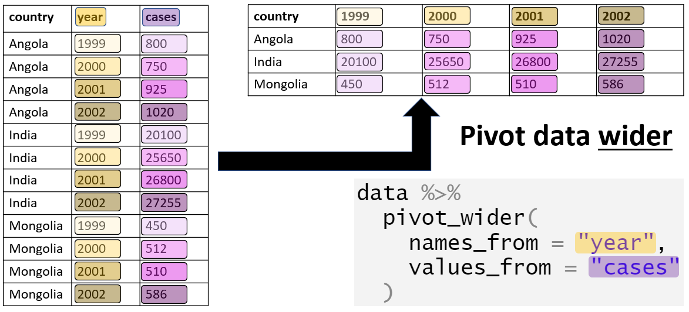

Cleaning Data
================
Last Updated: 14, October, 2024 at 14:23

- [Before we start…](#before-we-start)
- [Loading the tidyverse](#loading-the-tidyverse)
- [Some simple operations](#some-simple-operations)
  - [Opening large text files](#opening-large-text-files)
  - [Detecting outliers](#detecting-outliers)
  - [Missing data](#missing-data)
  - [Separating a column](#separating-a-column)
  - [Combining columns](#combining-columns)
  - [Strings using `stringr`](#strings-using-stringr)
- [Reorganizing data](#reorganizing-data)
  - [Loading some data](#loading-some-data)
  - [Grouping and summarizing data](#grouping-and-summarizing-data)
  - [Further processing](#further-processing)
  - [Note on dropping non-existing
    levels](#note-on-dropping-non-existing-levels)
  - [Converting to wide format](#converting-to-wide-format)
  - [Example: Titanic data](#example-titanic-data)
  - [Making data longer (melting
    data)](#making-data-longer-melting-data)
- [Merging data](#merging-data)
  - [Reading in the data](#reading-in-the-data)
  - [Merging the data](#merging-the-data)
- [Example: Global Health Data](#example-global-health-data)
  - [Questions A](#questions-a)
  - [Questions B](#questions-b)
  - [Solutions A](#solutions-a)
  - [Solutions B](#solutions-b)
- [Example: Social Security
  Applications](#example-social-security-applications)
  - [A reminder on `pivot_longer()`](#a-reminder-on-pivot_longer)
  - [Using `pivot_longer()`](#using-pivot_longer)
  - [Using `separate()`](#using-separate)
  - [Creating an `Other` column](#creating-an-other-column)
  - [Convert `Fiscal_Year` to year](#convert-fiscal_year-to-year)
  - [Create a date variable](#create-a-date-variable)
  - [Plots](#plots)
- [Example: Coal data](#example-coal-data)
  - [Change the first variable name](#change-the-first-variable-name)
  - [Convert to a long data format](#convert-to-a-long-data-format)
  - [Separate regions and countries](#separate-regions-and-countries)
- [Further exercises](#further-exercises)
  - [Voice-onset data](#voice-onset-data)
  - [Airline safety data](#airline-safety-data)

## Before we start…

Download the following data sets:

- `raw_depression.csv`
- `cars.txt`
- `DEMO_J.XPT`
- `INQ_J.XPT`
- `DUQ_J.XPT`
- `ssadisability.csv`
- `coal.csv`
- `vot.csv`
- `airline-safety.csv`
- `Titanic.csv`

## Loading the tidyverse

Let’s load the tidyverse…

``` r
library(tidyverse)
```

    ## ── Attaching packages ─────────────────────────────────────── tidyverse 1.3.2 ──
    ## ✔ ggplot2 3.4.0      ✔ purrr   0.3.5 
    ## ✔ tibble  3.1.8      ✔ dplyr   1.0.10
    ## ✔ tidyr   1.2.1      ✔ stringr 1.4.1 
    ## ✔ readr   2.1.3      ✔ forcats 0.5.2 
    ## ── Conflicts ────────────────────────────────────────── tidyverse_conflicts() ──
    ## ✖ dplyr::filter() masks stats::filter()
    ## ✖ dplyr::lag()    masks stats::lag()

## Some simple operations

### Opening large text files

One of the most simple things you can do is inspect your data using a
text editor. When text files are large, it’s a good idea to get an
editor that can handle large files. I suggest [Sublime Text
Editor](https://www.sublimetext.com/). This editor can handle much
larger files than you can open (as text) in Rstudio. Keep the file open
while you’re cleaning it!

### Detecting outliers

Outliers (as errors) can be most easily identified using graphs (See
later). However, some textual output might be useful as well.

Let’s read in some data (see `codebook.txt` for info about the
variables).

``` r
depression_data <- read_tsv('data/raw_depression.csv')
```

    ## Rows: 39775 Columns: 172
    ## ── Column specification ────────────────────────────────────────────────────────
    ## Delimiter: "\t"
    ## chr   (2): country, major
    ## dbl (170): Q1A, Q1I, Q1E, Q2A, Q2I, Q2E, Q3A, Q3I, Q3E, Q4A, Q4I, Q4E, Q5A, ...
    ## 
    ## ℹ Use `spec()` to retrieve the full column specification for this data.
    ## ℹ Specify the column types or set `show_col_types = FALSE` to quiet this message.

People have clearly made errors when entering their ages:

``` r
summary(depression_data$age)
```

    ##    Min. 1st Qu.  Median    Mean 3rd Qu.    Max. 
    ##   13.00   18.00   21.00   23.61   25.00 1998.00

The histogram looks weird because of the very few, very high ages. We
*could* try to fix these by assuming, for example, that `1998` is the
birth year and not the age. For now, let’s just remove these entries.

``` r
hist(depression_data$age)
```

<!-- -->

``` r
dim(depression_data)
```

    ## [1] 39775   172

``` r
filtered_depression_data <- filter(depression_data, age < 120)
dim(filtered_depression_data)
```

    ## [1] 39770   172

``` r
hist(filtered_depression_data$age, breaks=100)
```

<!-- -->

Here is another visualization.

``` r
par(mfcol=c(1,2))
boxplot(depression_data$age)
boxplot(filtered_depression_data$age)
```

<!-- -->

Here is another problem with the data…

``` r
hist(filtered_depression_data$familysize, breaks=100)
```

<!-- -->

``` r
summary(filtered_depression_data$familysize)
```

    ##    Min. 1st Qu.  Median    Mean 3rd Qu.    Max. 
    ##    0.00    2.00    3.00    3.51    4.00  133.00

Categorical data can also be messy. People entered their majors as free
text. And this is the result:

``` r
library(janitor)
```

    ## 
    ## Attaching package: 'janitor'

    ## The following objects are masked from 'package:stats':
    ## 
    ##     chisq.test, fisher.test

``` r
result <- tabyl(depression_data$major)
head(result, 50)
```

    ##                          depression_data$major  n      percent valid_percent
    ##                                              _  1 2.514142e-05  3.513827e-05
    ##                                              - 34 8.548083e-04  1.194701e-03
    ##                                             --  1 2.514142e-05  3.513827e-05
    ##                                            ---  1 2.514142e-05  3.513827e-05
    ##                                          -nil-  1 2.514142e-05  3.513827e-05
    ##                                            ???  1 2.514142e-05  3.513827e-05
    ##                                              .  1 2.514142e-05  3.513827e-05
    ##                                              /  2 5.028284e-05  7.027654e-05
    ##  &#1055;&#1089;&#1080;&#1093;&#1086;&#1083;&#1  1 2.514142e-05  3.513827e-05
    ##    &#1593;&#1604;&#1605; &#1606;&#1601;&#1587;  1 2.514142e-05  3.513827e-05
    ##       &#22810;&#23186;&#39636;&#35373;&#35336;  1 2.514142e-05  3.513827e-05
    ##                               &#28888;&#22521;  1 2.514142e-05  3.513827e-05
    ##                                  &#304;lahiyat  1 2.514142e-05  3.513827e-05
    ##                                              0  2 5.028284e-05  7.027654e-05
    ##                         1. Social work, 2. Law  1 2.514142e-05  3.513827e-05
    ##                                      12th arts  1 2.514142e-05  3.513827e-05
    ##                                             18  1 2.514142e-05  3.513827e-05
    ##                                             19  1 2.514142e-05  3.513827e-05
    ##  2 majors: Computer science and industrial eng  1 2.514142e-05  3.513827e-05
    ##                                   2D animation  1 2.514142e-05  3.513827e-05
    ##                                         2D Art  1 2.514142e-05  3.513827e-05
    ##                                   3D Animation  1 2.514142e-05  3.513827e-05
    ##                     3d animation, architecture  1 2.514142e-05  3.513827e-05
    ##                                             75  1 2.514142e-05  3.513827e-05
    ##                                        a level  1 2.514142e-05  3.513827e-05
    ##                                      A Teacher  1 2.514142e-05  3.513827e-05
    ##                                             AA  1 2.514142e-05  3.513827e-05
    ##                                           AADT  1 2.514142e-05  3.513827e-05
    ##                                       academic  1 2.514142e-05  3.513827e-05
    ##                                            Acc  1 2.514142e-05  3.513827e-05
    ##                                      Acc maybe  1 2.514142e-05  3.513827e-05
    ##                                           acca  1 2.514142e-05  3.513827e-05
    ##                                           Acca  2 5.028284e-05  7.027654e-05
    ##                                           ACCA  2 5.028284e-05  7.027654e-05
    ##     ACCA Professional Accounting Qualification  1 2.514142e-05  3.513827e-05
    ##                                    Accaountant  1 2.514142e-05  3.513827e-05
    ##                                     accauntant  1 2.514142e-05  3.513827e-05
    ##                                     Accontancy  1 2.514142e-05  3.513827e-05
    ##                                      accontant  1 2.514142e-05  3.513827e-05
    ##                               Acconting degree  1 2.514142e-05  3.513827e-05
    ##                                        Accoung  1 2.514142e-05  3.513827e-05
    ##                                     Accounring  1 2.514142e-05  3.513827e-05
    ##                                        account 22 5.531113e-04  7.730419e-04
    ##                                        Account 78 1.961031e-03  2.740785e-03
    ##                                        ACCOUNT  1 2.514142e-05  3.513827e-05
    ##                            account and finance  1 2.514142e-05  3.513827e-05
    ##                            Account and finance  2 5.028284e-05  7.027654e-05
    ##                                    Account ing  1 2.514142e-05  3.513827e-05
    ##                                     Accountacy  1 2.514142e-05  3.513827e-05
    ##                                      accountan  2 5.028284e-05  7.027654e-05

### Missing data

R encodes missing values as `NA`. Missing values are contagious:
performing calculations on data that contains missing values often leads
to an `NA` result. Some functions are robust against missing values
(they simply ignore them). However, when a result comes back as `NA`
it’s often because the data contained missing values in the first place.

``` r
some_data <- c(1,2,3,4, NA)
mean(some_data)
```

    ## [1] NA

``` r
max(some_data)
```

    ## [1] NA

Tips from the field:

- When reading in a file, it’s a good idea to know how missing values
  are encoded so you can tell R which values to interpret as missing.
- Sometime people will use absurd values to indicate missing data. For
  example, they might enter -1 or 99999 when an age value is missing.
  These are then read by R as numbers and your calculations end up being
  nonsense. One way to catch this it by looking for outliers!

### Separating a column

``` r
patient_data <-read_tsv('data/inpatient.tsv')
```

    ## Rows: 163065 Columns: 12
    ## ── Column specification ────────────────────────────────────────────────────────
    ## Delimiter: "\t"
    ## chr (10): DRG Definition, Provider Name, Provider Street Address, Provider C...
    ## dbl  (2): Provider Id, Total Discharges
    ## 
    ## ℹ Use `spec()` to retrieve the full column specification for this data.
    ## ℹ Specify the column types or set `show_col_types = FALSE` to quiet this message.

``` r
colnames(patient_data) <- make.names(colnames(patient_data))
head(patient_data, 5)
```

    ## # A tibble: 5 × 12
    ##   DRG.Definition Provi…¹ Provi…² Provi…³ Provi…⁴ Provi…⁵ Provi…⁶ Hospi…⁷ Total…⁸
    ##   <chr>            <dbl> <chr>   <chr>   <chr>   <chr>   <chr>   <chr>     <dbl>
    ## 1 039 - EXTRACR…   10001 SOUTHE… 1108 R… DOTHAN  AL      36301   AL - D…      91
    ## 2 039 - EXTRACR…   10005 MARSHA… 2505 U… BOAZ    AL      35957   AL - B…      14
    ## 3 039 - EXTRACR…   10006 ELIZA … 205 MA… FLOREN… AL      35631   AL - B…      24
    ## 4 039 - EXTRACR…   10011 ST VIN… 50 MED… BIRMIN… AL      35235   AL - B…      25
    ## 5 039 - EXTRACR…   10016 SHELBY… 1000 F… ALABAS… AL      35007   AL - B…      18
    ## # … with 3 more variables: Average.Covered.Charges <chr>,
    ## #   Average.Total.Payments <chr>, Average.Medicare.Payments <chr>, and
    ## #   abbreviated variable names ¹​Provider.Id, ²​Provider.Name,
    ## #   ³​Provider.Street.Address, ⁴​Provider.City, ⁵​Provider.State,
    ## #   ⁶​Provider.Zip.Code, ⁷​Hospital.Referral.Region.Description,
    ## #   ⁸​Total.Discharges

``` r
result <- tabyl(patient_data$Hospital.Referral.Region.Description)
head(result, 5)
```

    ##  patient_data$Hospital.Referral.Region.Description    n     percent
    ##                                     AK - Anchorage  231 0.001416613
    ##                                    AL - Birmingham 1881 0.011535277
    ##                                        AL - Dothan  340 0.002085058
    ##                                    AL - Huntsville  407 0.002495937
    ##                                        AL - Mobile  552 0.003385153

Let’s separate this column into two columns.

``` r
test <- separate(patient_data, Hospital.Referral.Region.Description, into=c('state', 'city'), sep='-')
```

    ## Warning: Expected 2 pieces. Additional pieces discarded in 791 rows [710, 711,
    ## 718, 830, 853, 1918, 1921, 1927, 1930, 1940, 2055, 2086, 3398, 3401, 3411, 3415,
    ## 3594, 3630, 5424, 5425, ...].

This resulted in some warnings in certain rows. Let’s look at some of
those rows.

``` r
patient_data$Hospital.Referral.Region.Description[710]
```

    ## [1] "NC - Winston-Salem"

``` r
patient_data$Hospital.Referral.Region.Description[711]
```

    ## [1] "NC - Winston-Salem"

``` r
patient_data$Hospital.Referral.Region.Description[1930]
```

    ## [1] "NC - Winston-Salem"

Let’s look at an example of the results.

``` r
test$state[710]
```

    ## [1] "NC "

``` r
test$city[710]
```

    ## [1] " Winston"

``` r
test <- separate(patient_data, Hospital.Referral.Region.Description, into=c('state', 'city'), sep=' - ', remove = FALSE)
```

No warnings anymore! Let’s look at an example of the results again

``` r
test$state[710]
```

    ## [1] "NC"

``` r
test$city[710]
```

    ## [1] "Winston-Salem"

Note, you can use regular expression for the `sep` argument: [see
here.](https://cran.r-project.org/web/packages/stringr/vignettes/regular-expressions.html)

### Combining columns

The opposite operation!

``` r
test <- unite(test, 'combined', c(Provider.Id, Provider.Name), sep='_+_', remove = FALSE)
head(test$combined, 3)
```

    ## [1] "10001_+_SOUTHEAST ALABAMA MEDICAL CENTER"
    ## [2] "10005_+_MARSHALL MEDICAL CENTER SOUTH"   
    ## [3] "10006_+_ELIZA COFFEE MEMORIAL HOSPITAL"

### Strings using `stringr`

It does happen that you need to clean textual data. The `stringr`
package has a bunch of functions to make your life easier (but not
easy). I will run through some examples but do have a look at the
[cheatsheet](https://evoldyn.gitlab.io/evomics-2018/ref-sheets/R_strings.pdf)
as well.

Remember, this data?

``` r
depression_data <- read_tsv('data/raw_depression.csv')
```

    ## Rows: 39775 Columns: 172
    ## ── Column specification ────────────────────────────────────────────────────────
    ## Delimiter: "\t"
    ## chr   (2): country, major
    ## dbl (170): Q1A, Q1I, Q1E, Q2A, Q2I, Q2E, Q3A, Q3I, Q3E, Q4A, Q4I, Q4E, Q5A, ...
    ## 
    ## ℹ Use `spec()` to retrieve the full column specification for this data.
    ## ℹ Specify the column types or set `show_col_types = FALSE` to quiet this message.

We have to load `stringr` separately.

``` r
library(stringr)
```

Let’s convert the majors to lower case.

``` r
head(depression_data$major, 10)
```

    ##  [1] NA                          NA                         
    ##  [3] NA                          "biology"                  
    ##  [5] "Psychology"                NA                         
    ##  [7] "Mechatronics engeenerieng" "Music"                    
    ##  [9] "Psychology"                "computer programming"

``` r
depression_data$major <- str_to_lower(depression_data$major)
head(depression_data$major, 10)
```

    ##  [1] NA                          NA                         
    ##  [3] NA                          "biology"                  
    ##  [5] "psychology"                NA                         
    ##  [7] "mechatronics engeenerieng" "music"                    
    ##  [9] "psychology"                "computer programming"

Let’s try to find biology majors

``` r
depression_data$bio <- str_detect(depression_data$major, 'bio')
bio_students <- filter(depression_data, bio)
```

That matched also biomedical and biochemistry students. Let’s detect
those using a regex (See <https://regex101.com/> for a regex
construction tool).

``` r
depression_data$not_other <- !str_detect(depression_data$major, 'chem|med|phys|tech')
```

Let’s combine our columns

``` r
depression_data <- mutate(depression_data, selection = not_other * bio)
bio_students <- filter(depression_data, selection==1)
```

## Reorganizing data

### Loading some data

``` r
car_data <- read_delim('data/cars.txt', delim = ' ')
```

    ## Rows: 93 Columns: 26
    ## ── Column specification ────────────────────────────────────────────────────────
    ## Delimiter: " "
    ## chr  (6): make, model, type, cylinders, rearseat, luggage
    ## dbl (20): min_price, mid_price, max_price, mpg_city, mpg_hgw, airbag, drive,...
    ## 
    ## ℹ Use `spec()` to retrieve the full column specification for this data.
    ## ℹ Specify the column types or set `show_col_types = FALSE` to quiet this message.

### Grouping and summarizing data

The `group_by()` function takes a tibble and returns the same tibble,
but with some extra information so that any subsequent function acts on
each unique combination defined in the `group_by()`.

``` r
grouped <- group_by(car_data, type, make)
```

If you inspect the `grouped` tibble it seems the same as the `car_data`
tibble. However, it has stored the grouping we asked for.

``` r
groups(grouped)
```

    ## [[1]]
    ## type
    ## 
    ## [[2]]
    ## make

Now, you can use the `summarize()` function to get summary data for each
subgroup

``` r
summaries <- summarise(grouped, mean.length = mean(length))
```

    ## `summarise()` has grouped output by 'type'. You can override using the
    ## `.groups` argument.

``` r
summaries
```

    ## # A tibble: 81 × 3
    ## # Groups:   type [6]
    ##    type    make          mean.length
    ##    <chr>   <chr>               <dbl>
    ##  1 Compact Audi                  180
    ##  2 Compact Chevrolet             183
    ##  3 Compact Chrysler              183
    ##  4 Compact Dodge                 181
    ##  5 Compact Ford                  177
    ##  6 Compact Honda                 185
    ##  7 Compact Mazda                 184
    ##  8 Compact Mercedes-Benz         175
    ##  9 Compact Nissan                181
    ## 10 Compact Oldsmobile            188
    ## # … with 71 more rows

You can ask for more than one summary statistic.

``` r
summaries <- summarise(grouped, mean.length = mean(length), max.length = max(length), std_rpm = sd(rpm))
```

    ## `summarise()` has grouped output by 'type'. You can override using the
    ## `.groups` argument.

``` r
summaries
```

    ## # A tibble: 81 × 5
    ## # Groups:   type [6]
    ##    type    make          mean.length max.length std_rpm
    ##    <chr>   <chr>               <dbl>      <dbl>   <dbl>
    ##  1 Compact Audi                  180        180      NA
    ##  2 Compact Chevrolet             183        184       0
    ##  3 Compact Chrysler              183        183      NA
    ##  4 Compact Dodge                 181        181      NA
    ##  5 Compact Ford                  177        177      NA
    ##  6 Compact Honda                 185        185      NA
    ##  7 Compact Mazda                 184        184      NA
    ##  8 Compact Mercedes-Benz         175        175      NA
    ##  9 Compact Nissan                181        181      NA
    ## 10 Compact Oldsmobile            188        188      NA
    ## # … with 71 more rows

### Further processing

Keep in mind that, as the result of `summarize()` is a tibble, you can
use the data selection methods we saw earlier.

``` r
subset <- filter(summaries, make ==  'Ford')
head(subset)
```

    ## # A tibble: 6 × 5
    ## # Groups:   type [6]
    ##   type    make  mean.length max.length std_rpm
    ##   <chr>   <chr>       <dbl>      <dbl>   <dbl>
    ## 1 Compact Ford         177         177     NA 
    ## 2 Large   Ford         212         212     NA 
    ## 3 Midsize Ford         192         192     NA 
    ## 4 Small   Ford         156         171   1061.
    ## 5 Sporty  Ford         180.        180    636.
    ## 6 Van     Ford         176         176     NA

### Note on dropping non-existing levels

By default, the `group_by()` function drops non-existing combinations of
grouping variables.

``` r
grouped1 <- group_by(car_data, type, make)
c1<-count(grouped1)
summaries1 <- summarise(grouped, mean.length = mean(length))
```

    ## `summarise()` has grouped output by 'type'. You can override using the
    ## `.groups` argument.

``` r
dim(summaries1)
```

    ## [1] 81  3

However, this behavior can be changed using the `.drop = FALSE` argument
(and converting the variables to factors)

``` r
grouped2 <- group_by(car_data, as.factor(type), as.factor(make), .drop=FALSE)
c2<-count(grouped2)
summaries2 <- summarise(grouped2, mean.length = mean(length))
```

    ## `summarise()` has grouped output by 'as.factor(type)'. You can override using
    ## the `.groups` argument.

``` r
summaries2 <- complete(summaries2)
dim(summaries2)
```

    ## [1] 192   3

### Converting to wide format

The result can be reshaped into a wide format. *While this format is
often not suited for plotting or analysis*, it might make it easier to
look at the data. Here is a quick visual:



- **`names_from`: the variable you wish to appear as columns**
- **`values_from`: the variable you wish to use to fill the fill the
  table**
- **`id_cols`: the variables you wish to use as row identifiers**

The function also takes other arguments to handle more complex cases,
see <https://tidyr.tidyverse.org/reference/pivot_wider.html>

``` r
wide <- pivot_wider(summaries, id_cols = make, names_from  = type, values_from = mean.length)
head(wide)
```

    ## # A tibble: 6 × 7
    ##   make      Compact Large Midsize Small Sporty   Van
    ##   <chr>       <dbl> <dbl>   <dbl> <dbl>  <dbl> <dbl>
    ## 1 Audi          180    NA     193    NA    NA     NA
    ## 2 Chevrolet     183   214     198    NA   186    186
    ## 3 Chrysler      183   203      NA    NA    NA     NA
    ## 4 Dodge         181    NA     192   173   180    175
    ## 5 Ford          177   212     192   156   180.   176
    ## 6 Honda         185    NA      NA   173   175     NA

### Example: Titanic data

``` r
titanic <-read_csv('data/Titanic.csv', na='*')
```

    ## New names:
    ## Rows: 1313 Columns: 7
    ## ── Column specification
    ## ──────────────────────────────────────────────────────── Delimiter: "," chr
    ## (4): Name, PClass, Age, Sex dbl (3): ...1, Survived, SexCode
    ## ℹ Use `spec()` to retrieve the full column specification for this data. ℹ
    ## Specify the column types or set `show_col_types = FALSE` to quiet this message.
    ## • `` -> `...1`

``` r
grouped <- group_by(titanic, PClass, Sex)
survival <- summarise(grouped, proportion = mean(Survived), survived = sum(Survived), total = length(Survived))
```

    ## `summarise()` has grouped output by 'PClass'. You can override using the
    ## `.groups` argument.

``` r
survival
```

    ## # A tibble: 7 × 5
    ## # Groups:   PClass [4]
    ##   PClass Sex    proportion survived total
    ##   <chr>  <chr>       <dbl>    <dbl> <int>
    ## 1 1st    female      0.937      134   143
    ## 2 1st    male        0.330       59   179
    ## 3 2nd    female      0.879       94   107
    ## 4 2nd    male        0.145       25   172
    ## 5 3rd    female      0.377       80   212
    ## 6 3rd    male        0.116       58   499
    ## 7 <NA>   male        0            0     1

You could make the result into a wide table.

``` r
survival_wide <- pivot_wider(survival,  names_from = Sex, id_cols = PClass, values_from = proportion)
survival_wide
```

    ## # A tibble: 4 × 3
    ## # Groups:   PClass [4]
    ##   PClass female  male
    ##   <chr>   <dbl> <dbl>
    ## 1 1st     0.937 0.330
    ## 2 2nd     0.879 0.145
    ## 3 3rd     0.377 0.116
    ## 4 <NA>   NA     0

### Making data longer (melting data)

Here is a quick graphic:


Let’s look at some data:

``` r
head(relig_income, 5)
```

    ## # A tibble: 5 × 11
    ##   religion       `<$10k` $10-2…¹ $20-3…² $30-4…³ $40-5…⁴ $50-7…⁵ $75-1…⁶ $100-…⁷
    ##   <chr>            <dbl>   <dbl>   <dbl>   <dbl>   <dbl>   <dbl>   <dbl>   <dbl>
    ## 1 Agnostic            27      34      60      81      76     137     122     109
    ## 2 Atheist             12      27      37      52      35      70      73      59
    ## 3 Buddhist            27      21      30      34      33      58      62      39
    ## 4 Catholic           418     617     732     670     638    1116     949     792
    ## 5 Don’t know/re…      15      14      15      11      10      35      21      17
    ## # … with 2 more variables: `>150k` <dbl>, `Don't know/refused` <dbl>, and
    ## #   abbreviated variable names ¹​`$10-20k`, ²​`$20-30k`, ³​`$30-40k`, ⁴​`$40-50k`,
    ## #   ⁵​`$50-75k`, ⁶​`$75-100k`, ⁷​`$100-150k`

This data is in a wider format. But we can easily melt it to a long
format.

``` r
new <- pivot_longer(relig_income, cols = !religion, names_to = "income", values_to = "count")
head(new, 5)
```

    ## # A tibble: 5 × 3
    ##   religion income  count
    ##   <chr>    <chr>   <dbl>
    ## 1 Agnostic <$10k      27
    ## 2 Agnostic $10-20k    34
    ## 3 Agnostic $20-30k    60
    ## 4 Agnostic $30-40k    81
    ## 5 Agnostic $40-50k    76

## Merging data

Here, we will use National Health and Nutrition Examination Survey data.
This is the [data
source](https://wwwn.cdc.gov/nchs/nhanes/continuousnhanes/default.aspx?BeginYear=2017).
See [here](https://wwwn.cdc.gov/Nchs/Nnyfs/Y_DEMO.htm) for more
information about the demographic variables.

These data are split into multiple files (based on topic). If we need
variables from different files, we can merge the different data subsets.

### Reading in the data

The data is in SAS Transport File Format. Therefore, we will use the
`haven` library to read it in.

``` r
library(haven)
demographics <- read_xpt('data/DEMO_J.XPT')
income <- read_xpt('data/INQ_J.XPT')
drugs <- read_xpt('data/DUQ_J.XPT')
```

There are many variables in each file. To keep things manageable, let’s
select some variables (we’ve seen how to do this before).

``` r
drug_habits <- select(drugs, SEQN, DUQ200:DUQ280)
age<-select(demographics, SEQN, RIDAGEYR, RIDAGEMN)
finance <- select(income, SEQN, INDFMMPC,INDFMMPI, INQ300, IND235)
```

### Merging the data

``` r
merged <- full_join(age, drug_habits, by='SEQN')
merged <- full_join(merged, finance, by='SEQN')
dim(merged)
```

    ## [1] 9254   25

Other related operations are illustrated in the image below. The various
operations differ in the way they handle rows missing in the left or
right tibble. In the image below, the merge is done by the variable
`ID`.


## Example: Global Health Data

Use the following data for this exercise:

``` r
library(gapminder)
gap_data <- gapminder
```

### Questions A

Starting from the original `gap_data`,

- Filter the data for the Americas in 2007.
- Create the variable `gdp`, defined as the product of `pop` and
  `gdpPercap`.

### Questions B

Starting from the original `gap_data`,

- Compute the mean life expectancy for each year per continent.  
- Identify all observations with above average life expectancy,
  stratified for each continent and year.

### Solutions A

``` r
head(gap_data)
```

    ## # A tibble: 6 × 6
    ##   country     continent  year lifeExp      pop gdpPercap
    ##   <fct>       <fct>     <int>   <dbl>    <int>     <dbl>
    ## 1 Afghanistan Asia       1952    28.8  8425333      779.
    ## 2 Afghanistan Asia       1957    30.3  9240934      821.
    ## 3 Afghanistan Asia       1962    32.0 10267083      853.
    ## 4 Afghanistan Asia       1967    34.0 11537966      836.
    ## 5 Afghanistan Asia       1972    36.1 13079460      740.
    ## 6 Afghanistan Asia       1977    38.4 14880372      786.

``` r
colnames(gap_data)
```

    ## [1] "country"   "continent" "year"      "lifeExp"   "pop"       "gdpPercap"

``` r
americas <- filter(gap_data, continent == 'Americas')
americas <- mutate(americas, gdp = (gdpPercap * pop)/1000000)
```

### Solutions B

``` r
grouped <- group_by(gap_data, continent, year)
summaries <- summarise(grouped, mean.lifeExp = mean(lifeExp))
```

    ## `summarise()` has grouped output by 'continent'. You can override using the
    ## `.groups` argument.

``` r
summaries
```

    ## # A tibble: 60 × 3
    ## # Groups:   continent [5]
    ##    continent  year mean.lifeExp
    ##    <fct>     <int>        <dbl>
    ##  1 Africa     1952         39.1
    ##  2 Africa     1957         41.3
    ##  3 Africa     1962         43.3
    ##  4 Africa     1967         45.3
    ##  5 Africa     1972         47.5
    ##  6 Africa     1977         49.6
    ##  7 Africa     1982         51.6
    ##  8 Africa     1987         53.3
    ##  9 Africa     1992         53.6
    ## 10 Africa     1997         53.6
    ## # … with 50 more rows

``` r
merged <- full_join(gap_data, summaries, by=c('continent', 'year'))
head(merged)
```

    ## # A tibble: 6 × 7
    ##   country     continent  year lifeExp      pop gdpPercap mean.lifeExp
    ##   <fct>       <fct>     <int>   <dbl>    <int>     <dbl>        <dbl>
    ## 1 Afghanistan Asia       1952    28.8  8425333      779.         46.3
    ## 2 Afghanistan Asia       1957    30.3  9240934      821.         49.3
    ## 3 Afghanistan Asia       1962    32.0 10267083      853.         51.6
    ## 4 Afghanistan Asia       1967    34.0 11537966      836.         54.7
    ## 5 Afghanistan Asia       1972    36.1 13079460      740.         57.3
    ## 6 Afghanistan Asia       1977    38.4 14880372      786.         59.6

``` r
merged <- mutate(merged, above.mean = lifeExp > mean.lifeExp)
head(merged)
```

    ## # A tibble: 6 × 8
    ##   country     continent  year lifeExp      pop gdpPercap mean.lifeExp above.mean
    ##   <fct>       <fct>     <int>   <dbl>    <int>     <dbl>        <dbl> <lgl>     
    ## 1 Afghanistan Asia       1952    28.8  8425333      779.         46.3 FALSE     
    ## 2 Afghanistan Asia       1957    30.3  9240934      821.         49.3 FALSE     
    ## 3 Afghanistan Asia       1962    32.0 10267083      853.         51.6 FALSE     
    ## 4 Afghanistan Asia       1967    34.0 11537966      836.         54.7 FALSE     
    ## 5 Afghanistan Asia       1972    36.1 13079460      740.         57.3 FALSE     
    ## 6 Afghanistan Asia       1977    38.4 14880372      786.         59.6 FALSE

## Example: Social Security Applications

I got this example from
[here](https://www.linkedin.com/learning-login/share?account=2133849&forceAccount=false&redirect=https%3A%2F%2Fwww.linkedin.com%2Flearning%2Fdata-wrangling-in-r-14135737%3Ftrk%3Dshare_ent_url%26shareId%3D%252BDp0PBL0TaS6XMBZDGEN2w%253D%253D).
This data set tracks how many people apply for SS through the website
(internet) and the total applications (including applications through
mail).

**Take some time to think how you would convert this data to a tidy data
set.**

``` r
ss <- read_csv('data/ssadisability.csv')
```

    ## Rows: 10 Columns: 25
    ## ── Column specification ────────────────────────────────────────────────────────
    ## Delimiter: ","
    ## chr  (1): Fiscal_Year
    ## num (24): Oct_Total, Oct_Internet, Nov_Total, Nov_Internet, Dec_Total, Dec_I...
    ## 
    ## ℹ Use `spec()` to retrieve the full column specification for this data.
    ## ℹ Specify the column types or set `show_col_types = FALSE` to quiet this message.

``` r
glimpse(ss)
```

    ## Rows: 10
    ## Columns: 25
    ## $ Fiscal_Year     <chr> "FY08", "FY09", "FY10", "FY11", "FY12", "FY13", "FY14"…
    ## $ Oct_Total       <dbl> 176407, 244781, 286598, 299033, 227456, 224624, 206471…
    ## $ Oct_Internet    <dbl> 15082, 32578, 65533, 92856, 86811, 92542, 98400, 13374…
    ## $ Nov_Total       <dbl> 204287, 181161, 213297, 209553, 200140, 249910, 237621…
    ## $ Nov_Internet    <dbl> 17301, 25620, 50098, 63424, 71175, 107053, 117934, 967…
    ## $ Dec_Total       <dbl> 151687, 176107, 198733, 215239, 254766, 188183, 175607…
    ## $ Dec_Internet    <dbl> 14321, 27174, 44512, 62877, 91424, 79719, 83377, 89619…
    ## $ Jan_Total       <dbl> 162966, 249062, 265665, 264286, 221146, 199588, 240969…
    ## $ Jan_Internet    <dbl> 18391, 57908, 68843, 84944, 85848, 93703, 125320, 1294…
    ## $ Feb_Total       <dbl> 228623, 221368, 225319, 223625, 228519, 219604, 205737…
    ## $ Feb_Internet    <dbl> 26034, 50408, 58465, 71314, 83576, 101878, 108384, 101…
    ## $ Mar_Total       <dbl> 190716, 235360, 243266, 246630, 299267, 285923, 219696…
    ## $ Mar_Internet    <dbl> 21064, 53592, 62198, 77916, 112104, 129415, 114993, 10…
    ## $ Apr_Total       <dbl> 194403, 234304, 298065, 300359, 233685, 224804, 218172…
    ## $ Apr_Internet    <dbl> 22372, 53675, 76573, 94722, 88330, 101619, 112417, 101…
    ## $ May_Total       <dbl> 226549, 281343, 239409, 241673, 239503, 269955, 258726…
    ## $ May_Internet    <dbl> 26337, 65822, 65780, 77603, 93826, 123440, 134714, 122…
    ## $ June_Total      <dbl> 193094, 237329, 231964, 233351, 284136, 223238, 213389…
    ## $ June_Internet   <dbl> 22551, 54285, 67163, 79925, 113613, 104146, 110227, 99…
    ## $ July_Total      <dbl> 181552, 285172, 300442, 292949, 221745, 204072, 198484…
    ## $ July_Internet   <dbl> 22728, 66565, 92957, 105276, 91323, 98326, 106013, 124…
    ## $ August_Total    <dbl> 245429, 240611, 248284, 237555, 298458, 281828, 265979…
    ## $ August_Internet <dbl> 30580, 54915, 75535, 86514, 119795, 135423, 139000, 10…
    ## $ Sept_Internet   <dbl> 24141, 52687, 73403, 103564, 93375, 104270, 107284, 98…
    ## $ Sept_Total      <dbl> 186750, 228692, 238965, 280913, 230648, 214004, 203384…

``` r
colnames(ss)
```

    ##  [1] "Fiscal_Year"     "Oct_Total"       "Oct_Internet"    "Nov_Total"      
    ##  [5] "Nov_Internet"    "Dec_Total"       "Dec_Internet"    "Jan_Total"      
    ##  [9] "Jan_Internet"    "Feb_Total"       "Feb_Internet"    "Mar_Total"      
    ## [13] "Mar_Internet"    "Apr_Total"       "Apr_Internet"    "May_Total"      
    ## [17] "May_Internet"    "June_Total"      "June_Internet"   "July_Total"     
    ## [21] "July_Internet"   "August_Total"    "August_Internet" "Sept_Internet"  
    ## [25] "Sept_Total"

### A reminder on `pivot_longer()`


### Using `pivot_longer()`

``` r
longer_format <- pivot_longer(ss, cols=Oct_Total:Sept_Total, names_to = 'period_source', values_to = 'Count')
```

This is better. But not perfect yet.

### Using `separate()`

Let’s split the `period_source` column.

``` r
splitted <- separate(longer_format, period_source, into=c('Month', 'Source'), sep='_')
```

### Creating an `Other` column

I’d like to create a column listing the difference between `Internet`
and `Total`. I’ll do this by first creating a wider format.


``` r
wider <- pivot_wider(splitted, names_from = 'Source', values_from = 'Count')
head(wider)
```

    ## # A tibble: 6 × 4
    ##   Fiscal_Year Month  Total Internet
    ##   <chr>       <chr>  <dbl>    <dbl>
    ## 1 FY08        Oct   176407    15082
    ## 2 FY08        Nov   204287    17301
    ## 3 FY08        Dec   151687    14321
    ## 4 FY08        Jan   162966    18391
    ## 5 FY08        Feb   228623    26034
    ## 6 FY08        Mar   190716    21064

``` r
wider<-mutate(wider, Other = Total - Internet)
head(wider)
```

    ## # A tibble: 6 × 5
    ##   Fiscal_Year Month  Total Internet  Other
    ##   <chr>       <chr>  <dbl>    <dbl>  <dbl>
    ## 1 FY08        Oct   176407    15082 161325
    ## 2 FY08        Nov   204287    17301 186986
    ## 3 FY08        Dec   151687    14321 137366
    ## 4 FY08        Jan   162966    18391 144575
    ## 5 FY08        Feb   228623    26034 202589
    ## 6 FY08        Mar   190716    21064 169652

Now we can go back to the long format.

``` r
long_again <- select(wider, -Total)
long_again <- pivot_longer(long_again, cols = c(Internet, Other), names_to = 'Source', values_to = 'Count') 
```

### Convert `Fiscal_Year` to year

``` r
numbers <- str_extract(long_again$Fiscal_Year, '[0-9]{2}')
numbers <- 2000 + as.integer(numbers)
long_again <- add_column(long_again, Year = numbers)
long_again <- select(long_again, -Fiscal_Year)
```

### Create a date variable

``` r
library(lubridate)
```

    ## Loading required package: timechange

    ## 
    ## Attaching package: 'lubridate'

    ## The following objects are masked from 'package:base':
    ## 
    ##     date, intersect, setdiff, union

``` r
long_again$date <- paste('01', long_again$Month, long_again$Year)
long_again$date<-dmy(long_again$date)
```

### Plots

Let’s create some plots (We’ll dedicate some more time to plotting in a
next section of the course).

``` r
data_2012 <- filter(long_again, Year == 2012)
ggplot(data_2012) + aes(x=date, y = Count, group=Source, color=Source) + geom_line()
```

<!-- -->

``` r
ggplot(long_again) + aes(x=Month, y = Count, group=Source, color=Source) + geom_line() + facet_grid(~Year)
```

    ## Warning: Removed 2 rows containing missing values (`geom_line()`).

<!-- -->

## Example: Coal data

Have a look at the data in an editor: + The first 2 lines can be
skipped. + Missing values are given by `--`.

``` r
coal_data <- read_csv('data/coal.csv', skip=2, na = "--")
```

    ## New names:
    ## Rows: 232 Columns: 31
    ## ── Column specification
    ## ──────────────────────────────────────────────────────── Delimiter: "," chr
    ## (1): ...1 dbl (30): 1980, 1981, 1982, 1983, 1984, 1985, 1986, 1987, 1988, 1989,
    ## 1990, ...
    ## ℹ Use `spec()` to retrieve the full column specification for this data. ℹ
    ## Specify the column types or set `show_col_types = FALSE` to quiet this message.
    ## • `` -> `...1`

``` r
head(coal_data)
```

    ## # A tibble: 6 × 31
    ##   ...1        `1980`  `1981`  `1982`  `1983`  `1984` `1985` `1986` `1987` `1988`
    ##   <chr>        <dbl>   <dbl>   <dbl>   <dbl>   <dbl>  <dbl>  <dbl>  <dbl>  <dbl>
    ## 1 North Ame… 1.65e+1 1.70e+1 1.65e+1 1.71e+1 1.84e+1 18.8   18.5   19.4   20.4  
    ## 2 Bermuda    0       0       0       0       0        0      0      0      0    
    ## 3 Canada     9.62e-1 9.90e-1 1.06e+0 1.12e+0 1.24e+0  1.21   1.13   1.25   1.36 
    ## 4 Greenland  5   e-5 5   e-5 3   e-5 3   e-5 3   e-5  0      0      0      0    
    ## 5 Mexico     1.02e-1 1.06e-1 1.20e-1 1.29e-1 1.31e-1  0.146  0.156  0.170  0.160
    ## 6 Saint Pie… 0       0       0       0       0        0      0      0      0    
    ## # … with 21 more variables: `1989` <dbl>, `1990` <dbl>, `1991` <dbl>,
    ## #   `1992` <dbl>, `1993` <dbl>, `1994` <dbl>, `1995` <dbl>, `1996` <dbl>,
    ## #   `1997` <dbl>, `1998` <dbl>, `1999` <dbl>, `2000` <dbl>, `2001` <dbl>,
    ## #   `2002` <dbl>, `2003` <dbl>, `2004` <dbl>, `2005` <dbl>, `2006` <dbl>,
    ## #   `2007` <dbl>, `2008` <dbl>, `2009` <dbl>

**Take some time to think how you would convert this data to a tidy data
set.**

### Change the first variable name

``` r
existing_names <- colnames(coal_data)
existing_names[1] <- 'country'
colnames(coal_data) <- existing_names
```

### Convert to a long data format


``` r
long_format <- pivot_longer(coal_data, names_to = 'year', values_to = 'coal_use', cols = '1980':'2009')
```

### Separate regions and countries

``` r
regions <- c("North America", "Central & South America", "Antarctica", "Europe", "Eurasia", "Middle East", "Africa", "Asia & Oceania", "World")

long_format <- mutate(long_format, is_region =long_format$country %in% regions)

region_data <- filter(long_format, is_region)
country_data <- filter(long_format, !is_region)

# Remove the 'is_region' column from both tibbles
region_data <- select(region_data, -is_region)
country_data <- select(country_data, -is_region)
```

## Further exercises

I have provided two data sets for some quick exercises:

### Voice-onset data

These data (`vot.csv`) were taken from
[here](https://www.jvcasillas.com/untidydata/). This is a voice-onset
time data set. Includes coronal stop data from English and Spanish
monolinguals, as well as English/Spanish bilinguals. In these data, the
`participant` variable denotes the participant’s number and whether they
are monolingual (Spanish or English) or bilingual.

**Try to reformat the data such that it features (1) a column with the
participant’s number (0-9) and (2) a column indicating whether the
participant is a Spanish speaker, English Speaker or Bilingual.**

### Airline safety data

I took these data (`airline-safety.csv`) from
[here](https://github.com/fivethirtyeight/data/blob/master/airline-safety/airline-safety.csv).
This is data on airline safety from 1985-1999 and 2000-2014. As you can
see in the data, the column names can be considered as variables
indicating the period and the specific statistic for the period (number
of incidents and fatalities).

**Try rearranging the data to contain a column `period` listing either
1985-1999 or 2000-2014. The data should contain four further columns:
`avail_seat_km_per_week`, `incidents`, `fatal_accidents` and
`fatalities`.**
