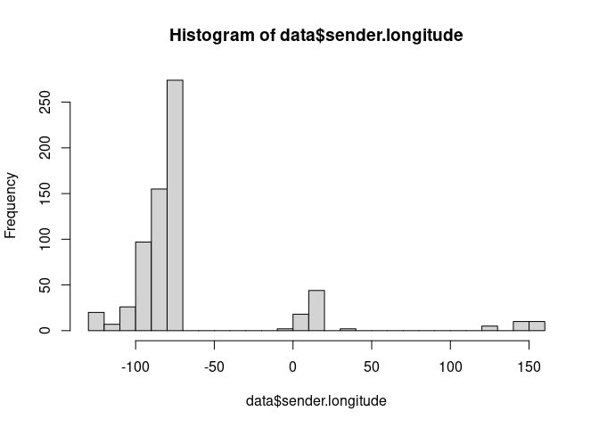
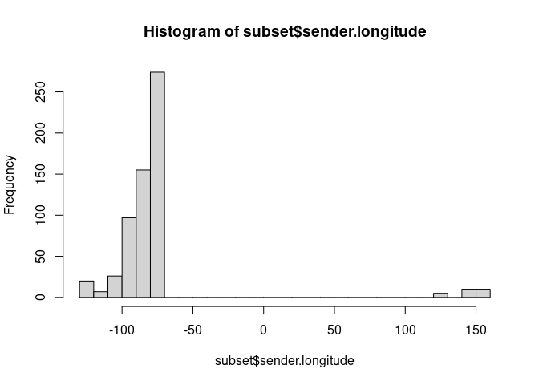

Filtering Data
================
Last Updated: 04, October, 2022 at 08:36

-   <a href="#dplyr" id="toc-dplyr">dplyr</a>
-   <a href="#selecting-columns" id="toc-selecting-columns">Selecting
    columns</a>
-   <a href="#filtering-on-criteria"
    id="toc-filtering-on-criteria">Filtering on criteria</a>
-   <a href="#ordering-rows" id="toc-ordering-rows">Ordering rows</a>
-   <a href="#exercises" id="toc-exercises">Exercises</a>
    -   <a href="#exercise-titanic-data"
        id="toc-exercise-titanic-data">Exercise: Titanic Data</a>
    -   <a href="#exercise-car-data" id="toc-exercise-car-data">Exercise: Car
        data</a>
    -   <a href="#exercise-film-data" id="toc-exercise-film-data">Exercise: Film
        data</a>

## dplyr

dplyr uses two functions to select columns and filter rows: `select()`
and `filter()`.

``` r
library(tidyverse)
```

    ## ── Attaching packages ─────────────────────────────────────── tidyverse 1.3.2 ──
    ## ✔ ggplot2 3.3.6     ✔ purrr   0.3.4
    ## ✔ tibble  3.1.8     ✔ dplyr   1.0.9
    ## ✔ tidyr   1.2.0     ✔ stringr 1.4.0
    ## ✔ readr   2.1.2     ✔ forcats 0.5.2
    ## ── Conflicts ────────────────────────────────────────── tidyverse_conflicts() ──
    ## ✖ dplyr::filter() masks stats::filter()
    ## ✖ dplyr::lag()    masks stats::lag()

``` r
library(readxl)
```

Let’s read in some data and make sure that the variable name adhere to
R’s expectations.

``` r
data <- read_excel("data/transit-data.xlsx", sheet = 'transport data', skip=1)
colnames(data) <- make.names(colnames(data))
```

## Selecting columns

Selecting columns is very straightforward.

``` r
subset <- select(data, date, sender.latitude)
head(subset)
```

    ## # A tibble: 6 × 2
    ##   date  sender.latitude
    ##   <chr>           <dbl>
    ## 1 5729             51.0
    ## 2 5741             51.0
    ## 3 5743             51.0
    ## 4 5752             51.0
    ## 5 5757             51.0
    ## 6 5765             51.0

You can also unselect columns

``` r
colnames(data)
```

    ## [1] "sender.location"    "sender.latitude"    "sender.longitude"  
    ## [4] "receiver.location"  "receiver.latitude"  "receiver.longitude"
    ## [7] "date"               "number.of.items"

``` r
subset <- select(data, -number.of.items)
colnames(subset)
```

    ## [1] "sender.location"    "sender.latitude"    "sender.longitude"  
    ## [4] "receiver.location"  "receiver.latitude"  "receiver.longitude"
    ## [7] "date"

## Filtering on criteria

``` r
subset <- filter(data, sender.latitude < 50)
head(subset)
```

    ## # A tibble: 6 × 8
    ##   sender.location          sende…¹ sende…² recei…³ recei…⁴ recei…⁵ date  numbe…⁶
    ##   <chr>                      <dbl>   <dbl> <chr>     <dbl>   <dbl> <chr>   <dbl>
    ## 1 USA, St Louis (MS)          38.6   -90.2 DEU, T…    53.1    13.5 1868…     456
    ## 2 USA, Mobile (AL)            30.7   -88.2 DEU, T…    53.1    13.5 1868…     450
    ## 3 USA, Mobile (AL)            30.7   -88.2 DEU, T…    53.1    13.5 1868…     428
    ## 4 USA, Laevenworth City (…    39.3   -94.9 DEU, T…    53.1    13.5 1868…     461
    ## 5 USA, St Louis (MS)          38.6   -90.2 DEU, T…    53.1    13.5 1869…     521
    ## 6 USA, Park County (KA)       43.9   -94.7 DEU, T…    53.1    13.5 1870…     452
    ## # … with abbreviated variable names ¹​sender.latitude, ²​sender.longitude,
    ## #   ³​receiver.location, ⁴​receiver.latitude, ⁵​receiver.longitude,
    ## #   ⁶​number.of.items

You can run filters in succession for more complex filtering

``` r
subset <- filter(data, sender.latitude < 50)
subset <- filter(subset, sender.latitude > 32)
subset <- filter(subset, sender.longitude > 0)
subset <- select(subset,  sender.latitude, sender.longitude)
summary(subset)
```

    ##  sender.latitude sender.longitude
    ##  Min.   :47.54   Min.   : 2.130  
    ##  1st Qu.:47.54   1st Qu.: 9.212  
    ##  Median :48.12   Median : 9.300  
    ##  Mean   :48.24   Mean   : 9.020  
    ##  3rd Qu.:48.80   3rd Qu.:10.739  
    ##  Max.   :49.57   Max.   :16.320

You can string queries together using `&`, `|`, and others. See
`Logical Operators` in the R documentation for details.

``` r
hist(data$sender.longitude, breaks=25)
```

<!-- -->

``` r
subset <- filter(data, sender.longitude < -50 | sender.longitude > 100)
hist(subset$sender.longitude,breaks=25)
```

<!-- -->

Let’s use the NOT operator to filter out one of the locations.

``` r
unique(data$sender.location)
```

    ##   [1] "DEU, Mockethal"                     
    ##   [2] "USA, St Louis (MS)"                 
    ##   [3] "USA, Mobile (AL)"                   
    ##   [4] "USA, Laevenworth City (KA)"         
    ##   [5] "USA, Park County (KA)"              
    ##   [6] "USA, Lagrange (TN)"                 
    ##   [7] "USA, Cairo (IL)"                    
    ##   [8] "USA, Nashville (TN)"                
    ##   [9] "USA, Montgomery (AL)"               
    ##  [10] "USA, Conover (NC)"                  
    ##  [11] "USA, Spokane (WA)"                  
    ##  [12] "USA, Winona (MN)"                   
    ##  [13] "CAN, Dodsland (ON)"                 
    ##  [14] "CAN, Hamilton (ON)"                 
    ##  [15] "USA, Milwaukee (WI)"                
    ##  [16] "USA, Buffalo (NY)"                  
    ##  [17] "DEU, Bremen"                        
    ##  [18] "USA, Manitowoc (WI)"                
    ##  [19] "USA, Orange (NJ)"                   
    ##  [20] "USA, Cincinnati (OH)"               
    ##  [21] "USA, Newport (KY)"                  
    ##  [22] "USA, Oskaloosa (IA)"                
    ##  [23] "USA, Warsaw (IL)"                   
    ##  [24] "USA, Koekuk (IA?)"                  
    ##  [25] "USA, Maisfeld (near Oskaloosa) (IA)"
    ##  [26] "DEU, Erfurt"                        
    ##  [27] "USA, Detroit (MI)"                  
    ##  [28] "DEU, Gotha"                         
    ##  [29] "FRA, Versailles"                    
    ##  [30] "FRA, Fort de Noisy"                 
    ##  [31] "USA, Monroe (MI)"                   
    ##  [32] "USA, Tonawanda (NY)"                
    ##  [33] "USA, St. Louis (MO)"                
    ##  [34] "USA, Warschau (IN)"                 
    ##  [35] "USA, Oak Grove (WI)"                
    ##  [36] "USA, Edwardsville (IL)"             
    ##  [37] "USA, New York (NY)"                 
    ##  [38] "USA, Williamsburg (NY)"             
    ##  [39] "USA, Brooklyn (NY)"                 
    ##  [40] "USA, San Francisco (CA)"            
    ##  [41] "CHE,  Amrisweil"                    
    ##  [42] "USA, Union Hill (NY)"               
    ##  [43] "USA, Sonoma (CA)"                   
    ##  [44] "USA, Richland County (OH)"          
    ##  [45] "USA, New Orleans (LA)"              
    ##  [46] "USA, Dayton (OH)"                   
    ##  [47] "DEU, Oberweißbach (TH)"            
    ##  [48] "USA, Waterloo (WI)"                 
    ##  [49] "USA, Amherst, Portage Co. (WI)"     
    ##  [50] "USA, Chicago (IL)"                  
    ##  [51] "USA, Minneapolis (MN) (MN)"         
    ##  [52] "DEU, Gräfenthal (TH)"              
    ##  [53] "DEU, Piesau (TH)"                   
    ##  [54] "USA, Austin (TX)"                   
    ##  [55] "USA, Brenham (TX)"                  
    ##  [56] "AUS, Sydney"                        
    ##  [57] "AUS, Melbourne"                     
    ##  [58] "DEU, Hamburg"                       
    ##  [59] "BEL, Antwerpen"                     
    ##  [60] "DEU, Leipzig (SA)"                  
    ##  [61] "AUT, Wien"                          
    ##  [62] "AUS, Coolgardie"                    
    ##  [63] "AUS, Golden Valley"                 
    ##  [64] "AUS, Boulder"                       
    ##  [65] "AUS, Moolyelle"                     
    ##  [66] "AUS, Waverly"                       
    ##  [67] "AUS, Ora Banda"                     
    ##  [68] "AUS, Kunanalling"                   
    ##  [69] "USA, Walhalla (ND)"                 
    ##  [70] "BEL, Antwerpen (Schiff Sorrento)"   
    ##  [71] "GBR, London (Schiff Sorrento)"      
    ##  [72] "EGY, London (Schiff Sorrento)"      
    ##  [73] "AUS, Yougilbar"                     
    ##  [74] "AUS, Lionsville"                    
    ##  [75] "USA, Cavalier (ND)"                 
    ##  [76] "USA, Oliverea (NY)"                 
    ##  [77] "USA, Yellowstone (WY)"              
    ##  [78] "USA, Trenton (NJ)"                  
    ##  [79] "DEU, Erfurt (TH)"                   
    ##  [80] "USA, Perry (OK)"                    
    ##  [81] "USA, Shamrock (OK)"                 
    ##  [82] "USA, Midford (OK)"                  
    ##  [83] "USA, Wellington (KS)"               
    ##  [84] "USA, Rochester (NY)"                
    ##  [85] "USA, Pittsburgh (PN)"               
    ##  [86] "USA, Brownfield (TX)"               
    ##  [87] "USA, Plainview (TX)"                
    ##  [88] "USA, Lubbock (TX)"                  
    ##  [89] "USA, Sweetwater (TX)"               
    ##  [90] "USA, Spur (TX)"                     
    ##  [91] "USA, Haskell (TX)"                  
    ##  [92] "USA, Lamesa (TX)"                   
    ##  [93] "USA, Big Spring (TX)"               
    ##  [94] "USA, Seymour (TX)"                  
    ##  [95] "USA, Guanah (TX)"                   
    ##  [96] "USA, Perryto (TX)"                  
    ##  [97] "USA, Burlington (CO)"               
    ##  [98] "USA, Stratton (CO)"                 
    ##  [99] "USA, Ozona (TX)"                    
    ## [100] "USA, Seminole (TX)"                 
    ## [101] "DEU, Jena (TH)"                     
    ## [102] "USA, Philadelphia (PA)"             
    ## [103] "DEU, Lobenstein"                    
    ## [104] "DEU, Glasin"                        
    ## [105] "USA, Cleveland (OH)"                
    ## [106] "USA, Frederick  Maryland"           
    ## [107] "USA, Covington (KY)"                
    ## [108] "USA, Brooko Station"                
    ## [109] "USA, Ohio (OH)"                     
    ## [110] "USA, O. Folly Island (SC)"          
    ## [111] "USA, Fernandina (FL)"               
    ## [112] "USA, Jacksonville (FL)"             
    ## [113] "USA, St. Augustine (FL)"            
    ## [114] "DEU, Stuttgart"                     
    ## [115] "DEU, Berlin"                        
    ## [116] "USA, Blue Ridge Summit (PA)"        
    ## [117] "USA, Warrensville (OH)"             
    ## [118] "USA, Ann Arbor (MI)"                
    ## [119] "USA, Homer (OH)"                    
    ## [120] "USA, Wilmington (Delaware)"         
    ## [121] "USA, Columbus (OH)"                 
    ## [122] "DEU, München"                      
    ## [123] "DEU, Wilhelmshaven"                 
    ## [124] "USA, Wood Ridge (NJ)"               
    ## [125] "USA, Jersey City (NJ)"              
    ## [126] "USA, Princeton (NJ)"                
    ## [127] "USA, New York (NY) (NJ)"            
    ## [128] "USA, Port Cester (NY)"              
    ## [129] "USA, Rutherford (NJ)"               
    ## [130] "USA, Carlstadt (NJ)"                
    ## [131] "DEU, Sebnitz (S)"                   
    ## [132] "DEU, Eckenhaid"                     
    ## [133] "USA, Lime Ridge (WI)"

``` r
subset <- filter(data, sender.location != 'USA, Cincinnati (OH)')
unique(subset$sender.location)
```

    ##   [1] "DEU, Mockethal"                     
    ##   [2] "USA, St Louis (MS)"                 
    ##   [3] "USA, Mobile (AL)"                   
    ##   [4] "USA, Laevenworth City (KA)"         
    ##   [5] "USA, Park County (KA)"              
    ##   [6] "USA, Lagrange (TN)"                 
    ##   [7] "USA, Cairo (IL)"                    
    ##   [8] "USA, Nashville (TN)"                
    ##   [9] "USA, Montgomery (AL)"               
    ##  [10] "USA, Conover (NC)"                  
    ##  [11] "USA, Spokane (WA)"                  
    ##  [12] "USA, Winona (MN)"                   
    ##  [13] "CAN, Dodsland (ON)"                 
    ##  [14] "CAN, Hamilton (ON)"                 
    ##  [15] "USA, Milwaukee (WI)"                
    ##  [16] "USA, Buffalo (NY)"                  
    ##  [17] "DEU, Bremen"                        
    ##  [18] "USA, Manitowoc (WI)"                
    ##  [19] "USA, Orange (NJ)"                   
    ##  [20] "USA, Newport (KY)"                  
    ##  [21] "USA, Oskaloosa (IA)"                
    ##  [22] "USA, Warsaw (IL)"                   
    ##  [23] "USA, Koekuk (IA?)"                  
    ##  [24] "USA, Maisfeld (near Oskaloosa) (IA)"
    ##  [25] "DEU, Erfurt"                        
    ##  [26] "USA, Detroit (MI)"                  
    ##  [27] "DEU, Gotha"                         
    ##  [28] "FRA, Versailles"                    
    ##  [29] "FRA, Fort de Noisy"                 
    ##  [30] "USA, Monroe (MI)"                   
    ##  [31] "USA, Tonawanda (NY)"                
    ##  [32] "USA, St. Louis (MO)"                
    ##  [33] "USA, Warschau (IN)"                 
    ##  [34] "USA, Oak Grove (WI)"                
    ##  [35] "USA, Edwardsville (IL)"             
    ##  [36] "USA, New York (NY)"                 
    ##  [37] "USA, Williamsburg (NY)"             
    ##  [38] "USA, Brooklyn (NY)"                 
    ##  [39] "USA, San Francisco (CA)"            
    ##  [40] "CHE,  Amrisweil"                    
    ##  [41] "USA, Union Hill (NY)"               
    ##  [42] "USA, Sonoma (CA)"                   
    ##  [43] "USA, Richland County (OH)"          
    ##  [44] "USA, New Orleans (LA)"              
    ##  [45] "USA, Dayton (OH)"                   
    ##  [46] "DEU, Oberweißbach (TH)"            
    ##  [47] "USA, Waterloo (WI)"                 
    ##  [48] "USA, Amherst, Portage Co. (WI)"     
    ##  [49] "USA, Chicago (IL)"                  
    ##  [50] "USA, Minneapolis (MN) (MN)"         
    ##  [51] "DEU, Gräfenthal (TH)"              
    ##  [52] "DEU, Piesau (TH)"                   
    ##  [53] "USA, Austin (TX)"                   
    ##  [54] "USA, Brenham (TX)"                  
    ##  [55] "AUS, Sydney"                        
    ##  [56] "AUS, Melbourne"                     
    ##  [57] "DEU, Hamburg"                       
    ##  [58] "BEL, Antwerpen"                     
    ##  [59] "DEU, Leipzig (SA)"                  
    ##  [60] "AUT, Wien"                          
    ##  [61] "AUS, Coolgardie"                    
    ##  [62] "AUS, Golden Valley"                 
    ##  [63] "AUS, Boulder"                       
    ##  [64] "AUS, Moolyelle"                     
    ##  [65] "AUS, Waverly"                       
    ##  [66] "AUS, Ora Banda"                     
    ##  [67] "AUS, Kunanalling"                   
    ##  [68] "USA, Walhalla (ND)"                 
    ##  [69] "BEL, Antwerpen (Schiff Sorrento)"   
    ##  [70] "GBR, London (Schiff Sorrento)"      
    ##  [71] "EGY, London (Schiff Sorrento)"      
    ##  [72] "AUS, Yougilbar"                     
    ##  [73] "AUS, Lionsville"                    
    ##  [74] "USA, Cavalier (ND)"                 
    ##  [75] "USA, Oliverea (NY)"                 
    ##  [76] "USA, Yellowstone (WY)"              
    ##  [77] "USA, Trenton (NJ)"                  
    ##  [78] "DEU, Erfurt (TH)"                   
    ##  [79] "USA, Perry (OK)"                    
    ##  [80] "USA, Shamrock (OK)"                 
    ##  [81] "USA, Midford (OK)"                  
    ##  [82] "USA, Wellington (KS)"               
    ##  [83] "USA, Rochester (NY)"                
    ##  [84] "USA, Pittsburgh (PN)"               
    ##  [85] "USA, Brownfield (TX)"               
    ##  [86] "USA, Plainview (TX)"                
    ##  [87] "USA, Lubbock (TX)"                  
    ##  [88] "USA, Sweetwater (TX)"               
    ##  [89] "USA, Spur (TX)"                     
    ##  [90] "USA, Haskell (TX)"                  
    ##  [91] "USA, Lamesa (TX)"                   
    ##  [92] "USA, Big Spring (TX)"               
    ##  [93] "USA, Seymour (TX)"                  
    ##  [94] "USA, Guanah (TX)"                   
    ##  [95] "USA, Perryto (TX)"                  
    ##  [96] "USA, Burlington (CO)"               
    ##  [97] "USA, Stratton (CO)"                 
    ##  [98] "USA, Ozona (TX)"                    
    ##  [99] "USA, Seminole (TX)"                 
    ## [100] "DEU, Jena (TH)"                     
    ## [101] "USA, Philadelphia (PA)"             
    ## [102] "DEU, Lobenstein"                    
    ## [103] "DEU, Glasin"                        
    ## [104] "USA, Cleveland (OH)"                
    ## [105] "USA, Frederick  Maryland"           
    ## [106] "USA, Covington (KY)"                
    ## [107] "USA, Brooko Station"                
    ## [108] "USA, Ohio (OH)"                     
    ## [109] "USA, O. Folly Island (SC)"          
    ## [110] "USA, Fernandina (FL)"               
    ## [111] "USA, Jacksonville (FL)"             
    ## [112] "USA, St. Augustine (FL)"            
    ## [113] "DEU, Stuttgart"                     
    ## [114] "DEU, Berlin"                        
    ## [115] "USA, Blue Ridge Summit (PA)"        
    ## [116] "USA, Warrensville (OH)"             
    ## [117] "USA, Ann Arbor (MI)"                
    ## [118] "USA, Homer (OH)"                    
    ## [119] "USA, Wilmington (Delaware)"         
    ## [120] "USA, Columbus (OH)"                 
    ## [121] "DEU, München"                      
    ## [122] "DEU, Wilhelmshaven"                 
    ## [123] "USA, Wood Ridge (NJ)"               
    ## [124] "USA, Jersey City (NJ)"              
    ## [125] "USA, Princeton (NJ)"                
    ## [126] "USA, New York (NY) (NJ)"            
    ## [127] "USA, Port Cester (NY)"              
    ## [128] "USA, Rutherford (NJ)"               
    ## [129] "USA, Carlstadt (NJ)"                
    ## [130] "DEU, Sebnitz (S)"                   
    ## [131] "DEU, Eckenhaid"                     
    ## [132] "USA, Lime Ridge (WI)"

One handy trick is to select using a list of values.

``` r
selected_locations <-c('USA, Brownfield (TX)', 'USA, Rochester (NY)', 'USA, Wellington (KS)')
subset <- filter(data, sender.location %in% selected_locations)
unique(subset$sender.location)
```

    ## [1] "USA, Wellington (KS)" "USA, Rochester (NY)"  "USA, Brownfield (TX)"

## Ordering rows

You can use arrange to order the rows.

``` r
subset1 <-select(data, sender.location, sender.latitude)
subset1 <-arrange(subset1, sender.latitude)
head(subset1, n = 15)
```

    ## # A tibble: 15 × 2
    ##    sender.location    sender.latitude
    ##    <chr>                        <dbl>
    ##  1 AUS, Golden Valley           -41.6
    ##  2 AUS, Golden Valley           -41.6
    ##  3 AUS, Golden Valley           -41.6
    ##  4 AUS, Golden Valley           -41.6
    ##  5 AUS, Golden Valley           -41.6
    ##  6 AUS, Golden Valley           -41.6
    ##  7 AUS, Melbourne               -37.8
    ##  8 AUS, Melbourne               -37.8
    ##  9 AUS, Moolyelle               -36.8
    ## 10 AUS, Moolyelle               -36.8
    ## 11 AUS, Sydney                  -33.9
    ## 12 AUS, Sydney                  -33.9
    ## 13 AUS, Sydney                  -33.9
    ## 14 AUS, Waverly                 -31.9
    ## 15 AUS, Waverly                 -31.9

Arranging in descending order? No problem.

``` r
subset1 <-select(data, sender.location, sender.latitude)
subset1 <-arrange(subset1, desc(sender.latitude))
head(subset1, n = 15)
```

    ## # A tibble: 15 × 2
    ##    sender.location               sender.latitude
    ##    <chr>                                   <dbl>
    ##  1 DEU, Glasin                              53.9
    ##  2 DEU, Glasin                              53.9
    ##  3 DEU, Glasin                              53.9
    ##  4 DEU, Hamburg                             53.6
    ##  5 DEU, Wilhelmshaven                       53.5
    ##  6 DEU, Wilhelmshaven                       53.5
    ##  7 DEU, Wilhelmshaven                       53.5
    ##  8 DEU, Bremen                              53.1
    ##  9 DEU, Bremen                              53.1
    ## 10 DEU, Bremen                              53.1
    ## 11 DEU, Bremen                              53.1
    ## 12 DEU, Berlin                              52.5
    ## 13 CAN, Dodsland (ON)                       51.8
    ## 14 CAN, Dodsland (ON)                       51.8
    ## 15 GBR, London (Schiff Sorrento)            51.5

Arranging based on multiple columns.

``` r
subset1 <-select(data, sender.location, sender.latitude)
subset1 <-mutate(subset1, rounded = round(sender.latitude))
subset1 <-arrange(subset1, desc(rounded), sender.location)
head(subset1, n = 15)
```

    ## # A tibble: 15 × 3
    ##    sender.location               sender.latitude rounded
    ##    <chr>                                   <dbl>   <dbl>
    ##  1 DEU, Glasin                              53.9      54
    ##  2 DEU, Glasin                              53.9      54
    ##  3 DEU, Glasin                              53.9      54
    ##  4 DEU, Hamburg                             53.6      54
    ##  5 DEU, Wilhelmshaven                       53.5      54
    ##  6 DEU, Wilhelmshaven                       53.5      54
    ##  7 DEU, Wilhelmshaven                       53.5      54
    ##  8 DEU, Berlin                              52.5      53
    ##  9 DEU, Bremen                              53.1      53
    ## 10 DEU, Bremen                              53.1      53
    ## 11 DEU, Bremen                              53.1      53
    ## 12 DEU, Bremen                              53.1      53
    ## 13 CAN, Dodsland (ON)                       51.8      52
    ## 14 CAN, Dodsland (ON)                       51.8      52
    ## 15 GBR, London (Schiff Sorrento)            51.5      52

## Exercises

### Exercise: Titanic Data

Read in the data and perform the following operations:

-   Count the number of male survivors that were older than 25.
-   How many first class passengers where female?
-   How many female passengers survived?

### Exercise: Car data

Read in the data and perform the following operations:

The data file contains variables describing a number of cars.

-   Select all cars with at least 25 mpg in the city.
-   Select all BMW’s
-   Are there any Large cars with more than 25 mpg in the city?
-   Which cars use over 50% more fuel on the city than they do in the
    highway?
-   Which cars have an action radius of over 400 miles on the highway?

### Exercise: Film data

Use the following data file: `films.dat` (in the data folder). This file
lists the title, year of release, length in minutes, number of cast
members listed, rating, and number of lines of description are recorded
for a simple random sample of 100 movies.

-   Write code to select all films from 1980 to 1990 (including both
    1980 and 1990)

-   Select all films with a rating of 1

-   Write a short script that allows selecting all movies that were made
    in the five years before a given date. The script starts by
    assigning a value (year) to a variable. The script selects all
    movies made in the 5 years preceding the year assigned to the
    variable and prints the selected data to the screen. The earliest
    film in the data was made in 1924. Therefore, if the year assigned
    to the variable is before 1930, the script should print the message
    `No movies found`.

-   Write code that adds a new variable `ratio` to the data. This
    variable is obtained by dividing the number of actors (`Cast`) by
    the length of the movie (`Length`). Next, select the movies for
    which the ratio Cast/Length is at least 0.1. Print the selected
    movies to the screen.
