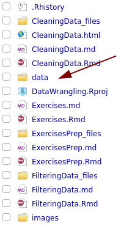

Reading Data
================
Last Updated: 03, October, 2023 at 09:12

- <a href="#before-we-begin" id="toc-before-we-begin">Before we begin…</a>
- <a href="#reading-data-from-excel-using-readxl"
  id="toc-reading-data-from-excel-using-readxl">Reading data from excel
  using readxl</a>
- <a href="#reading-data-from-a-comma-separated-text-file"
  id="toc-reading-data-from-a-comma-separated-text-file">Reading data from
  a comma separated text file</a>
- <a href="#tibbles" id="toc-tibbles">Tibbles</a>
- <a href="#some-interesting-options-when-using-read_csv"
  id="toc-some-interesting-options-when-using-read_csv">Some interesting
  options when using <code>read_csv()</code></a>
  - <a href="#no-column-names-no-problem"
    id="toc-no-column-names-no-problem">No column names? No problem!</a>
  - <a href="#specifying-missing-data"
    id="toc-specifying-missing-data">Specifying missing data</a>
  - <a href="#reading-from-url" id="toc-reading-from-url">Reading from
    URL</a>
- <a href="#reading-files-not-seperated-by-commas"
  id="toc-reading-files-not-seperated-by-commas">Reading files not
  seperated by commas</a>
- <a href="#exploring-data" id="toc-exploring-data">Exploring data</a>
  - <a href="#head-and-tail" id="toc-head-and-tail">Head and tail</a>
  - <a href="#summary" id="toc-summary">Summary</a>
  - <a href="#glimpse" id="toc-glimpse">Glimpse</a>
  - <a href="#skim" id="toc-skim">Skim</a>
- <a href="#addressing-a-single-variable"
  id="toc-addressing-a-single-variable">Addressing a single variable</a>
- <a href="#creating-new-variables"
  id="toc-creating-new-variables">Creating new variables</a>
- <a href="#creating-new-variables-using-mutate"
  id="toc-creating-new-variables-using-mutate">Creating new variables
  using <code>mutate</code></a>
- <a href="#exercises" id="toc-exercises">Exercises</a>
  - <a href="#exercise-1" id="toc-exercise-1">Exercise 1</a>
  - <a href="#exercise-2" id="toc-exercise-2">Exercise 2</a>

``` r
library(tidyverse)
```

    ## ── Attaching core tidyverse packages ──────────────────────── tidyverse 2.0.0 ──
    ## ✔ dplyr     1.1.0     ✔ readr     2.1.4
    ## ✔ forcats   1.0.0     ✔ stringr   1.5.0
    ## ✔ ggplot2   3.4.1     ✔ tibble    3.2.0
    ## ✔ lubridate 1.9.2     ✔ tidyr     1.3.0
    ## ✔ purrr     1.0.1     
    ## ── Conflicts ────────────────────────────────────────── tidyverse_conflicts() ──
    ## ✖ dplyr::filter() masks stats::filter()
    ## ✖ dplyr::lag()    masks stats::lag()
    ## ℹ Use the ]8;;http://conflicted.r-lib.org/conflicted package]8;; to force all conflicts to become errors

## Before we begin…

Download the following data files to your computer:

- `transit-data.xlsx`
- `pakistan_intellectual_capital.csv`
- `cars.txt`
- `wages1833.csv`

## Reading data from excel using readxl

Excel spreadsheets are often used and easy ways to store data.

Explore the data in `transit-data.xlsx`. (Please note the organization
of my project folder.)

library(tidyverse)

Note that (1) Data does not start in cell A1, (2) Data contains
different date formats, and (3) the data contain weird characters.

Read the first sheet of data:

``` r
library(readxl)
data <-read_excel("data/transit-data.xlsx") #Be sure to use the correct relative path here.
```

Look at the help for the read_excel function:

``` r
?read_excel
```

Let’s specify the data range we want to read.

``` r
info <-read_excel("data/transit-data.xlsx", sheet = 'info', range = 'B1:C7')
info <-read_excel("data/transit-data.xlsx", sheet = 'info', range = cell_cols('B:C'))
```

Let’s now read the data Data in the second sheet:

``` r
more_data <- read_excel("data/transit-data.xlsx", sheet = 'transport data')
```

    ## New names:
    ## • `` -> `...2`
    ## • `` -> `...3`
    ## • `` -> `...5`
    ## • `` -> `...6`
    ## • `` -> `...8`

We need to skip the first line of the data.

``` r
more_data <- read_excel("data/transit-data.xlsx", sheet = 'transport data', skip=1)
```

The column names are human readable but not very handy for coding.
**Indeed, in general, only dots and underscores should be used in
variable names.** There is a quick way to solve this.

``` r
colnames(more_data) <- make.names(colnames(more_data))
```

## Reading data from a comma separated text file

R has functions for reading in text files. However, the functions
provided by tidyverse are more powerful. When reading in data, R reports
on the column types. Information about the different types and their
labels can be found here: [Column
Types](https://tibble.tidyverse.org/articles/types.html)

*Note: The default report on the column types is a bit disorganized in
this view. It will look better in your console.*

``` r
data <- read_csv('data/pakistan_intellectual_capital.csv', n_max=10)
```

    ## New names:
    ## Rows: 10 Columns: 13
    ## ── Column specification
    ## ──────────────────────────────────────────────────────── Delimiter: "," chr
    ## (9): Teacher Name, University Currently Teaching, Department, Province U... dbl
    ## (3): ...1, S#, Year lgl (1): Other Information
    ## ℹ Use `spec()` to retrieve the full column specification for this data. ℹ
    ## Specify the column types or set `show_col_types = FALSE` to quiet this message.
    ## • `` -> `...1`

## Tibbles

Reading in data using tidyverse functions generates tibbles, instead of
R’s traditional `data.frame`. These are a newer version of the classic
data frame with features tweaked to make life a bit easier.

``` r
print(class(data))
```

    ## [1] "spec_tbl_df" "tbl_df"      "tbl"         "data.frame"

Convert to an old school data frame.

``` r
old_school<-as.data.frame(data)
```

## Some interesting options when using `read_csv()`

### No column names? No problem!

If data has no column names, use `col_names = FALSE`

``` r
read_csv("1,2,3\n4,5,6", col_names = FALSE)
```

    ## Rows: 2 Columns: 3
    ## ── Column specification ────────────────────────────────────────────────────────
    ## Delimiter: ","
    ## dbl (3): X1, X2, X3
    ## 
    ## ℹ Use `spec()` to retrieve the full column specification for this data.
    ## ℹ Specify the column types or set `show_col_types = FALSE` to quiet this message.

    ## # A tibble: 2 × 3
    ##      X1    X2    X3
    ##   <dbl> <dbl> <dbl>
    ## 1     1     2     3
    ## 2     4     5     6

You can also directly set the column names in this case.

``` r
read_csv("1,2,3\n4,5,6", col_names = c("x", "y", "z"))
```

    ## Rows: 2 Columns: 3
    ## ── Column specification ────────────────────────────────────────────────────────
    ## Delimiter: ","
    ## dbl (3): x, y, z
    ## 
    ## ℹ Use `spec()` to retrieve the full column specification for this data.
    ## ℹ Specify the column types or set `show_col_types = FALSE` to quiet this message.

    ## # A tibble: 2 × 3
    ##       x     y     z
    ##   <dbl> <dbl> <dbl>
    ## 1     1     2     3
    ## 2     4     5     6

### Specifying missing data

Another option that commonly needs tweaking is `na`: this specifies the
value (or values) that are used to represent missing values in your
file:

``` r
read_csv("a,b,c\n1,2,.", na = ".")
```

    ## Rows: 1 Columns: 3
    ## ── Column specification ────────────────────────────────────────────────────────
    ## Delimiter: ","
    ## dbl (2): a, b
    ## lgl (1): c
    ## 
    ## ℹ Use `spec()` to retrieve the full column specification for this data.
    ## ℹ Specify the column types or set `show_col_types = FALSE` to quiet this message.

    ## # A tibble: 1 × 3
    ##       a     b c    
    ##   <dbl> <dbl> <lgl>
    ## 1     1     2 NA

### Reading from URL

You can read data directly from a URL as well.

``` r
url<-'https://raw.githubusercontent.com/dvanderelst-python-class/python-class/fall2022/11_Pandas_Statistics/data/pizzasize.csv'
data <- read_csv(url)
```

    ## Rows: 250 Columns: 5
    ## ── Column specification ────────────────────────────────────────────────────────
    ## Delimiter: ","
    ## chr (3): Store, CrustDescription, Topping
    ## dbl (2): ID, Diameter
    ## 
    ## ℹ Use `spec()` to retrieve the full column specification for this data.
    ## ℹ Specify the column types or set `show_col_types = FALSE` to quiet this message.

## Reading files not seperated by commas

`read_csv()` expects comma separated field. For data separated by other
characters use these:

- tab separated: `read_tsv()`
- all others: `read_delim()`, specifying the `delim` argument.
- `read_csv2()` uses `;` for the field separator and `,` for the decimal
  point. This format is common in some European countries.

## Exploring data

After reading in the data, it’s a good idea to explore the data. Use
either the environment tab in Rstudio or use functions that give you
some info about your data.

*“This is a critical step that should always be performed. It is simple
but it is vital. You should make numerical summaries such as means,
standard deviations (SDs), maximum and minimum, correlations and
whatever else is appropriate to the specific dataset. Equally important
are graphical summaries.”*

*(Faraway, J. J. (2004). Linear models with R. Chapman and Hall/CRC.).*

One of the most simple things you can do is inspect your data using a
text editor. When text files are large, it’s a good idea to get an
editor that can handle large files. I suggest [Sublime Text
Editor](https://www.sublimetext.com/). This editor can handle much
larger files than you can open (as text) in Rstudio. Keep the file open
while you’re cleaning it!

### Head and tail

``` r
data <- read_csv('data/pakistan_intellectual_capital.csv', n_max=10)
```

    ## New names:
    ## Rows: 10 Columns: 13
    ## ── Column specification
    ## ──────────────────────────────────────────────────────── Delimiter: "," chr
    ## (9): Teacher Name, University Currently Teaching, Department, Province U... dbl
    ## (3): ...1, S#, Year lgl (1): Other Information
    ## ℹ Use `spec()` to retrieve the full column specification for this data. ℹ
    ## Specify the column types or set `show_col_types = FALSE` to quiet this message.
    ## • `` -> `...1`

``` r
head(data)
```

    ## # A tibble: 6 × 13
    ##    ...1  `S#` Teacher …¹ Unive…² Depar…³ Provi…⁴ Desig…⁵ Termi…⁶ Gradu…⁷ Country
    ##   <dbl> <dbl> <chr>      <chr>   <chr>   <chr>   <chr>   <chr>   <chr>   <chr>  
    ## 1     2     3 Dr. Abdul… Univer… Comput… Baloch… Assist… PhD     Asian … Thaila…
    ## 2     4     5 Dr. Wahee… Univer… Comput… Baloch… Assist… PhD     Asian … Thaila…
    ## 3     5     6 Dr. Junai… Univer… Comput… Baloch… Assist… PhD     Asian … Thaila…
    ## 4     6     7 Dr. Mahee… Univer… Comput… Baloch… Assist… PhD     Asian … Thaila…
    ## 5    24    25 Samina Az… Sardar… Comput… Baloch… Lectur… BS      Baloch… Pakist…
    ## 6    25    26 Nausheed … Sardar… Comput… Baloch… Lectur… MCS     Univer… Pakist…
    ## # … with 3 more variables: Year <dbl>,
    ## #   `Area of Specialization/Research Interests` <chr>,
    ## #   `Other Information` <lgl>, and abbreviated variable names ¹​`Teacher Name`,
    ## #   ²​`University Currently Teaching`, ³​Department,
    ## #   ⁴​`Province University Located`, ⁵​Designation, ⁶​`Terminal Degree`,
    ## #   ⁷​`Graduated from`

``` r
tail(data)
```

    ## # A tibble: 6 × 13
    ##    ...1  `S#` Teacher …¹ Unive…² Depar…³ Provi…⁴ Desig…⁵ Termi…⁶ Gradu…⁷ Country
    ##   <dbl> <dbl> <chr>      <chr>   <chr>   <chr>   <chr>   <chr>   <chr>   <chr>  
    ## 1    24    25 Samina Az… Sardar… Comput… Baloch… Lectur… BS      Baloch… Pakist…
    ## 2    25    26 Nausheed … Sardar… Comput… Baloch… Lectur… MCS     Univer… Pakist…
    ## 3    26    27 Shumaila … Sardar… Comput… Baloch… Lectur… MS      Baloch… Pakist…
    ## 4    27    28 Mirfa Man… Sardar… Comput… Baloch… Lectur… BS      Sardar… Pakist…
    ## 5    28    29 Saira Muj… Sardar… Comput… Baloch… Lectur… BS      Sardar… Pakist…
    ## 6    29    30 Arifa Anw… Sardar… Comput… Baloch… Lectur… BS      Sardar… Pakist…
    ## # … with 3 more variables: Year <dbl>,
    ## #   `Area of Specialization/Research Interests` <chr>,
    ## #   `Other Information` <lgl>, and abbreviated variable names ¹​`Teacher Name`,
    ## #   ²​`University Currently Teaching`, ³​Department,
    ## #   ⁴​`Province University Located`, ⁵​Designation, ⁶​`Terminal Degree`,
    ## #   ⁷​`Graduated from`

### Summary

Get a quick summary

``` r
summary(data)
```

    ##       ...1             S#        Teacher Name      
    ##  Min.   : 2.00   Min.   : 3.00   Length:10         
    ##  1st Qu.: 5.25   1st Qu.: 6.25   Class :character  
    ##  Median :24.50   Median :25.50   Mode  :character  
    ##  Mean   :17.60   Mean   :18.60                     
    ##  3rd Qu.:26.75   3rd Qu.:27.75                     
    ##  Max.   :29.00   Max.   :30.00                     
    ##                                                    
    ##  University Currently Teaching  Department        Province University Located
    ##  Length:10                     Length:10          Length:10                  
    ##  Class :character              Class :character   Class :character           
    ##  Mode  :character              Mode  :character   Mode  :character           
    ##                                                                              
    ##                                                                              
    ##                                                                              
    ##                                                                              
    ##  Designation        Terminal Degree    Graduated from       Country         
    ##  Length:10          Length:10          Length:10          Length:10         
    ##  Class :character   Class :character   Class :character   Class :character  
    ##  Mode  :character   Mode  :character   Mode  :character   Mode  :character  
    ##                                                                             
    ##                                                                             
    ##                                                                             
    ##                                                                             
    ##       Year      Area of Specialization/Research Interests Other Information
    ##  Min.   :2005   Length:10                                 Mode:logical     
    ##  1st Qu.:2008   Class :character                          NA's:10          
    ##  Median :2009   Mode  :character                                           
    ##  Mean   :2008                                                              
    ##  3rd Qu.:2009                                                              
    ##  Max.   :2011                                                              
    ##  NA's   :4

### Glimpse

The function glimpse gives you also a quick overview:

``` r
glimpse(data)
```

    ## Rows: 10
    ## Columns: 13
    ## $ ...1                                        <dbl> 2, 4, 5, 6, 24, 25, 26, 27…
    ## $ `S#`                                        <dbl> 3, 5, 6, 7, 25, 26, 27, 28…
    ## $ `Teacher Name`                              <chr> "Dr. Abdul Basit", "Dr. Wa…
    ## $ `University Currently Teaching`             <chr> "University of Balochistan…
    ## $ Department                                  <chr> "Computer Science & IT", "…
    ## $ `Province University Located`               <chr> "Balochistan", "Balochista…
    ## $ Designation                                 <chr> "Assistant Professor", "As…
    ## $ `Terminal Degree`                           <chr> "PhD", "PhD", "PhD", "PhD"…
    ## $ `Graduated from`                            <chr> "Asian Institute of Techno…
    ## $ Country                                     <chr> "Thailand", "Thailand", "T…
    ## $ Year                                        <dbl> NA, NA, NA, NA, 2005, 2008…
    ## $ `Area of Specialization/Research Interests` <chr> "Software Engineering & DB…
    ## $ `Other Information`                         <lgl> NA, NA, NA, NA, NA, NA, NA…

### Skim

And what about this beautiful exploratory tool?

``` r
library(skimr)
skim(data)
```

|                                                  |      |
|:-------------------------------------------------|:-----|
| Name                                             | data |
| Number of rows                                   | 10   |
| Number of columns                                | 13   |
| \_\_\_\_\_\_\_\_\_\_\_\_\_\_\_\_\_\_\_\_\_\_\_   |      |
| Column type frequency:                           |      |
| character                                        | 9    |
| logical                                          | 1    |
| numeric                                          | 3    |
| \_\_\_\_\_\_\_\_\_\_\_\_\_\_\_\_\_\_\_\_\_\_\_\_ |      |
| Group variables                                  | None |

Data summary

**Variable type: character**

| skim_variable                             | n_missing | complete_rate | min | max | empty | n_unique | whitespace |
|:------------------------------------------|----------:|--------------:|----:|----:|------:|---------:|-----------:|
| Teacher Name                              |         0 |             1 |  11 |  19 |     0 |       10 |          0 |
| University Currently Teaching             |         0 |             1 |  25 |  38 |     0 |        2 |          0 |
| Department                                |         0 |             1 |  16 |  21 |     0 |        2 |          0 |
| Province University Located               |         0 |             1 |  11 |  11 |     0 |        1 |          0 |
| Designation                               |         0 |             1 |   8 |  19 |     0 |        2 |          0 |
| Terminal Degree                           |         0 |             1 |   2 |   3 |     0 |        4 |          0 |
| Graduated from                            |         0 |             1 |  25 |  85 |     0 |        4 |          0 |
| Country                                   |         0 |             1 |   8 |   8 |     0 |        2 |          0 |
| Area of Specialization/Research Interests |         0 |             1 |   4 |  77 |     0 |       10 |          0 |

**Variable type: logical**

| skim_variable     | n_missing | complete_rate | mean | count |
|:------------------|----------:|--------------:|-----:|:------|
| Other Information |        10 |             0 |  NaN | :     |

**Variable type: numeric**

| skim_variable | n_missing | complete_rate |   mean |    sd |   p0 |     p25 |    p50 |     p75 | p100 | hist  |
|:--------------|----------:|--------------:|-------:|------:|-----:|--------:|-------:|--------:|-----:|:------|
| …1            |         0 |           1.0 |   17.6 | 11.62 |    2 |    5.25 |   24.5 |   26.75 |   29 | ▅▁▁▁▇ |
| S#            |         0 |           1.0 |   18.6 | 11.62 |    3 |    6.25 |   25.5 |   27.75 |   30 | ▅▁▁▁▇ |
| Year          |         4 |           0.6 | 2008.5 |  1.97 | 2005 | 2008.25 | 2009.0 | 2009.00 | 2011 | ▂▁▂▇▂ |

``` r
skim_tee(data)
```

    ## ── Data Summary ────────────────────────
    ##                            Values
    ## Name                       data  
    ## Number of rows             10    
    ## Number of columns          13    
    ## _______________________          
    ## Column type frequency:           
    ##   character                9     
    ##   logical                  1     
    ##   numeric                  3     
    ## ________________________         
    ## Group variables            None  
    ## 
    ## ── Variable type: character ────────────────────────────────────────────────────
    ##   skim_variable                             n_missing complete_rate min max
    ## 1 Teacher Name                                      0             1  11  19
    ## 2 University Currently Teaching                     0             1  25  38
    ## 3 Department                                        0             1  16  21
    ## 4 Province University Located                       0             1  11  11
    ## 5 Designation                                       0             1   8  19
    ## 6 Terminal Degree                                   0             1   2   3
    ## 7 Graduated from                                    0             1  25  85
    ## 8 Country                                           0             1   8   8
    ## 9 Area of Specialization/Research Interests         0             1   4  77
    ##   empty n_unique whitespace
    ## 1     0       10          0
    ## 2     0        2          0
    ## 3     0        2          0
    ## 4     0        1          0
    ## 5     0        2          0
    ## 6     0        4          0
    ## 7     0        4          0
    ## 8     0        2          0
    ## 9     0       10          0
    ## 
    ## ── Variable type: logical ──────────────────────────────────────────────────────
    ##   skim_variable     n_missing complete_rate mean count
    ## 1 Other Information        10             0  NaN ": " 
    ## 
    ## ── Variable type: numeric ──────────────────────────────────────────────────────
    ##   skim_variable n_missing complete_rate   mean    sd   p0     p25    p50    p75
    ## 1 ...1                  0           1     17.6 11.6     2    5.25   24.5   26.8
    ## 2 S#                    0           1     18.6 11.6     3    6.25   25.5   27.8
    ## 3 Year                  4           0.6 2008.   1.97 2005 2008.   2009   2009  
    ##   p100 hist 
    ## 1   29 ▅▁▁▁▇
    ## 2   30 ▅▁▁▁▇
    ## 3 2011 ▂▁▂▇▂

## Addressing a single variable

A simple way to get variables from a tibble is using the `$` operator.

``` r
my_variable <- data$Year
summary(my_variable)
```

    ##    Min. 1st Qu.  Median    Mean 3rd Qu.    Max.    NA's 
    ##    2005    2008    2009    2008    2009    2011       4

However, this does not work if your variables names have names with a
space (or other weird characters). This does work, however,

``` r
my_variable <- data['Terminal Degree']
```

## Creating new variables

Often, you will want to create new variables based on existing ones to
make subsequent processing easier.

``` r
data['very_simple'] <- 1
data['very_simple']
```

    ## # A tibble: 10 × 1
    ##    very_simple
    ##          <dbl>
    ##  1           1
    ##  2           1
    ##  3           1
    ##  4           1
    ##  5           1
    ##  6           1
    ##  7           1
    ##  8           1
    ##  9           1
    ## 10           1

However, we can do more interesting things.

``` r
data['has_phd'] <- data['Terminal Degree'] == 'PhD'
data['has_phd']
```

    ## # A tibble: 10 × 1
    ##    has_phd
    ##    <lgl>  
    ##  1 TRUE   
    ##  2 TRUE   
    ##  3 TRUE   
    ##  4 TRUE   
    ##  5 FALSE  
    ##  6 FALSE  
    ##  7 FALSE  
    ##  8 FALSE  
    ##  9 FALSE  
    ## 10 FALSE

We can calculate new variables.

``` r
data['years_since_graduation'] <- 2022 - data$Year
```

## Creating new variables using `mutate`

The function `mutate` is the `Tidyverse`-approach to creating new
variables. Let’s use the pizza data for this demo.

``` r
url<-'https://raw.githubusercontent.com/dvanderelst-python-class/python-class/fall2022/11_Pandas_Statistics/data/pizzasize.csv'
data <- read_csv(url)
```

    ## Rows: 250 Columns: 5
    ## ── Column specification ────────────────────────────────────────────────────────
    ## Delimiter: ","
    ## chr (3): Store, CrustDescription, Topping
    ## dbl (2): ID, Diameter
    ## 
    ## ℹ Use `spec()` to retrieve the full column specification for this data.
    ## ℹ Specify the column types or set `show_col_types = FALSE` to quiet this message.

Let’s create a new column giving the surface area of each column.

``` r
data <- mutate(data, area = pi * (Diameter/2)^2)
data
```

    ## # A tibble: 250 × 6
    ##       ID Store     CrustDescription Topping       Diameter  area
    ##    <dbl> <chr>     <chr>            <chr>            <dbl> <dbl>
    ##  1     1 Dominos   ThinNCrispy      Supreme           29.4  679.
    ##  2     2 Dominos   ThinNCrispy      BBQMeatlovers     29.6  690.
    ##  3     3 Dominos   DeepPan          Hawaiian          27.1  575.
    ##  4     4 Dominos   ThinNCrispy      Supreme           27.4  592.
    ##  5     5 Dominos   ClassicCrust     Hawaiian          26.6  555.
    ##  6     6 Dominos   DeepPan          BBQMeatlovers     27.2  579.
    ##  7     7 EagleBoys MidCrust         SuperSupremo      29.2  667.
    ##  8     8 EagleBoys DeepPan          Hawaiian          28.8  651.
    ##  9     9 EagleBoys ThinCrust        BBQMeatlovers     30.0  709.
    ## 10    10 EagleBoys DeepPan          BBQMeatlovers     29.4  678.
    ## # … with 240 more rows

For fun: `transmute` only keeps the new variable.

``` r
data <- transmute(data, area = pi * (Diameter/2)^2)
data
```

    ## # A tibble: 250 × 1
    ##     area
    ##    <dbl>
    ##  1  679.
    ##  2  690.
    ##  3  575.
    ##  4  592.
    ##  5  555.
    ##  6  579.
    ##  7  667.
    ##  8  651.
    ##  9  709.
    ## 10  678.
    ## # … with 240 more rows

## Exercises

### Exercise 1

- Read in the `cars.txt` file

- Print the first lines of the data

- Print the column names

- Calculate the difference in mpg on the highway and the city, add this
  difference as a new variable to the data.

### Exercise 2

Download the `wages1833.csv` data file (from the data folder) and save
it to your computer. This file contains data on the wages of Lancashire
cotton factory workers in 1833. For each age category, the file lists
the following:

- `age`: age in years

- `mnum:` number of male workers of the corresponding age

- `mwage`: average wage of male workers of the corresponding age

- `fnum`: number of female workers of the corresponding age

- `fwage`: average wage of female workers of the corresponding age

More info on the data can be found in this paper: *Boot, H.M. 1995. How
Skilled Were the Lancashire Cotton Factory Workers in 1833? Economic
History Review 48: 283-303.*

Write a script that does the following:

- Reads in the data

- Adds a new variable that lists the difference between the number of
  male and female workers

- Adds a new variable `diff_pct` that gives the difference in average
  wage between the male and female workers expressed as a percentage of
  the female wage.

  $$diff_pct = 100 \times \frac{mwage - fwage}{fwage}$$
