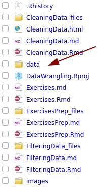

```{r setup, include=FALSE}
knitr::opts_chunk$set(echo = TRUE)
```

```{r}
library(tidyverse)
```

## Before we begin...

Download the following data files to your computer:

-   `transit-data.xlsx`
-   `pakistan_intellectual_capital.csv`
-   `cars.txt`
-   `wages1833.csv`

## Using the tidyverse vs built-in data reading functions


### Default function

In base R, the default function for reading tabular data from a CSV file is `read.csv()`. This function is widely used, but it has some quirks:

+ Automatic conversion of strings to factors: By default, `read.csv()` automatically converts character columns to factors, which can cause issues if you're not expecting categorical data. You can disable this behavior by setting `stringsAsFactors = FALSE`.

+ Column name handling: Column names are automatically adjusted to be syntactically valid variable names. For example, spaces are replaced with periods (.), which can make column names harder to read.

+ Performance: While `read.csv()` is perfectly fine for smaller datasets, it can be slower when working with larger files.

Example usage:

```{r}
data <- read.csv("data/pakistan_intellectual_capital.csv")
```

### The tidyverse way

The tidyverse provides its own functions to read data. For example, the nearly-equivalent function to `read.csv()` is `read_csv()` (from the `readr` package). **Notice the small difference in the function name!**

The tidyverse provides a more user-friendly function for reading CSV files: read_csv() from the readr package. It addresses many of the limitations of read.csv() and offers a more intuitive experience for modern data analysis:

+ Type guessing: `read_csv()` automatically guesses the types of columns (e.g., numeric, character, date) but does not convert them to factors unless specified.
+ Handling of column names: Column names are left as-is, without modification. This keeps names readable, especially when they contain spaces or special characters.
+ Faster performance: `read_csv()` is optimized for speed and can handle larger datasets more efficiently than `read.csv()`. This performance difference becomes noticeable for very large datasets (e.g., over 1 GB).
+ Tibble output: The result of `read_csv()` is a tibble, which has advantages over a data.frame, such as better printing in the console and more intuitive column subsetting.

Example usage:

```{r}  
data <- read_csv("data/pakistan_intellectual_capital.csv")
```

**Throughout this class, I will try to use the tidyverse functions for reading data.**

## Reading data from excel using readxl

Excel spreadsheets are often used and easy ways to store data.

Explore the data in `transit-data.xlsx`. (Please note the organization of my project folder.)



Note that:

+ The data data do not start in cell A1
+ The data contain different date formats
+ The data contain weird characters

Read the first sheet of data:

```{r}
library(readxl)
data <-read_excel("data/transit-data.xlsx") #Be sure to use the correct relative path here.
```

Look at the help for the read_excel function:

```{r}
?read_excel
```

Let's specify the data range we want to read.

```{r}
info <-read_excel("data/transit-data.xlsx", sheet = 'info', range = 'B1:C7')
info <-read_excel("data/transit-data.xlsx", sheet = 'info', range = cell_cols('B:C'))
```

Let's now read the data in the second sheet:

```{r}
more_data <- read_excel("data/transit-data.xlsx", sheet = 'transport data')
```

We need to skip the first line of the data.

```{r}
more_data <- read_excel("data/transit-data.xlsx", sheet = 'transport data', skip=1)
```

The column names are human readable but not very handy for coding. There is a quick way to solve this.

Tip: Only use underscores or dots in column names. This will make your life easier when coding.

```{r}
colnames(more_data) <- make.names(colnames(more_data))
```

## Reading data from a comma separated text file

R has functions for reading in text files. However, the functions provided by tidyverse are often more powerful. When reading in data, R reports on the column types. Information about the different types and their labels can be found here: [Column Types](https://tibble.tidyverse.org/articles/types.html)

*Note: The default report on the column types is a bit disorganized in this view. It will look better in your console.*

```{r}
data <- read_csv('data/pakistan_intellectual_capital.csv', n_max=10)
```

## Tibbles

Reading in data using tidyverse functions generates `tibbles`, instead of R's traditional `data.frame`. These are a newer version of the classic data frame with features tweaked to make life a bit easier. 

+ **Printing**: Tibbles print more concisely than `data.frames`. They show a preview of the data, while data.frames show the entire dataset in the console.
+ **Subsetting**: When you subset a data.frame with `mydata[1]`, the result is still a data.frame, whereas in a tibble, subsetting a column with `mydata[[1]]` or `mydata$column_name` returns a vector directly.
+ **Casting**: Tibbles preserve the type of data you provide. A `data.frame`, might coerce data into factors.

```{r}
print(class(data))
```

Convert to an old school data frame.

```{r}
old_school<-as.data.frame(data)
```

## Some interesting options when using `read_csv()`

### No column names? No problem!

If data has no column names, use `col_names = FALSE`

```{r}
read_csv("1,2,3\n4,5,6", col_names = FALSE)
```

You can also directly set the column names in this case.

```{r}
read_csv("1,2,3\n4,5,6", col_names = c("x", "y", "z"))
```

### Specifying missing data

Another option that commonly needs tweaking is `na`: this specifies the value (or values) that are used to represent missing values in your file:

```{r}
read_csv("a,b,c\n1,2,.", na = ".")
```

### Reading from URL

You can read data directly from a URL as well.

```{r}
url<-'https://raw.githubusercontent.com/dvanderelst-python-class/python-class/fall2022/11_Pandas_Statistics/data/pizzasize.csv'
data <- read_csv(url)
```

## Reading files not seperated by commas

`read_csv()` expects comma separated field. For data separated by other characters use these:

-   tab separated: `read_tsv()`
-   all others: `read_delim()`, specifying the `delim` argument.
-   `read_csv2()` uses `;` for the field separator and `,` for the decimal point. This format is common in some European countries.

## Exploring data

After reading in the data, it's a good idea to explore the data. Use either the environment tab in Rstudio or use functions that give you some info about your data.

*"This is a critical step that should always be performed. It is simple but it is vital. You should make numerical summaries such as means, standard deviations (SDs), maximum and minimum, correlations and whatever else is appropriate to the specific dataset. Equally important are graphical summaries."*

*(Faraway, J. J. (2004). Linear models with R. Chapman and Hall/CRC.).*

One of the most simple things you can do is inspect your data using a text editor. When text files are large, it's a good idea to get an editor that can handle large files. I suggest [Sublime Text Editor](https://www.sublimetext.com/). This editor can handle much larger files than you can open (as text) in Rstudio. Keep the file open while you're cleaning it!

Let's read in some data:

```{r}
data <- read_csv('data/pakistan_intellectual_capital.csv') # n_max is the number of rows to read
```


### Column names

```{r}
colnames(data)
```

### Head and tail

```{r}
head(data)
```

```{r}
tail(data)
```

### Summary

Get a quick summary

```{r}
summary(data)
```

### Glimpse

The function glimpse gives you also a quick overview:

```{r}
glimpse(data)
```

### Skim

And what about this beautiful exploratory tool?

```{r}
library(skimr)
skim(data)

```

```{r}
skim_tee(data)
```
### Tabulating

You can use the `janitor` package to get a quick overview of categorical variables, i.e., tabulating categorical variables. It's somewhat confusing that the `percent` column is not a percentage but a proportion.

```{r}
library(janitor)
tabyl(data, `Province University Located`)
```


## Addressing a single variable

A simple way to get variables from a tibble is using the `$` operator.

```{r}
my_variable <- data$Year
summary(my_variable)
```

However, this does not work if your variables names have names with a space (or other weird characters). This does work, however,

```{r}
my_variable <- data['Terminal Degree']
```

## Creating new variables

Often, you will want to create new variables based on existing ones to make subsequent processing easier.

```{r}
data['very_simple'] <- 1
data['very_simple']
```

However, we can do more interesting things.

```{r}
data['has_phd'] <- data['Terminal Degree'] == 'PhD'
data['has_phd']
```

We can calculate new variables.

```{r}
data['years_since_graduation'] <- 2022 - data$Year
```

## Creating new variables using `mutate`

The function `mutate` is the `Tidyverse`-approach to creating new variables. Let's use the pizza data for this demo.

```{r}
url<-'https://raw.githubusercontent.com/dvanderelst-python-class/python-class/fall2022/11_Pandas_Statistics/data/pizzasize.csv'
data <- read_csv(url)
```

### Mathematical Operations on Existing Columns

Let's create a new column giving the surface area of each column.

```{r}
data <- mutate(data, area = pi * (Diameter/2)^2)
data
```

For fun: `transmute` only keeps the new variable.

```{r}
data <- transmute(data, area = pi * (Diameter/2)^2)
data
```

### Logical/Conditional Variables

Tip: You can use `mutate` to created categories in your data.

```{r}
data <- read_delim("data/cars.txt", delim = " ")
data <- mutate(data, mpg_difference = mpg_hgw - mpg_city,
         fuel_efficiency_category = case_when(
           mpg_difference < 5 ~ "Efficient",
           mpg_difference >= 5 & mpg_difference <= 10 ~ "Moderate",
           mpg_difference > 10 ~ "Inefficient"
         ))
head(data)
```

```{r}
data <- mutate(data, small_engine = if_else(engine < 2, 1, 0))
names(data)
```

```{r}
data <- mutate(data, `small tank` = if_else(tank < 15, 1, 0))
names(data)
```

## Exercises

### Exercise 1

-   Read in the `cars.txt` file

-   Print the first lines of the data

-   Print the column names

-   Calculate the difference in mpg on the highway and the city, add this difference as a new variable to the data.

### Exercise 2

Download the `wages1833.csv` data file (from the data folder) and save it to your computer. This file contains data on the wages of Lancashire cotton factory workers in 1833. For each age category, the file lists the following:

-   `age`: age in years

-   `mnum:` number of male workers of the corresponding age

-   `mwage`: average wage of male workers of the corresponding age

-   `fnum`: number of female workers of the corresponding age

-   `fwage`: average wage of female workers of the corresponding age

More info on the data can be found in this paper: *Boot, H.M. 1995. How Skilled Were the Lancashire Cotton Factory Workers in 1833? Economic History Review 48: 283-303.*

Write a script that does the following:

-   Reads in the data

-   Adds a new variable that lists the difference between the number of male and female workers

-   Adds a new variable `diff_pct` that gives the difference in average wage between the male and female workers expressed as a percentage of the female wage. The `diff_pct` will give a positive number if males earn more on average, and a negative number if females earn more.


    $$diff_{pct} = 100 \times \frac{mwage - fwage}{fwage}$$
    
### Exercise 3

Read in the `wages1833.csv` data file using the `read_csv()` function.
Create a new column called age_group, which categorizes workers into the following groups based on their age:

+ "Child": Age < 14
+ "Young": 14 <= Age <= 20
+ "Adult": Age > 20

### Exercise 4

Read in the wages1833.csv file using `read_csv()`. Create a new column called `wage_difference`, which gives the absolute difference between the average male wage (`mwage`) and the average female wage (`fwage`). Create a second new column called `higher_wage`, which indicates whether males or females earned more on average in each row ("Male" or "Female"). Print the first few rows of the data.

