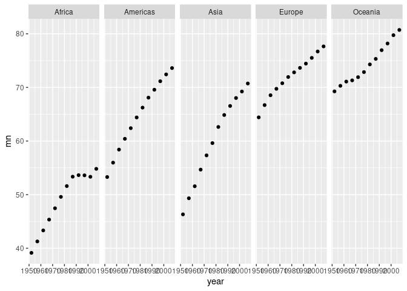
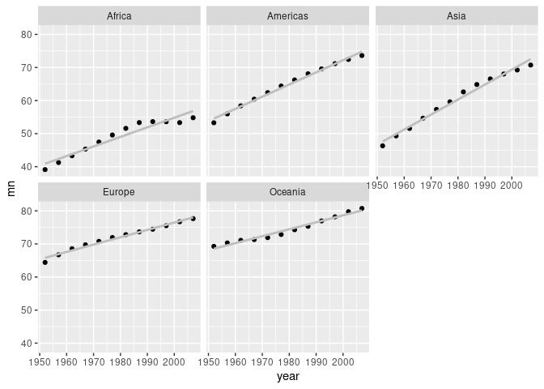

ggplot2
================
Dieter
2022-08-26

-   <a href="#installing-the-gapminder-package"
    id="toc-installing-the-gapminder-package">Installing the gapminder
    package</a>
-   <a href="#a-first-simple-example" id="toc-a-first-simple-example">A
    first simple example</a>
-   <a href="#exploring-some-data" id="toc-exploring-some-data">Exploring
    some data</a>
    -   <a href="#distributions" id="toc-distributions">Distributions</a>
-   <a href="#more-aesthetics" id="toc-more-aesthetics">More aesthetics</a>

## Installing the gapminder package

We will use the `gapminder` package to get public health data. This data
comes from the excellent [gapminder
website](https://www.gapminder.org/). This package provides a
`gapminder` tibble that contains the following variables:

-   country  
-   continent
-   year  
-   lifeExp life
-   pop
-   gdpPercap

Loading the package.

``` r
library(tidyverse)
```

    ## ── Attaching packages ─────────────────────────────────────── tidyverse 1.3.2 ──
    ## ✔ ggplot2 3.3.6     ✔ purrr   0.3.4
    ## ✔ tibble  3.1.8     ✔ dplyr   1.0.9
    ## ✔ tidyr   1.2.0     ✔ stringr 1.4.0
    ## ✔ readr   2.1.2     ✔ forcats 0.5.2
    ## ── Conflicts ────────────────────────────────────────── tidyverse_conflicts() ──
    ## ✖ dplyr::filter() masks stats::filter()
    ## ✖ dplyr::lag()    masks stats::lag()

``` r
library(gapminder)
gap_data <- gapminder #So I can see the data in the environment tab
```

## A first simple example

``` r
subset <- filter(gap_data, country == 'Algeria')
ggplot(subset) + aes(x=year, y=pop) + geom_point()
```

<!-- -->

``` r
subset <- filter(gap_data, country == 'Algeria')
ggplot(subset) + aes(x=year, y=pop) + geom_col() #Do not use geom_bar as that counts the data
```

<!-- --> We could use
`geom_bar()` but we have to override the default counting behavior.

``` r
subset <- filter(gap_data, country == 'Algeria')
ggplot(subset) + aes(x=year, y=pop) + geom_bar(stat= 'identity') 
```

<!-- -->

``` r
grp <- group_by(gap_data, country)
latest <- slice(grp, which.max(year))
grp <- group_by(latest, continent)
summary_data <- summarize(grp, sm = sum(pop) / 1000000000, mn = mean(pop))
p <- ggplot(summary_data) + aes(x = continent, y = sm) + geom_col()
p
```

<!-- -->

``` r
ggsave('saved.pdf', p)
```

    ## Saving 7 x 5 in image

## Exploring some data

### Distributions

Read in some body data.

``` r
data <- read_csv('data/body.csv')
```

    ## Rows: 507 Columns: 25
    ## ── Column specification ────────────────────────────────────────────────────────
    ## Delimiter: ","
    ## dbl (25): Biacromial, Biiliac, Bitrochanteric, ChestDepth, ChestDia, ElbowDi...
    ## 
    ## ℹ Use `spec()` to retrieve the full column specification for this data.
    ## ℹ Specify the column types or set `show_col_types = FALSE` to quiet this message.

Create a simple histogram

``` r
ggplot(data) + aes(x = Hip, y=..density..) + geom_histogram() + geom_density(col='red')
```

    ## `stat_bin()` using `bins = 30`. Pick better value with `binwidth`.

<!-- -->

Boxplots are also very nice tools to get a quick view of your data.
Here, we overlay the raw data in red.

``` r
ggplot(data) + aes(x = factor(Gender), y = Forearm) + geom_boxplot() + geom_jitter(width=0.1, height = 0, alpha = 0.25, col='red')
```

<!-- --> \### Scatter
plots

``` r
ggplot(data) + aes(x = Hip, y = Forearm) + geom_point() + geom_smooth(method = "loess") +  geom_smooth(method = "lm", col='red')
```

    ## `geom_smooth()` using formula 'y ~ x'
    ## `geom_smooth()` using formula 'y ~ x'

<!-- -->

## More aesthetics

Map variables on shapes and colors.

``` r
#ggplot(data) + aes(x= Thigh, y=Waist, shape = Gender) + geom_point() # Does not work
#ggplot(data) + aes(x= Thigh, y=Waist, shape = as.factor(Gender), color= Gender) + geom_point() # Does work - but notice the output
ggplot(data) + aes(x= Thigh, y=Waist, shape = as.factor(Gender), color= as.factor(Gender)) + geom_point() # Does work - but notice the output
```

<!-- --> Another
example using the gapminder data

``` r
grp <- group_by(gap_data,year,continent)
mns <- summarise(grp, mn = sum(pop) / 1000000000)
```

    ## `summarise()` has grouped output by 'year'. You can override using the
    ## `.groups` argument.

``` r
ggplot(mns) + aes(x= year, y = mn, color = continent) + geom_point()
```

<!-- -->

``` r
subset <- filter(gap_data, country == 'Angola')
ggplot(subset) + aes(x= year, y = pop, size = gdpPercap) + geom_point()
```

<!-- --> \## Small
multiples: multiple panels

``` r
grp <- group_by(gap_data, year, continent)
mns <- summarise(grp, mn = mean(lifeExp))
```

    ## `summarise()` has grouped output by 'year'. You can override using the
    ## `.groups` argument.

``` r
ggplot(mns) + aes(x = year, y=mn) + geom_point() + facet_grid(.~continent) 
```

<!-- -->

``` r
ggplot(mns) + aes(x = year, y=mn) + geom_point() + facet_wrap(~continent) + geom_smooth(method ='lm', color='gray', se=FALSE)
```

    ## `geom_smooth()` using formula 'y ~ x'

<!-- -->
