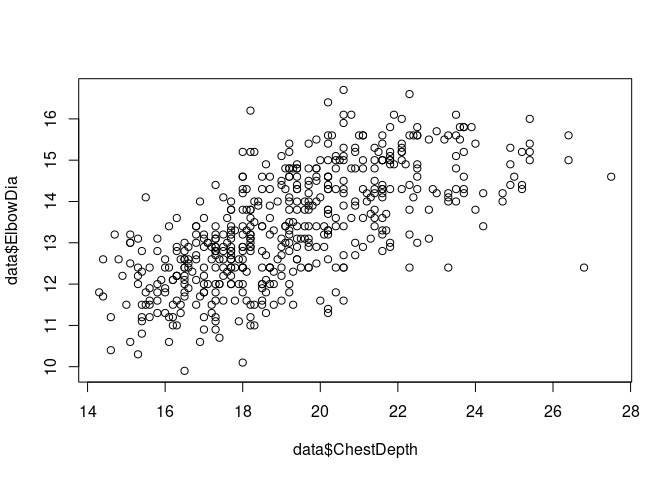
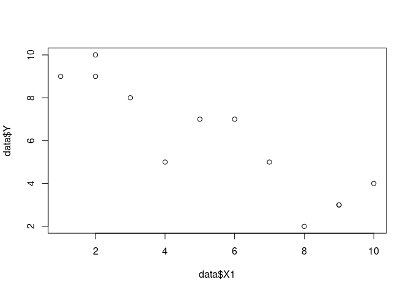

Correlation
================
Last Updated: 24, September, 2023 at 08:11

- <a href="#body-data-set" id="toc-body-data-set">Body data set</a>
- <a href="#vik-data-set" id="toc-vik-data-set">Vik data set</a>
  - <a href="#calculating-the-confidence-intervals"
    id="toc-calculating-the-confidence-intervals">Calculating the confidence
    intervals</a>
  - <a href="#get-p-value-manually" id="toc-get-p-value-manually">Get p
    value manually</a>
  - <a href="#calculate-the-t-value"
    id="toc-calculate-the-t-value">Calculate the t-value</a>
  - <a href="#calculate-p-value" id="toc-calculate-p-value">Calculate p
    value</a>
- <a href="#demo-of-confidence-intervals-for-large-r"
  id="toc-demo-of-confidence-intervals-for-large-r">Demo of confidence
  intervals for large r</a>

# Body data set

``` r
library(tidyverse)
```

    ## ── Attaching core tidyverse packages ──────────────────────── tidyverse 2.0.0 ──
    ## ✔ dplyr     1.1.0     ✔ readr     2.1.4
    ## ✔ forcats   1.0.0     ✔ stringr   1.5.0
    ## ✔ ggplot2   3.4.1     ✔ tibble    3.2.0
    ## ✔ lubridate 1.9.2     ✔ tidyr     1.3.0
    ## ✔ purrr     1.0.1     
    ## ── Conflicts ────────────────────────────────────────── tidyverse_conflicts() ──
    ## ✖ dplyr::filter() masks stats::filter()
    ## ✖ dplyr::lag()    masks stats::lag()
    ## ℹ Use the ]8;;http://conflicted.r-lib.org/conflicted package]8;; to force all conflicts to become errors

``` r
data <- read_csv('data/body.csv')
```

    ## Rows: 507 Columns: 25
    ## ── Column specification ────────────────────────────────────────────────────────
    ## Delimiter: ","
    ## dbl (25): Biacromial, Biiliac, Bitrochanteric, ChestDepth, ChestDia, ElbowDi...
    ## 
    ## ℹ Use `spec()` to retrieve the full column specification for this data.
    ## ℹ Specify the column types or set `show_col_types = FALSE` to quiet this message.

``` r
cor.test(data$ChestDepth, data$ElbowDia)
```

    ## 
    ##  Pearson's product-moment correlation
    ## 
    ## data:  data$ChestDepth and data$ElbowDia
    ## t = 20.022, df = 505, p-value < 2.2e-16
    ## alternative hypothesis: true correlation is not equal to 0
    ## 95 percent confidence interval:
    ##  0.6137075 0.7111244
    ## sample estimates:
    ##       cor 
    ## 0.6652377

``` r
plot(data$ChestDepth, data$ElbowDia)
```

<!-- -->

# Vik data set

``` r
data <- read_csv('data/vik_table_9_2.csv')
```

    ## Rows: 12 Columns: 4
    ## ── Column specification ────────────────────────────────────────────────────────
    ## Delimiter: ","
    ## dbl (4): Person, Y, X1, X2
    ## 
    ## ℹ Use `spec()` to retrieve the full column specification for this data.
    ## ℹ Specify the column types or set `show_col_types = FALSE` to quiet this message.

``` r
result <- cor.test(data$X1, data$Y)
plot(data$X1, data$Y)
```

<!-- -->

``` r
result
```

    ## 
    ##  Pearson's product-moment correlation
    ## 
    ## data:  data$X1 and data$Y
    ## t = -6.4208, df = 10, p-value = 7.627e-05
    ## alternative hypothesis: true correlation is not equal to 0
    ## 95 percent confidence interval:
    ##  -0.9710564 -0.6661805
    ## sample estimates:
    ##        cor 
    ## -0.8971007

## Calculating the confidence intervals

``` r
# Note that the confidence interval is not symmetric around the
# estimated correlation value

estimate <- result$estimate
lower <- result$conf.int[1]
upper <- result$conf.int[2]

values <- c(lower, estimate, upper)
delta1 <- estimate - lower
delta2 <- estimate - upper
deltas <- c(delta1, delta2)

values
```

    ##                   cor            
    ## -0.9710564 -0.8971007 -0.6661805

``` r
deltas
```

    ##         cor         cor 
    ##  0.07395562 -0.23092019

## Get p value manually

Get the sample correlation.

``` r
sample_correlation <- cor(data$X1, data$Y)
sample_correlation
```

    ## [1] -0.8971007

## Calculate the t-value

``` r
n<-length(data$X1) 
tvalue <- sample_correlation * sqrt((n-2)/(1 - sample_correlation^2))
tvalue
```

    ## [1] -6.420811

## Calculate p value

Per default R conducts a two-sided test using the following code:

``` r
df<-n-2
pvalue <- 2 * pt(tvalue, df)
pvalue
```

    ## [1] 7.626715e-05

# Demo of confidence intervals for large r

``` r
library(faux)
```

    ## 
    ## ************
    ## Welcome to faux. For support and examples visit:
    ## https://debruine.github.io/faux/
    ## - Get and set global package options with: faux_options()
    ## ************

``` r
data <- rnorm_multi(n= 10, vars = 2, r=0.80)
result <- cor.test(data$X1, data$X2)

result
```

    ## 
    ##  Pearson's product-moment correlation
    ## 
    ## data:  data$X1 and data$X2
    ## t = 2.6654, df = 8, p-value = 0.02857
    ## alternative hypothesis: true correlation is not equal to 0
    ## 95 percent confidence interval:
    ##  0.09890353 0.91873008
    ## sample estimates:
    ##       cor 
    ## 0.6858221

``` r
# Note that the confidence interval is not symmetric around the
# estimated correlation value

estimate <- result$estimate
lower <- result$conf.int[1]
upper <- result$conf.int[2]

values <- c(lower, estimate, upper)
delta1 <- estimate - lower
delta2 <- estimate - upper
deltas <- c(delta1, delta2)

values
```

    ##                   cor            
    ## 0.09890353 0.68582214 0.91873008

``` r
deltas
```

    ##        cor        cor 
    ##  0.5869186 -0.2329079
