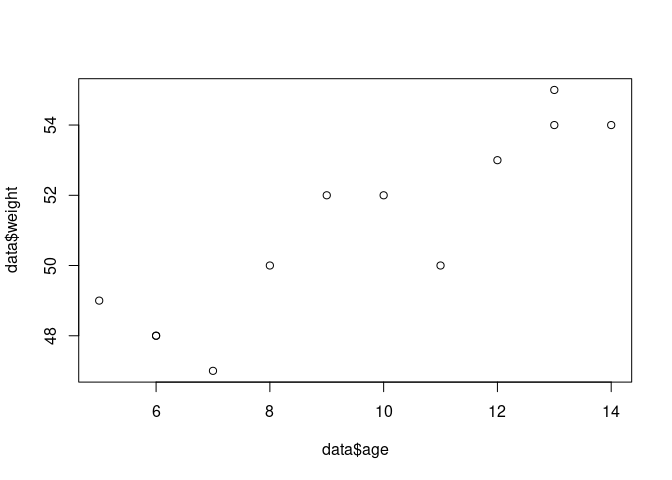

Simple Example of Linear Model
================
Last Updated: 24, October, 2023 at 09:06

- [A first example](#a-first-example)
  - [Read and create data data](#read-and-create-data-data)
  - [Run a simple linear model](#run-a-simple-linear-model)
  - [Get the F value components](#get-the-f-value-components)
- [Explicit model comparison](#explicit-model-comparison)
  - [Simple model](#simple-model)
  - [More complex model](#more-complex-model)
  - [Compare the models](#compare-the-models)
- [Second example](#second-example)
  - [Relationship between two variables:
    correlation](#relationship-between-two-variables-correlation)
  - [Relationship between two variables: linear
    model](#relationship-between-two-variables-linear-model)

**This file lists the examples used in the slides.**

# A first example

Before starting download the following data sets:

- `vik_table_9_2.csv`
- `body.csv`

## Read and create data data

``` r
data<-read.csv('data/vik_table_9_2.csv')

# Let's create two variables that could represent the age and weight of penguins
data$age<- 15 - data$X1
data$weight<-data$Y + 45
plot(data$age, data$weight)
```

<!-- -->

## Run a simple linear model

``` r
model1<-lm(weight ~ age, data=data) # fit this model: weight = B0 + B1 * age + error
summary(model1)
```

    ## 
    ## Call:
    ## lm(formula = weight ~ age, data = data)
    ## 
    ## Residuals:
    ##     Min      1Q  Median      3Q     Max 
    ## -2.1635 -0.3365  0.1121  0.7804  1.4907 
    ## 
    ## Coefficients:
    ##             Estimate Std. Error t value Pr(>|t|)    
    ## (Intercept)  43.6308     1.2031  36.267 6.04e-12 ***
    ## age           0.7757     0.1208   6.421 7.63e-05 ***
    ## ---
    ## Signif. codes:  0 '***' 0.001 '**' 0.01 '*' 0.05 '.' 0.1 ' ' 1
    ## 
    ## Residual standard error: 1.25 on 10 degrees of freedom
    ## Multiple R-squared:  0.8048, Adjusted R-squared:  0.7853 
    ## F-statistic: 41.23 on 1 and 10 DF,  p-value: 7.627e-05

## Get the F value components

``` r
anova(model1)
```

    ## Analysis of Variance Table
    ## 
    ## Response: weight
    ##           Df Sum Sq Mean Sq F value    Pr(>F)    
    ## age        1 64.383  64.383  41.227 7.627e-05 ***
    ## Residuals 10 15.617   1.562                      
    ## ---
    ## Signif. codes:  0 '***' 0.001 '**' 0.01 '*' 0.05 '.' 0.1 ' ' 1

# Explicit model comparison

## Simple model

First, run the simple model…

``` r
data$average_weight <- mean(data$weight) # Create a new variable which is the average of all weights
simple_model <- lm(weight ~ average_weight, data = data)
summary(simple_model)
```

    ## 
    ## Call:
    ## lm(formula = weight ~ average_weight, data = data)
    ## 
    ## Residuals:
    ##    Min     1Q Median     3Q    Max 
    ##  -4.00  -2.25   0.00   2.25   4.00 
    ## 
    ## Coefficients: (1 not defined because of singularities)
    ##                Estimate Std. Error t value Pr(>|t|)    
    ## (Intercept)     51.0000     0.7785   65.51  1.3e-15 ***
    ## average_weight       NA         NA      NA       NA    
    ## ---
    ## Signif. codes:  0 '***' 0.001 '**' 0.01 '*' 0.05 '.' 0.1 ' ' 1
    ## 
    ## Residual standard error: 2.697 on 11 degrees of freedom

## More complex model

Let’s run the more complex model (again)…

``` r
complex_model<-lm(weight ~ age, data=data)
```

## Compare the models

Compare the following output with that of the of the complex model.

``` r
anova(simple_model, complex_model)
```

    ## Analysis of Variance Table
    ## 
    ## Model 1: weight ~ average_weight
    ## Model 2: weight ~ age
    ##   Res.Df    RSS Df Sum of Sq      F    Pr(>F)    
    ## 1     11 80.000                                  
    ## 2     10 15.617  1    64.383 41.227 7.627e-05 ***
    ## ---
    ## Signif. codes:  0 '***' 0.001 '**' 0.01 '*' 0.05 '.' 0.1 ' ' 1

``` r
anova(complex_model)
```

    ## Analysis of Variance Table
    ## 
    ## Response: weight
    ##           Df Sum Sq Mean Sq F value    Pr(>F)    
    ## age        1 64.383  64.383  41.227 7.627e-05 ***
    ## Residuals 10 15.617   1.562                      
    ## ---
    ## Signif. codes:  0 '***' 0.001 '**' 0.01 '*' 0.05 '.' 0.1 ' ' 1

# Second example

``` r
data <- read.csv('data/body.csv')
data<-data[1:20,]
head(data)
```

    ##   Biacromial Biiliac Bitrochanteric ChestDepth ChestDia ElbowDia WristDia
    ## 1       42.9    26.0           31.5       17.7     28.0     13.1     10.4
    ## 2       43.7    28.5           33.5       16.9     30.8     14.0     11.8
    ## 3       40.1    28.2           33.3       20.9     31.7     13.9     10.9
    ## 4       44.3    29.9           34.0       18.4     28.2     13.9     11.2
    ## 5       42.5    29.9           34.0       21.5     29.4     15.2     11.6
    ## 6       43.3    27.0           31.5       19.6     31.3     14.0     11.5
    ##   KneeDia AnkleDia Shoulder Chest Waist Navel  Hip Thigh Bicep Forearm Knee
    ## 1    18.8     14.1    106.2  89.5  71.5  74.5 93.5  51.5  32.5    26.0 34.5
    ## 2    20.6     15.1    110.5  97.0  79.0  86.5 94.8  51.5  34.4    28.0 36.5
    ## 3    19.7     14.1    115.1  97.5  83.2  82.9 95.0  57.3  33.4    28.8 37.0
    ## 4    20.9     15.0    104.5  97.0  77.8  78.8 94.0  53.0  31.0    26.2 37.0
    ## 5    20.7     14.9    107.5  97.5  80.0  82.5 98.5  55.4  32.0    28.4 37.7
    ## 6    18.8     13.9    119.8  99.9  82.5  80.1 95.3  57.5  33.0    28.0 36.6
    ##   Calf Ankle Wrist Age Weight Height Gender
    ## 1 36.5  23.5  16.5  21   65.6  174.0      1
    ## 2 37.5  24.5  17.0  23   71.8  175.3      1
    ## 3 37.3  21.9  16.9  28   80.7  193.5      1
    ## 4 34.8  23.0  16.6  23   72.6  186.5      1
    ## 5 38.6  24.4  18.0  22   78.8  187.2      1
    ## 6 36.1  23.5  16.9  21   74.8  181.5      1

## Relationship between two variables: correlation

``` r
correlation_test<-cor.test(data$Wrist, data$Age)
correlation_test
```

    ## 
    ##  Pearson's product-moment correlation
    ## 
    ## data:  data$Wrist and data$Age
    ## t = 1.0465, df = 18, p-value = 0.3092
    ## alternative hypothesis: true correlation is not equal to 0
    ## 95 percent confidence interval:
    ##  -0.2271038  0.6166544
    ## sample estimates:
    ##       cor 
    ## 0.2394848

``` r
correlation_test$estimate**2
```

    ##        cor 
    ## 0.05735295

## Relationship between two variables: linear model

Notice how the t-test for the parameter for `x` gives the same results
as the t-test for the correlation test.

``` r
model2<-lm(data$Wrist~data$Age)
summary(model2)
```

    ## 
    ## Call:
    ## lm(formula = data$Wrist ~ data$Age)
    ## 
    ## Residuals:
    ##     Min      1Q  Median      3Q     Max 
    ## -1.1170 -0.7277 -0.2141  0.7566  1.5516 
    ## 
    ## Coefficients:
    ##             Estimate Std. Error t value Pr(>|t|)    
    ## (Intercept) 15.73914    1.56466  10.059 8.16e-09 ***
    ## data$Age     0.06860    0.06555   1.047    0.309    
    ## ---
    ## Signif. codes:  0 '***' 0.001 '**' 0.01 '*' 0.05 '.' 0.1 ' ' 1
    ## 
    ## Residual standard error: 0.8297 on 18 degrees of freedom
    ## Multiple R-squared:  0.05735,    Adjusted R-squared:  0.004984 
    ## F-statistic: 1.095 on 1 and 18 DF,  p-value: 0.3092
