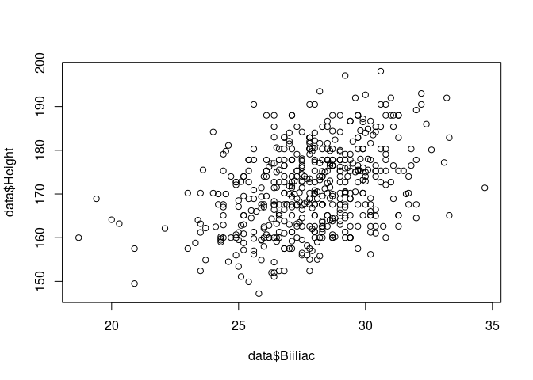
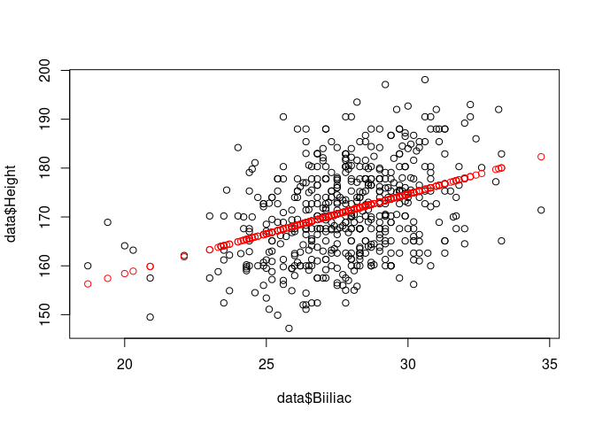
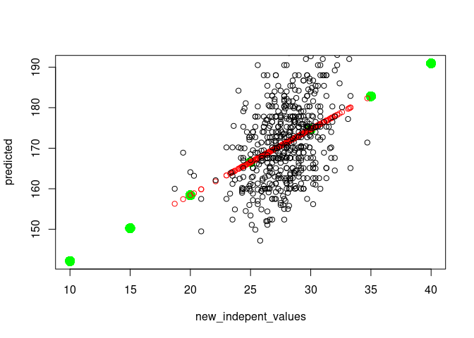
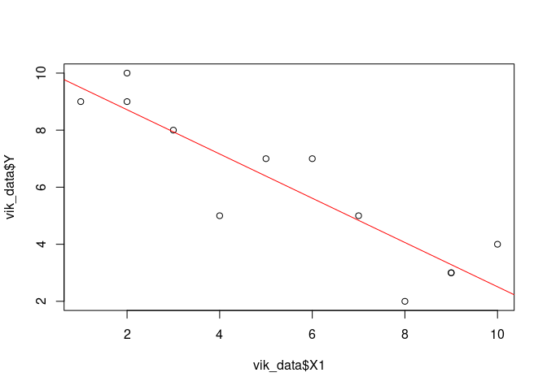

Simple Regression
================
Last Updated: 24, September, 2023 at 18:18

- <a href="#functions-we-will-use"
  id="toc-functions-we-will-use">Functions we will use</a>
- <a href="#read-data" id="toc-read-data">Read Data</a>
- <a href="#run-simple-regression-model"
  id="toc-run-simple-regression-model">Run simple regression model</a>
- <a href="#compare-with-correlation"
  id="toc-compare-with-correlation">Compare with correlation</a>
- <a href="#get-the-predicted-values"
  id="toc-get-the-predicted-values">Get the predicted values</a>
- <a href="#easier-regression-line" id="toc-easier-regression-line">Easier
  regression line</a>
- <a href="#third-example" id="toc-third-example">Third example</a>

# Functions we will use

- `lm`, to fit a linear model
- `summary`, to get the results from a linear model
- `anova`, to get more results from a linear model
- `predict`, to predict new values
- `abline`, to plot a regression line

# Read Data

``` r
library(tidyverse)
```

    ## ── Attaching core tidyverse packages ──────────────────────── tidyverse 2.0.0 ──
    ## ✔ dplyr     1.1.0     ✔ readr     2.1.4
    ## ✔ forcats   1.0.0     ✔ stringr   1.5.0
    ## ✔ ggplot2   3.4.1     ✔ tibble    3.2.0
    ## ✔ lubridate 1.9.2     ✔ tidyr     1.3.0
    ## ✔ purrr     1.0.1     
    ## ── Conflicts ────────────────────────────────────────── tidyverse_conflicts() ──
    ## ✖ dplyr::filter() masks stats::filter()
    ## ✖ dplyr::lag()    masks stats::lag()
    ## ℹ Use the ]8;;http://conflicted.r-lib.org/conflicted package]8;; to force all conflicts to become errors

``` r
data <- read_csv('data/body.csv')
```

    ## Rows: 507 Columns: 25
    ## ── Column specification ────────────────────────────────────────────────────────
    ## Delimiter: ","
    ## dbl (25): Biacromial, Biiliac, Bitrochanteric, ChestDepth, ChestDia, ElbowDi...
    ## 
    ## ℹ Use `spec()` to retrieve the full column specification for this data.
    ## ℹ Specify the column types or set `show_col_types = FALSE` to quiet this message.

# Run simple regression model

``` r
plot(data$Biiliac,data$Height)
```

<!-- -->

``` r
# Note: this syntax makes the predict function work
result <- lm(Height ~ Biiliac, data = data)
# This does not work with the predict function: result <- lm(data$Height ~ data$Biiliac)
summary(result)
```

    ## 
    ## Call:
    ## lm(formula = Height ~ Biiliac, data = data)
    ## 
    ## Residuals:
    ##      Min       1Q   Median       3Q      Max 
    ## -20.6424  -6.6158  -0.1255   6.1055  23.7281 
    ## 
    ## Coefficients:
    ##             Estimate Std. Error t value Pr(>|t|)    
    ## (Intercept) 125.8837     4.8964  25.709   <2e-16 ***
    ## Biiliac       1.6263     0.1754   9.272   <2e-16 ***
    ## ---
    ## Signif. codes:  0 '***' 0.001 '**' 0.01 '*' 0.05 '.' 0.1 ' ' 1
    ## 
    ## Residual standard error: 8.705 on 505 degrees of freedom
    ## Multiple R-squared:  0.1455, Adjusted R-squared:  0.1438 
    ## F-statistic: 85.98 on 1 and 505 DF,  p-value: < 2.2e-16

If we wish to know how the F-value was calculate we can ask for the
anova table.

``` r
anova(result)
```

    ## Analysis of Variance Table
    ## 
    ## Response: Height
    ##            Df Sum Sq Mean Sq F value    Pr(>F)    
    ## Biiliac     1   6515  6514.6  85.978 < 2.2e-16 ***
    ## Residuals 505  38264    75.8                      
    ## ---
    ## Signif. codes:  0 '***' 0.001 '**' 0.01 '*' 0.05 '.' 0.1 ' ' 1

# Compare with correlation

``` r
correlation <- cor.test(data$Height, data$Biiliac)
correlation
```

    ## 
    ##  Pearson's product-moment correlation
    ## 
    ## data:  data$Height and data$Biiliac
    ## t = 9.2724, df = 505, p-value < 2.2e-16
    ## alternative hypothesis: true correlation is not equal to 0
    ## 95 percent confidence interval:
    ##  0.3044541 0.4534453
    ## sample estimates:
    ##       cor 
    ## 0.3814241

``` r
correlation$estimate^2
```

    ##       cor 
    ## 0.1454843

# Get the predicted values

``` r
fitted <- fitted.values(result)
plot(data$Biiliac,data$Height)
points(data$Biiliac, fitted, col='red')
```

<!-- -->

More general prediction:

``` r
new_indepent_values <- c(10,15, 20, 25, 30, 35, 40)
new_data <- data.frame(Biiliac = new_indepent_values)

predicted <- predict(result, newdata=new_data)

plot(new_indepent_values,predicted, col='green', cex=2, pch=16)
points(data$Biiliac, fitted, col='red')
points(data$Biiliac, data$Height, col='black')
```

<!-- --> \#
Second example

``` r
vik_data <- read_csv('data/vik_table_9_2.csv')
```

    ## Rows: 12 Columns: 4
    ## ── Column specification ────────────────────────────────────────────────────────
    ## Delimiter: ","
    ## dbl (4): Person, Y, X1, X2
    ## 
    ## ℹ Use `spec()` to retrieve the full column specification for this data.
    ## ℹ Specify the column types or set `show_col_types = FALSE` to quiet this message.

``` r
plot(vik_data$X1, vik_data$Y)
```

<!-- -->

``` r
result <- lm(Y ~ X1, data=vik_data)
summary(result)
```

    ## 
    ## Call:
    ## lm(formula = Y ~ X1, data = vik_data)
    ## 
    ## Residuals:
    ##     Min      1Q  Median      3Q     Max 
    ## -2.1635 -0.3365  0.1121  0.7804  1.4907 
    ## 
    ## Coefficients:
    ##             Estimate Std. Error t value Pr(>|t|)    
    ## (Intercept)  10.2664     0.7561  13.579 9.07e-08 ***
    ## X1           -0.7757     0.1208  -6.421 7.63e-05 ***
    ## ---
    ## Signif. codes:  0 '***' 0.001 '**' 0.01 '*' 0.05 '.' 0.1 ' ' 1
    ## 
    ## Residual standard error: 1.25 on 10 degrees of freedom
    ## Multiple R-squared:  0.8048, Adjusted R-squared:  0.7853 
    ## F-statistic: 41.23 on 1 and 10 DF,  p-value: 7.627e-05

# Easier regression line

``` r
plot(vik_data$X1, vik_data$Y)
abline(result, col='red')
```

<!-- -->

# Third example

Notice how the t-test for the parameter for `x` gives the same results
as the t-test for the correlation test.

``` r
x <- rnorm(100)
y <- rnorm(100)
result <- lm(y ~ x)
summary(result)
```

    ## 
    ## Call:
    ## lm(formula = y ~ x)
    ## 
    ## Residuals:
    ##     Min      1Q  Median      3Q     Max 
    ## -2.1470 -0.6763  0.1133  0.5612  3.4334 
    ## 
    ## Coefficients:
    ##             Estimate Std. Error t value Pr(>|t|)
    ## (Intercept) -0.01576    0.10051  -0.157    0.876
    ## x           -0.07699    0.10065  -0.765    0.446
    ## 
    ## Residual standard error: 0.9903 on 98 degrees of freedom
    ## Multiple R-squared:  0.005935,   Adjusted R-squared:  -0.004209 
    ## F-statistic: 0.5851 on 1 and 98 DF,  p-value: 0.4462

``` r
cor.test(x,y)
```

    ## 
    ##  Pearson's product-moment correlation
    ## 
    ## data:  x and y
    ## t = -0.76492, df = 98, p-value = 0.4462
    ## alternative hypothesis: true correlation is not equal to 0
    ## 95 percent confidence interval:
    ##  -0.2693807  0.1212135
    ## sample estimates:
    ##         cor 
    ## -0.07703878
