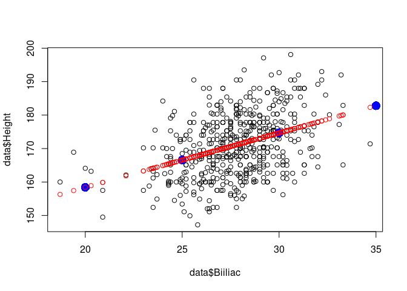

Simple Regression
================
Last Updated: 24, October, 2023 at 08:42

- [Before we start…](#before-we-start)
- [Functions we will use](#functions-we-will-use)
- [First example: body data](#first-example-body-data)
  - [Read Data](#read-data)
  - [Run simple regression model](#run-simple-regression-model)
  - [Compare with correlation](#compare-with-correlation)
  - [Get the predicted values](#get-the-predicted-values)
    - [For the existing independent variable
      values](#for-the-existing-independent-variable-values)
    - [For new independent variable
      values](#for-new-independent-variable-values)
  - [Second example: Vik data](#second-example-vik-data)
  - [Easier regression line](#easier-regression-line)

# Before we start…

Download the following data sets:

- `vik_table_9_2.csv`
- `body.csv`

# Functions we will use

- `lm`, to fit a linear model
- `summary`, to get the results from a linear model
- `anova`, to get more results from a linear model (or to compare
  models)
- `predict`, to predict new values
- `abline`, to plot a regression line

# First example: body data

## Read Data

``` r
library(tidyverse)
```

    ## ── Attaching packages ─────────────────────────────────────── tidyverse 1.3.2 ──
    ## ✔ ggplot2 3.4.0      ✔ purrr   0.3.5 
    ## ✔ tibble  3.1.8      ✔ dplyr   1.0.10
    ## ✔ tidyr   1.2.1      ✔ stringr 1.4.1 
    ## ✔ readr   2.1.3      ✔ forcats 0.5.2 
    ## ── Conflicts ────────────────────────────────────────── tidyverse_conflicts() ──
    ## ✖ dplyr::filter() masks stats::filter()
    ## ✖ dplyr::lag()    masks stats::lag()

``` r
data <- read_csv('data/body.csv')
```

    ## Rows: 507 Columns: 25
    ## ── Column specification ────────────────────────────────────────────────────────
    ## Delimiter: ","
    ## dbl (25): Biacromial, Biiliac, Bitrochanteric, ChestDepth, ChestDia, ElbowDi...
    ## 
    ## ℹ Use `spec()` to retrieve the full column specification for this data.
    ## ℹ Specify the column types or set `show_col_types = FALSE` to quiet this message.

## Run simple regression model

``` r
plot(data$Biiliac,data$Height)
```

<!-- -->

``` r
# Note: this syntax makes the predict function work
result <- lm(Height ~ Biiliac, data = data)
# This does not work with the predict function: result <- lm(data$Height ~ data$Biiliac)
summary(result)
```

    ## 
    ## Call:
    ## lm(formula = Height ~ Biiliac, data = data)
    ## 
    ## Residuals:
    ##      Min       1Q   Median       3Q      Max 
    ## -20.6424  -6.6158  -0.1255   6.1055  23.7281 
    ## 
    ## Coefficients:
    ##             Estimate Std. Error t value Pr(>|t|)    
    ## (Intercept) 125.8837     4.8964  25.709   <2e-16 ***
    ## Biiliac       1.6263     0.1754   9.272   <2e-16 ***
    ## ---
    ## Signif. codes:  0 '***' 0.001 '**' 0.01 '*' 0.05 '.' 0.1 ' ' 1
    ## 
    ## Residual standard error: 8.705 on 505 degrees of freedom
    ## Multiple R-squared:  0.1455, Adjusted R-squared:  0.1438 
    ## F-statistic: 85.98 on 1 and 505 DF,  p-value: < 2.2e-16

If we wish to know how the F-value was calculated we can ask for the
anova table.

``` r
anova(result)
```

    ## Analysis of Variance Table
    ## 
    ## Response: Height
    ##            Df Sum Sq Mean Sq F value    Pr(>F)    
    ## Biiliac     1   6515  6514.6  85.978 < 2.2e-16 ***
    ## Residuals 505  38264    75.8                      
    ## ---
    ## Signif. codes:  0 '***' 0.001 '**' 0.01 '*' 0.05 '.' 0.1 ' ' 1

## Compare with correlation

``` r
correlation <- cor.test(data$Height, data$Biiliac)
correlation
```

    ## 
    ##  Pearson's product-moment correlation
    ## 
    ## data:  data$Height and data$Biiliac
    ## t = 9.2724, df = 505, p-value < 2.2e-16
    ## alternative hypothesis: true correlation is not equal to 0
    ## 95 percent confidence interval:
    ##  0.3044541 0.4534453
    ## sample estimates:
    ##       cor 
    ## 0.3814241

``` r
correlation$estimate^2
```

    ##       cor 
    ## 0.1454843

## Get the predicted values

### For the existing independent variable values

``` r
fitted <- fitted.values(result)
plot(data$Biiliac,data$Height)
points(data$Biiliac, fitted, col='red')
```

<!-- -->

### For new independent variable values

More general prediction:

``` r
new_independent_values <- c(10,15, 20, 25, 30, 35, 40)
new_data <- data.frame(Biiliac = new_independent_values)

predicted <- predict(result, newdata=new_data)

plot(data$Biiliac, data$Height, col='black')
points(new_independent_values,predicted, col='blue', cex=2, pch=16)
points(data$Biiliac, fitted, col='red')
```

<!-- -->

## Second example: Vik data

``` r
vik_data <- read_csv('data/vik_table_9_2.csv')
```

    ## Rows: 12 Columns: 4
    ## ── Column specification ────────────────────────────────────────────────────────
    ## Delimiter: ","
    ## dbl (4): Person, Y, X1, X2
    ## 
    ## ℹ Use `spec()` to retrieve the full column specification for this data.
    ## ℹ Specify the column types or set `show_col_types = FALSE` to quiet this message.

``` r
plot(vik_data$X1, vik_data$Y)
```

<!-- -->

``` r
result <- lm(Y ~ X1, data=vik_data)
summary(result)
```

    ## 
    ## Call:
    ## lm(formula = Y ~ X1, data = vik_data)
    ## 
    ## Residuals:
    ##     Min      1Q  Median      3Q     Max 
    ## -2.1635 -0.3365  0.1121  0.7804  1.4907 
    ## 
    ## Coefficients:
    ##             Estimate Std. Error t value Pr(>|t|)    
    ## (Intercept)  10.2664     0.7561  13.579 9.07e-08 ***
    ## X1           -0.7757     0.1208  -6.421 7.63e-05 ***
    ## ---
    ## Signif. codes:  0 '***' 0.001 '**' 0.01 '*' 0.05 '.' 0.1 ' ' 1
    ## 
    ## Residual standard error: 1.25 on 10 degrees of freedom
    ## Multiple R-squared:  0.8048, Adjusted R-squared:  0.7853 
    ## F-statistic: 41.23 on 1 and 10 DF,  p-value: 7.627e-05

## Easier regression line

``` r
plot(vik_data$X1, vik_data$Y)
abline(result, col='red')
```

<!-- -->
