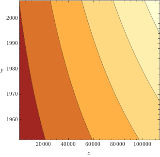
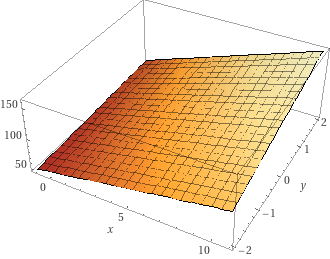

Multiple Regression
================
Dieter
2022-08-26

- [Data used](#data-used)
- [Read in some data](#read-in-some-data)
- [Revisit the simple linear model](#revisit-the-simple-linear-model)
  - [Manual calculation of the F
    value](#manual-calculation-of-the-f-value)
- [Intro to the multiple linear
  regression](#intro-to-the-multiple-linear-regression)
  - [A first example](#a-first-example)
  - [Confidence intervals](#confidence-intervals)
  - [Manual calculation of the F
    value](#manual-calculation-of-the-f-value-1)
  - [Visualizing the fitted model](#visualizing-the-fitted-model)
  - [Manually running the omnibus
    test](#manually-running-the-omnibus-test)
  - [Manually calculating the F ratio for the omnibus
    test](#manually-calculating-the-f-ratio-for-the-omnibus-test)
- [Model comparison](#model-comparison)
  - [A simple and a complex model](#a-simple-and-a-complex-model)
  - [What if the models only differ by one
    variable](#what-if-the-models-only-differ-by-one-variable)
- [Interactions](#interactions)
  - [Model without interaction](#model-without-interaction)
  - [Model with interaction](#model-with-interaction)
  - [Using zeroed data](#using-zeroed-data)
- [Step](#step)
  - [Using the Murder data](#using-the-murder-data)
  - [Using the body data](#using-the-body-data)

## Data used

- `body.csv`
- `vik_table_9_2.csv`

## Read in some data

``` r
library(tidyverse)
```

    ## ── Attaching packages ─────────────────────────────────────── tidyverse 1.3.2 ──
    ## ✔ ggplot2 3.4.0      ✔ purrr   0.3.5 
    ## ✔ tibble  3.1.8      ✔ dplyr   1.0.10
    ## ✔ tidyr   1.2.1      ✔ stringr 1.4.1 
    ## ✔ readr   2.1.3      ✔ forcats 0.5.2 
    ## ── Conflicts ────────────────────────────────────────── tidyverse_conflicts() ──
    ## ✖ dplyr::filter() masks stats::filter()
    ## ✖ dplyr::lag()    masks stats::lag()

``` r
body_data <-read_csv('data/body.csv')
```

    ## Rows: 507 Columns: 25
    ## ── Column specification ────────────────────────────────────────────────────────
    ## Delimiter: ","
    ## dbl (25): Biacromial, Biiliac, Bitrochanteric, ChestDepth, ChestDia, ElbowDi...
    ## 
    ## ℹ Use `spec()` to retrieve the full column specification for this data.
    ## ℹ Specify the column types or set `show_col_types = FALSE` to quiet this message.

## Revisit the simple linear model

``` r
model <- lm(body_data$Weight ~ body_data$Waist)
summary(model)
```

    ## 
    ## Call:
    ## lm(formula = body_data$Weight ~ body_data$Waist)
    ## 
    ## Residuals:
    ##      Min       1Q   Median       3Q      Max 
    ## -16.3211  -3.5995  -0.0936   3.6932  19.0536 
    ## 
    ## Coefficients:
    ##                  Estimate Std. Error t value Pr(>|t|)    
    ## (Intercept)     -15.18382    1.79291  -8.469 2.72e-16 ***
    ## body_data$Waist   1.09550    0.02306  47.514  < 2e-16 ***
    ## ---
    ## Signif. codes:  0 '***' 0.001 '**' 0.01 '*' 0.05 '.' 0.1 ' ' 1
    ## 
    ## Residual standard error: 5.712 on 505 degrees of freedom
    ## Multiple R-squared:  0.8172, Adjusted R-squared:  0.8168 
    ## F-statistic:  2258 on 1 and 505 DF,  p-value: < 2.2e-16

``` r
anova(model)
```

    ## Analysis of Variance Table
    ## 
    ## Response: body_data$Weight
    ##                  Df Sum Sq Mean Sq F value    Pr(>F)    
    ## body_data$Waist   1  73649   73649  2257.6 < 2.2e-16 ***
    ## Residuals       505  16475      33                      
    ## ---
    ## Signif. codes:  0 '***' 0.001 '**' 0.01 '*' 0.05 '.' 0.1 ' ' 1

### Manual calculation of the F value

``` r
predicted <- predict(model)
mn_predicted <-mean(predicted)
resids <- model$residuals


captured_variance <- sum((predicted - mn_predicted)^2)
uncaptured_variance <- sum((resids)^2)

n_predictors <- 1
manual_f <- (captured_variance / n_predictors)/ (uncaptured_variance/ model$df.residual)
captured_variance
```

    ## [1] 73648.74

``` r
uncaptured_variance
```

    ## [1] 16474.61

``` r
manual_f
```

    ## [1] 2257.572

## Intro to the multiple linear regression

### A first example

Here I use data provided by Vik 2013 (*Table 9.2 in Vik, Peter.
Regression, ANOVA, and the General Linear Model, 2013.*). This allows
double checking the calculating provided in this book.

``` r
vik_data <-read_csv('data/vik_table_9_2.csv')
```

    ## Rows: 12 Columns: 4
    ## ── Column specification ────────────────────────────────────────────────────────
    ## Delimiter: ","
    ## dbl (4): Person, Y, X1, X2
    ## 
    ## ℹ Use `spec()` to retrieve the full column specification for this data.
    ## ℹ Specify the column types or set `show_col_types = FALSE` to quiet this message.

``` r
head(vik_data)
```

    ## # A tibble: 6 × 4
    ##   Person     Y    X1    X2
    ##    <dbl> <dbl> <dbl> <dbl>
    ## 1      1     2     8     1
    ## 2      2     3     9     2
    ## 3      3     3     9     2
    ## 4      4     4    10     3
    ## 5      5     7     6     8
    ## 6      6     5     7     9

``` r
model <- lm(Y ~ X1 + X2, data=vik_data)
summary(model)
```

    ## 
    ## Call:
    ## lm(formula = Y ~ X1 + X2, data = vik_data)
    ## 
    ## Residuals:
    ##      Min       1Q   Median       3Q      Max 
    ## -2.45564 -0.24631  0.03248  0.54747  1.52060 
    ## 
    ## Coefficients:
    ##             Estimate Std. Error t value Pr(>|t|)    
    ## (Intercept)   9.2014     1.5185   6.060 0.000188 ***
    ## X1           -0.7085     0.1481  -4.783 0.000997 ***
    ## X2            0.1209     0.1486   0.813 0.436963    
    ## ---
    ## Signif. codes:  0 '***' 0.001 '**' 0.01 '*' 0.05 '.' 0.1 ' ' 1
    ## 
    ## Residual standard error: 1.271 on 9 degrees of freedom
    ## Multiple R-squared:  0.8182, Adjusted R-squared:  0.7777 
    ## F-statistic: 20.25 on 2 and 9 DF,  p-value: 0.0004663

### Confidence intervals

We can get the confidence intervals for the estimated coefficients.

``` r
confint(model)
```

    ##                  2.5 %     97.5 %
    ## (Intercept)  5.7663394 12.6364198
    ## X1          -1.0435258 -0.3734124
    ## X2          -0.2153328  0.4571416

### Manual calculation of the F value

``` r
predicted <- predict(model)
mn_predicted <-mean(predicted)
resids <- model$residuals

captured_variance <- sum((predicted - mn_predicted)^2)
uncaptured_variance <- sum((resids)^2)

n_predictors <- 2
manual_F <- (captured_variance / n_predictors)/ (uncaptured_variance/ model$df.residual)
captured_variance
```

    ## [1] 65.45267

``` r
uncaptured_variance
```

    ## [1] 14.54733

``` r
manual_f
```

    ## [1] 2257.572

### Visualizing the fitted model

``` r
# library(plotly)
# library(pracma)
# coeffs <- model$coefficient
# xi <- seq(min(vik_data$X1), max(vik_data$X1), length.out=100)
# yi <- seq(min(vik_data$X2), max(vik_data$X2), length.out=100)
# grid <- meshgrid(xi,yi)
# xi <- grid[[1]]
# yi <- grid[[2]]
# 
# 
# zi <- coeffs[1] + coeffs[2] * xi + coeffs[3] * yi
# 
# my_plot <- plot_ly(vik_data, x = ~X1,  y = ~X2, z = ~Y, type = "scatter3d", mode = "markers")
# my_plot <- add_trace(p = my_plot, z = zi, x = xi, y = yi, type = "surface")
# my_plot
```

### Manually running the omnibus test

I fit the full model and the base model (which is usually only done
implicitly).

``` r
vik_data$mean_y <- mean(vik_data$Y)


model_base <- lm(Y ~ mean_y, data=vik_data)
model_full <- lm(Y ~ X1 + X2, data=vik_data)
```

Let’s look at the full model’s F value.

``` r
summary(model_full)
```

    ## 
    ## Call:
    ## lm(formula = Y ~ X1 + X2, data = vik_data)
    ## 
    ## Residuals:
    ##      Min       1Q   Median       3Q      Max 
    ## -2.45564 -0.24631  0.03248  0.54747  1.52060 
    ## 
    ## Coefficients:
    ##             Estimate Std. Error t value Pr(>|t|)    
    ## (Intercept)   9.2014     1.5185   6.060 0.000188 ***
    ## X1           -0.7085     0.1481  -4.783 0.000997 ***
    ## X2            0.1209     0.1486   0.813 0.436963    
    ## ---
    ## Signif. codes:  0 '***' 0.001 '**' 0.01 '*' 0.05 '.' 0.1 ' ' 1
    ## 
    ## Residual standard error: 1.271 on 9 degrees of freedom
    ## Multiple R-squared:  0.8182, Adjusted R-squared:  0.7777 
    ## F-statistic: 20.25 on 2 and 9 DF,  p-value: 0.0004663

Let’s now explicitly compare the base and the full model. This results
in the same F-value! So, we could run the omnibus test by comparing the
base model, $y_i = \bar{x}_i$, with the full model. But this is done
implicitly by R when fitting the full model.

``` r
anova(model_base, model_full)
```

    ## Analysis of Variance Table
    ## 
    ## Model 1: Y ~ mean_y
    ## Model 2: Y ~ X1 + X2
    ##   Res.Df    RSS Df Sum of Sq      F    Pr(>F)    
    ## 1     11 80.000                                  
    ## 2      9 14.547  2    65.453 20.247 0.0004663 ***
    ## ---
    ## Signif. codes:  0 '***' 0.001 '**' 0.01 '*' 0.05 '.' 0.1 ' ' 1

### Manually calculating the F ratio for the omnibus test

``` r
full_model_predictions <- predict(model_full)
mean_full_model_predictions <-mean(full_model_predictions)

base_model_predictions <- predict(model_base)

captured_variance <- sum((full_model_predictions - mean_full_model_predictions)^2) 
uncaptured_variance <- sum((base_model_predictions- vik_data$Y)^2) 
test <- sum((model_full$residuals)^2) 
test
```

    ## [1] 14.54733

``` r
captured_variance
```

    ## [1] 65.45267

``` r
uncaptured_variance
```

    ## [1] 80

``` r
manual_f <- captured_variance/uncaptured_variance
manual_f
```

    ## [1] 0.8181584

## Model comparison

### A simple and a complex model

``` r
state_data <- as.data.frame(state.x77)
colnames(state_data) <- make.names(colnames(state_data))
head(state_data)
```

    ##            Population Income Illiteracy Life.Exp Murder HS.Grad Frost   Area
    ## Alabama          3615   3624        2.1    69.05   15.1    41.3    20  50708
    ## Alaska            365   6315        1.5    69.31   11.3    66.7   152 566432
    ## Arizona          2212   4530        1.8    70.55    7.8    58.1    15 113417
    ## Arkansas         2110   3378        1.9    70.66   10.1    39.9    65  51945
    ## California      21198   5114        1.1    71.71   10.3    62.6    20 156361
    ## Colorado         2541   4884        0.7    72.06    6.8    63.9   166 103766

Let’s fit two (nested) models,

``` r
simple_model <- lm(state_data$Murder ~ state_data$Illiteracy)
complex_model <- lm(state_data$Murder ~ state_data$Illiteracy + state_data$Income + state_data$Population)
```

Let’s look at their summaries:

``` r
summary(simple_model)
```

    ## 
    ## Call:
    ## lm(formula = state_data$Murder ~ state_data$Illiteracy)
    ## 
    ## Residuals:
    ##     Min      1Q  Median      3Q     Max 
    ## -5.5315 -2.0602 -0.2503  1.6916  6.9745 
    ## 
    ## Coefficients:
    ##                       Estimate Std. Error t value Pr(>|t|)    
    ## (Intercept)             2.3968     0.8184   2.928   0.0052 ** 
    ## state_data$Illiteracy   4.2575     0.6217   6.848 1.26e-08 ***
    ## ---
    ## Signif. codes:  0 '***' 0.001 '**' 0.01 '*' 0.05 '.' 0.1 ' ' 1
    ## 
    ## Residual standard error: 2.653 on 48 degrees of freedom
    ## Multiple R-squared:  0.4942, Adjusted R-squared:  0.4836 
    ## F-statistic: 46.89 on 1 and 48 DF,  p-value: 1.258e-08

``` r
summary(complex_model)
```

    ## 
    ## Call:
    ## lm(formula = state_data$Murder ~ state_data$Illiteracy + state_data$Income + 
    ##     state_data$Population)
    ## 
    ## Residuals:
    ##     Min      1Q  Median      3Q     Max 
    ## -4.7846 -1.6768 -0.0839  1.4783  7.6417 
    ## 
    ## Coefficients:
    ##                        Estimate Std. Error t value Pr(>|t|)    
    ## (Intercept)           1.3402721  3.3694210   0.398   0.6926    
    ## state_data$Illiteracy 4.1109188  0.6706786   6.129 1.85e-07 ***
    ## state_data$Income     0.0000644  0.0006762   0.095   0.9245    
    ## state_data$Population 0.0002219  0.0000842   2.635   0.0114 *  
    ## ---
    ## Signif. codes:  0 '***' 0.001 '**' 0.01 '*' 0.05 '.' 0.1 ' ' 1
    ## 
    ## Residual standard error: 2.507 on 46 degrees of freedom
    ## Multiple R-squared:  0.5669, Adjusted R-squared:  0.5387 
    ## F-statistic: 20.07 on 3 and 46 DF,  p-value: 1.84e-08

``` r
anova(simple_model, complex_model)
```

    ## Analysis of Variance Table
    ## 
    ## Model 1: state_data$Murder ~ state_data$Illiteracy
    ## Model 2: state_data$Murder ~ state_data$Illiteracy + state_data$Income + 
    ##     state_data$Population
    ##   Res.Df    RSS Df Sum of Sq      F  Pr(>F)  
    ## 1     48 337.76                              
    ## 2     46 289.19  2    48.574 3.8633 0.02812 *
    ## ---
    ## Signif. codes:  0 '***' 0.001 '**' 0.01 '*' 0.05 '.' 0.1 ' ' 1

### What if the models only differ by one variable

In this case, the p-value associated with the newly introduced variable
is equal to the p value of the anova comparison. In fact the $F$ value
is equal to $t^2$ value.

``` r
simple_model <- lm(state_data$Murder ~ state_data$Illiteracy)
complex_model <- lm(state_data$Murder ~ state_data$Illiteracy + state_data$Income)
summary(complex_model)
```

    ## 
    ## Call:
    ## lm(formula = state_data$Murder ~ state_data$Illiteracy + state_data$Income)
    ## 
    ## Residuals:
    ##     Min      1Q  Median      3Q     Max 
    ## -5.6343 -1.9289 -0.0171  1.6779  6.7349 
    ## 
    ## Coefficients:
    ##                         Estimate Std. Error t value Pr(>|t|)    
    ## (Intercept)           -0.4409926  3.5034602  -0.126    0.900    
    ## state_data$Illiteracy  4.5099882  0.6934465   6.504 4.63e-08 ***
    ## state_data$Income      0.0005731  0.0006879   0.833    0.409    
    ## ---
    ## Signif. codes:  0 '***' 0.001 '**' 0.01 '*' 0.05 '.' 0.1 ' ' 1
    ## 
    ## Residual standard error: 2.661 on 47 degrees of freedom
    ## Multiple R-squared:  0.5015, Adjusted R-squared:  0.4803 
    ## F-statistic: 23.64 on 2 and 47 DF,  p-value: 7.841e-08

``` r
anova(simple_model, complex_model)
```

    ## Analysis of Variance Table
    ## 
    ## Model 1: state_data$Murder ~ state_data$Illiteracy
    ## Model 2: state_data$Murder ~ state_data$Illiteracy + state_data$Income
    ##   Res.Df    RSS Df Sum of Sq      F Pr(>F)
    ## 1     48 337.76                           
    ## 2     47 332.85  1    4.9163 0.6942 0.4089

## Interactions

### Model without interaction

``` r
library(gapminder)
gap <- gapminder
model <- lm(lifeExp ~ gdpPercap + year, data = gap)
summary(model)
```

    ## 
    ## Call:
    ## lm(formula = lifeExp ~ gdpPercap + year, data = gap)
    ## 
    ## Residuals:
    ##     Min      1Q  Median      3Q     Max 
    ## -67.262  -6.954   1.219   7.759  19.553 
    ## 
    ## Coefficients:
    ##               Estimate Std. Error t value Pr(>|t|)    
    ## (Intercept) -4.184e+02  2.762e+01  -15.15   <2e-16 ***
    ## gdpPercap    6.697e-04  2.447e-05   27.37   <2e-16 ***
    ## year         2.390e-01  1.397e-02   17.11   <2e-16 ***
    ## ---
    ## Signif. codes:  0 '***' 0.001 '**' 0.01 '*' 0.05 '.' 0.1 ' ' 1
    ## 
    ## Residual standard error: 9.694 on 1701 degrees of freedom
    ## Multiple R-squared:  0.4375, Adjusted R-squared:  0.4368 
    ## F-statistic: 661.4 on 2 and 1701 DF,  p-value: < 2.2e-16

### Model with interaction

``` r
model <- lm(lifeExp ~ gdpPercap * year, data = gap)
summary(model)
```

    ## 
    ## Call:
    ## lm(formula = lifeExp ~ gdpPercap * year, data = gap)
    ## 
    ## Residuals:
    ##     Min      1Q  Median      3Q     Max 
    ## -54.234  -7.314   1.002   7.951  19.780 
    ## 
    ## Coefficients:
    ##                  Estimate Std. Error t value Pr(>|t|)    
    ## (Intercept)    -3.532e+02  3.267e+01 -10.811  < 2e-16 ***
    ## gdpPercap      -8.754e-03  2.547e-03  -3.437 0.000602 ***
    ## year            2.060e-01  1.653e-02  12.463  < 2e-16 ***
    ## gdpPercap:year  4.754e-06  1.285e-06   3.700 0.000222 ***
    ## ---
    ## Signif. codes:  0 '***' 0.001 '**' 0.01 '*' 0.05 '.' 0.1 ' ' 1
    ## 
    ## Residual standard error: 9.658 on 1700 degrees of freedom
    ## Multiple R-squared:  0.442,  Adjusted R-squared:  0.441 
    ## F-statistic: 448.8 on 3 and 1700 DF,  p-value: < 2.2e-16

This gives the same result:

``` r
gap$multi <- gap$gdpPercap * gap$year
model <- lm(lifeExp ~ gdpPercap + year + multi, data = gap)
summary(model)
```

    ## 
    ## Call:
    ## lm(formula = lifeExp ~ gdpPercap + year + multi, data = gap)
    ## 
    ## Residuals:
    ##     Min      1Q  Median      3Q     Max 
    ## -54.234  -7.314   1.002   7.951  19.780 
    ## 
    ## Coefficients:
    ##               Estimate Std. Error t value Pr(>|t|)    
    ## (Intercept) -3.532e+02  3.267e+01 -10.811  < 2e-16 ***
    ## gdpPercap   -8.754e-03  2.547e-03  -3.437 0.000602 ***
    ## year         2.060e-01  1.653e-02  12.463  < 2e-16 ***
    ## multi        4.754e-06  1.285e-06   3.700 0.000222 ***
    ## ---
    ## Signif. codes:  0 '***' 0.001 '**' 0.01 '*' 0.05 '.' 0.1 ' ' 1
    ## 
    ## Residual standard error: 9.658 on 1700 degrees of freedom
    ## Multiple R-squared:  0.442,  Adjusted R-squared:  0.441 
    ## F-statistic: 448.8 on 3 and 1700 DF,  p-value: < 2.2e-16

``` r
range(gap$gdpPercap)
```

    ## [1]    241.1659 113523.1329

``` r
range(gap$year)
```

    ## [1] 1952 2007

See this link for a plot of the model:
<https://www.wolframalpha.com/input?i=plot+-3.532e%2B02+%2B+x+*+-8.754e-03+%2B+y+*+2.060e-01+%2B+4.754e-06+*+%28x+*+y%29+with+x++%3D+241+to+113523+and+y+%3D+1952+to+2007>

  



### Using zeroed data

``` r
gap <- mutate(gap, year = scale(year))
gap <- mutate(gap, gdpPercap = scale(gdpPercap))
model <- lm(lifeExp ~ gdpPercap * year, data = gap)
range(gap$gdpPercap)
```

    ## [1] -0.7075012 10.7845089

``` r
range(gap$year)
```

    ## [1] -1.592787  1.592787

``` r
summary(model)
```

    ## 
    ## Call:
    ## lm(formula = lifeExp ~ gdpPercap * year, data = gap)
    ## 
    ## Residuals:
    ##     Min      1Q  Median      3Q     Max 
    ## -54.234  -7.314   1.002   7.951  19.780 
    ## 
    ## Coefficients:
    ##                Estimate Std. Error t value Pr(>|t|)    
    ## (Intercept)     59.2906     0.2392  247.90  < 2e-16 ***
    ## gdpPercap        6.4680     0.2430   26.61  < 2e-16 ***
    ## year             4.1489     0.2404   17.26  < 2e-16 ***
    ## gdpPercap:year   0.8091     0.2187    3.70 0.000222 ***
    ## ---
    ## Signif. codes:  0 '***' 0.001 '**' 0.01 '*' 0.05 '.' 0.1 ' ' 1
    ## 
    ## Residual standard error: 9.658 on 1700 degrees of freedom
    ## Multiple R-squared:  0.442,  Adjusted R-squared:  0.441 
    ## F-statistic: 448.8 on 3 and 1700 DF,  p-value: < 2.2e-16

The fitted model becomes,

$$
z = 59.29 + 6.46  x + 4.14  y + 0.80 + x y
$$ with $x$ the gdpPercap and $y$ the year.

See this link for a graph:
<https://www.wolframalpha.com/input?i=plot+59.2906+%2B+6.4680+*+x+%2B+4.1489+*+y+%2B+0.8091+%2B+x+*+y+with+x+from+-+1+to+11+and+y+from+-2+to+2>




## Step

### Using the Murder data

``` r
library(MASS)
```

    ## 
    ## Attaching package: 'MASS'

    ## The following object is masked from 'package:dplyr':
    ## 
    ##     select

``` r
full=lm(Murder~.,data=state_data)
stepAIC(full, direction="backward", trace = TRUE)
```

    ## Start:  AIC=63.01
    ## Murder ~ Population + Income + Illiteracy + Life.Exp + HS.Grad + 
    ##     Frost + Area
    ## 
    ##              Df Sum of Sq    RSS    AIC
    ## - Income      1     0.236 128.27 61.105
    ## - HS.Grad     1     0.973 129.01 61.392
    ## <none>                    128.03 63.013
    ## - Area        1     7.514 135.55 63.865
    ## - Illiteracy  1     8.299 136.33 64.154
    ## - Frost       1     9.260 137.29 64.505
    ## - Population  1    25.719 153.75 70.166
    ## - Life.Exp    1   127.175 255.21 95.503
    ## 
    ## Step:  AIC=61.11
    ## Murder ~ Population + Illiteracy + Life.Exp + HS.Grad + Frost + 
    ##     Area
    ## 
    ##              Df Sum of Sq    RSS    AIC
    ## - HS.Grad     1     0.763 129.03 59.402
    ## <none>                    128.27 61.105
    ## - Area        1     7.310 135.58 61.877
    ## - Illiteracy  1     8.715 136.98 62.392
    ## - Frost       1     9.345 137.61 62.621
    ## - Population  1    27.142 155.41 68.702
    ## - Life.Exp    1   127.500 255.77 93.613
    ## 
    ## Step:  AIC=59.4
    ## Murder ~ Population + Illiteracy + Life.Exp + Frost + Area
    ## 
    ##              Df Sum of Sq    RSS    AIC
    ## <none>                    129.03 59.402
    ## - Illiteracy  1     8.723 137.75 60.672
    ## - Frost       1    11.030 140.06 61.503
    ## - Area        1    15.937 144.97 63.225
    ## - Population  1    26.415 155.45 66.714
    ## - Life.Exp    1   140.391 269.42 94.213

    ## 
    ## Call:
    ## lm(formula = Murder ~ Population + Illiteracy + Life.Exp + Frost + 
    ##     Area, data = state_data)
    ## 
    ## Coefficients:
    ## (Intercept)   Population   Illiteracy     Life.Exp        Frost         Area  
    ##   1.202e+02    1.780e-04    1.173e+00   -1.608e+00   -1.373e-02    6.804e-06

### Using the body data

``` r
library(MASS)
full=lm(Weight~.,data=body_data)
stepAIC(full, direction="backward", trace = TRUE)
```

    ## Start:  AIC=775.52
    ## Weight ~ Biacromial + Biiliac + Bitrochanteric + ChestDepth + 
    ##     ChestDia + ElbowDia + WristDia + KneeDia + AnkleDia + Shoulder + 
    ##     Chest + Waist + Navel + Hip + Thigh + Bicep + Forearm + Knee + 
    ##     Calf + Ankle + Wrist + Age + Height + Gender
    ## 
    ##                  Df Sum of Sq    RSS    AIC
    ## - Ankle           1      0.06 2120.8 773.54
    ## - Navel           1      0.49 2121.2 773.64
    ## - Biacromial      1      0.71 2121.5 773.69
    ## - AnkleDia        1      2.08 2122.8 774.02
    ## - WristDia        1      3.42 2124.2 774.34
    ## - Bitrochanteric  1      3.83 2124.6 774.44
    ## - Wrist           1      5.98 2126.7 774.95
    ## - ElbowDia        1      6.57 2127.3 775.09
    ## - Bicep           1      8.17 2128.9 775.47
    ## <none>                        2120.7 775.52
    ## - Biiliac         1     13.13 2133.9 776.65
    ## - ChestDia        1     15.71 2136.5 777.27
    ## - Shoulder        1     27.81 2148.6 780.13
    ## - Knee            1     30.39 2151.1 780.74
    ## - Gender          1     36.02 2156.8 782.06
    ## - KneeDia         1     43.48 2164.2 783.81
    ## - Chest           1     47.62 2168.4 784.78
    ## - Forearm         1     51.49 2172.2 785.69
    ## - ChestDepth      1     77.87 2198.6 791.81
    ## - Thigh           1     78.65 2199.4 791.99
    ## - Age             1     88.97 2209.7 794.36
    ## - Hip             1    108.21 2229.0 798.75
    ## - Calf            1    118.89 2239.6 801.18
    ## - Waist           1    797.97 2918.7 935.45
    ## - Height          1   1173.76 3294.5 996.85
    ## 
    ## Step:  AIC=773.54
    ## Weight ~ Biacromial + Biiliac + Bitrochanteric + ChestDepth + 
    ##     ChestDia + ElbowDia + WristDia + KneeDia + AnkleDia + Shoulder + 
    ##     Chest + Waist + Navel + Hip + Thigh + Bicep + Forearm + Knee + 
    ##     Calf + Wrist + Age + Height + Gender
    ## 
    ##                  Df Sum of Sq    RSS    AIC
    ## - Navel           1      0.46 2121.3 771.65
    ## - Biacromial      1      0.69 2121.5 771.70
    ## - AnkleDia        1      2.46 2123.3 772.13
    ## - WristDia        1      3.37 2124.2 772.34
    ## - Bitrochanteric  1      3.80 2124.6 772.45
    ## - Wrist           1      6.08 2126.9 772.99
    ## - ElbowDia        1      6.52 2127.3 773.09
    ## - Bicep           1      8.15 2129.0 773.48
    ## <none>                        2120.8 773.54
    ## - Biiliac         1     13.10 2133.9 774.66
    ## - ChestDia        1     15.71 2136.5 775.28
    ## - Shoulder        1     27.86 2148.7 778.15
    ## - Knee            1     32.75 2153.6 779.31
    ## - Gender          1     36.02 2156.8 780.08
    ## - KneeDia         1     43.87 2164.7 781.92
    ## - Chest           1     47.59 2168.4 782.79
    ## - Forearm         1     51.43 2172.2 783.69
    ## - ChestDepth      1     77.84 2198.6 789.81
    ## - Thigh           1     78.76 2199.6 790.02
    ## - Age             1     89.71 2210.5 792.54
    ## - Hip             1    108.59 2229.4 796.86
    ## - Calf            1    137.71 2258.5 803.44
    ## - Waist           1    798.17 2919.0 933.49
    ## - Height          1   1174.23 3295.0 994.93
    ## 
    ## Step:  AIC=771.65
    ## Weight ~ Biacromial + Biiliac + Bitrochanteric + ChestDepth + 
    ##     ChestDia + ElbowDia + WristDia + KneeDia + AnkleDia + Shoulder + 
    ##     Chest + Waist + Hip + Thigh + Bicep + Forearm + Knee + Calf + 
    ##     Wrist + Age + Height + Gender
    ## 
    ##                  Df Sum of Sq    RSS    AIC
    ## - Biacromial      1      0.66 2121.9 769.81
    ## - AnkleDia        1      2.22 2123.5 770.18
    ## - Bitrochanteric  1      3.57 2124.8 770.50
    ## - WristDia        1      3.64 2124.9 770.52
    ## - Wrist           1      6.05 2127.3 771.09
    ## - ElbowDia        1      6.26 2127.5 771.14
    ## - Bicep           1      7.75 2129.0 771.50
    ## <none>                        2121.3 771.65
    ## - Biiliac         1     12.67 2133.9 772.67
    ## - ChestDia        1     16.22 2137.5 773.51
    ## - Shoulder        1     28.62 2149.9 776.44
    ## - Knee            1     32.29 2153.6 777.31
    ## - Gender          1     36.57 2157.8 778.31
    ## - KneeDia         1     45.28 2166.6 780.36
    ## - Chest           1     47.13 2168.4 780.79
    ## - Forearm         1     52.51 2173.8 782.05
    ## - ChestDepth      1     77.39 2198.7 787.82
    ## - Thigh           1     81.25 2202.5 788.71
    ## - Age             1     96.82 2218.1 792.28
    ## - Hip             1    121.11 2242.4 797.80
    ## - Calf            1    140.97 2262.2 802.27
    ## - Waist           1    896.91 3018.2 948.44
    ## - Height          1   1174.61 3295.9 993.06
    ## 
    ## Step:  AIC=769.81
    ## Weight ~ Biiliac + Bitrochanteric + ChestDepth + ChestDia + ElbowDia + 
    ##     WristDia + KneeDia + AnkleDia + Shoulder + Chest + Waist + 
    ##     Hip + Thigh + Bicep + Forearm + Knee + Calf + Wrist + Age + 
    ##     Height + Gender
    ## 
    ##                  Df Sum of Sq    RSS    AIC
    ## - AnkleDia        1      2.48 2124.4 768.40
    ## - WristDia        1      3.67 2125.6 768.68
    ## - Bitrochanteric  1      4.29 2126.2 768.83
    ## - ElbowDia        1      6.13 2128.1 769.27
    ## - Wrist           1      6.92 2128.9 769.46
    ## - Bicep           1      8.26 2130.2 769.78
    ## <none>                        2121.9 769.81
    ## - Biiliac         1     12.23 2134.2 770.72
    ## - ChestDia        1     15.56 2137.5 771.51
    ## - Shoulder        1     28.16 2150.1 774.49
    ## - Knee            1     32.95 2154.9 775.62
    ## - Gender          1     40.48 2162.4 777.39
    ## - KneeDia         1     44.74 2166.7 778.39
    ## - Chest           1     48.22 2170.2 779.20
    ## - Forearm         1     52.71 2174.6 780.25
    ## - ChestDepth      1     77.31 2199.2 785.95
    ## - Thigh           1     81.31 2203.2 786.87
    ## - Age             1     96.41 2218.3 790.33
    ## - Hip             1    123.57 2245.5 796.50
    ## - Calf            1    140.68 2262.6 800.35
    ## - Waist           1    897.14 3019.1 946.59
    ## - Height          1   1219.78 3341.7 998.06
    ## 
    ## Step:  AIC=768.4
    ## Weight ~ Biiliac + Bitrochanteric + ChestDepth + ChestDia + ElbowDia + 
    ##     WristDia + KneeDia + Shoulder + Chest + Waist + Hip + Thigh + 
    ##     Bicep + Forearm + Knee + Calf + Wrist + Age + Height + Gender
    ## 
    ##                  Df Sum of Sq    RSS     AIC
    ## - Bitrochanteric  1      4.47 2128.9  767.46
    ## - WristDia        1      4.54 2129.0  767.48
    ## - Wrist           1      6.39 2130.8  767.92
    ## - Bicep           1      7.91 2132.3  768.28
    ## <none>                        2124.4  768.40
    ## - ElbowDia        1      9.46 2133.9  768.65
    ## - Biiliac         1     13.47 2137.9  769.60
    ## - ChestDia        1     15.43 2139.8  770.07
    ## - Shoulder        1     26.32 2150.7  772.64
    ## - Knee            1     31.67 2156.1  773.90
    ## - Gender          1     38.79 2163.2  775.57
    ## - Chest           1     51.66 2176.1  778.58
    ## - Forearm         1     51.96 2176.4  778.65
    ## - KneeDia         1     53.53 2177.9  779.02
    ## - ChestDepth      1     77.05 2201.5  784.46
    ## - Thigh           1     82.29 2206.7  785.67
    ## - Age             1     94.35 2218.8  788.43
    ## - Hip             1    122.97 2247.4  794.93
    ## - Calf            1    143.48 2267.9  799.53
    ## - Waist           1    896.31 3020.7  944.86
    ## - Height          1   1255.96 3380.4 1001.90
    ## 
    ## Step:  AIC=767.46
    ## Weight ~ Biiliac + ChestDepth + ChestDia + ElbowDia + WristDia + 
    ##     KneeDia + Shoulder + Chest + Waist + Hip + Thigh + Bicep + 
    ##     Forearm + Knee + Calf + Wrist + Age + Height + Gender
    ## 
    ##              Df Sum of Sq    RSS     AIC
    ## - WristDia    1      4.90 2133.8  766.63
    ## - Wrist       1      6.96 2135.8  767.12
    ## - Bicep       1      7.34 2136.2  767.21
    ## - ElbowDia    1      7.67 2136.6  767.29
    ## <none>                    2128.9  767.46
    ## - Biiliac     1      9.65 2138.5  767.76
    ## - ChestDia    1     12.91 2141.8  768.53
    ## - Shoulder    1     27.13 2156.0  771.88
    ## - Knee        1     33.25 2162.1  773.32
    ## - Gender      1     39.54 2168.4  774.79
    ## - KneeDia     1     51.57 2180.5  777.60
    ## - Forearm     1     54.44 2183.3  778.27
    ## - Chest       1     57.69 2186.6  779.02
    ## - ChestDepth  1     77.06 2205.9  783.49
    ## - Thigh       1     87.77 2216.7  785.95
    ## - Age         1     99.38 2228.3  788.60
    ## - Hip         1    127.01 2255.9  794.84
    ## - Calf        1    139.66 2268.5  797.68
    ## - Waist       1    911.72 3040.6  946.19
    ## - Height      1   1254.46 3383.3 1000.34
    ## 
    ## Step:  AIC=766.63
    ## Weight ~ Biiliac + ChestDepth + ChestDia + ElbowDia + KneeDia + 
    ##     Shoulder + Chest + Waist + Hip + Thigh + Bicep + Forearm + 
    ##     Knee + Calf + Wrist + Age + Height + Gender
    ## 
    ##              Df Sum of Sq    RSS     AIC
    ## - Wrist       1      3.97 2137.7  765.57
    ## - Bicep       1      7.13 2140.9  766.32
    ## <none>                    2133.8  766.63
    ## - Biiliac     1      9.23 2143.0  766.82
    ## - ElbowDia    1     12.10 2145.9  767.49
    ## - ChestDia    1     13.55 2147.3  767.84
    ## - Shoulder    1     26.56 2160.3  770.90
    ## - Knee        1     32.84 2166.6  772.37
    ## - Gender      1     39.48 2173.3  773.92
    ## - Forearm     1     54.13 2187.9  777.33
    ## - KneeDia     1     56.85 2190.6  777.96
    ## - Chest       1     60.08 2193.9  778.71
    ## - ChestDepth  1     73.88 2207.7  781.89
    ## - Thigh       1     85.73 2219.5  784.60
    ## - Age         1     97.74 2231.5  787.34
    ## - Hip         1    127.75 2261.5  794.11
    ## - Calf        1    142.03 2275.8  797.30
    ## - Waist       1    917.62 3051.4  945.99
    ## - Height      1   1271.05 3404.8 1001.55
    ## 
    ## Step:  AIC=765.57
    ## Weight ~ Biiliac + ChestDepth + ChestDia + ElbowDia + KneeDia + 
    ##     Shoulder + Chest + Waist + Hip + Thigh + Bicep + Forearm + 
    ##     Knee + Calf + Age + Height + Gender
    ## 
    ##              Df Sum of Sq    RSS     AIC
    ## - Bicep       1      6.68 2144.4  765.15
    ## <none>                    2137.7  765.57
    ## - ElbowDia    1     11.05 2148.8  766.18
    ## - Biiliac     1     11.41 2149.2  766.27
    ## - ChestDia    1     14.04 2151.8  766.89
    ## - Shoulder    1     26.62 2164.4  769.85
    ## - Knee        1     31.10 2168.8  770.89
    ## - Gender      1     39.75 2177.5  772.91
    ## - Forearm     1     50.51 2188.3  775.41
    ## - KneeDia     1     53.43 2191.2  776.09
    ## - Chest       1     58.40 2196.1  777.24
    ## - ChestDepth  1     73.15 2210.9  780.63
    ## - Thigh       1     99.26 2237.0  786.58
    ## - Age         1    101.33 2239.1  787.05
    ## - Hip         1    124.78 2262.5  792.33
    ## - Calf        1    138.06 2275.8  795.30
    ## - Waist       1    926.25 3064.0  946.08
    ## - Height      1   1279.67 3417.4 1001.42
    ## 
    ## Step:  AIC=765.15
    ## Weight ~ Biiliac + ChestDepth + ChestDia + ElbowDia + KneeDia + 
    ##     Shoulder + Chest + Waist + Hip + Thigh + Forearm + Knee + 
    ##     Calf + Age + Height + Gender
    ## 
    ##              Df Sum of Sq    RSS    AIC
    ## <none>                    2144.4 765.15
    ## - ElbowDia    1     11.03 2155.5 765.75
    ## - ChestDia    1     11.46 2155.9 765.86
    ## - Biiliac     1     12.19 2156.6 766.03
    ## - Knee        1     27.80 2172.2 769.68
    ## - Shoulder    1     32.32 2176.7 770.74
    ## - Gender      1     37.06 2181.5 771.84
    ## - KneeDia     1     54.73 2199.2 775.93
    ## - ChestDepth  1     71.64 2216.1 779.81
    ## - Chest       1     74.65 2219.1 780.50
    ## - Age         1     98.29 2242.7 785.88
    ## - Forearm     1    119.40 2263.8 790.63
    ## - Hip         1    121.76 2266.2 791.15
    ## - Thigh       1    123.73 2268.2 791.59
    ## - Calf        1    133.88 2278.3 793.86
    ## - Waist       1    929.27 3073.7 945.68
    ## - Height      1   1274.33 3418.8 999.62

    ## 
    ## Call:
    ## lm(formula = Weight ~ Biiliac + ChestDepth + ChestDia + ElbowDia + 
    ##     KneeDia + Shoulder + Chest + Waist + Hip + Thigh + Forearm + 
    ##     Knee + Calf + Age + Height + Gender, data = body_data)
    ## 
    ## Coefficients:
    ## (Intercept)      Biiliac   ChestDepth     ChestDia     ElbowDia      KneeDia  
    ##  -121.11380      0.09451      0.28004      0.12415      0.26400      0.45002  
    ##    Shoulder        Chest        Waist          Hip        Thigh      Forearm  
    ##     0.07936      0.14703      0.37465      0.20624      0.26130      0.52963  
    ##        Knee         Calf          Age       Height       Gender  
    ##     0.18622      0.34008     -0.05606      0.29486     -1.42332
