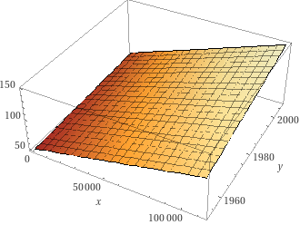

## Data used

+ `body.csv`
+ `vik_table_9_2.csv`

## Read in some data

```{r}
library(tidyverse)
body_data <-read_csv('data/body.csv')
```

## Revisit the simple linear model

```{r}
model <- lm(body_data$Weight ~ body_data$Waist)
summary(model)
```

```{r}
anova(model)
```

### Manual calculation of the F value

```{r}
predicted <- predict(model)
mn_predicted <-mean(predicted)
resids <- model$residuals


captured_variance <- sum((predicted - mn_predicted)^2)
uncaptured_variance <- sum((resids)^2)

n_predictors <- 1
manual_f <- (captured_variance / n_predictors)/ (uncaptured_variance/ model$df.residual)
captured_variance
uncaptured_variance
manual_f
```

## Intro to the multiple linear regression

### A first example

Here I use data provided by Vik 2013 (*Table 9.2 in Vik, Peter. Regression, ANOVA, and the General Linear Model, 2013.*). This allows double checking the calculating provided in this book.

```{r}
vik_data <-read_csv('data/vik_table_9_2.csv')
head(vik_data)
```

```{r}
model <- lm(Y ~ X1 + X2, data=vik_data)
summary(model)
```

### Confidence intervals

We can get the confidence intervals for the estimated coefficients.

```{r}
confint(model)
```

### Manual calculation of the F value

```{r}
predicted <- predict(model)
mn_predicted <-mean(predicted)
resids <- model$residuals

captured_variance <- sum((predicted - mn_predicted)^2)
uncaptured_variance <- sum((resids)^2)

n_predictors <- 2
manual_F <- (captured_variance / n_predictors)/ (uncaptured_variance/ model$df.residual)
captured_variance
uncaptured_variance
manual_f
```

### Visuzalizing the fitted model

```{r}
# library(plotly)
# library(pracma)
# coeffs <- model$coefficient
# xi <- seq(min(vik_data$X1), max(vik_data$X1), length.out=100)
# yi <- seq(min(vik_data$X2), max(vik_data$X2), length.out=100)
# grid <- meshgrid(xi,yi)
# xi <- grid[[1]]
# yi <- grid[[2]]
# 
# 
# zi <- coeffs[1] + coeffs[2] * xi + coeffs[3] * yi
# 
# my_plot <- plot_ly(vik_data, x = ~X1,  y = ~X2, z = ~Y, type = "scatter3d", mode = "markers")
# my_plot <- add_trace(p = my_plot, z = zi, x = xi, y = yi, type = "surface")
# my_plot
```

### Manually running the omnibus test

I fit the full model and the base model (which is usually only done implicitly).

```{r}
vik_data$mean_y <- mean(vik_data$Y)


model_base <- lm(Y ~ mean_y, data=vik_data)
model_full <- lm(Y ~ X1 + X2, data=vik_data)
```

Let's look at the full model's F value.

```{r}
summary(model_full)
```

Let's now explicitly compare the base and the full model. This results in the same F-value! So, we could run the omnibus test by comparing the base model, $y_i = \bar{x}_i$, with the full model. But this is done implicitly by R when fitting the full model.

```{r}
anova(model_base, model_full)
```

### Manually calculating the F ratio for the omnibus test

```{r}
full_model_predictions <- predict(model_full)
mean_full_model_predictions <-mean(full_model_predictions)

base_model_predictions <- predict(model_base)

captured_variance <- sum((full_model_predictions - mean_full_model_predictions)^2) 
uncaptured_variance <- sum((base_model_predictions- vik_data$Y)^2) 
test <- sum((model_full$residuals)^2) 
test
captured_variance
uncaptured_variance
manual_f <- captured_variance/uncaptured_variance
manual_f
```

## Model comparison

### A simple and a complex model

```{r}
state_data <- as.data.frame(state.x77)
colnames(state_data) <- make.names(colnames(state_data))
head(state_data)
```

Let's fit two (nested) models,

```{r}
simple_model <- lm(state_data$Murder ~ state_data$Illiteracy)
complex_model <- lm(state_data$Murder ~ state_data$Illiteracy + state_data$Income + state_data$Population)
```

Let's look at their summaries:

```{r}
summary(simple_model)
```

```{r}
summary(complex_model)
```

```{r}
anova(simple_model, complex_model)
```

### What if the models only differ by one variable

In this case, the p-value associated with the newly introduced variable is equal to the p value of the anova comparison. In fact the $F$ value is equal to $t^2$ value.

```{r}
simple_model <- lm(state_data$Murder ~ state_data$Illiteracy)
complex_model <- lm(state_data$Murder ~ state_data$Illiteracy + state_data$Income)
summary(complex_model)
anova(simple_model, complex_model)
```

## Interactions

### Using non-zeroed data

```{r}
library(gapminder)
gap <- gapminder
model <- lm(lifeExp ~ gdpPercap * year, data = gap)
summary(model)
```

```{r}
range(gap$gdpPercap)
range(gap$year)
```

See this link for a plot of the model: <https://www.wolframalpha.com/input?i=plot+-3.532e%2B02+%2B+x+*+-8.754e-03+%2B+y+*+2.060e-01+%2B+4.754e-06+*+%28x+*+y%29+with+x++%3D+241+to+113523+and+y+%3D+1952+to+2007>

\


### Using zeroed data

```{r}
gap <- mutate(gap, year = scale(year))
gap <- mutate(gap, gdpPercap = scale(gdpPercap))
model <- lm(lifeExp ~ gdpPercap * year, data = gap)
range(gap$gdpPercap)
range(gap$year)
```

```{r}
summary(model)
```

The fitted model becomes,

$$
z = 59.29 + 6.46  x + 4.14  y + 0.80 + x y
$$ with $x$ the gdpPercap and $y$ the year.

See this link for a graph: <https://www.wolframalpha.com/input?i=plot+59.2906+%2B+6.4680+*+x+%2B+4.1489+*+y+%2B+0.8091+%2B+x+*+y+with+x+from+-+1+to+11+and+y+from+-2+to+2>


## Step

### Using the Murder data

```{r}
library(MASS)
full=lm(Murder~.,data=state_data)
stepAIC(full, direction="backward", trace = TRUE)
```

### Using the body data

```{r}
library(MASS)
full=lm(Weight~.,data=body_data)
stepAIC(full, direction="backward", trace = TRUE)
```
