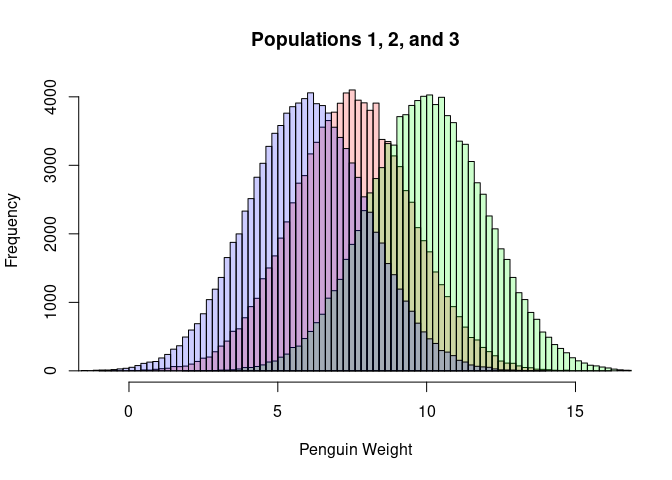
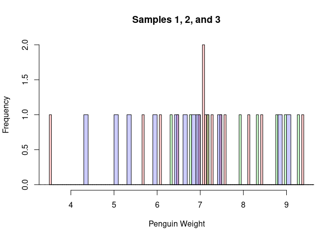
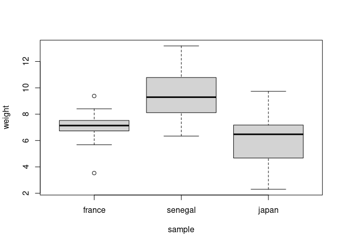
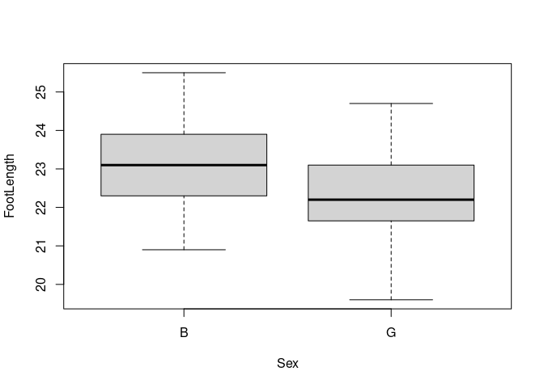
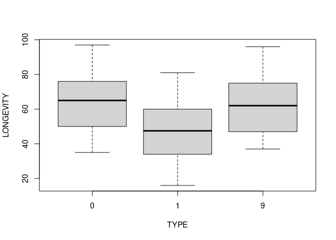
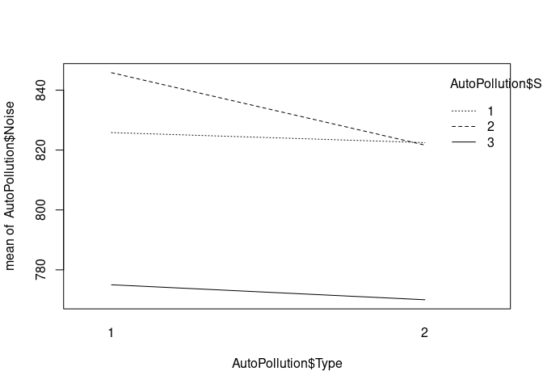
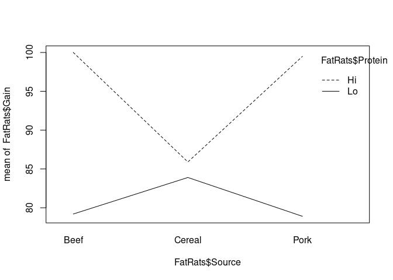

The LM with categorical predictors (ANOVA)
================
Last Updated: 02, November, 2023 at 09:21

- [One way Anova: one categorical
  predictor](#one-way-anova-one-categorical-predictor)
  - [Fake data](#fake-data)
    - [Make some population data](#make-some-population-data)
    - [Sample from the populations](#sample-from-the-populations)
    - [Run classic ANOVA](#run-classic-anova)
    - [Run LM](#run-lm)
    - [Change contrasts](#change-contrasts)
  - [Real data: feet](#real-data-feet)
  - [Real data: flies (A warning!)](#real-data-flies-a-warning)
- [Two way ANOVA: two categorical
  predictors](#two-way-anova-two-categorical-predictors)
  - [Real data: car noise](#real-data-car-noise)
    - [Model without interaction](#model-without-interaction)
    - [Model with interaction](#model-with-interaction)
  - [Real data: fat rats](#real-data-fat-rats)
    - [Change the contrasts](#change-the-contrasts)
    - [Interpreting the coefficients](#interpreting-the-coefficients)

``` r
library(reshape)
```

# One way Anova: one categorical predictor

## Fake data

### Make some population data

``` r
sample_size <- 15

population1 <- rnorm(100000, mean = 7.5, sd = 2)
population2 <- rnorm(100000, mean = 10, sd = 2)
population3 <- rnorm(100000, mean = 6, sd = 2)

hist(population1, breaks=100, col=rgb(1,0,0,0.2), main='', xlab = 'Penguin Weight')
hist(population2, breaks=100,  add=TRUE, col=rgb(0,1,0,0.2))
hist(population3, breaks=100,  add=TRUE, col=rgb(0,0,1,0.2))
title('Populations 1, 2, and 3')
```

<!-- -->

### Sample from the populations

``` r
france <- sample(population1, sample_size)
senegal <- sample(population2, sample_size)
japan <- sample(population3, sample_size)

hist(france, breaks=100, col=rgb(1,0,0,0.2), main='', xlab='Penguin Weight')
hist(senegal, breaks=100,  add=TRUE, col=rgb(0,1,0,0.2))
hist(japan, breaks=100,  add=TRUE, col=rgb(0,0,1,0.2))
title('Samples 1, 2, and 3')
```

<!-- -->

``` r
data <-data.frame(cbind(france,senegal,japan))
data<-melt(data, id.vars=c())
colnames(data) <- c('sample', 'weight')
data$sample<-factor(data$sample)
head(data)
```

    ##   sample   weight
    ## 1 france 7.138380
    ## 2 france 7.460480
    ## 3 france 3.529983
    ## 4 france 7.074943
    ## 5 france 7.077097
    ## 6 france 7.272727

``` r
tail(data)
```

    ##    sample   weight
    ## 40  japan 2.594050
    ## 41  japan 2.299101
    ## 42  japan 5.381973
    ## 43  japan 6.473630
    ## 44  japan 9.733502
    ## 45  japan 6.681245

``` r
boxplot(weight ~ sample, data = data)
```

<!-- -->

### Run classic ANOVA

``` r
result <- aov(weight ~ sample, data = data)
summary(result)
```

    ##             Df Sum Sq Mean Sq F value   Pr(>F)    
    ## sample       2  94.15   47.08   12.83 4.48e-05 ***
    ## Residuals   42 154.09    3.67                     
    ## ---
    ## Signif. codes:  0 '***' 0.001 '**' 0.01 '*' 0.05 '.' 0.1 ' ' 1

### Run LM

``` r
result <- lm(weight ~ sample, data = data)
summary(result)
```

    ## 
    ## Call:
    ## lm(formula = weight ~ sample, data = data)
    ## 
    ## Residuals:
    ##     Min      1Q  Median      3Q     Max 
    ## -3.7337 -0.9997  0.1112  1.0790  3.7069 
    ## 
    ## Coefficients:
    ##               Estimate Std. Error t value Pr(>|t|)    
    ## (Intercept)     7.0272     0.4946  14.209  < 2e-16 ***
    ## samplesenegal   2.4480     0.6994   3.500  0.00112 ** 
    ## samplejapan    -0.9944     0.6994  -1.422  0.16250    
    ## ---
    ## Signif. codes:  0 '***' 0.001 '**' 0.01 '*' 0.05 '.' 0.1 ' ' 1
    ## 
    ## Residual standard error: 1.915 on 42 degrees of freedom
    ## Multiple R-squared:  0.3793, Adjusted R-squared:  0.3497 
    ## F-statistic: 12.83 on 2 and 42 DF,  p-value: 4.475e-05

### Change contrasts

#### Helmert coding

Here, I use Helmert coding (from R). Helmert coding compares each level
of a categorical variable to the mean of the subsequent levels.

Compare this to the slides.

``` r
contrasts(data$sample) <- contr.helmert(n = 3)
result <- lm(weight ~ sample, data = data)
summary(result)
```

    ## 
    ## Call:
    ## lm(formula = weight ~ sample, data = data)
    ## 
    ## Residuals:
    ##     Min      1Q  Median      3Q     Max 
    ## -3.7337 -0.9997  0.1112  1.0790  3.7069 
    ## 
    ## Coefficients:
    ##             Estimate Std. Error t value Pr(>|t|)    
    ## (Intercept)   7.5117     0.2855  26.308  < 2e-16 ***
    ## sample1       1.2240     0.3497   3.500 0.001116 ** 
    ## sample2      -0.7394     0.2019  -3.662 0.000694 ***
    ## ---
    ## Signif. codes:  0 '***' 0.001 '**' 0.01 '*' 0.05 '.' 0.1 ' ' 1
    ## 
    ## Residual standard error: 1.915 on 42 degrees of freedom
    ## Multiple R-squared:  0.3793, Adjusted R-squared:  0.3497 
    ## F-statistic: 12.83 on 2 and 42 DF,  p-value: 4.475e-05

``` r
data
```

    ##     sample    weight
    ## 1   france  7.138380
    ## 2   france  7.460480
    ## 3   france  3.529983
    ## 4   france  7.074943
    ## 5   france  7.077097
    ## 6   france  7.272727
    ## 7   france  7.588472
    ## 8   france  6.963855
    ## 9   france  6.497204
    ## 10  france  6.053686
    ## 11  france  9.379643
    ## 12  france  5.677400
    ## 13  france  8.407911
    ## 14  france  8.106210
    ## 15  france  7.179985
    ## 16 senegal  7.175329
    ## 17 senegal 10.360787
    ## 18 senegal  7.906833
    ## 19 senegal  6.761125
    ## 20 senegal 10.216058
    ## 21 senegal 13.182059
    ## 22 senegal  9.291666
    ## 23 senegal  6.337989
    ## 24 senegal 10.986212
    ## 25 senegal  8.987288
    ## 26 senegal 11.364843
    ## 27 senegal  8.322805
    ## 28 senegal 10.581495
    ## 29 senegal  8.790005
    ## 30 senegal 11.862865
    ## 31   japan  5.980890
    ## 32   japan  2.904823
    ## 33   japan  7.408324
    ## 34   japan  5.033175
    ## 35   japan  6.839957
    ## 36   japan  6.944342
    ## 37   japan  8.859892
    ## 38   japan  9.048538
    ## 39   japan  4.309218
    ## 40   japan  2.594050
    ## 41   japan  2.299101
    ## 42   japan  5.381973
    ## 43   japan  6.473630
    ## 44   japan  9.733502
    ## 45   japan  6.681245

``` r
model.matrix(result)
```

    ##    (Intercept) sample1 sample2
    ## 1            1      -1      -1
    ## 2            1      -1      -1
    ## 3            1      -1      -1
    ## 4            1      -1      -1
    ## 5            1      -1      -1
    ## 6            1      -1      -1
    ## 7            1      -1      -1
    ## 8            1      -1      -1
    ## 9            1      -1      -1
    ## 10           1      -1      -1
    ## 11           1      -1      -1
    ## 12           1      -1      -1
    ## 13           1      -1      -1
    ## 14           1      -1      -1
    ## 15           1      -1      -1
    ## 16           1       1      -1
    ## 17           1       1      -1
    ## 18           1       1      -1
    ## 19           1       1      -1
    ## 20           1       1      -1
    ## 21           1       1      -1
    ## 22           1       1      -1
    ## 23           1       1      -1
    ## 24           1       1      -1
    ## 25           1       1      -1
    ## 26           1       1      -1
    ## 27           1       1      -1
    ## 28           1       1      -1
    ## 29           1       1      -1
    ## 30           1       1      -1
    ## 31           1       0       2
    ## 32           1       0       2
    ## 33           1       0       2
    ## 34           1       0       2
    ## 35           1       0       2
    ## 36           1       0       2
    ## 37           1       0       2
    ## 38           1       0       2
    ## 39           1       0       2
    ## 40           1       0       2
    ## 41           1       0       2
    ## 42           1       0       2
    ## 43           1       0       2
    ## 44           1       0       2
    ## 45           1       0       2
    ## attr(,"assign")
    ## [1] 0 1 1
    ## attr(,"contrasts")
    ## attr(,"contrasts")$sample
    ##         [,1] [,2]
    ## france    -1   -1
    ## senegal    1   -1
    ## japan      0    2

#### Compare coefficients with data

``` r
# Fitted coefficients
result$coefficients
```

    ## (Intercept)     sample1     sample2 
    ##   7.5117332   1.2239794  -0.7394446

``` r
all_data <- c(france, senegal, japan)
grand_mean <- mean(all_data)
mean_france <- mean(france)
mean_senegal <- mean(senegal)
mean_japan <- mean(japan)

c(grand_mean, mean_france, mean_senegal, mean_japan)
```

    ## [1] 7.511733 7.027198 9.475157 6.032844

In the Helmert coding (The R version)…

- The intercept is the grand mean
- Beta1 is 0.5 X the difference between France and Senegal
- Beta2 is 1/3 X the difference between Japan and the mean of Senegal
  and France

``` r
intercept <- grand_mean
beta1 <- (mean_senegal - mean_france) / 2
beta2 <- (mean_japan - (mean_senegal + mean_france) / 2) / 3
c(intercept, beta1, beta2)
```

    ## [1]  7.5117332  1.2239794 -0.7394446

``` r
result$coefficients
```

    ## (Intercept)     sample1     sample2 
    ##   7.5117332   1.2239794  -0.7394446

#### Using the Faux package to change contrasts

``` r
library(faux)
```

    ## 
    ## ************
    ## Welcome to faux. For support and examples visit:
    ## https://debruine.github.io/faux/
    ## - Get and set global package options with: faux_options()
    ## ************

``` r
helmert <- contr_code_helmert(c(1,2,3))
helmert <- contrasts(helmert)

contrasts(data$sample)  <- helmert

result <- lm(weight ~ sample, data = data)
summary(result)
```

    ## 
    ## Call:
    ## lm(formula = weight ~ sample, data = data)
    ## 
    ## Residuals:
    ##     Min      1Q  Median      3Q     Max 
    ## -3.7337 -0.9997  0.1112  1.0790  3.7069 
    ## 
    ## Coefficients:
    ##              Estimate Std. Error t value Pr(>|t|)    
    ## (Intercept)    7.5117     0.2855  26.308  < 2e-16 ***
    ## sample.2-1     2.4480     0.6994   3.500 0.001116 ** 
    ## sample.3-1.2  -2.2183     0.6057  -3.662 0.000694 ***
    ## ---
    ## Signif. codes:  0 '***' 0.001 '**' 0.01 '*' 0.05 '.' 0.1 ' ' 1
    ## 
    ## Residual standard error: 1.915 on 42 degrees of freedom
    ## Multiple R-squared:  0.3793, Adjusted R-squared:  0.3497 
    ## F-statistic: 12.83 on 2 and 42 DF,  p-value: 4.475e-05

``` r
c(grand_mean, mean_france, mean_senegal, mean_japan)
```

    ## [1] 7.511733 7.027198 9.475157 6.032844

## Real data: feet

``` r
library(tidyverse)
```

    ## ── Attaching packages ─────────────────────────────────────── tidyverse 1.3.2 ──
    ## ✔ ggplot2 3.4.0      ✔ purrr   0.3.5 
    ## ✔ tibble  3.1.8      ✔ dplyr   1.0.10
    ## ✔ tidyr   1.2.1      ✔ stringr 1.4.1 
    ## ✔ readr   2.1.3      ✔ forcats 0.5.2 
    ## ── Conflicts ────────────────────────────────────────── tidyverse_conflicts() ──
    ## ✖ tidyr::expand() masks reshape::expand()
    ## ✖ dplyr::filter() masks stats::filter()
    ## ✖ dplyr::lag()    masks stats::lag()
    ## ✖ dplyr::rename() masks reshape::rename()

``` r
feet <- read_csv('data/feet.csv')
```

    ## Rows: 38 Columns: 7
    ## ── Column specification ────────────────────────────────────────────────────────
    ## Delimiter: ","
    ## chr (3): Sex, Foot, Hand
    ## dbl (4): Month, Year, FootLength, FootWidth
    ## 
    ## ℹ Use `spec()` to retrieve the full column specification for this data.
    ## ℹ Specify the column types or set `show_col_types = FALSE` to quiet this message.

``` r
head(feet)
```

    ## # A tibble: 6 × 7
    ##   Month  Year FootLength FootWidth Sex   Foot  Hand 
    ##   <dbl> <dbl>      <dbl>     <dbl> <chr> <chr> <chr>
    ## 1    10    87       23.4       8.8 B     L     L    
    ## 2    12    87       22.5       9.7 B     R     R    
    ## 3     1    88       23.2       9.8 B     L     R    
    ## 4     2    88       23.1       8.9 B     L     R    
    ## 5     3    88       23.7       9.7 B     R     R    
    ## 6     2    88       24.1       9.6 B     L     R

``` r
model <- lm(FootLength ~ Sex, data = feet)
summary(model)
```

    ## 
    ## Call:
    ## lm(formula = FootLength ~ Sex, data = feet)
    ## 
    ## Residuals:
    ##      Min       1Q   Median       3Q      Max 
    ## -2.72105 -0.73684 -0.08158  0.85789  2.37895 
    ## 
    ## Coefficients:
    ##             Estimate Std. Error t value Pr(>|t|)    
    ## (Intercept)  23.1421     0.2948  78.492   <2e-16 ***
    ## SexG         -0.8211     0.4170  -1.969   0.0567 .  
    ## ---
    ## Signif. codes:  0 '***' 0.001 '**' 0.01 '*' 0.05 '.' 0.1 ' ' 1
    ## 
    ## Residual standard error: 1.285 on 36 degrees of freedom
    ## Multiple R-squared:  0.09724,    Adjusted R-squared:  0.07216 
    ## F-statistic: 3.878 on 1 and 36 DF,  p-value: 0.05667

``` r
boxplot(FootLength ~ Sex, data = feet)
```

<!-- -->

## Real data: flies (A warning!)

<http://jse.amstat.org/datasets/fruitfly.txt>

``` r
flies <- read_csv('data/flies.csv')
```

    ## Rows: 125 Columns: 6
    ## ── Column specification ────────────────────────────────────────────────────────
    ## Delimiter: ","
    ## dbl (6): ID, PARTNERS, TYPE, LONGEVITY, THORAX, SLEEP
    ## 
    ## ℹ Use `spec()` to retrieve the full column specification for this data.
    ## ℹ Specify the column types or set `show_col_types = FALSE` to quiet this message.

``` r
head(flies)
```

    ## # A tibble: 6 × 6
    ##      ID PARTNERS  TYPE LONGEVITY THORAX SLEEP
    ##   <dbl>    <dbl> <dbl>     <dbl>  <dbl> <dbl>
    ## 1     1        8     0        35   0.64    22
    ## 2     2        8     0        37   0.68     9
    ## 3     3        8     0        49   0.68    49
    ## 4     4        8     0        46   0.72     1
    ## 5     5        8     0        63   0.72    23
    ## 6     6        8     0        39   0.76    83

``` r
# Don't do this!!
model <- lm(LONGEVITY ~ TYPE, data = flies)
summary(model)
```

    ## 
    ## Call:
    ## lm(formula = LONGEVITY ~ TYPE, data = flies)
    ## 
    ## Residuals:
    ##     Min      1Q  Median      3Q     Max 
    ## -40.712 -14.105  -0.105  13.434  40.895 
    ## 
    ## Coefficients:
    ##             Estimate Std. Error t value Pr(>|t|)    
    ## (Intercept)  56.1050     1.8607  30.152   <2e-16 ***
    ## TYPE          0.6068     0.4567   1.329    0.186    
    ## ---
    ## Signif. codes:  0 '***' 0.001 '**' 0.01 '*' 0.05 '.' 0.1 ' ' 1
    ## 
    ## Residual standard error: 17.51 on 123 degrees of freedom
    ## Multiple R-squared:  0.01415,    Adjusted R-squared:  0.006135 
    ## F-statistic: 1.765 on 1 and 123 DF,  p-value: 0.1864

``` r
## Do this!!
model <- lm(LONGEVITY ~ as.factor(TYPE), data = flies)
summary(model)
```

    ## 
    ## Call:
    ## lm(formula = LONGEVITY ~ as.factor(TYPE), data = flies)
    ## 
    ## Residuals:
    ##    Min     1Q Median     3Q    Max 
    ## -31.74 -13.74   0.26  11.44  33.26 
    ## 
    ## Coefficients:
    ##                  Estimate Std. Error t value Pr(>|t|)    
    ## (Intercept)        64.080      2.233  28.701  < 2e-16 ***
    ## as.factor(TYPE)1  -16.340      3.158  -5.175 9.08e-07 ***
    ## as.factor(TYPE)9   -0.520      3.867  -0.134    0.893    
    ## ---
    ## Signif. codes:  0 '***' 0.001 '**' 0.01 '*' 0.05 '.' 0.1 ' ' 1
    ## 
    ## Residual standard error: 15.79 on 122 degrees of freedom
    ## Multiple R-squared:  0.2051, Adjusted R-squared:  0.1921 
    ## F-statistic: 15.74 on 2 and 122 DF,  p-value: 8.305e-07

``` r
boxplot(LONGEVITY ~ TYPE, data = flies)
```

<!-- -->

# Two way ANOVA: two categorical predictors

## Real data: car noise

``` r
library(Stat2Data)
data(AutoPollution)
head(AutoPollution)
```

    ##   Noise Size Type Side
    ## 1   810    1    1    1
    ## 2   820    1    1    1
    ## 3   820    1    1    1
    ## 4   840    2    1    1
    ## 5   840    2    1    1
    ## 6   845    2    1    1

``` r
AutoPollution$Size <- as.factor(AutoPollution$Size) 
AutoPollution$Type <- as.factor(AutoPollution$Type) 
levels(AutoPollution$Size)
```

    ## [1] "1" "2" "3"

``` r
levels(AutoPollution$Type)
```

    ## [1] "1" "2"

``` r
interaction.plot(x.factor=AutoPollution$Type, trace.factor = AutoPollution$Size, response=AutoPollution$Noise)
```

<!-- -->

### Model without interaction

When we fit a model without interactions, its equation is the following:

$$
y = \beta_0 + [\beta_1 x_1 + \beta_2 x_2 ] + [\beta_3 x_3]
$$

with $x_1$ and $x_2$ encoding the Variable `Size` and $x_3$ encoding the
variable `Type`.

``` r
model <- lm(Noise ~ Type + Size, data = AutoPollution)
summary(model)
```

    ## 
    ## Call:
    ## lm(formula = Noise ~ Type + Size, data = AutoPollution)
    ## 
    ## Residuals:
    ##     Min      1Q  Median      3Q     Max 
    ## -19.583  -7.292   1.250   6.250  15.833 
    ## 
    ## Coefficients:
    ##             Estimate Std. Error t value Pr(>|t|)    
    ## (Intercept)  829.583      3.099 267.657  < 2e-16 ***
    ## Type2        -10.833      3.099  -3.495  0.00141 ** 
    ## Size2          9.583      3.796   2.525  0.01674 *  
    ## Size3        -51.667      3.796 -13.611  7.4e-15 ***
    ## ---
    ## Signif. codes:  0 '***' 0.001 '**' 0.01 '*' 0.05 '.' 0.1 ' ' 1
    ## 
    ## Residual standard error: 9.298 on 32 degrees of freedom
    ## Multiple R-squared:  0.9074, Adjusted R-squared:  0.8987 
    ## F-statistic: 104.5 on 3 and 32 DF,  p-value: < 2.2e-16

### Model with interaction

When we fit a model **with** interactions, its equation is the
following:

$$
y = \beta_0 + [\beta_1 x_1 + \beta_2 x_2 ] + [\beta_3 x_3] + [\beta_4 x_1 x_3] + [\beta_5 x_2 x_3]
$$

with $x_1$ and $x_2$ encoding the Variable `Size` and $x_3$ encoding the
variable `Type`, and two terms that encode the combination of the levels
of `Size` and `Type`.

``` r
model <- lm(Noise ~ Type * Size, data = AutoPollution)
summary(model)
```

    ## 
    ## Call:
    ## lm(formula = Noise ~ Type * Size, data = AutoPollution)
    ## 
    ## Residuals:
    ##      Min       1Q   Median       3Q      Max 
    ## -15.8333  -5.2083  -0.4167   5.0000  15.0000 
    ## 
    ## Coefficients:
    ##             Estimate Std. Error t value Pr(>|t|)    
    ## (Intercept)  825.833      3.302 250.106  < 2e-16 ***
    ## Type2         -3.333      4.670  -0.714 0.480849    
    ## Size2         20.000      4.670   4.283 0.000175 ***
    ## Size3        -50.833      4.670 -10.886 6.11e-12 ***
    ## Type2:Size2  -20.833      6.604  -3.155 0.003638 ** 
    ## Type2:Size3   -1.667      6.604  -0.252 0.802471    
    ## ---
    ## Signif. codes:  0 '***' 0.001 '**' 0.01 '*' 0.05 '.' 0.1 ' ' 1
    ## 
    ## Residual standard error: 8.088 on 30 degrees of freedom
    ## Multiple R-squared:  0.9343, Adjusted R-squared:  0.9234 
    ## F-statistic: 85.34 on 5 and 30 DF,  p-value: < 2.2e-16

## Real data: fat rats

``` r
data(FatRats)
head(FatRats)
```

    ##   Gain Protein Source
    ## 1   73      Hi   Beef
    ## 2  102      Hi   Beef
    ## 3  118      Hi   Beef
    ## 4  104      Hi   Beef
    ## 5   81      Hi   Beef
    ## 6  107      Hi   Beef

- `Protein`: Level of protein (Hi or Lo)
- `Source`: Source of protein (Beef, Cereal, or Pork)

``` r
model<-lm(Gain ~ Protein * Source, data=FatRats)
summary(model)
```

    ## 
    ## Call:
    ## lm(formula = Gain ~ Protein * Source, data = FatRats)
    ## 
    ## Residuals:
    ##    Min     1Q Median     3Q    Max 
    ##  -29.9   -8.9    2.1   10.8   27.1 
    ## 
    ## Coefficients:
    ##                        Estimate Std. Error t value Pr(>|t|)    
    ## (Intercept)             100.000      4.628  21.607  < 2e-16 ***
    ## ProteinLo               -20.800      6.545  -3.178  0.00245 ** 
    ## SourceCereal            -14.100      6.545  -2.154  0.03570 *  
    ## SourcePork               -0.500      6.545  -0.076  0.93939    
    ## ProteinLo:SourceCereal   18.800      9.256   2.031  0.04719 *  
    ## ProteinLo:SourcePork      0.200      9.256   0.022  0.98284    
    ## ---
    ## Signif. codes:  0 '***' 0.001 '**' 0.01 '*' 0.05 '.' 0.1 ' ' 1
    ## 
    ## Residual standard error: 14.64 on 54 degrees of freedom
    ## Multiple R-squared:  0.2835, Adjusted R-squared:  0.2172 
    ## F-statistic: 4.273 on 5 and 54 DF,  p-value: 0.002398

``` r
interaction.plot(x.factor=FatRats$Source, trace.factor = FatRats$Protein, response= FatRats$Gain)
```

<!-- -->

### Change the contrasts

Here, I just quickly change the contrasts. This does not change the
model’s equation (and number of fitted coefficients) but it does change
the meaning of these coefficients. The sum coding compares levels to the
overall mean of the response variable (the intercept is the overall
mean), i.e.,

``` r
mean(FatRats$Gain)
```

    ## [1] 87.9

``` r
contrasts(FatRats$Protein) <- contr.sum(2)
contrasts(FatRats$Source) <- contr.sum(3)
model<-lm(Gain ~ Protein + Source, data=FatRats)
summary(model)
```

    ## 
    ## Call:
    ## lm(formula = Gain ~ Protein + Source, data = FatRats)
    ## 
    ## Residuals:
    ##     Min      1Q  Median      3Q     Max 
    ## -36.133  -9.908   0.800   8.967  29.333 
    ## 
    ## Coefficients:
    ##             Estimate Std. Error t value Pr(>|t|)    
    ## (Intercept)   87.900      1.947  45.155  < 2e-16 ***
    ## Protein1       7.233      1.947   3.716 0.000469 ***
    ## Source1        1.700      2.753   0.618 0.539399    
    ## Source2       -3.000      2.753  -1.090 0.280500    
    ## ---
    ## Signif. codes:  0 '***' 0.001 '**' 0.01 '*' 0.05 '.' 0.1 ' ' 1
    ## 
    ## Residual standard error: 15.08 on 56 degrees of freedom
    ## Multiple R-squared:  0.2113, Adjusted R-squared:  0.169 
    ## F-statistic: 5.001 on 3 and 56 DF,  p-value: 0.003834

### Interpreting the coefficients

The sum contrast compares each level of a variable to the overall mean.
It is important to remember that knowing a variable’s mean value and n
deviations from this mean allows us to fix n + 1 values. This mechanism
is used by deviation coding to model the various levels of the dependent
given the independent.

The overall mean for the dependent is 87.9. The fitted coefficient for
`Protein` is 7.233. This means that for one level of this variable the
average should be (87.9 + 7.233) = 95.133. For the other level, the
average should be 87.9 - 7.233) = 80.667. Indeed, if this were not so,
the overall mean could not be 87.9.

We can see that is so by calculating the average of the dependent
variable for the two levels of `Protein`:

``` r
grouped <- group_by(FatRats, Protein)
means <- summarise(grouped, mean = mean(Gain))
means
```

    ## # A tibble: 2 × 2
    ##   Protein  mean
    ##   <fct>   <dbl>
    ## 1 Hi       95.1
    ## 2 Lo       80.7

For the variable `Source` a similar reasoning holds.

For one level of the variable, the average dependent should be (87.9
+1.7) = 89.6. For another, the average should be (87.9 -3) = 84.9.
Finally, to ensure that the average is 87.9, the last level should have
a mean of 87.9 - (1.7 + -3) = 89.2.

``` r
grouped <- group_by(FatRats, Source)
means <- summarise(grouped, mean = mean(Gain))
means
```

    ## # A tibble: 3 × 2
    ##   Source  mean
    ##   <fct>  <dbl>
    ## 1 Beef    89.6
    ## 2 Cereal  84.9
    ## 3 Pork    89.2
