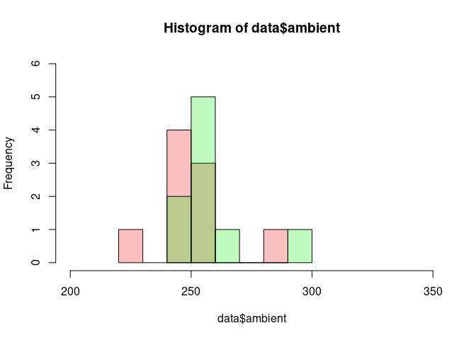

t-test
================
Last Updated: 01, November, 2022 at 17:43

``` r
library(tidyverse)
```

    ## ── Attaching packages ─────────────────────────────────────── tidyverse 1.3.2 ──
    ## ✔ ggplot2 3.3.6     ✔ purrr   0.3.4
    ## ✔ tibble  3.1.8     ✔ dplyr   1.0.9
    ## ✔ tidyr   1.2.0     ✔ stringr 1.4.0
    ## ✔ readr   2.1.2     ✔ forcats 0.5.2
    ## ── Conflicts ────────────────────────────────────────── tidyverse_conflicts() ──
    ## ✖ dplyr::filter() masks stats::filter()
    ## ✖ dplyr::lag()    masks stats::lag()

The most boring data in the world…

``` r
data <- read_csv('data/bands.csv')
```

    ## New names:
    ## Rows: 9 Columns: 3
    ## ── Column specification
    ## ──────────────────────────────────────────────────────── Delimiter: "," dbl
    ## (3): ...1, heated, ambient
    ## ℹ Use `spec()` to retrieve the full column specification for this data. ℹ
    ## Specify the column types or set `show_col_types = FALSE` to quiet this message.
    ## • `` -> `...1`

Note: here we treat the data as collected on seperate rubber bands. This
is, we run a two sample t-test.

``` r
t.test(data$ambient, data$heated)
```

    ## 
    ##  Welch Two Sample t-test
    ## 
    ## data:  data$ambient and data$heated
    ## t = -0.86861, df = 15.814, p-value = 0.3981
    ## alternative hypothesis: true difference in means is not equal to 0
    ## 95 percent confidence interval:
    ##  -21.805078   9.138412
    ## sample estimates:
    ## mean of x mean of y 
    ##  251.2222  257.5556

``` r
c1 <- adjustcolor( "red2", alpha.f = 0.25)
c2 <- adjustcolor( "green2", alpha.f = 0.25)
hist(data$ambient, col=c1, xlim = c(200, 350), ylim = c(0, 6))
hist(data$heated, col=c2, add=TRUE)
```

<!-- -->
