Assumptions
================
Last Updated: 16, November, 2023 at 09:22

- [Read some data](#read-some-data)
- [Assumption 1: Linearity of model](#assumption-1-linearity-of-model)
  - [Example 1](#example-1)
  - [Example 2](#example-2)
  - [Example 3](#example-3)
  - [Example 4](#example-4)
- [Assumption 2: Normal distribution of the
  errors](#assumption-2-normal-distribution-of-the-errors)
- [Assumption 3: Homoscedasticity](#assumption-3-homoscedasticity)
- [More examples](#more-examples)
  - [Heteroscedasticity: Gambling
    data](#heteroscedasticity-gambling-data)
  - [Non-linear relationship: Pima
    data](#non-linear-relationship-pima-data)

# Read some data

``` r
library(tidyverse)
```

    ## ── Attaching packages ─────────────────────────────────────── tidyverse 1.3.2 ──
    ## ✔ ggplot2 3.4.0      ✔ purrr   0.3.5 
    ## ✔ tibble  3.1.8      ✔ dplyr   1.0.10
    ## ✔ tidyr   1.2.1      ✔ stringr 1.4.1 
    ## ✔ readr   2.1.3      ✔ forcats 0.5.2 
    ## ── Conflicts ────────────────────────────────────────── tidyverse_conflicts() ──
    ## ✖ dplyr::filter() masks stats::filter()
    ## ✖ dplyr::lag()    masks stats::lag()

``` r
body_data <-read_csv('data/body.csv')
```

    ## Rows: 507 Columns: 25
    ## ── Column specification ────────────────────────────────────────────────────────
    ## Delimiter: ","
    ## dbl (25): Biacromial, Biiliac, Bitrochanteric, ChestDepth, ChestDia, ElbowDi...
    ## 
    ## ℹ Use `spec()` to retrieve the full column specification for this data.
    ## ℹ Specify the column types or set `show_col_types = FALSE` to quiet this message.

``` r
vik_data <-read_csv('data/vik_table_9_2.csv')
```

    ## Rows: 12 Columns: 4
    ## ── Column specification ────────────────────────────────────────────────────────
    ## Delimiter: ","
    ## dbl (4): Person, Y, X1, X2
    ## 
    ## ℹ Use `spec()` to retrieve the full column specification for this data.
    ## ℹ Specify the column types or set `show_col_types = FALSE` to quiet this message.

# Assumption 1: Linearity of model

## Example 1

``` r
plot(vik_data$X1, vik_data$Y)
```

<!-- -->

``` r
model <- lm(Y ~ X1, data = vik_data)
plot(fitted(model), resid(model))
```

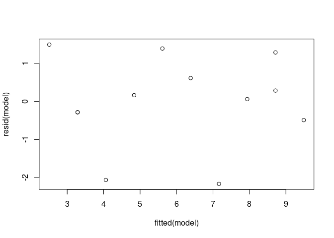<!-- --> Let’s
create the diagnostic plots. For our purposes, we will only look at the
top two plots.

``` r
# Split the plotting panel into a 2 x 2 grid. Such that we get the four plots
# in 4 separate panels.
par(mfrow = c(2, 2))
plot(model)
```

<!-- -->

``` r
# We can reset the plotting panel using this code: par(mfrow = c(1, 1))
```

## Example 2

``` r
x_data <- runif(100)
y_data <- x_data^3 + rnorm(100, sd=0.05)
fake <- tibble(x_data=x_data, y_data = y_data)
model <- lm(y_data ~ x_data, data = fake)
par(mfrow = c(1, 1)) 
plot(x_data, y_data)
abline(model, col='red')
```

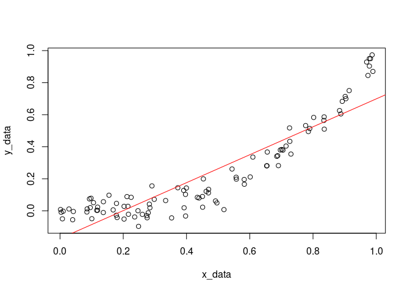<!-- -->

``` r
model <- lm(y_data ~ x_data, data = fake)
summary(model)
```

    ## 
    ## Call:
    ## lm(formula = y_data ~ x_data, data = fake)
    ## 
    ## Residuals:
    ##      Min       1Q   Median       3Q      Max 
    ## -0.27150 -0.08737 -0.01992  0.08296  0.28573 
    ## 
    ## Coefficients:
    ##             Estimate Std. Error t value Pr(>|t|)    
    ## (Intercept) -0.17305    0.02210   -7.83 5.85e-12 ***
    ## x_data       0.87200    0.04057   21.49  < 2e-16 ***
    ## ---
    ## Signif. codes:  0 '***' 0.001 '**' 0.01 '*' 0.05 '.' 0.1 ' ' 1
    ## 
    ## Residual standard error: 0.1205 on 98 degrees of freedom
    ## Multiple R-squared:  0.825,  Adjusted R-squared:  0.8232 
    ## F-statistic: 461.9 on 1 and 98 DF,  p-value: < 2.2e-16

``` r
par(mfrow = c(2, 2))  # Split the plotting panel into a 2 x 2 grid
plot(model)
```

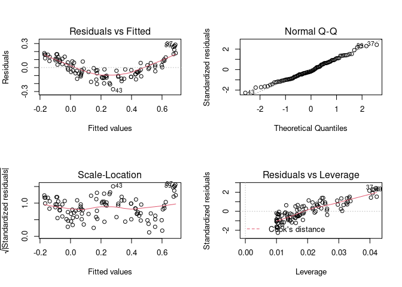<!-- -->

``` r
par(mfrow = c(1, 1)) 
```

Let’s run the model on transformed data and look at the diagnostic plots
again.

``` r
model <- lm(y_data ~ I(x_data^3), data = fake)
par(mfrow = c(2, 2))  # Split the plotting panel into a 2 x 2 grid
plot(model)
```

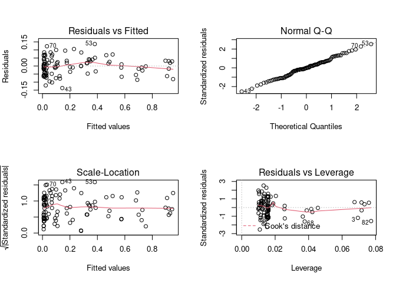<!-- -->

``` r
par(mfrow = c(1, 1)) 
```

## Example 3

This demonstrates that the diagnostic plots can also be used when we
have multiple predictors (in this case plotting the dependent vs the
independents might be difficult or impossible).

``` r
x1_data <- runif(100)
x2_data <- runif(100)
y_data <- x1_data^3 + x2_data^3
fake <- tibble(x1_data=x1_data,x2_data=x2_data, y_data = y_data)
model <- lm(y_data ~ x1_data + x2_data, data = fake)
par(mfrow = c(2, 2))  # Split the plotting panel into a 2 x 2 grid
plot(model)
```

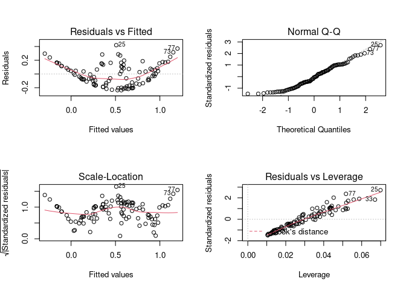<!-- -->

``` r
par(mfrow = c(1, 1))
```

## Example 4

Finally, an example with real data.

``` r
model <- lm(Weight ~ Height, data = body_data)
par(mfrow = c(2, 2))  # Split the plotting panel into a 2 x 2 grid
plot(model)
```

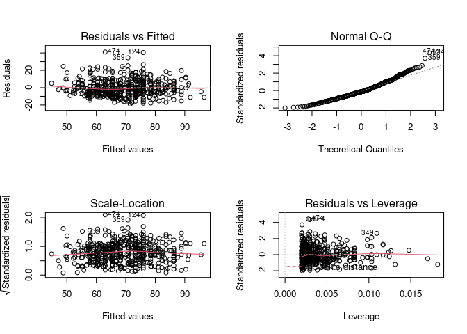<!-- -->

``` r
par(mfrow = c(1, 1)) 
```

# Assumption 2: Normal distribution of the errors

``` r
model <- lm(Bicep ~ Shoulder, data = body_data)
residuals <- resid(model)
hist(residuals, 50)
```

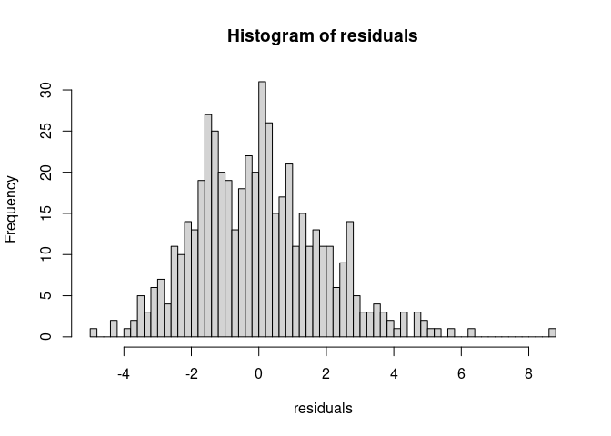<!-- -->

``` r
par(mfrow = c(2, 2))  # Split the plotting panel into a 2 x 2 grid
plot(model)
```

<!-- -->

``` r
par(mfrow = c(1, 1)) 
```

# Assumption 3: Homoscedasticity

I created a data set with heteroscedasticity. The gambling data below
might be a good example as well.

``` r
n<-500
errors <-rnorm(n, sd=seq(0.1,5, length.out=n))
x<-runif(n)
x<-sort(x)
y<- (20 * x) + errors
plot(x, y)
```

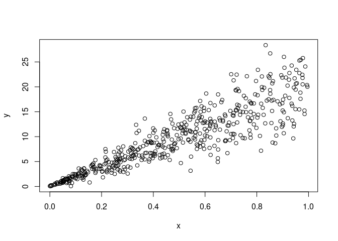<!-- -->

``` r
fake<-tibble(x=x, y=y)
model <- lm(y~x, data = fake) 
```

The model is still fitted properly!

``` r
summary(model)
```

    ## 
    ## Call:
    ## lm(formula = y ~ x, data = fake)
    ## 
    ## Residuals:
    ##     Min      1Q  Median      3Q     Max 
    ## -9.0569 -1.3754  0.0346  1.2388 11.7878 
    ## 
    ## Coefficients:
    ##             Estimate Std. Error t value Pr(>|t|)    
    ## (Intercept)  0.06833    0.25812   0.265    0.791    
    ## x           19.79738    0.46121  42.925   <2e-16 ***
    ## ---
    ## Signif. codes:  0 '***' 0.001 '**' 0.01 '*' 0.05 '.' 0.1 ' ' 1
    ## 
    ## Residual standard error: 2.873 on 498 degrees of freedom
    ## Multiple R-squared:  0.7872, Adjusted R-squared:  0.7868 
    ## F-statistic:  1843 on 1 and 498 DF,  p-value: < 2.2e-16

``` r
plot(x, y)
abline(model, col='red')
```

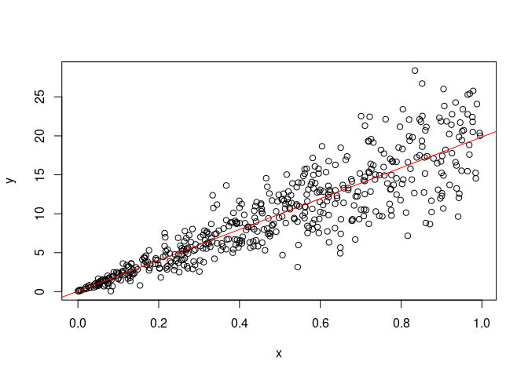<!-- -->

``` r
par(mfrow = c(2, 2))  # Split the plotting panel into a 2 x 2 grid
plot(model)
```

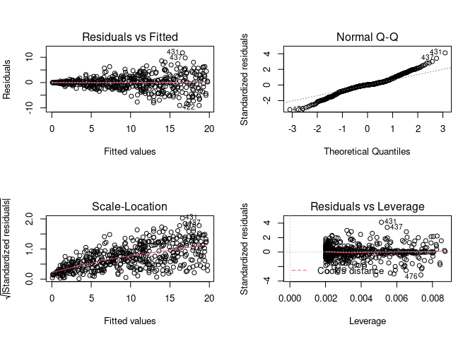<!-- -->

``` r
par(mfrow = c(1, 1)) 
```

# More examples

## Heteroscedasticity: Gambling data

The teengamb data frame has 47 rows and 5 columns. A survey was
conducted to study teenage gambling in Britain. This data frame contains
the following columns:

- sex 0=male, 1=female
- Socioeconomic status score based on parents’ occupation
- Income in pounds per week
- Verbal score in words out of 12 correctly defined
- Gamble expenditure on gambling in pounds per year

``` r
library(faraway)
data <- teengamb
head(data)
```

    ##   sex status income verbal gamble
    ## 1   1     51   2.00      8    0.0
    ## 2   1     28   2.50      8    0.0
    ## 3   1     37   2.00      6    0.0
    ## 4   1     28   7.00      4    7.3
    ## 5   1     65   2.00      8   19.6
    ## 6   1     61   3.47      6    0.1

``` r
model<- lm(gamble~income, data=data)
```

``` r
plot(data$income, data$gamble)
```

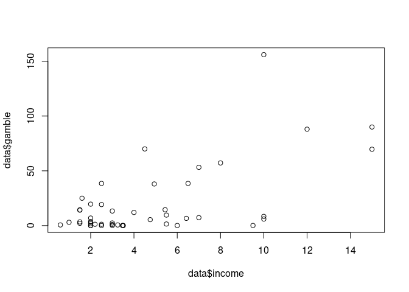<!-- -->

``` r
summary(model)
```

    ## 
    ## Call:
    ## lm(formula = gamble ~ income, data = data)
    ## 
    ## Residuals:
    ##     Min      1Q  Median      3Q     Max 
    ## -46.020 -11.874  -3.757  11.934 107.120 
    ## 
    ## Coefficients:
    ##             Estimate Std. Error t value Pr(>|t|)    
    ## (Intercept)   -6.325      6.030  -1.049      0.3    
    ## income         5.520      1.036   5.330 3.05e-06 ***
    ## ---
    ## Signif. codes:  0 '***' 0.001 '**' 0.01 '*' 0.05 '.' 0.1 ' ' 1
    ## 
    ## Residual standard error: 24.95 on 45 degrees of freedom
    ## Multiple R-squared:  0.387,  Adjusted R-squared:  0.3734 
    ## F-statistic: 28.41 on 1 and 45 DF,  p-value: 3.045e-06

``` r
par(mfrow = c(2, 2))  # Split the plotting panel into a 2 x 2 grid
plot(model)
```

<!-- -->

``` r
par(mfrow = c(1, 1)) 
```

``` r
plot(data$status,data$gamble)
```

<!-- -->

## Non-linear relationship: Pima data

The National Institute of Diabetes and Digestive and Kidney Diseases
conducted a study on 768 adult female Pima Indians living near Phoenix.
The dataset contains the following variables

- Number of times pregnant
- Plasma glucose concentration at 2 hours in an oral glucose tolerance
  test
- Diastolic blood pressure (mm Hg)
- Triceps skin fold thickness (mm) insulin 2-Hour serum insulin (mu
  U/ml)
- Body mass index (weight in kg/(height in metres squared))
- Diabetes pedigree function age Age (years)
- Test whether the patient shows signs of diabetes (coded 0 if negative,
  1 if positive)

``` r
data<-pima
model <-lm(test ~ age + insulin, data=data)

par(mfrow = c(2, 2))  # Split the plotting panel into a 2 x 2 grid
plot(model)
```

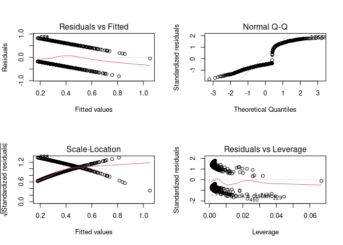<!-- -->

``` r
par(mfrow = c(1, 1)) 
```
