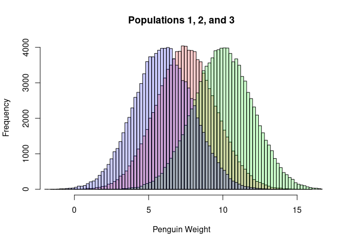
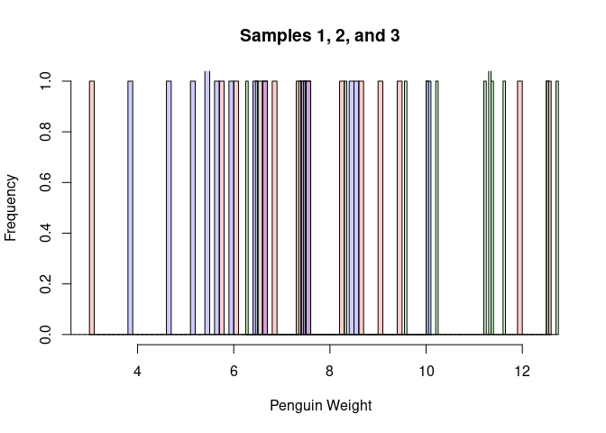
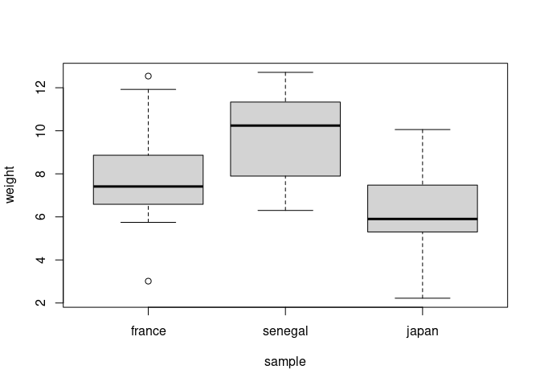
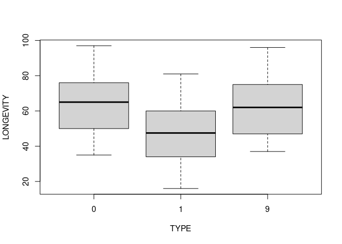

One-Way Anova
================
Last Updated: 30, October, 2023 at 16:43

- [Fake data](#fake-data)
  - [Make some population data](#make-some-population-data)
  - [Sample from the populations](#sample-from-the-populations)
  - [Run classic ANOVA](#run-classic-anova)
  - [Run LM](#run-lm)
  - [Change contrasts](#change-contrasts)
    - [Helmert coding](#helmert-coding)
    - [Compare with data](#compare-with-data)
    - [Faux](#faux)
- [Real data: feet](#real-data-feet)
- [Real data: flies (A warning!)](#real-data-flies-a-warning)

``` r
library(reshape)
```

# Fake data

## Make some population data

``` r
sample_size <- 15

population1 <- rnorm(100000, mean = 7.5, sd = 2)
population2 <- rnorm(100000, mean = 10, sd = 2)
population3 <- rnorm(100000, mean = 6, sd = 2)

hist(population1, breaks=100, col=rgb(1,0,0,0.2), main='', xlab = 'Penguin Weight')
hist(population2, breaks=100,  add=TRUE, col=rgb(0,1,0,0.2))
hist(population3, breaks=100,  add=TRUE, col=rgb(0,0,1,0.2))
title('Populations 1, 2, and 3')
```

<!-- -->

## Sample from the populations

``` r
france <- sample(population1, sample_size)
senegal <- sample(population2, sample_size)
japan <- sample(population3, sample_size)

hist(france, breaks=100, col=rgb(1,0,0,0.2), main='', xlab='Penguin Weight')
hist(senegal, breaks=100,  add=TRUE, col=rgb(0,1,0,0.2))
hist(japan, breaks=100,  add=TRUE, col=rgb(0,0,1,0.2))
title('Samples 1, 2, and 3')
```

<!-- -->

``` r
data <-data.frame(cbind(france,senegal,japan))
data<-melt(data, id.vars=c())
colnames(data) <- c('sample', 'weight')
data$sample<-factor(data$sample)
head(data)
```

    ##   sample    weight
    ## 1 france  6.549549
    ## 2 france  7.326938
    ## 3 france  3.014669
    ## 4 france 11.922262
    ## 5 france  9.482891
    ## 6 france  7.412375

``` r
tail(data)
```

    ##    sample    weight
    ## 40  japan  3.811695
    ## 41  japan  4.690628
    ## 42  japan 10.057104
    ## 43  japan  7.401513
    ## 44  japan  8.489356
    ## 45  japan  6.683846

``` r
boxplot(weight ~ sample, data = data)
```

<!-- -->

## Run classic ANOVA

``` r
result <- aov(weight ~ sample, data = data)
summary(result)
```

    ##             Df Sum Sq Mean Sq F value   Pr(>F)    
    ## sample       2  99.29   49.65   10.42 0.000211 ***
    ## Residuals   42 200.10    4.76                     
    ## ---
    ## Signif. codes:  0 '***' 0.001 '**' 0.01 '*' 0.05 '.' 0.1 ' ' 1

## Run LM

``` r
result <- lm(weight ~ sample, data = data)
summary(result)
```

    ## 
    ## Call:
    ## lm(formula = weight ~ sample, data = data)
    ## 
    ## Residuals:
    ##     Min      1Q  Median      3Q     Max 
    ## -4.7904 -1.2555 -0.2597  1.4471  4.7372 
    ## 
    ## Coefficients:
    ##               Estimate Std. Error t value Pr(>|t|)    
    ## (Intercept)     7.8051     0.5636  13.849   <2e-16 ***
    ## samplesenegal   2.0539     0.7970   2.577   0.0136 *  
    ## samplejapan    -1.5741     0.7970  -1.975   0.0549 .  
    ## ---
    ## Signif. codes:  0 '***' 0.001 '**' 0.01 '*' 0.05 '.' 0.1 ' ' 1
    ## 
    ## Residual standard error: 2.183 on 42 degrees of freedom
    ## Multiple R-squared:  0.3317, Adjusted R-squared:  0.2998 
    ## F-statistic: 10.42 on 2 and 42 DF,  p-value: 0.0002114

## Change contrasts

### Helmert coding

Here, I use Helmert coding (from R). Helmert coding compares each level
of a categorical variable to the mean of the subsequent levels.

Compare this to the slides.

``` r
contrasts(data$sample) <- contr.helmert(n = 3)
result <- lm(weight ~ sample, data = data)
summary(result)
```

    ## 
    ## Call:
    ## lm(formula = weight ~ sample, data = data)
    ## 
    ## Residuals:
    ##     Min      1Q  Median      3Q     Max 
    ## -4.7904 -1.2555 -0.2597  1.4471  4.7372 
    ## 
    ## Coefficients:
    ##             Estimate Std. Error t value Pr(>|t|)    
    ## (Intercept)   7.9650     0.3254  24.479  < 2e-16 ***
    ## sample1       1.0270     0.3985   2.577 0.013570 *  
    ## sample2      -0.8670     0.2301  -3.768 0.000506 ***
    ## ---
    ## Signif. codes:  0 '***' 0.001 '**' 0.01 '*' 0.05 '.' 0.1 ' ' 1
    ## 
    ## Residual standard error: 2.183 on 42 degrees of freedom
    ## Multiple R-squared:  0.3317, Adjusted R-squared:  0.2998 
    ## F-statistic: 10.42 on 2 and 42 DF,  p-value: 0.0002114

``` r
data
```

    ##     sample    weight
    ## 1   france  6.549549
    ## 2   france  7.326938
    ## 3   france  3.014669
    ## 4   france 11.922262
    ## 5   france  9.482891
    ## 6   france  7.412375
    ## 7   france  7.526032
    ## 8   france  8.646374
    ## 9   france  5.746758
    ## 10  france 12.542250
    ## 11  france  6.619016
    ## 12  france  6.046784
    ## 13  france  6.882043
    ## 14  france  8.274752
    ## 15  france  9.083369
    ## 16 senegal 10.018104
    ## 17 senegal 11.638199
    ## 18 senegal  7.379708
    ## 19 senegal  7.463891
    ## 20 senegal  8.326967
    ## 21 senegal 12.715429
    ## 22 senegal 11.352607
    ## 23 senegal  9.599256
    ## 24 senegal 11.316091
    ## 25 senegal  6.299320
    ## 26 senegal 11.230249
    ## 27 senegal 10.240627
    ## 28 senegal  6.478472
    ## 29 senegal 12.519620
    ## 30 senegal 11.306023
    ## 31   japan  8.525588
    ## 32   japan  5.445072
    ## 33   japan  5.478760
    ## 34   japan  5.902820
    ## 35   japan  2.221520
    ## 36   japan  7.553931
    ## 37   japan  6.406123
    ## 38   japan  5.155624
    ## 39   japan  5.640705
    ## 40   japan  3.811695
    ## 41   japan  4.690628
    ## 42   japan 10.057104
    ## 43   japan  7.401513
    ## 44   japan  8.489356
    ## 45   japan  6.683846

``` r
model.matrix(result)
```

    ##    (Intercept) sample1 sample2
    ## 1            1      -1      -1
    ## 2            1      -1      -1
    ## 3            1      -1      -1
    ## 4            1      -1      -1
    ## 5            1      -1      -1
    ## 6            1      -1      -1
    ## 7            1      -1      -1
    ## 8            1      -1      -1
    ## 9            1      -1      -1
    ## 10           1      -1      -1
    ## 11           1      -1      -1
    ## 12           1      -1      -1
    ## 13           1      -1      -1
    ## 14           1      -1      -1
    ## 15           1      -1      -1
    ## 16           1       1      -1
    ## 17           1       1      -1
    ## 18           1       1      -1
    ## 19           1       1      -1
    ## 20           1       1      -1
    ## 21           1       1      -1
    ## 22           1       1      -1
    ## 23           1       1      -1
    ## 24           1       1      -1
    ## 25           1       1      -1
    ## 26           1       1      -1
    ## 27           1       1      -1
    ## 28           1       1      -1
    ## 29           1       1      -1
    ## 30           1       1      -1
    ## 31           1       0       2
    ## 32           1       0       2
    ## 33           1       0       2
    ## 34           1       0       2
    ## 35           1       0       2
    ## 36           1       0       2
    ## 37           1       0       2
    ## 38           1       0       2
    ## 39           1       0       2
    ## 40           1       0       2
    ## 41           1       0       2
    ## 42           1       0       2
    ## 43           1       0       2
    ## 44           1       0       2
    ## 45           1       0       2
    ## attr(,"assign")
    ## [1] 0 1 1
    ## attr(,"contrasts")
    ## attr(,"contrasts")$sample
    ##         [,1] [,2]
    ## france    -1   -1
    ## senegal    1   -1
    ## japan      0    2

### Compare with data

``` r
# Fitted coefficients
result$coefficients
```

    ## (Intercept)     sample1     sample2 
    ##   7.9649980   1.0269500  -0.8670228

``` r
all_data <- c(france, senegal, japan)
grand_mean <- mean(all_data)
mean_france <- mean(france)
mean_senegal <- mean(senegal)
mean_japan <- mean(japan)

c(grand_mean, mean_france, mean_senegal, mean_japan)
```

    ## [1] 7.964998 7.805071 9.858971 6.230952

In the Helmert coding (The R version)…

- The intercept is the grand mean
- Beta1 is 0.5 X the difference between France and Senegal
- Beta2 is 1/3 X the difference between Japan and the mean of Senegal
  and France

``` r
intercept <- grand_mean
beta1 <- (mean_senegal - mean_france) / 2
beta2 <- (mean_japan - (mean_senegal + mean_france) / 2) / 3
c(intercept, beta1, beta2)
```

    ## [1]  7.9649980  1.0269500 -0.8670228

``` r
result$coefficients
```

    ## (Intercept)     sample1     sample2 
    ##   7.9649980   1.0269500  -0.8670228

### Faux

``` r
library(faux)
```

    ## 
    ## ************
    ## Welcome to faux. For support and examples visit:
    ## https://debruine.github.io/faux/
    ## - Get and set global package options with: faux_options()
    ## ************

``` r
helmert <- contr_code_helmert(c(1,2,3))
helmert <- contrasts(helmert)

contrasts(data$sample)  <- helmert

result <- lm(weight ~ sample, data = data)
summary(result)
```

    ## 
    ## Call:
    ## lm(formula = weight ~ sample, data = data)
    ## 
    ## Residuals:
    ##     Min      1Q  Median      3Q     Max 
    ## -4.7904 -1.2555 -0.2597  1.4471  4.7372 
    ## 
    ## Coefficients:
    ##              Estimate Std. Error t value Pr(>|t|)    
    ## (Intercept)    7.9650     0.3254  24.479  < 2e-16 ***
    ## sample.2-1     2.0539     0.7970   2.577 0.013570 *  
    ## sample.3-1.2  -2.6011     0.6902  -3.768 0.000506 ***
    ## ---
    ## Signif. codes:  0 '***' 0.001 '**' 0.01 '*' 0.05 '.' 0.1 ' ' 1
    ## 
    ## Residual standard error: 2.183 on 42 degrees of freedom
    ## Multiple R-squared:  0.3317, Adjusted R-squared:  0.2998 
    ## F-statistic: 10.42 on 2 and 42 DF,  p-value: 0.0002114

``` r
c(grand_mean, mean_france, mean_senegal, mean_japan)
```

    ## [1] 7.964998 7.805071 9.858971 6.230952

# Real data: feet

``` r
library(tidyverse)
```

    ## ── Attaching packages ─────────────────────────────────────── tidyverse 1.3.2 ──
    ## ✔ ggplot2 3.4.0      ✔ purrr   0.3.5 
    ## ✔ tibble  3.1.8      ✔ dplyr   1.0.10
    ## ✔ tidyr   1.2.1      ✔ stringr 1.4.1 
    ## ✔ readr   2.1.3      ✔ forcats 0.5.2 
    ## ── Conflicts ────────────────────────────────────────── tidyverse_conflicts() ──
    ## ✖ tidyr::expand() masks reshape::expand()
    ## ✖ dplyr::filter() masks stats::filter()
    ## ✖ dplyr::lag()    masks stats::lag()
    ## ✖ dplyr::rename() masks reshape::rename()

``` r
feet <- read_csv('data/feet.csv')
```

    ## Rows: 38 Columns: 7
    ## ── Column specification ────────────────────────────────────────────────────────
    ## Delimiter: ","
    ## chr (3): Sex, Foot, Hand
    ## dbl (4): Month, Year, FootLength, FootWidth
    ## 
    ## ℹ Use `spec()` to retrieve the full column specification for this data.
    ## ℹ Specify the column types or set `show_col_types = FALSE` to quiet this message.

``` r
head(feet)
```

    ## # A tibble: 6 × 7
    ##   Month  Year FootLength FootWidth Sex   Foot  Hand 
    ##   <dbl> <dbl>      <dbl>     <dbl> <chr> <chr> <chr>
    ## 1    10    87       23.4       8.8 B     L     L    
    ## 2    12    87       22.5       9.7 B     R     R    
    ## 3     1    88       23.2       9.8 B     L     R    
    ## 4     2    88       23.1       8.9 B     L     R    
    ## 5     3    88       23.7       9.7 B     R     R    
    ## 6     2    88       24.1       9.6 B     L     R

``` r
model <- lm(FootLength ~ Sex, data = feet)
summary(model)
```

    ## 
    ## Call:
    ## lm(formula = FootLength ~ Sex, data = feet)
    ## 
    ## Residuals:
    ##      Min       1Q   Median       3Q      Max 
    ## -2.72105 -0.73684 -0.08158  0.85789  2.37895 
    ## 
    ## Coefficients:
    ##             Estimate Std. Error t value Pr(>|t|)    
    ## (Intercept)  23.1421     0.2948  78.492   <2e-16 ***
    ## SexG         -0.8211     0.4170  -1.969   0.0567 .  
    ## ---
    ## Signif. codes:  0 '***' 0.001 '**' 0.01 '*' 0.05 '.' 0.1 ' ' 1
    ## 
    ## Residual standard error: 1.285 on 36 degrees of freedom
    ## Multiple R-squared:  0.09724,    Adjusted R-squared:  0.07216 
    ## F-statistic: 3.878 on 1 and 36 DF,  p-value: 0.05667

``` r
boxplot(FootLength ~ Sex, data = feet)
```

<!-- -->

# Real data: flies (A warning!)

<http://jse.amstat.org/datasets/fruitfly.txt>

``` r
flies <- read_csv('data/flies.csv')
```

    ## Rows: 125 Columns: 6
    ## ── Column specification ────────────────────────────────────────────────────────
    ## Delimiter: ","
    ## dbl (6): ID, PARTNERS, TYPE, LONGEVITY, THORAX, SLEEP
    ## 
    ## ℹ Use `spec()` to retrieve the full column specification for this data.
    ## ℹ Specify the column types or set `show_col_types = FALSE` to quiet this message.

``` r
head(flies)
```

    ## # A tibble: 6 × 6
    ##      ID PARTNERS  TYPE LONGEVITY THORAX SLEEP
    ##   <dbl>    <dbl> <dbl>     <dbl>  <dbl> <dbl>
    ## 1     1        8     0        35   0.64    22
    ## 2     2        8     0        37   0.68     9
    ## 3     3        8     0        49   0.68    49
    ## 4     4        8     0        46   0.72     1
    ## 5     5        8     0        63   0.72    23
    ## 6     6        8     0        39   0.76    83

``` r
# Don't do this!!
model <- lm(LONGEVITY ~ TYPE, data = flies)
summary(model)
```

    ## 
    ## Call:
    ## lm(formula = LONGEVITY ~ TYPE, data = flies)
    ## 
    ## Residuals:
    ##     Min      1Q  Median      3Q     Max 
    ## -40.712 -14.105  -0.105  13.434  40.895 
    ## 
    ## Coefficients:
    ##             Estimate Std. Error t value Pr(>|t|)    
    ## (Intercept)  56.1050     1.8607  30.152   <2e-16 ***
    ## TYPE          0.6068     0.4567   1.329    0.186    
    ## ---
    ## Signif. codes:  0 '***' 0.001 '**' 0.01 '*' 0.05 '.' 0.1 ' ' 1
    ## 
    ## Residual standard error: 17.51 on 123 degrees of freedom
    ## Multiple R-squared:  0.01415,    Adjusted R-squared:  0.006135 
    ## F-statistic: 1.765 on 1 and 123 DF,  p-value: 0.1864

``` r
## Do this!!
model <- lm(LONGEVITY ~ as.factor(TYPE), data = flies)
summary(model)
```

    ## 
    ## Call:
    ## lm(formula = LONGEVITY ~ as.factor(TYPE), data = flies)
    ## 
    ## Residuals:
    ##    Min     1Q Median     3Q    Max 
    ## -31.74 -13.74   0.26  11.44  33.26 
    ## 
    ## Coefficients:
    ##                  Estimate Std. Error t value Pr(>|t|)    
    ## (Intercept)        64.080      2.233  28.701  < 2e-16 ***
    ## as.factor(TYPE)1  -16.340      3.158  -5.175 9.08e-07 ***
    ## as.factor(TYPE)9   -0.520      3.867  -0.134    0.893    
    ## ---
    ## Signif. codes:  0 '***' 0.001 '**' 0.01 '*' 0.05 '.' 0.1 ' ' 1
    ## 
    ## Residual standard error: 15.79 on 122 degrees of freedom
    ## Multiple R-squared:  0.2051, Adjusted R-squared:  0.1921 
    ## F-statistic: 15.74 on 2 and 122 DF,  p-value: 8.305e-07

``` r
boxplot(LONGEVITY ~ TYPE, data = flies)
```

<!-- -->
