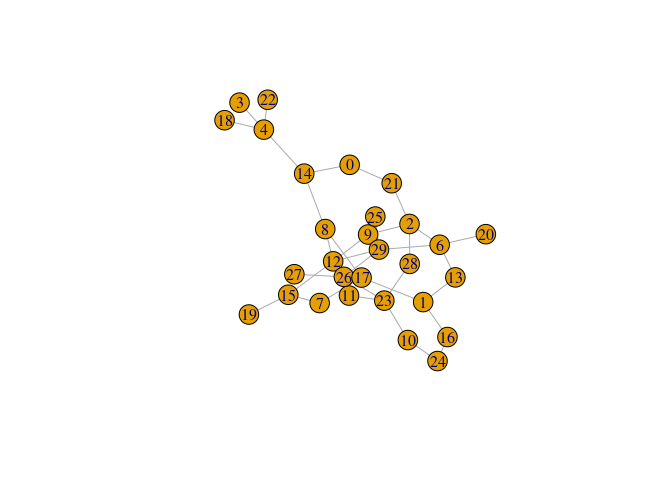
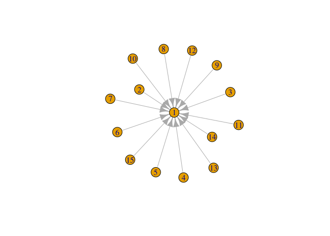
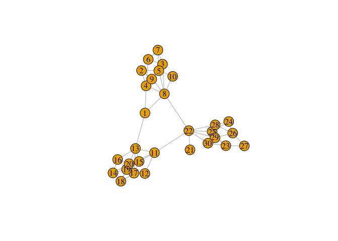

Network Analysis
================
Dieter
Last Updated: 03, September, 2022 at 16:14

-   <a href="#loading-the-required-packages"
    id="toc-loading-the-required-packages">Loading the required packages</a>
-   <a href="#loading-some-data-and-create-a-gaph"
    id="toc-loading-some-data-and-create-a-gaph">Loading some data and
    create a gaph</a>
-   <a href="#create-sample-graphs" id="toc-create-sample-graphs">Create
    sample graphs</a>
    -   <a href="#some-simple-functions" id="toc-some-simple-functions">Some
        simple functions</a>
    -   <a href="#random-graphs" id="toc-random-graphs">Random graphs</a>
-   <a href="#analyzing-network-properties"
    id="toc-analyzing-network-properties">Analyzing network properties</a>

## Loading the required packages

``` r
library(sna)
```

    ## Loading required package: statnet.common

    ## 
    ## Attaching package: 'statnet.common'

    ## The following objects are masked from 'package:base':
    ## 
    ##     attr, order

    ## Loading required package: network

    ## 
    ## 'network' 1.17.2 (2022-05-20), part of the Statnet Project
    ## * 'news(package="network")' for changes since last version
    ## * 'citation("network")' for citation information
    ## * 'https://statnet.org' for help, support, and other information

    ## sna: Tools for Social Network Analysis
    ## Version 2.7 created on 2022-05-09.
    ## copyright (c) 2005, Carter T. Butts, University of California-Irvine
    ##  For citation information, type citation("sna").
    ##  Type help(package="sna") to get started.

``` r
library(igraph)
```

    ## 
    ## Attaching package: 'igraph'

    ## The following objects are masked from 'package:sna':
    ## 
    ##     betweenness, bonpow, closeness, components, degree, dyad.census,
    ##     evcent, hierarchy, is.connected, neighborhood, triad.census

    ## The following objects are masked from 'package:network':
    ## 
    ##     %c%, %s%, add.edges, add.vertices, delete.edges, delete.vertices,
    ##     get.edge.attribute, get.edges, get.vertex.attribute, is.bipartite,
    ##     is.directed, list.edge.attributes, list.vertex.attributes,
    ##     set.edge.attribute, set.vertex.attribute

    ## The following objects are masked from 'package:stats':
    ## 
    ##     decompose, spectrum

    ## The following object is masked from 'package:base':
    ## 
    ##     union

## Loading some data and create a gaph

``` r
network_data <- read.delim('data/undirected.txt', header = FALSE, sep = " ")
graph1 <- graph_from_data_frame(network_data, directed = FALSE)
plot(graph1)
```

<!-- -->

Also, notice the following functions:

-   `graph_from_adjacency_matrix()`
-   `graph_from_adj_list()`

## Create sample graphs

### Some simple functions

See: graph_from_literal(), make_chordal_ring(), make_empty_graph(),
make_full_citation_graph(), make_full_graph(), make_graph(),
make_lattice(), make_ring(), make_star(), make_tree()

``` r
graph2 <- make_star(n=15, mode='in')
plot(graph2)
```

<!-- -->

### Random graphs

These are often used to research the properties of graphs. See
`sample_*` functions.

``` r
sw <- sample_islands(3, 10, 5/10, 1)
plot(sw)
```

<!-- -->

## Analyzing network properties

``` r
sw <- sample_islands(3, 10, 5/10, 1)
degree(sw)
```

    ##  [1] 7 5 7 7 5 6 4 4 4 5 5 7 6 5 6 7 5 3 4 4 3 6 2 2 5 7 5 3 4 5

``` r
betweenness(sw)
```

    ##  [1]  19.128205   2.930769 107.751421 112.603985   7.647436  15.480769
    ##  [7]   4.200000   0.700000   3.230769   8.333333   7.729779  97.382481
    ## [13]  22.007520   3.283333  21.907251  17.045615  77.731913   3.250000
    ## [19]   2.887374   4.431782   0.000000  39.607576   0.700000   0.500000
    ## [25]  23.101515  40.957576  25.930952   0.450000  83.948579 120.140065

``` r
edge_density(sw)
```

    ## [1] 0.1701149
