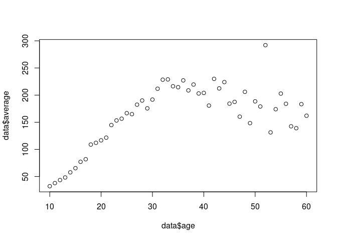

Basic Programming
================
Last Updated: 03, September, 2022 at 15:31

-   <a href="#basics-of-programming-variables-and-functions"
    id="toc-basics-of-programming-variables-and-functions">Basics of
    programming: variables and functions</a>
-   <a href="#basic-operations-r-as-a-calculator"
    id="toc-basic-operations-r-as-a-calculator">Basic operations: R as a
    calculator</a>
-   <a href="#logical-operations" id="toc-logical-operations">Logical
    operations</a>
-   <a href="#storing-data-in-variables"
    id="toc-storing-data-in-variables">Storing data in variables</a>
    -   <a href="#assigning-data-to-a-variable"
        id="toc-assigning-data-to-a-variable">Assigning data to a variable</a>
    -   <a href="#note-on-naming-variables"
        id="toc-note-on-naming-variables">Note on naming variables</a>
    -   <a href="#the-vector" id="toc-the-vector">The vector</a>
-   <a href="#a-trick" id="toc-a-trick">A trick</a>
-   <a href="#functions" id="toc-functions">Functions</a>
-   <a href="#flow-control-in-r" id="toc-flow-control-in-r">Flow control in
    R</a>
    -   <a href="#the-if-statement" id="toc-the-if-statement">The
        <code>if</code> statement</a>
    -   <a href="#the-for-loop" id="toc-the-for-loop">The <code>for</code>
        loop</a>
    -   <a href="#the-while-loop" id="toc-the-while-loop">The <code>while</code>
        loop</a>
-   <a href="#exercises" id="toc-exercises">Exercises</a>
-   <a href="#note-on-vector-preallocation"
    id="toc-note-on-vector-preallocation">Note on vector preallocation</a>

## Basics of programming: variables and functions

Programming is basically (1) storing data, (2) performing operations on
this data.

We will store data in so-called variables. We use functions to perform
operations on the data.

## Basic operations: R as a calculator

R can perform the classic operations.

``` r
1 / 200 * 30
```

    ## [1] 0.15

``` r
(59 + 73 + 2) / 3
```

    ## [1] 44.66667

``` r
sin(pi / 2)
```

    ## [1] 1

## Logical operations

``` r
5 > 6
```

    ## [1] FALSE

``` r
5 + 1 == 6 #NOTICE: I am using == to check equality!
```

    ## [1] TRUE

``` r
1234 != 1234
```

    ## [1] FALSE

## Storing data in variables

### Assigning data to a variable

R use `<-` to make assignments. This is a pain to type. You *could* use
`=` but it will cause confusion later on.

``` r
my_variable <- 5
```

Variables (also called values) come in many types (or classes). The very
basic ones are the following:

``` r
my_logical <- TRUE
my_character <- 'this is just a piece of text'
my_numeric <- 1.23455
```

These are very simple data types. We will often used much more complex
ones when working with actual data.

``` r
Name <- c("Jon", "Bill", "Maria", "Ben", "Tina")
Age <- c(23, 41, 32, 58, 26)
my_data_frame <- data.frame(Name, Age)
```

R studio shows `values` and `data` separately in the Environment window.
However, this is just a visualization used by R studio. **You can use
this window to inspect variables!**

### Note on naming variables

Try to use descriptive names for variables. And try to stick to a naming
convention that works for you - preferably one that makes your code easy
to read.

``` r
i_like_snake_case <- 'snake_case'
otherPeopleUseCamelCase <- 'CamelCase'
some.people.use.periods <- 'periods.are.allowed'
And_aFew.People_RENOUNCEconvention <- 'Madness, Madness, I tell you!'
```

From R for Data Science:

*There’s an implied contract between you and R: it will do the tedious
computation for you, but in return, you must be completely precise in
your instructions. Typos matter. Case matters.*

Also, it is important that you use names that are not keywords or
functions in R. For example, the following is a bad idea:

``` r
#length <- 15 ## THIS IS A BAD IDEA
```

### The vector

R is another basic variable in R. It’s the simplest type of variable
that actually allows you to store something recognizable as ‘data’. We
will spend some time on vectors as they are a good place to start to
work with relatively simple data. Also, understanding how to work with
vectors makes working with more complex data easier. Much of the
operations you can do on vectors, which are 1D, can also be done on 2D
data frames.

#### Creating a vector manually

``` r
a_vector <- c(1, 5, 4, 9, 0)
another_one <- c(1, 5.4, TRUE, "hello")
```

#### Creating a vector using the `:` operator

``` r
x <- 1:7
y <- 2:-2
```

#### Using `seq` to make a vector

``` r
step_size <- seq(1, 10, by=0.25)
length_specified <- seq(1, 10, length.out = 20)
```

#### Indexing vectors

Every item in a vector has an index. Vector indices in R start from 1,
unlike most programming languages where index start from 0.

``` r
my_longer_vector <- c(1, 2, 'three', '4', 'V', 6, 7, 8)
```

You can use the `[]` to select (multiple) elements from a vector.

``` r
my_single_element <- my_longer_vector[5]
the_start <- my_longer_vector[1:3]
my_part_of_vector <- my_longer_vector[c(1, 2, 5)] # I'm using a vector to select parts of a vector. Life is funny.
```

You can also use `[]` to overwrite a part of a vector

``` r
my_longer_vector[1:3] <- c('replace', 'this', 'now')
```

#### Logical vectors

``` r
vector1 <- c(1,5,6,7,2,3,5,4,6,8,1,9,0,1)
binary_vector <- vector1 > 5
binary_vector
```

    ##  [1] FALSE FALSE  TRUE  TRUE FALSE FALSE FALSE FALSE  TRUE  TRUE FALSE  TRUE
    ## [13] FALSE FALSE

``` r
some_other_vector <- seq(from = 0, to = 100, length.out = length(vector1))
selected <- some_other_vector[binary_vector]
selected
```

    ## [1] 15.38462 23.07692 61.53846 69.23077 84.61538

## A trick

Before we go on, I want to share a simple trick. Using a IDE like
Rstudio makes life easier (or at least it should). One of the benefits
of the IDE is tab-completion.

\[DEMO GOES HERE\]

## Functions

Now we know how to store data, we can start manipulating the data using
functions.

Functions take 0 or more inputs (also called arguments), perform some
operation (i.e., the function of the function), and return some output.
This output can be complex and consist of multiple parts. This are
generic ways in which functions are used:

    output <- function_name(arg1 = val1, arg2 = val2, ...)
    output <- function_name(val1, val2, ...)

We’ve already encountered a function:

``` r
output<-seq(from = 1, to= 123, by = 0.123)
```

How do we know which arguments a function can take? Using the help:

``` r
?seq
```

Some very simple functions that might be usefull.

``` r
a <- max(output)
b <- mean(output)
c <- min(output)
d <- ceiling(output)
e <- sd(output)
```

Here is a function which returns more complex data. At this point,
you’re not suposed to know what this funtion does (it fits a regression
line). The point is that it returns complex data with multiple fields.

``` r
x <- runif(100)
y <- 10 + 5 * x + rnorm(100)
result <- lm(y ~ x)
print(result)
```

    ## 
    ## Call:
    ## lm(formula = y ~ x)
    ## 
    ## Coefficients:
    ## (Intercept)            x  
    ##      10.285        4.555

## Flow control in R

You could write all R scripts as a serial statements of functions.
However, to fully exploit the power of programming, you would need to
learn about flow control. Flow control refers to (1) executing bits of
code depending on a condition, and (2) iteratively executing pieces of
code.

This is a short script which does one thing after another.

``` r
data <- read.csv('data/wages1833.csv')
data$average <- ((data$mnum * data$mwage) + (data$fnum * data$fwage)) / (data$mnum + data$fnum)
model <- lm(data$average ~ data$age)
result <- summary(model)
plot(data$age, data$average )
```

<!-- -->

### The `if` statement

This is the basic anatomy of an if statement

    if (expression) {
       #statement to execute if condition is true
    }

Example:

``` r
my_number <-12

if (my_number < 20){
  x <- sprintf('%i is less than 20', my_number)
  print(x)
}
```

    ## [1] "12 is less than 20"

There is also an if-else variant of this,

``` r
a  <- -5
 
# condition
if(a > 0)
{
    print("Positive Number")
}else{
    print("negative number")
}
```

    ## [1] "negative number"

Rewriting the previous one on 1 line (maybe that makes it easier to
read?)

``` r
a  <- -5
 
# condition
if(a > 0){print("Positive Number")}else{print("negative number")}
```

    ## [1] "negative number"

### The `for` loop

The `for` loop iterates over a sequence.

``` r
my_vector <- runif(5)
for (x in my_vector) {
  y <- x * 3
  print(y)
}
```

    ## [1] 0.7050276
    ## [1] 2.101707
    ## [1] 0.4559092
    ## [1] 0.1409621
    ## [1] 0.7993773

Just to drive the point home, another example:

``` r
fruits <- list("apple", "banana", "cherry")
for (x in fruits) {
  print(x)
} 
```

    ## [1] "apple"
    ## [1] "banana"
    ## [1] "cherry"

One very common use of the `for` loop is to iterate a bit of code
exactly n times.

``` r
number_of_time_i_want_to_repeat_this <-10
for (x in 1:10) {
  print('This is being repeated!')
} 
```

    ## [1] "This is being repeated!"
    ## [1] "This is being repeated!"
    ## [1] "This is being repeated!"
    ## [1] "This is being repeated!"
    ## [1] "This is being repeated!"
    ## [1] "This is being repeated!"
    ## [1] "This is being repeated!"
    ## [1] "This is being repeated!"
    ## [1] "This is being repeated!"
    ## [1] "This is being repeated!"

You can use a `break` statement to break the loop at any point.

``` r
number_of_time_i_want_to_repeat_this <-10
for (x in 1:10) {
  print('This is being repeated!')
  if (x > 7){
    print('I quit!')
    break
  }
} 
```

    ## [1] "This is being repeated!"
    ## [1] "This is being repeated!"
    ## [1] "This is being repeated!"
    ## [1] "This is being repeated!"
    ## [1] "This is being repeated!"
    ## [1] "This is being repeated!"
    ## [1] "This is being repeated!"
    ## [1] "This is being repeated!"
    ## [1] "I quit!"

### The `while` loop

The while repeats a piece of code if something is true and as long as it
is true.

``` r
i <- 1
while (i < 6) {
  print(i)
  i <- i + 1
} 
```

    ## [1] 1
    ## [1] 2
    ## [1] 3
    ## [1] 4
    ## [1] 5

## Exercises

-   Write a for loop that iterates over the numbers 1 to 7 and prints
    the cube of each number using print().
-   Write a while loop that prints out standard random normal numbers
    (use `rnorm()`) but stops (breaks) if you get a number bigger than
    1.
-   Using a for loop simulate the flip a coin twenty times, keeping
    track of the individual outcomes (1 = heads, 0 = tails) in a vector.
-   Use a while loop to investigate the number of terms required before
    the series
    
    reaches above 10 million.

## Note on vector preallocation

This piece of code build a vector by appending numbers to the end of it.

``` r
repeats <- 10000
startTime <- Sys.time()
my_vector <- c()
for (i in 0:repeats){
  x <- runif(1)
  vector <- append(vector, x)
}
endTime <- Sys.time()
print(sprintf('Duration: %.2f', endTime - startTime))
```

    ## [1] "Duration: 0.59"

This piece of code preallocates a vector and is more efficient.

``` r
repeats <- 10000
startTime <- Sys.time()
my_vector <- numeric(repeats)
for (i in 0:repeats){
  x <- runif(1)
  vector[i] <- x
  }
endTime <- Sys.time()
print(sprintf('Duration: %.2f', endTime - startTime))
```

    ## [1] "Duration: 0.03"
