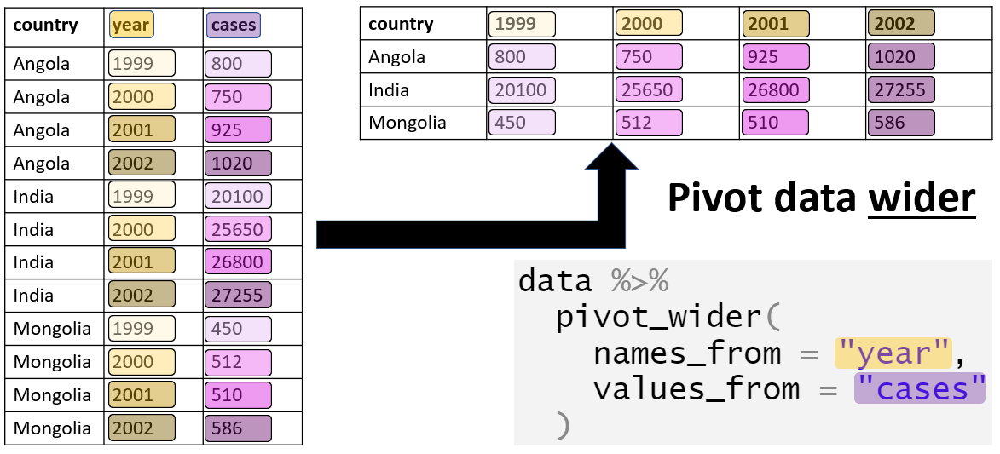

## Loading the tidyverse

```{r}
library(tidyverse)
```

## Some simple operations

### Opening large text files

One of the most simple things you can do is inspect your data using a text editor. When text files are large, it's a good idea to get an editor that can handle large files. I suggest [Sublime Text Editor](https://www.sublimetext.com/). This editor can handle much larger files than you can open (as text) in Rstudio. Keep the file open while you're cleaning it!

### Detecting outliers

Outliers (as errors) can be most easily identified using graphs. However, some textual output might be useful as well.

Let's read in some data (see codebook.txt for info about the variables).

```{r}
depression_data <- read_tsv('data/raw_depression.csv')
```

People have clearly made errors when entering their ages:

```{r}
summary(depression_data$age)
```

The histogram looks weird because of the very few, very high ages. We *could* try to fix these by assuming, for example, that `1998` is the birthyear and not the age. We will do this later.

```{r}
hist(depression_data$age)
```

```{r}
dim(depression_data)
filtered_depression_data <- filter(depression_data, age < 120)
dim(filtered_depression_data)
hist(filtered_depression_data$age, breaks=100)
```

Here is another visualization.

```{r}
par(mfcol=c(1,2))
boxplot(depression_data$age)
boxplot(filtered_depression_data$age)
```

Here is another problem with the data...

```{r}
hist(filtered_depression_data$familysize, breaks=100)
summary(filtered_depression_data$familysize)
```

Categorical data can also be messy. People entered their majors as free text. And this is the result:

```{r}
library(janitor)
result <- tabyl(depression_data$major)
head(result, 50)
```

### Missing data

R encodes missing values as `NA`. Missing values are contagious: performing calculations on data that contains missing values often leads to an `NA` result. Some functions are robust against missing values (they simply ignore them). However, when a result comes back as `NA` it's often because the data contained missing values in the first place.

```{r}
some_data <- c(1,2,3,4, NA)
mean(some_data)
max(some_data)
```

Tips from the field:

-   When reading in a file, it's a good idea to know how missing values are encoded so you can tell R which values to interpret as missing.
-   Sometime people will use absurd values to indicate missing data. For example, they might enter -1 or 99999 when an age value is missing. These are then read by R as numbers and your calculations end up being nonsense. One way to catch this it by looking for outliers!

### Separating a column

```{r}
patient_data <-read_tsv('data/inpatient.tsv')
colnames(patient_data) <- make.names(colnames(patient_data))
head(patient_data, 5)
```

```{r}
result <- tabyl(patient_data$Hospital.Referral.Region.Description)
head(result, 5)
```

Let's separate this column into two columns.

```{r}
test <- separate(patient_data, Hospital.Referral.Region.Description, into=c('state', 'city'), sep='-')
```

This resulted in some warnings in certain rows. Let's look at some of those rows.

```{r}
patient_data$Hospital.Referral.Region.Description[710]
patient_data$Hospital.Referral.Region.Description[711]
patient_data$Hospital.Referral.Region.Description[1930]
```

```{r}
test <- separate(patient_data, Hospital.Referral.Region.Description, into=c('state', 'city'), sep=' - ', remove = FALSE)
```

No warnings anymore! Note, you can use regular expression for the `sep` argument: [see here.](https://cran.r-project.org/web/packages/stringr/vignettes/regular-expressions.html)

### Combining columns

The opposite operation!

```{r}
test <- unite(test, 'combined', c(Provider.Id, Provider.Name), sep='_+_', remove = FALSE)
head(test$combined, 3)
```

### Strings using `stringr`

It does happen that you need to clean textual data. The `stringr` package has a bunch of functions to make your life easier (but not easy). I will run through some examples but do have a look at the [cheatsheet](https://evoldyn.gitlab.io/evomics-2018/ref-sheets/R_strings.pdf) as well.

Remember, this data?

```{r}
depression_data <- read_tsv('data/raw_depression.csv')
```

We have to load `stringr` separately.

```{r}
library(stringr)
```

Let's convert the majors to lower case. Notice that strings that are not coner

```{r}
head(depression_data$major, 10)
depression_data$major <- str_to_lower(depression_data$major)
head(depression_data$major, 10)
```

Let's try to find biology majors

```{r}
depression_data$bio <- str_detect(depression_data$major, 'bio')
bio_students <- filter(depression_data, bio)
```

That matched also biomedical and biochemistry students. Let's detect those using a regex (See <https://regex101.com/> for a regex construction tool).

```{r}
depression_data$other <- !str_detect(depression_data$major, 'chem|med|phys|tech')
```

Let's combine our columns

```{r}
depression_data <- mutate(depression_data, selection = other * bio)
bio_students <- filter(depression_data, selection==1)
```

## Reorganizing data

### Loading some data

```{r}
car_data <- read_delim('data/cars.txt', delim = ' ')
```

### Grouping and summarizing data

The `group_by()` function takes a tibble and returns the same tibble, but with some extra information so that any subsequent function acts on each unique combination defined in the `group_by()`.

```{r}
grouped <- group_by(car_data, type, make)
```

If you inspect the `grouped` tibble it seems the same as the `car_data` tibble. However, it has stored the grouping we asked for.

```{r}
groups(grouped)
```

Now, you can use the `summarize()` function to get summary data for each subgroup

```{r}
summaries <- summarise(grouped, mean.length = mean(length))
summaries
```

You can ask for more than one summary statistic.

```{r}
summaries <- summarise(grouped, mean.length = mean(length), max.length = max(length), std_rpm = sd(rpm))
summaries
```

### Further processing

Keep in mind that, as the result of `summarize()` is a tibble, you can use the data selection methods we saw earlier.

```{r}
subset <- filter(summaries, make ==  'Ford')
head(subset)
```

### Note on dropping non-existing levels

By default, the `group_by()` function drops non-existing combinations of grouping variables.

```{r}
grouped1 <- group_by(car_data, type, make)
c1<-count(grouped1)
summaries1 <- summarise(grouped, mean.length = mean(length))
dim(summaries1)
```

However, this behavior can be changed using the `.drop = FALSE` argument (and converting the variables to factors)

```{r}
grouped2 <- group_by(car_data, as.factor(type), as.factor(make), .drop=FALSE)
c2<-count(grouped2)
summaries2 <- summarise(grouped2, mean.length = mean(length))
summaries2 <- complete(summaries2)
dim(summaries2)
```

### Converting to wide format

The result can be reshaped into a wide format. While this format is often not suited for plotting or analysis, it might make it easier to look at the data. Here is a quick visual:



```{r}
wide <- pivot_wider(summaries, id_cols = make, names_from  = type, values_from = mean.length)
head(wide)
```

### Making data longer (melting data)

Here is a quick graphic:


Let's look at some data:

```{r}
head(relig_income, 5)
```

This data is in a wider format. But we can easily melt it to a long format.

```{r}
new <- pivot_longer(relig_income, cols = !religion)
head(new, 5)
```

You can specify names for the new columns while melting.

```{r}
new <- pivot_longer(relig_income, !religion, names_to = "income", values_to = "count")
head(new, 5)
```

## Merging data

Here, we will use National Health and Nutrition Examination Survey data. This is the [data source](https://wwwn.cdc.gov/nchs/nhanes/continuousnhanes/default.aspx?BeginYear=2017). See [here](https://wwwn.cdc.gov/Nchs/Nnyfs/Y_DEMO.htm) for more information about the demographic variables.

These data are split into multiple files (based on topic). If we need variables from different files, we can merge the different data subsets.

### Reading in the data

The data is in SAS Transport File Format. Therefore, we will use the `haven` library to read it in.

```{r}
library(haven)
demographics <- read_xpt('data/DEMO_J.XPT')
income <- read_xpt('data/INQ_J.XPT')
drugs <- read_xpt('data/DUQ_J.XPT')
```

There are many variables in each file. To keep things manageable, let's select some variables (we've seen how to do this before).

```{r}
drug_habits <- select(drugs, SEQN, DUQ200:DUQ280)
age<-select(demographics, SEQN, RIDAGEYR, RIDAGEMN)
finance <- select(income, SEQN, INDFMMPC,INDFMMPI, INQ300, IND235)
```

### Merging the data

```{r}
merged <- full_join(age, drug_habits, by='SEQN')
merged <- full_join(merged, finance, by='SEQN')
dim(merged)
```

Other related operations are illustrated in the image below. The various operations differ in the way they handle rows missing in the left or right tibble. In the image below, the merge is done by the variable `ID`.


## Exercise: Global Health Data

Use the following data for this exercise:

```{r}
library(gapminder)
gap_data <- gapminder
```

-   Filter the data for the Americas in 2007. Retain only the `lifeExp` variable and deselect all other variables.
-   Create the variable `gdp`, defined as the product of `pop` and `gdpPercap`.
-   Identify the observation (combination of county, continent, and year) with lowest gdp per person.
-   Identify all observations with above average life expectancy, stratified for each continent.
-   Compute the mean life expectancy for each year per continent.

## Example: Social Security Applications

I got this example from [here](https://www.linkedin.com/learning-login/share?account=2133849&forceAccount=false&redirect=https%3A%2F%2Fwww.linkedin.com%2Flearning%2Fdata-wrangling-in-r-14135737%3Ftrk%3Dshare_ent_url%26shareId%3D%252BDp0PBL0TaS6XMBZDGEN2w%253D%253D). This data set tracks how many people apply for SS through the website (internet) and the total applications (including applications through mail).

**Take some time to think how you would convert this data to a tidy data set.**

```{r}
ss <- read_csv('data/ssadisability.csv')
glimpse(ss)
colnames(ss)
```

### A reminder on `pivot_longer()`


### Using `pivot_longer()`

```{r}
longer_format <- pivot_longer(ss, cols=Oct_Total:Sept_Total, names_to = 'period_source', values_to = 'Count')
```

This is better. But not perfect yet.

```{r}
count
```

### Using `separate()`

Let's split the `period_source` column.

```{r}
splitted <- separate(longer_format, period_source, into=c('Month', 'Source'), sep='_')
```

### Creating an `Other` column

I'd like to create a column listing the difference between `Internet` and `Total`. I'll do this by first creating a wider format.


```{r}
wider <- pivot_wider(splitted, names_from = 'Source', values_from = 'Count')
head(wider)
wider<-mutate(wider, Other = Total - Internet)
head(wider)
```

Now we can go back to the long format.

```{r}
long_again <- select(wider, -Total)
long_again <- pivot_longer(long_again, cols = c(Internet, Other), names_to = 'Source', values_to = 'Count') 
```

### Convert `Fiscal_Year` to year

```{r}
numbers <- str_extract(long_again$Fiscal_Year, '[0-9]{2}')
numbers <- 2000 + as.integer(numbers)
long_again <- add_column(long_again, Year = numbers)
long_again <- select(long_again, -Fiscal_Year)
```

### Create a date variable

```{r}
library(lubridate)
long_again$date <- paste('01', long_again$Month, long_again$Year)
long_again$date<-dmy(long_again$date)
```

### Plots

Let's create some plots.

```{r}
data_2012 <- filter(long_again, Year == 2012)
ggplot(data_2012) + aes(x=date, y = Count, group=Source, color=Source) + geom_line()
```

```{r}
ggplot(long_again) + aes(x=Month, y = Count, group=Source, color=Source) + geom_line() + facet_grid(~Year)
```

## Example: Coal data

Have a look at the data in an editor: + The first 2 lines can be skipped. + Missing values are given by `--`.

```{r}
coal_data <- read_csv('data/coal.csv', skip=2, na = "--")
head(coal_data)
```

**Take some time to think how you would convert this data to a tidy data set.**

### Change the first variable name

```{r}
existing_names <- colnames(coal_data)
existing_names[1] <- 'country'
colnames(coal_data) <- existing_names
```

### Convert to a long data format


```{r}
long_format <- pivot_longer(coal_data, names_to = 'year', values_to = 'coal_use', cols = '1980':'2009')
```

### Separate regions and countries

```{r}
regions <- c("North America", "Central & South America", "Antarctica", "Europe", "Eurasia", "Middle East", "Africa", "Asia & Oceania", "World")

long_format <- mutate(long_format, is_region =long_format$country %in% regions)

region_data <- filter(long_format, is_region)
country_data <- filter(long_format, !is_region)

# Remove the 'is_region' column from both tibbles
region_data <- select(region_data, -is_region)
country_data <- select(country_data, -is_region)
```

## Further exercises

I have provided two data sets for some quick exercises:

### Voice-onset data

These data were taken from [here](https://www.jvcasillas.com/untidydata/). This is a voice-onset time data set. Includes coronal stop data from English and Spanish monolinguals, as well as English/Spanish bilinguals. In these data, the `participant` variable denotes the participant's number and whether they are monolingual (Spanish or English) or bilingual.

**Try to reformat the data such that it features (1) a column with the participant's number (0-9) and (2) a column indicating whether the participant is a Spanish speaker, English Speaker or Bilingual.**

### Airline safety data

I took these data from [here](https://github.com/fivethirtyeight/data/blob/master/airline-safety/airline-safety.csv). This is data on airline safety from 1985-1999 and 2000-2014. As you can see in the data, the column names can be considered as variables indicating the period and the specific statistic for the period (number of incidents and fatalities).

**Try rearranging the data to contain a column `period` listing either 1985-1999 or 2000-2014. The data should contain four further columns: `avail_seat_km_per_week`, `incidents`, `fatal_accidents` and `fatalities`.**


