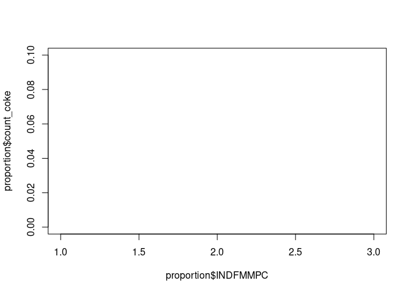

Exercises Prep
================
Dieter

-   <a href="#warning" id="toc-warning">Warning</a>
-   <a href="#national-health-and-nutrition-examination-survey"
    id="toc-national-health-and-nutrition-examination-survey">National
    Health and Nutrition Examination Survey</a>
    -   <a href="#preprocess-and-merge" id="toc-preprocess-and-merge">Preprocess
        and merge</a>

## Warning

**This document contains some of the solutions for the exercises. You’re
welcome to look over my shoulder but I encourage you to try the
exercises for yourself first.**

``` r
library(tidyverse)
```

    ## ── Attaching packages ─────────────────────────────────────── tidyverse 1.3.2 ──
    ## ✔ ggplot2 3.3.6     ✔ purrr   0.3.4
    ## ✔ tibble  3.1.8     ✔ dplyr   1.0.9
    ## ✔ tidyr   1.2.0     ✔ stringr 1.4.0
    ## ✔ readr   2.1.2     ✔ forcats 0.5.1
    ## ── Conflicts ────────────────────────────────────────── tidyverse_conflicts() ──
    ## ✖ dplyr::filter() masks stats::filter()
    ## ✖ dplyr::lag()    masks stats::lag()

## National Health and Nutrition Examination Survey

This is the [data
source](https://wwwn.cdc.gov/nchs/nhanes/continuousnhanes/default.aspx?BeginYear=2017).
See [here](https://wwwn.cdc.gov/Nchs/Nnyfs/Y_DEMO.htm) for more
information about the demographic variables.

### Preprocess and merge

``` r
library(haven)
demographics <- read_xpt('data/DEMO_J.XPT')
income <- read_xpt('data/INQ_J.XPT')
drugs <- read_xpt('data/DUQ_J.XPT')

drug_habits <- select(drugs, SEQN, DUQ200:DUQ280)
age<-select(demographics, SEQN, RIDAGEYR, RIDAGEMN)
finance <- select(income, SEQN, INDFMMPC,INDFMMPI, INQ300, IND235)
merged <- full_join(age, drug_habits, by='SEQN')
merged <- full_join(merged, finance, by='SEQN')
dim(merged)
```

    ## [1] 9254   25

Now, we need to do a bit of data cleaning. + The encoding for the
cocaine use can be found
[here](https://wwwn.cdc.gov/Nchs/Nhanes/2017-2018/DUQ_J.htm#DUQ250). +
The encoding for the income level can be found
[here](https://wwwn.cdc.gov/Nchs/Nhanes/2017-2018/INQ_J.htm).

``` r
merged <- mutate(merged, drug_used = case_when(DUQ200 == 1 ~ 1, TRUE ~ 0))
merged <- filter(merged, INDFMMPC<4)
```

Let’s group the data

``` r
grouped <- group_by(merged, INDFMMPC)
proportion <- summarise(grouped, count_coke = mean(drug_used, na.rm = TRUE))
plot(proportion$INDFMMPC, proportion$count_coke, type='b', ylim=c(0, 0.1))
```

<!-- -->
