Base Plotting
================
Dieter
2022-08-26

-   <a href="#notes" id="toc-notes">Notes</a>
-   <a href="#read-in-some-data" id="toc-read-in-some-data">Read in some
    data</a>
-   <a href="#basic-plot-type-lines-and-scatter"
    id="toc-basic-plot-type-lines-and-scatter">Basic plot type: lines and
    scatter</a>
    -   <a href="#scatter-plot" id="toc-scatter-plot">Scatter plot</a>
    -   <a href="#line-plot" id="toc-line-plot">Line plot</a>
    -   <a href="#setting-colors-and-markers"
        id="toc-setting-colors-and-markers">Setting colors and markers</a>
-   <a href="#basic-plot-type-histogram"
    id="toc-basic-plot-type-histogram">Basic plot type: histogram</a>
-   <a href="#basic-plot-type-barchart"
    id="toc-basic-plot-type-barchart">Basic plot type: barchart</a>
-   <a href="#basic-plot-type-boxplot"
    id="toc-basic-plot-type-boxplot">Basic plot type: boxplot</a>
    -   <a href="#setting-plot-parameters"
        id="toc-setting-plot-parameters">Setting plot parameters</a>
        -   <a href="#setting-the-inner-and-the-outer-margins"
            id="toc-setting-the-inner-and-the-outer-margins">Setting the inner and
            the outer margins</a>
        -   <a href="#plotting-subplots" id="toc-plotting-subplots">Plotting
            subplots</a>
    -   <a href="#changing-text-and-font"
        id="toc-changing-text-and-font">Changing text and font</a>
        -   <a href="#adding-labels" id="toc-adding-labels">Adding labels</a>
        -   <a href="#chaning-the-font-face" id="toc-chaning-the-font-face">Chaning
            the font face</a>
        -   <a href="#scaling-text-sizes" id="toc-scaling-text-sizes">Scaling text
            sizes</a>
        -   <a href="#example" id="toc-example">Example</a>
-   <a href="#adding-stuff-to-existing-plots"
    id="toc-adding-stuff-to-existing-plots">Adding stuff to existing
    plots</a>
    -   <a href="#adding-points-or-lines" id="toc-adding-points-or-lines">Adding
        points or lines</a>

## Notes

The base plotting system in R is somewhat dated (we’ll run into some
limits below). But it is still a powerfull way of creating plots
programmatically.

## Read in some data

``` r
body_data <- read.csv('data/body.csv')
head(body_data)
```

    ##   Biacromial Biiliac Bitrochanteric ChestDepth ChestDia ElbowDia WristDia
    ## 1       42.9    26.0           31.5       17.7     28.0     13.1     10.4
    ## 2       43.7    28.5           33.5       16.9     30.8     14.0     11.8
    ## 3       40.1    28.2           33.3       20.9     31.7     13.9     10.9
    ## 4       44.3    29.9           34.0       18.4     28.2     13.9     11.2
    ## 5       42.5    29.9           34.0       21.5     29.4     15.2     11.6
    ## 6       43.3    27.0           31.5       19.6     31.3     14.0     11.5
    ##   KneeDia AnkleDia Shoulder Chest Waist Navel  Hip Thigh Bicep Forearm Knee
    ## 1    18.8     14.1    106.2  89.5  71.5  74.5 93.5  51.5  32.5    26.0 34.5
    ## 2    20.6     15.1    110.5  97.0  79.0  86.5 94.8  51.5  34.4    28.0 36.5
    ## 3    19.7     14.1    115.1  97.5  83.2  82.9 95.0  57.3  33.4    28.8 37.0
    ## 4    20.9     15.0    104.5  97.0  77.8  78.8 94.0  53.0  31.0    26.2 37.0
    ## 5    20.7     14.9    107.5  97.5  80.0  82.5 98.5  55.4  32.0    28.4 37.7
    ## 6    18.8     13.9    119.8  99.9  82.5  80.1 95.3  57.5  33.0    28.0 36.6
    ##   Calf Ankle Wrist Age Weight Height Gender
    ## 1 36.5  23.5  16.5  21   65.6  174.0      1
    ## 2 37.5  24.5  17.0  23   71.8  175.3      1
    ## 3 37.3  21.9  16.9  28   80.7  193.5      1
    ## 4 34.8  23.0  16.6  23   72.6  186.5      1
    ## 5 38.6  24.4  18.0  22   78.8  187.2      1
    ## 6 36.1  23.5  16.9  21   74.8  181.5      1

``` r
dev.off() # Make sure all graphic parameters are reset
```

    ## null device 
    ##           1

## Basic plot type: lines and scatter

### Scatter plot

``` r
plot(body_data$KneeDia, body_data$Forearm)
```

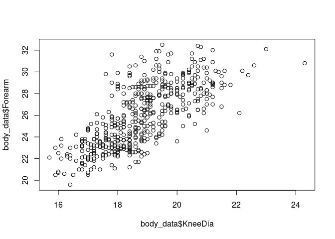<!-- -->

### Line plot

``` r
x <- 1:10
y <- runif(10) * x
plot(x, y, type= 'l')
```

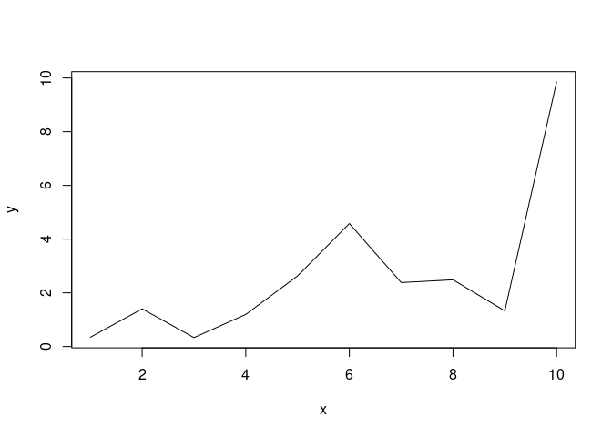<!-- -->

``` r
plot(x, y, type= 'b')
```

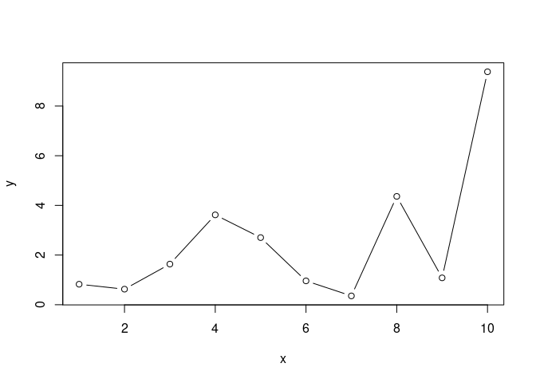<!-- -->

### Setting colors and markers

See
[here](http://www.sthda.com/english/wiki/r-plot-pch-symbols-the-different-point-shapes-available-in-r)
for a list of `pch` marker values. See
[here](http://www.stat.columbia.edu/~tzheng/files/Rcolor.pdf) for a list
of color names R knows out of the box.

``` r
x <- 1:10
y <- runif(10) * x
plot(x, y, type= 'b', pch=15, col ='red2')
```

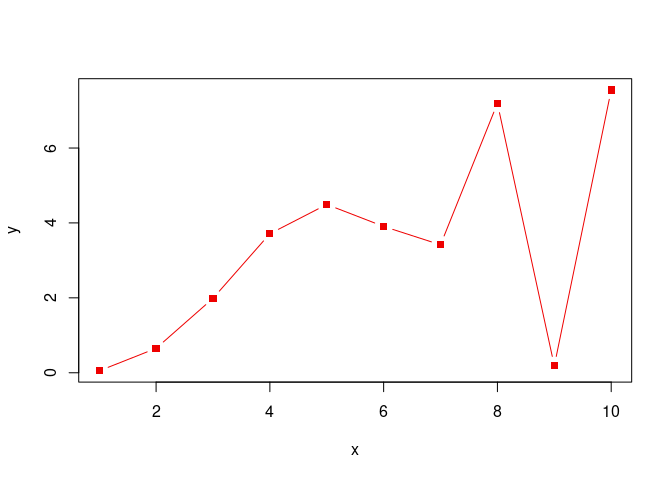<!-- --> R also
knows about hex colors.

``` r
x <- 1:10
y <- runif(10) * x
plot(x, y, type= 'b', pch=15, col ='#47B04E')
```

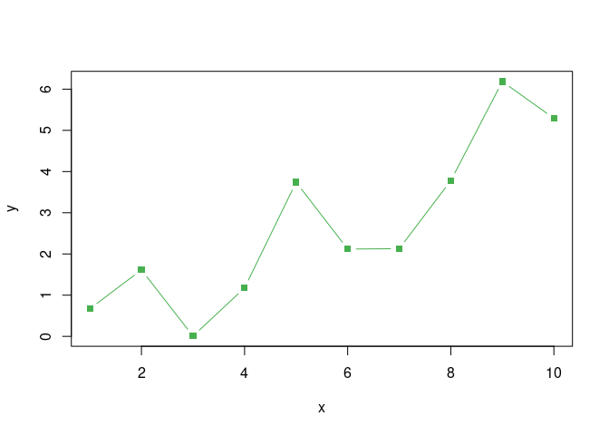<!-- --> \###
Handy Dandy: adding an alpha channel to a color

``` r
my_red <- adjustcolor( "red2", alpha.f = 0.25)
plot(body_data$KneeDia, body_data$Forearm, pch=16, col=my_red)
```

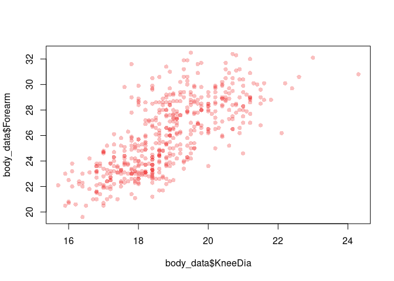<!-- -->

## Basic plot type: histogram

The `hist()` function has a number of interesting arguments:

-   main
-   xlab, ylab  
-   freq

``` r
hist(body_data$ChestDepth, freq = FALSE, main ='A normalized histogram')
```

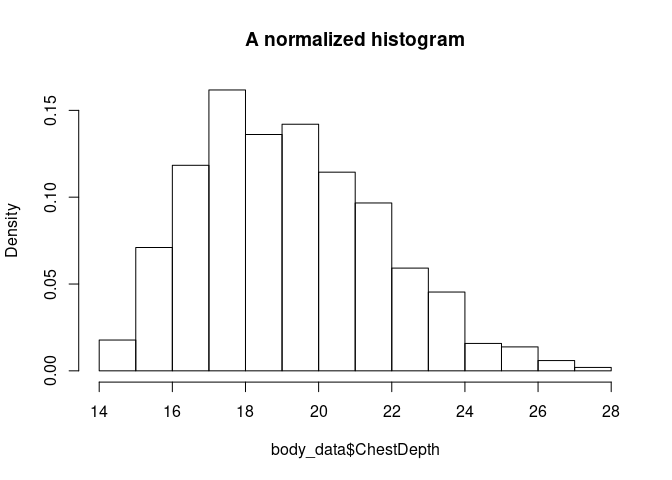<!-- -->

## Basic plot type: barchart

Some interesting arguments:

-   names.arg

``` r
labels <- c('a', 'b', 'c', 'd', 'e', 'f')
values <- c(1, 2, 3, 1, 2, 3)
barplot(values, names.arg = labels)
```

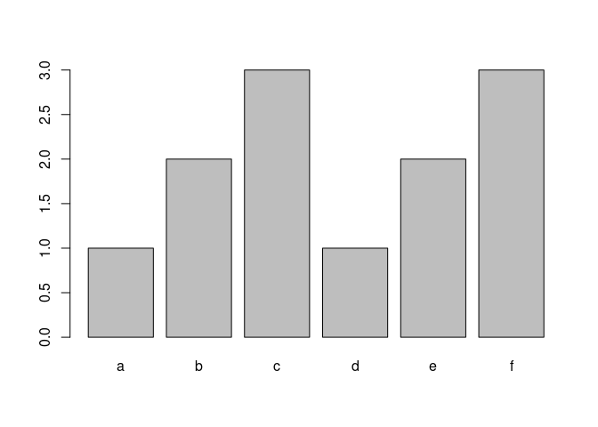<!-- -->

## Basic plot type: boxplot

``` r
body_data$AgeCat <- cut(body_data$Age, 10)
boxplot(body_data$Height ~ body_data$AgeCat)
```

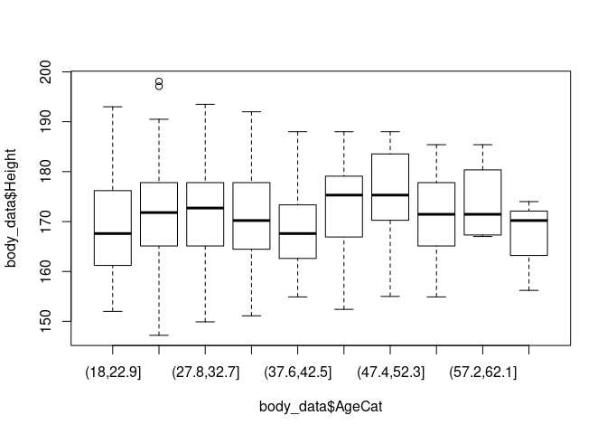<!-- -->

### Setting plot parameters

The function `par()` allows setting parameters for subsequent plots.
Most importantly, you can set the subsequent plots’ margins and number
of of subplots.

#### Setting the inner and the outer margins

You can find more information about inner and outer margins in R
[here](https://r-graph-gallery.com/74-margin-and-oma-cheatsheet.html).

``` r
par(oma=c(0,0,0,0))
x <- 1:10
y <- runif(10) * x
plot(x, y, type= 'l')
```

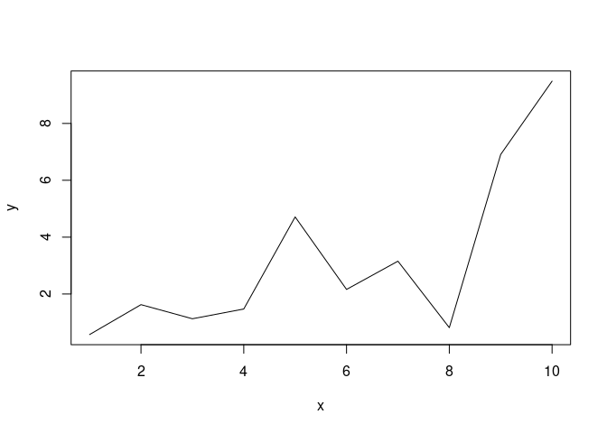<!-- -->

#### Plotting subplots

``` r
par(mfcol = c(1,2))
hist(body_data$ChestDepth, freq = FALSE, main ='A normalized histogram')
hist(body_data$Biiliac, freq = FALSE, main ='A normalized histogram')
```

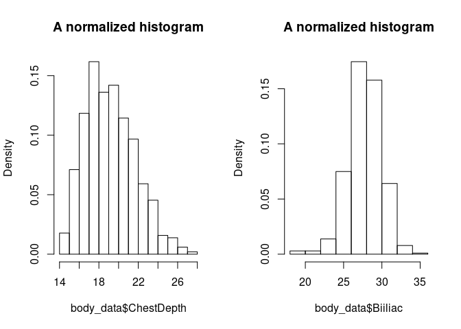<!-- -->

``` r
dev.off() # Make sure all graphic parameters are reset
```

    ## null device 
    ##           1

### Changing text and font

#### Adding labels

1.  axis labels: `xlab =`, `ylab =`
2.  subtitle: `sub =`
3.  title: `main =`

#### Chaning the font face

font face: `font =`

-   values: 1 (plain), 2 (bold), 3 (italic), or 4 (bold italic)

font family: `family =`

-   “serif”, “sans”, or “mono”

#### Scaling text sizes

1.  scaling all elements: `cex =`
2.  scaling axis labels: `cex.lab =`
3.  scaling subtitle: `cex.sub =`
4.  scaling tick mark labels: `cex.axis =`
5.  scaling title: `cex.main =`

#### Example

``` r
plot(x, y, type= 'b', family='serif', main='Some title', cex=1.25)
```

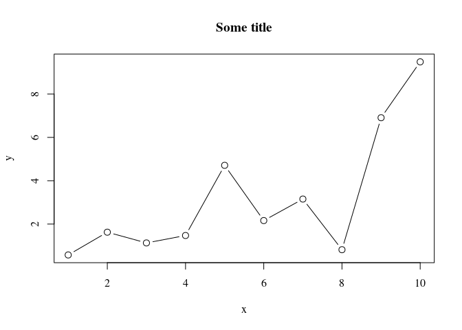<!-- -->

## Adding stuff to existing plots

### Adding points or lines

``` r
plot(body_data$KneeDia, body_data$Forearm)
points(c(18, 20, 22), c(22, 23, 24), type='b', col='red2')
points(c(18, 20, 22), c(23, 24, 25), col='blue2')
```

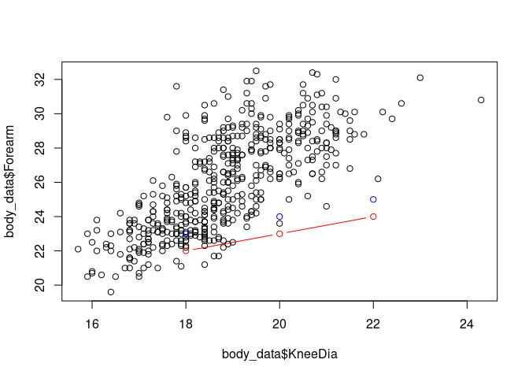<!-- --> \###
A limitation of R

This does cuts the range of the plot to the range of the first plotted
data!

``` r
my_blue <- adjustcolor( "navyblue", alpha.f = 0.25)
my_red <- adjustcolor( "indianred4", alpha.f = 0.25)

males <- body_data[body_data$Gender==0,]
females <- body_data[body_data$Gender==1,]

plot(females$Height, females$Weight, pch=15, main='Some graph', col=my_blue)
points(males$Height, males$Weight, pch=15, main='Some graph', col=my_red)
```

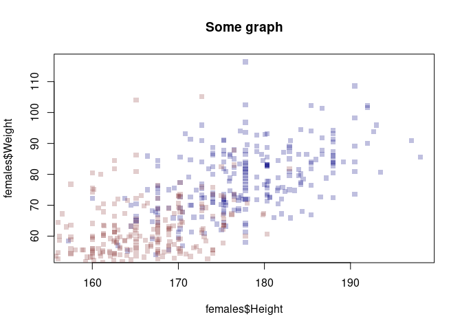<!-- --> This
solves the problem. But it’s a bit dissapointing that R does not update
the axes of the plots.

``` r
my_blue <- adjustcolor( "navyblue", alpha.f = 0.25)
my_red <- adjustcolor( "indianred4", alpha.f = 0.25)

xrange <- range(body_data$Height)
yrange <- range(body_data$Weight)

males <- body_data[body_data$Gender==0,]
females <- body_data[body_data$Gender==1,]

plot(females$Height, females$Weight, pch=15, main='Some graph', col=my_blue, xlim = xrange, ylim = yrange)
points(males$Height, males$Weight, pch=15, main='Some graph', col=my_red)
```

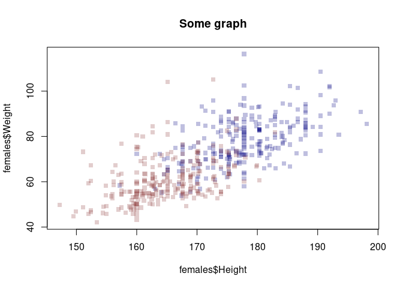<!-- --> \###
More bling

``` r
my_blue <- adjustcolor( "navyblue", alpha.f = 0.25)
my_red <- adjustcolor( "indianred4", alpha.f = 0.25)
my_orange <- adjustcolor( "orange", alpha.f = 0.5)

xrange <- range(body_data$Height)
yrange <- range(body_data$Weight)

males <- body_data[body_data$Gender==0,]
females <- body_data[body_data$Gender==1,]

plot(females$Height, females$Weight, pch=15, main='Some graph', col=my_blue, xlim = xrange, ylim = yrange, xlab='Height', ylab='Weight')
points(males$Height, males$Weight, pch=15, main='Some graph', col=my_red)

# Add a label to the graph
text(x=160, y=100, labels='A label', col="green2")
# Add a label to the graph
text(x=160, y=100, labels='A label', col="green2", font=3, family='serif')
# Add an arrow
arrows(x0=190, y0=100, x1=170,y1=60, length = 0.1, lwd=4, col=my_orange)
```

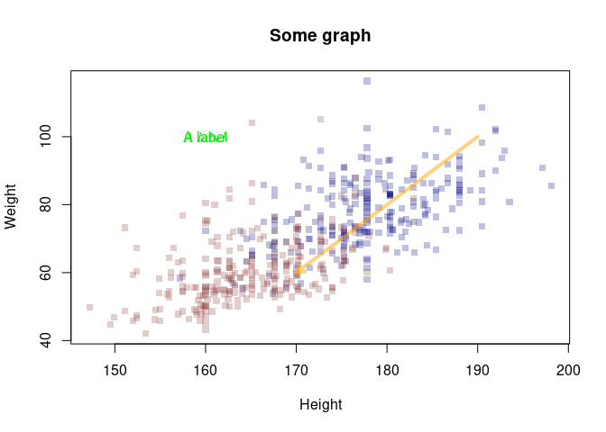<!-- --> \##
Adding legends

Adding legends can be done using the `legend()`. These are the main
arguments to the function:

-   x and y : the x and y co-ordinates to be used to position the legend
-   legend : the text of the legend

*You can set the location using a keyword, i.e. `x=` “bottomright”,
“bottom”, “bottomleft”, “left”, “topleft”, “top”, “topright”, “right” or
“center”.*

Apart from the location of the legend and the text to appear, **you have
to provide some parameters that set the legend’s markers**.

``` r
my_blue <- adjustcolor( "navyblue", alpha.f = 0.25)
my_red <- adjustcolor( "indianred4", alpha.f = 0.25)
my_orange <- adjustcolor( "orange", alpha.f = 0.5)

xrange <- range(body_data$Height)
yrange <- range(body_data$Weight)

males <- body_data[body_data$Gender==0,]
females <- body_data[body_data$Gender==1,]

plot(females$Height, females$Weight, pch=15, main='Some graph', col=my_blue, xlim = xrange, ylim = yrange, xlab='Height', ylab='Weight')
points(males$Height, males$Weight, pch=15, main='Some graph', col=my_red)

# Add the legend - notice: we have to set the colors and markers for the legend manually
legend('bottomright', c('Women', 'Men'), col = c(my_red, my_blue), pch=15)
```

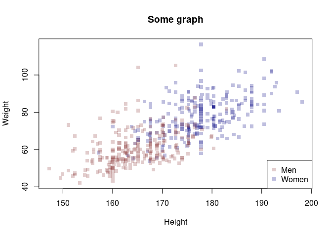<!-- -->
