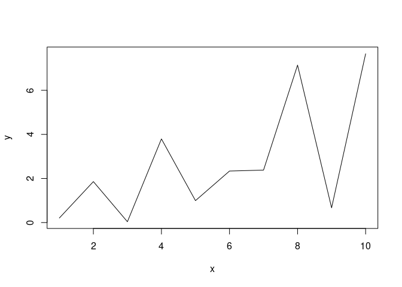
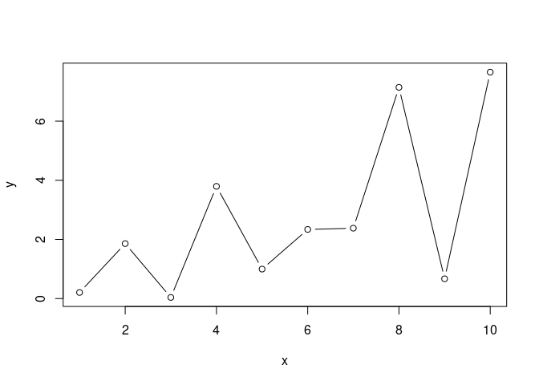
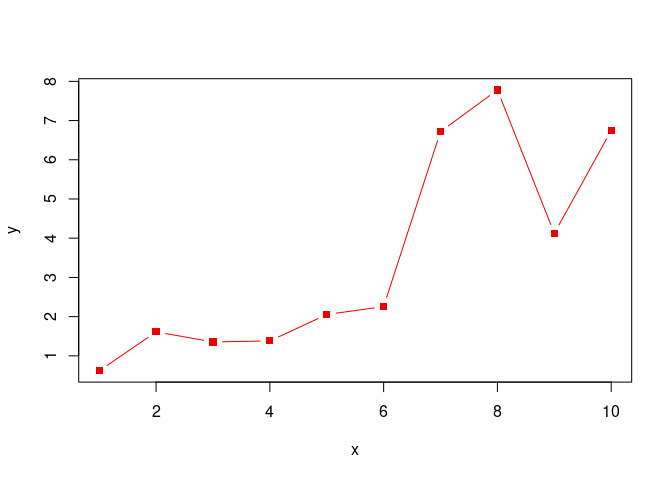
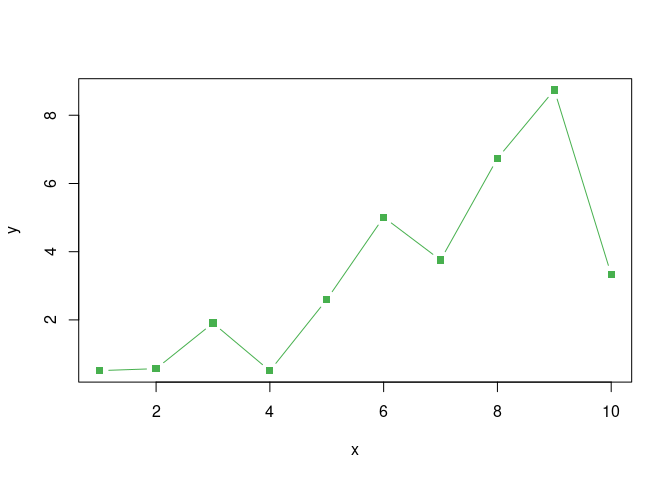
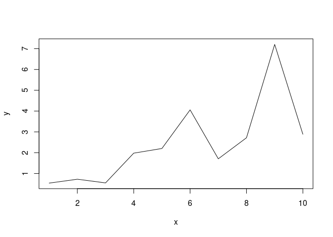
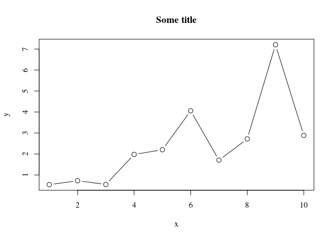

Base Plotting
================
Last Updated: 13, October, 2022 at 09:49

-   <a href="#notes" id="toc-notes">Notes</a>
-   <a href="#read-in-some-data" id="toc-read-in-some-data">Read in some
    data</a>
-   <a href="#basic-plot-type-lines-and-scatter"
    id="toc-basic-plot-type-lines-and-scatter">Basic plot type: lines and
    scatter</a>
    -   <a href="#scatter-plot" id="toc-scatter-plot">Scatter plot</a>
    -   <a href="#line-plot" id="toc-line-plot">Line plot</a>
    -   <a href="#setting-colors-and-markers"
        id="toc-setting-colors-and-markers">Setting colors and markers</a>
    -   <a href="#handy-dandy-adding-an-alpha-channel-to-a-color"
        id="toc-handy-dandy-adding-an-alpha-channel-to-a-color">Handy Dandy:
        adding an alpha channel to a color</a>
-   <a href="#basic-plot-type-histogram"
    id="toc-basic-plot-type-histogram">Basic plot type: histogram</a>
-   <a href="#basic-plot-type-barchart"
    id="toc-basic-plot-type-barchart">Basic plot type: barchart</a>
-   <a href="#basic-plot-type-boxplot"
    id="toc-basic-plot-type-boxplot">Basic plot type: boxplot</a>
    -   <a href="#setting-plot-parameters"
        id="toc-setting-plot-parameters">Setting plot parameters</a>
    -   <a href="#changing-text-and-font"
        id="toc-changing-text-and-font">Changing text and font</a>
-   <a href="#adding-stuff-to-existing-plots"
    id="toc-adding-stuff-to-existing-plots">Adding stuff to existing
    plots</a>
    -   <a href="#adding-points-or-lines" id="toc-adding-points-or-lines">Adding
        points or lines</a>
    -   <a href="#a-limitation-of-r" id="toc-a-limitation-of-r">A limitation of
        R</a>
    -   <a href="#more-bling" id="toc-more-bling">More bling</a>
-   <a href="#adding-legends" id="toc-adding-legends">Adding legends</a>
-   <a href="#exercises" id="toc-exercises">Exercises</a>

## Notes

The base plotting system in R is somewhat dated (we’ll run into some
limits below). But it is still a powerful way of creating plots
programmatically.

## Read in some data

This is the data
[source](http://jse.amstat.org/v11n2/datasets.heinz.html).

``` r
library(tidyverse)
```

    ## ── Attaching packages ─────────────────────────────────────── tidyverse 1.3.2 ──
    ## ✔ ggplot2 3.3.6     ✔ purrr   0.3.4
    ## ✔ tibble  3.1.8     ✔ dplyr   1.0.9
    ## ✔ tidyr   1.2.0     ✔ stringr 1.4.0
    ## ✔ readr   2.1.2     ✔ forcats 0.5.2
    ## ── Conflicts ────────────────────────────────────────── tidyverse_conflicts() ──
    ## ✖ dplyr::filter() masks stats::filter()
    ## ✖ dplyr::lag()    masks stats::lag()

``` r
body_data <- read_csv('data/body.csv')
```

    ## Rows: 507 Columns: 25
    ## ── Column specification ────────────────────────────────────────────────────────
    ## Delimiter: ","
    ## dbl (25): Biacromial, Biiliac, Bitrochanteric, ChestDepth, ChestDia, ElbowDi...
    ## 
    ## ℹ Use `spec()` to retrieve the full column specification for this data.
    ## ℹ Specify the column types or set `show_col_types = FALSE` to quiet this message.

``` r
head(body_data)
```

    ## # A tibble: 6 × 25
    ##   Biacromial Biiliac Bitrochan…¹ Chest…² Chest…³ Elbow…⁴ Wrist…⁵ KneeDia Ankle…⁶
    ##        <dbl>   <dbl>       <dbl>   <dbl>   <dbl>   <dbl>   <dbl>   <dbl>   <dbl>
    ## 1       42.9    26          31.5    17.7    28      13.1    10.4    18.8    14.1
    ## 2       43.7    28.5        33.5    16.9    30.8    14      11.8    20.6    15.1
    ## 3       40.1    28.2        33.3    20.9    31.7    13.9    10.9    19.7    14.1
    ## 4       44.3    29.9        34      18.4    28.2    13.9    11.2    20.9    15  
    ## 5       42.5    29.9        34      21.5    29.4    15.2    11.6    20.7    14.9
    ## 6       43.3    27          31.5    19.6    31.3    14      11.5    18.8    13.9
    ## # … with 16 more variables: Shoulder <dbl>, Chest <dbl>, Waist <dbl>,
    ## #   Navel <dbl>, Hip <dbl>, Thigh <dbl>, Bicep <dbl>, Forearm <dbl>,
    ## #   Knee <dbl>, Calf <dbl>, Ankle <dbl>, Wrist <dbl>, Age <dbl>, Weight <dbl>,
    ## #   Height <dbl>, Gender <dbl>, and abbreviated variable names ¹​Bitrochanteric,
    ## #   ²​ChestDepth, ³​ChestDia, ⁴​ElbowDia, ⁵​WristDia, ⁶​AnkleDia
    ## # ℹ Use `colnames()` to see all variable names

``` r
try(dev.off()) # Make sure all graphic parameters are reset
```

    ## null device 
    ##           1

## Basic plot type: lines and scatter

### Scatter plot

``` r
plot(body_data$KneeDia, body_data$Forearm)
```

<!-- -->

### Line plot

``` r
x <- 1:10
y <- runif(10) * x
plot(x, y, type= 'l')
```

<!-- -->

``` r
plot(x, y, type= 'b')
```

<!-- -->

### Setting colors and markers

See
[here](http://www.sthda.com/english/wiki/r-plot-pch-symbols-the-different-point-shapes-available-in-r)
for a list of `pch` marker values. See
[here](http://www.stat.columbia.edu/~tzheng/files/Rcolor.pdf) for a list
of color names R knows out of the box.

``` r
x <- 1:10
y <- runif(10) * x
plot(x, y, type= 'b', pch=15, col ='red2')
```

<!-- -->

R also knows about hex colors.

``` r
x <- 1:10
y <- runif(10) * x
plot(x, y, type= 'b', pch=15, col ='#47B04E')
```

<!-- -->

### Handy Dandy: adding an alpha channel to a color

``` r
my_red <- adjustcolor( "red2", alpha.f = 0.25)
plot(body_data$KneeDia, body_data$Forearm, pch=16, col=my_red)
```

<!-- -->

## Basic plot type: histogram

The `hist()` function has a number of interesting arguments:

-   main
-   xlab, ylab  
-   freq

``` r
hist(body_data$ChestDepth, freq = FALSE, main ='A normalized histogram')
```

<!-- -->

## Basic plot type: barchart

Some interesting arguments:

-   names.arg

``` r
labels <- c('a', 'b', 'c', 'd', 'e', 'f')
values <- c(1, 2, 3, 1, 2, 3)
barplot(values, names.arg = labels)
```

<!-- -->

## Basic plot type: boxplot

``` r
body_data$AgeCat <- cut(body_data$Age, 10)
boxplot(body_data$Height ~ body_data$AgeCat)
```

<!-- -->

### Setting plot parameters

The function `par()` allows setting parameters for subsequent plots.
Most importantly, you can set the subsequent plots’ margins and number
of of subplots.

#### Setting the inner and the outer margins

You can find more information about inner and outer margins in R
[here](https://r-graph-gallery.com/74-margin-and-oma-cheatsheet.html).

``` r
par(oma=c(0,0,0,0))
x <- 1:10
y <- runif(10) * x
plot(x, y, type= 'l')
```

<!-- -->

#### Plotting subplots

``` r
par(mfcol = c(1,2))
hist(body_data$ChestDepth, freq = FALSE, main ='A normalized histogram')
hist(body_data$Biiliac, freq = FALSE, main ='A normalized histogram')
```

<!-- -->

``` r
try(dev.off())  # Make sure all graphic parameters are reset
```

    ## null device 
    ##           1

### Changing text and font

#### Adding labels

1.  axis labels: `xlab =`, `ylab =`
2.  subtitle: `sub =`
3.  title: `main =`

#### Changing the font face

font face: `font =`

-   values: 1 (plain), 2 (bold), 3 (italic), or 4 (bold italic)

font family: `family =`

-   “serif”, “sans”, or “mono”

#### Scaling text sizes

1.  scaling all elements: `cex =`
2.  scaling axis labels: `cex.lab =`
3.  scaling subtitle: `cex.sub =`
4.  scaling tick mark labels: `cex.axis =`
5.  scaling title: `cex.main =`

#### Example

``` r
plot(x, y, type= 'b', family='serif', main='Some title', cex=1.25)
```

<!-- -->

## Adding stuff to existing plots

### Adding points or lines

``` r
plot(body_data$KneeDia, body_data$Forearm)
points(c(18, 20, 22), c(22, 23, 24), type='b', col='red2')
points(c(18, 20, 22), c(23, 24, 25), col='blue2')
```

<!-- -->

### A limitation of R

This does cuts the range of the plot to the range of the first plotted
data!

``` r
my_blue <- adjustcolor( "navyblue", alpha.f = 0.25)
my_red <- adjustcolor( "indianred4", alpha.f = 0.25)

males <- body_data[body_data$Gender==0,]
females <- body_data[body_data$Gender==1,]

plot(females$Height, females$Weight, pch=15, main='Some graph', col=my_blue)
points(males$Height, males$Weight, pch=15, main='Some graph', col=my_red)
```

<!-- -->

This solves the problem. But it’s a bit dissapointing that R does not
update the axes of the plots.

``` r
my_blue <- adjustcolor( "navyblue", alpha.f = 0.25)
my_red <- adjustcolor( "indianred4", alpha.f = 0.25)

xrange <- range(body_data$Height)
yrange <- range(body_data$Weight)

males <- body_data[body_data$Gender==0,]
females <- body_data[body_data$Gender==1,]

plot(females$Height, females$Weight, pch=15, main='Some graph', col=my_blue, xlim = xrange, ylim = yrange)
points(males$Height, males$Weight, pch=15, main='Some graph', col=my_red)
```

<!-- -->

### More bling

``` r
my_blue <- adjustcolor( "navyblue", alpha.f = 0.25)
my_red <- adjustcolor( "indianred4", alpha.f = 0.25)
my_orange <- adjustcolor( "orange", alpha.f = 0.5)

xrange <- range(body_data$Height)
yrange <- range(body_data$Weight)

males <- body_data[body_data$Gender==0,]
females <- body_data[body_data$Gender==1,]

plot(females$Height, females$Weight, pch=15, main='Some graph', col=my_blue, xlim = xrange, ylim = yrange, xlab='Height', ylab='Weight')
points(males$Height, males$Weight, pch=15, main='Some graph', col=my_red)

# Add a label to the graph
text(x=160, y=100, labels='A label', col="green2")
# Add a label to the graph
text(x=160, y=100, labels='A label', col="green2", font=3, family='serif')
# Add an arrow
arrows(x0=190, y0=100, x1=170,y1=60, length = 0.1, lwd=4, col=my_orange)
```

<!-- -->

# Adding legends

Adding legends can be done using the `legend()`. These are the main
arguments to the function:

-   x and y : the x and y co-ordinates to be used to position the legend
-   legend : the text of the legend

*You can set the location using a keyword, i.e. `x=` “bottomright”,
“bottom”, “bottomleft”, “left”, “topleft”, “top”, “topright”, “right” or
“center”.*

Apart from the location of the legend and the text to appear, **you have
to provide some parameters that set the legend’s markers**.

``` r
my_blue <- adjustcolor( "navyblue", alpha.f = 0.25)
my_red <- adjustcolor( "indianred4", alpha.f = 0.25)
my_orange <- adjustcolor( "orange", alpha.f = 0.5)

xrange <- range(body_data$Height)
yrange <- range(body_data$Weight)

males <- body_data[body_data$Gender==0,]
females <- body_data[body_data$Gender==1,]

plot(females$Height, females$Weight, pch=15, main='Some graph', col=my_blue, xlim = xrange, ylim = yrange, xlab='Height', ylab='Weight')
points(males$Height, males$Weight, pch=15, main='Some graph', col=my_red)

# Add the legend - notice: we have to set the colors and markers for the legend manually
legend('bottomright', c('Women', 'Men'), col = c(my_red, my_blue), pch=15)
```

<!-- -->

# Exercises

Use these data:

``` r
body_data <- read_csv('data/body.csv')
```

    ## Rows: 507 Columns: 25
    ## ── Column specification ────────────────────────────────────────────────────────
    ## Delimiter: ","
    ## dbl (25): Biacromial, Biiliac, Bitrochanteric, ChestDepth, ChestDia, ElbowDi...
    ## 
    ## ℹ Use `spec()` to retrieve the full column specification for this data.
    ## ℹ Specify the column types or set `show_col_types = FALSE` to quiet this message.

-   Create a histogram of people’s height, split out by gender. Overlay
    the histogram for women and men (use an alpha setting to make both
    of them visible). Make sure the histogram shows all data and is not
    cut off.

-   Plot a bar chart of people’s height. Use 10-year age bins on the
    x-axis.

-   Create a cumulative histogram of people’s height (or any other
    variable).
