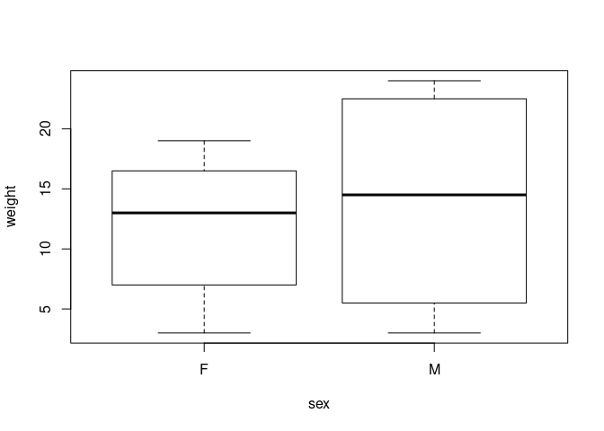
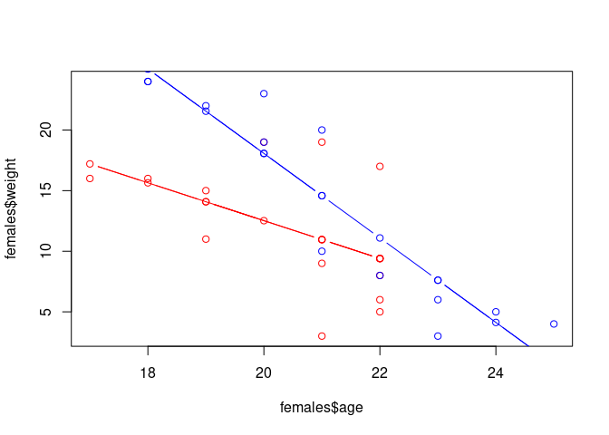

ANCOVA
================
Last Updated: 13, November, 2022 at 15:28

-   <a href="#one-way-ancova" id="toc-one-way-ancova">One-way ancova</a>
-   <a href="#ancova" id="toc-ancova">Ancova</a>
-   <a href="#compare-models" id="toc-compare-models">Compare models</a>

``` r
library(tidyverse)
```

    ## ── Attaching packages ─────────────────────────────────────── tidyverse 1.3.2 ──
    ## ✔ ggplot2 3.3.6     ✔ purrr   0.3.4
    ## ✔ tibble  3.1.8     ✔ dplyr   1.0.9
    ## ✔ tidyr   1.2.0     ✔ stringr 1.4.0
    ## ✔ readr   2.1.2     ✔ forcats 0.5.2
    ## ── Conflicts ────────────────────────────────────────── tidyverse_conflicts() ──
    ## ✖ dplyr::filter() masks stats::filter()
    ## ✖ dplyr::lag()    masks stats::lag()

``` r
library(readxl)
```

``` r
data <- read_excel('data/vik_table_17_2.xlsx')
```

# One-way ancova

``` r
model1 <- lm(weight ~ sex, data = data)
summary(model1)
```

    ## 
    ## Call:
    ## lm(formula = weight ~ sex, data = data)
    ## 
    ## Residuals:
    ##    Min     1Q Median     3Q    Max 
    ## -11.00  -6.25   1.00   6.25  10.00 
    ## 
    ## Coefficients:
    ##             Estimate Std. Error t value Pr(>|t|)    
    ## (Intercept)   12.000      2.114   5.676 1.04e-05 ***
    ## sexM           2.000      2.990   0.669    0.511    
    ## ---
    ## Signif. codes:  0 '***' 0.001 '**' 0.01 '*' 0.05 '.' 0.1 ' ' 1
    ## 
    ## Residual standard error: 7.324 on 22 degrees of freedom
    ## Multiple R-squared:  0.01993,    Adjusted R-squared:  -0.02461 
    ## F-statistic: 0.4475 on 1 and 22 DF,  p-value: 0.5105

``` r
boxplot(weight ~ sex, data = data)
```

<!-- -->

# Ancova

``` r
model2 <- lm(weight ~ sex * age, data = data)
summary(model2)
```

    ## 
    ## Call:
    ## lm(formula = weight ~ sex * age, data = data)
    ## 
    ## Residuals:
    ##    Min     1Q Median     3Q    Max 
    ## -7.959 -3.085 -1.038  1.540  8.041 
    ## 
    ## Coefficients:
    ##             Estimate Std. Error t value Pr(>|t|)  
    ## (Intercept)  43.7449    15.9580   2.741   0.0126 *
    ## sexM         44.0326    20.2885   2.170   0.0422 *
    ## age          -1.5612     0.7822  -1.996   0.0598 .
    ## sexM:age     -1.9243     0.9791  -1.965   0.0634 .
    ## ---
    ## Signif. codes:  0 '***' 0.001 '**' 0.01 '*' 0.05 '.' 0.1 ' ' 1
    ## 
    ## Residual standard error: 4.471 on 20 degrees of freedom
    ## Multiple R-squared:  0.668,  Adjusted R-squared:  0.6181 
    ## F-statistic: 13.41 on 3 and 20 DF,  p-value: 5.036e-05

``` r
model.matrix(model2)
```

    ##    (Intercept) sexM age sexM:age
    ## 1            1    0  21        0
    ## 2            1    0  22        0
    ## 3            1    0  22        0
    ## 4            1    0  22        0
    ## 5            1    0  21        0
    ## 6            1    0  19        0
    ## 7            1    0  20        0
    ## 8            1    0  19        0
    ## 9            1    0  18        0
    ## 10           1    0  17        0
    ## 11           1    0  21        0
    ## 12           1    0  22        0
    ## 13           1    1  23       23
    ## 14           1    1  24       24
    ## 15           1    1  25       25
    ## 16           1    1  23       23
    ## 17           1    1  22       22
    ## 18           1    1  21       21
    ## 19           1    1  18       18
    ## 20           1    1  18       18
    ## 21           1    1  19       19
    ## 22           1    1  20       20
    ## 23           1    1  20       20
    ## 24           1    1  21       21
    ## attr(,"assign")
    ## [1] 0 1 2 3
    ## attr(,"contrasts")
    ## attr(,"contrasts")$sex
    ## [1] "contr.treatment"

``` r
females <- filter(data, sex == 'F')
males <- filter(data, sex == 'M')

coefs <- coefficients(model2)

prediction_females <- coefs[1] + coefs[3]  * females$age 
prediction_males <- coefs[1] + coefs[2] +coefs[3]  * males$age + coefs[4] * males$age 

plot(females$age, females$weight, col='red', xlim = range(data$age), ylim = range(data$weight))
points(females$age, prediction_females, type='b', col='red')

points(males$age, males$weight, col='blue')
points(males$age, prediction_males, type='b', col='blue')
```

<!-- -->

``` r
# To double check my equations
# points(data$age, model2$fitted.values, col='green')
# my_predications <- c(prediction_females, prediction_males)
# r_predications <- unname(model2$fitted.values)
```

# Compare models

``` r
anova(model1, model2)
```

    ## Analysis of Variance Table
    ## 
    ## Model 1: weight ~ sex
    ## Model 2: weight ~ sex * age
    ##   Res.Df     RSS Df Sum of Sq      F    Pr(>F)    
    ## 1     22 1180.00                                  
    ## 2     20  399.78  2    780.22 19.516 1.993e-05 ***
    ## ---
    ## Signif. codes:  0 '***' 0.001 '**' 0.01 '*' 0.05 '.' 0.1 ' ' 1
