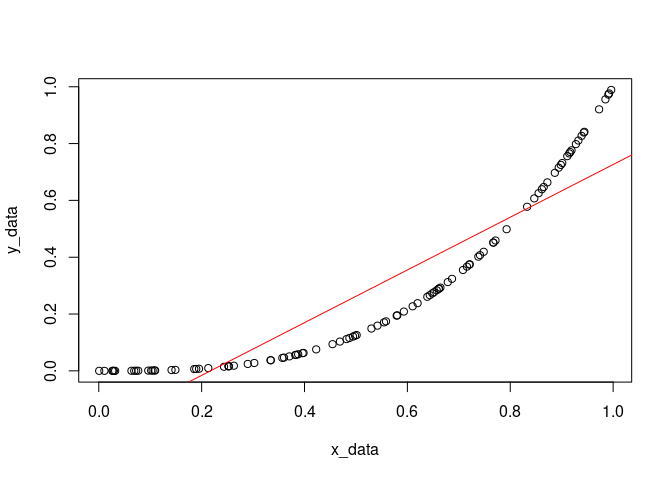
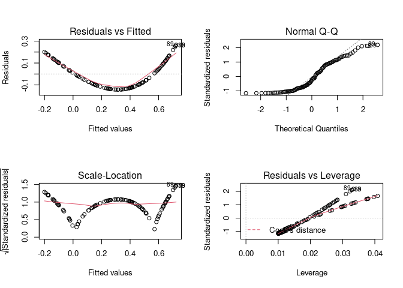
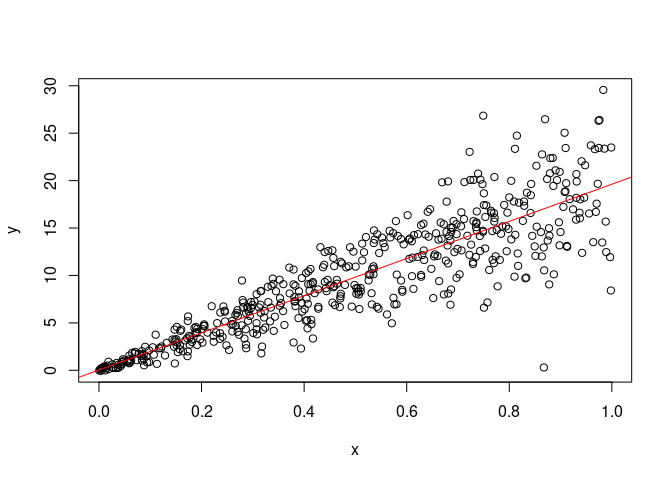
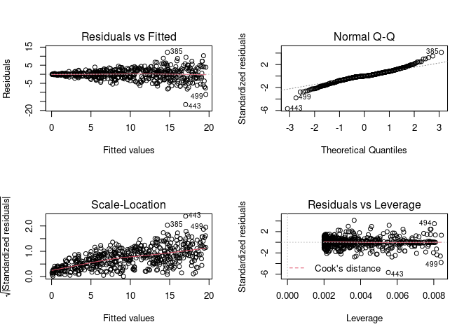

Assumptions
================
Last Updated: 16, September, 2023 at 18:17

- <a href="#read-some-data" id="toc-read-some-data">Read some data</a>
- <a href="#assumption-1-linearity-of-model"
  id="toc-assumption-1-linearity-of-model">Assumption 1: Linearity of
  model</a>
  - <a href="#example-1" id="toc-example-1">Example 1</a>
  - <a href="#example-2" id="toc-example-2">Example 2</a>
  - <a href="#example-3" id="toc-example-3">Example 3</a>
  - <a href="#example-4" id="toc-example-4">Example 4</a>
- <a href="#assumption-2-normal-distribution-of-the-errors"
  id="toc-assumption-2-normal-distribution-of-the-errors">Assumption 2:
  normal distribution of the errors</a>
- <a href="#assumption-3-homoscedasticity"
  id="toc-assumption-3-homoscedasticity">Assumption 3:
  Homoscedasticity</a>
- <a href="#more-examples" id="toc-more-examples">More examples</a>
  - <a href="#gambling" id="toc-gambling">Gambling</a>

# Read some data

``` r
library(tidyverse)
```

    ## ── Attaching core tidyverse packages ──────────────────────── tidyverse 2.0.0 ──
    ## ✔ dplyr     1.1.0     ✔ readr     2.1.4
    ## ✔ forcats   1.0.0     ✔ stringr   1.5.0
    ## ✔ ggplot2   3.4.1     ✔ tibble    3.2.0
    ## ✔ lubridate 1.9.2     ✔ tidyr     1.3.0
    ## ✔ purrr     1.0.1     
    ## ── Conflicts ────────────────────────────────────────── tidyverse_conflicts() ──
    ## ✖ dplyr::filter() masks stats::filter()
    ## ✖ dplyr::lag()    masks stats::lag()
    ## ℹ Use the ]8;;http://conflicted.r-lib.org/conflicted package]8;; to force all conflicts to become errors

``` r
body_data <-read_csv('data/body.csv')
```

    ## Rows: 507 Columns: 25
    ## ── Column specification ────────────────────────────────────────────────────────
    ## Delimiter: ","
    ## dbl (25): Biacromial, Biiliac, Bitrochanteric, ChestDepth, ChestDia, ElbowDi...
    ## 
    ## ℹ Use `spec()` to retrieve the full column specification for this data.
    ## ℹ Specify the column types or set `show_col_types = FALSE` to quiet this message.

``` r
vik_data <-read_csv('data/vik_table_9_2.csv')
```

    ## Rows: 12 Columns: 4
    ## ── Column specification ────────────────────────────────────────────────────────
    ## Delimiter: ","
    ## dbl (4): Person, Y, X1, X2
    ## 
    ## ℹ Use `spec()` to retrieve the full column specification for this data.
    ## ℹ Specify the column types or set `show_col_types = FALSE` to quiet this message.

# Assumption 1: Linearity of model

## Example 1

``` r
plot(vik_data$X1, vik_data$Y)
```

<!-- -->

``` r
model <- lm(Y ~ X1, data = vik_data)
plot(fitted(model), resid(model))
```

<!-- -->

``` r
par(mfrow = c(2, 2))  # Split the plotting panel into a 2 x 2 grid
plot(model)
```

<!-- -->

## Example 2

``` r
x_data <- runif(100)
y_data <- x_data^3
fake <- tibble(x_data=x_data, y_data = y_data)
model <- lm(y_data ~ x_data, data = fake)
par(mfrow = c(1, 1)) 
plot(x_data, y_data)
abline(model, col='red')
```

<!-- -->

``` r
model <- lm(y_data ~ x_data, data = fake)
par(mfrow = c(2, 2))  # Split the plotting panel into a 2 x 2 grid
plot(model)
```

<!-- -->

``` r
par(mfrow = c(1, 1)) 
```

## Example 3

``` r
x1_data <- runif(100)
x2_data <- runif(100)
y_data <- x1_data^3 + x2_data^3
fake <- tibble(x1_data=x1_data,x2_data=x2_data, y_data = y_data)
model <- lm(y_data ~ x1_data + x2_data, data = fake)
par(mfrow = c(2, 2))  # Split the plotting panel into a 2 x 2 grid
plot(model)
```

<!-- -->

``` r
par(mfrow = c(1, 1))
```

## Example 4

``` r
model <- lm(Weight ~ Height, data = body_data)
par(mfrow = c(2, 2))  # Split the plotting panel into a 2 x 2 grid
plot(model)
```

<!-- -->

``` r
par(mfrow = c(1, 1)) 
```

# Assumption 2: normal distribution of the errors

``` r
model <- lm(Bicep ~ Shoulder, data = body_data)
residuals <- resid(model)
hist(residuals, 50)
```

<!-- -->

``` r
par(mfrow = c(2, 2))  # Split the plotting panel into a 2 x 2 grid
plot(model)
```

<!-- -->

``` r
par(mfrow = c(1, 1)) 
```

# Assumption 3: Homoscedasticity

``` r
n<-500
errors <-rnorm(n, sd=seq(0.1,5, length.out=n))
x<-runif(n)
x<-sort(x)
y<- (20 * x) + errors
plot(x, y)
```

<!-- -->

``` r
fake<-tibble(x=x, y=y)
model <- lm(y~x, data = fake) 
```

The model is still fitted properly!

``` r
summary(model)
```

    ## 
    ## Call:
    ## lm(formula = y ~ x, data = fake)
    ## 
    ## Residuals:
    ##      Min       1Q   Median       3Q      Max 
    ## -12.1884  -1.0699   0.0775   1.3305  10.0144 
    ## 
    ## Coefficients:
    ##             Estimate Std. Error t value Pr(>|t|)    
    ## (Intercept)  0.03199    0.25310   0.126    0.899    
    ## x           19.68554    0.44150  44.588   <2e-16 ***
    ## ---
    ## Signif. codes:  0 '***' 0.001 '**' 0.01 '*' 0.05 '.' 0.1 ' ' 1
    ## 
    ## Residual standard error: 2.806 on 498 degrees of freedom
    ## Multiple R-squared:  0.7997, Adjusted R-squared:  0.7993 
    ## F-statistic:  1988 on 1 and 498 DF,  p-value: < 2.2e-16

``` r
plot(x, y)
abline(model, col='red')
```

<!-- -->

``` r
par(mfrow = c(2, 2))  # Split the plotting panel into a 2 x 2 grid
plot(model)
```

<!-- -->

``` r
par(mfrow = c(1, 1)) 
```

# More examples

## Gambling

The teengamb data frame has 47 rows and 5 columns. A survey was
conducted to study teenage gambling in Britain. This data frame contains
the following columns:

- sex 0=male, 1=female
- Socioeconomic status score based on parents’ occupation
- Income in pounds per week
- Verbal score in words out of 12 correctly defined
- Gamble expenditure on gambling in pounds per year

``` r
library(faraway)
data <- teengamb
head(data)
```

    ##   sex status income verbal gamble
    ## 1   1     51   2.00      8    0.0
    ## 2   1     28   2.50      8    0.0
    ## 3   1     37   2.00      6    0.0
    ## 4   1     28   7.00      4    7.3
    ## 5   1     65   2.00      8   19.6
    ## 6   1     61   3.47      6    0.1

``` r
model<- lm(gamble~income, data=data)
```

``` r
plot(data$income, data$gamble)
```

<!-- -->

``` r
summary(model)
```

    ## 
    ## Call:
    ## lm(formula = gamble ~ income, data = data)
    ## 
    ## Residuals:
    ##     Min      1Q  Median      3Q     Max 
    ## -46.020 -11.874  -3.757  11.934 107.120 
    ## 
    ## Coefficients:
    ##             Estimate Std. Error t value Pr(>|t|)    
    ## (Intercept)   -6.325      6.030  -1.049      0.3    
    ## income         5.520      1.036   5.330 3.05e-06 ***
    ## ---
    ## Signif. codes:  0 '***' 0.001 '**' 0.01 '*' 0.05 '.' 0.1 ' ' 1
    ## 
    ## Residual standard error: 24.95 on 45 degrees of freedom
    ## Multiple R-squared:  0.387,  Adjusted R-squared:  0.3734 
    ## F-statistic: 28.41 on 1 and 45 DF,  p-value: 3.045e-06

``` r
par(mfrow = c(2, 2))  # Split the plotting panel into a 2 x 2 grid
plot(model)
```

<!-- -->

``` r
par(mfrow = c(1, 1)) 
```

``` r
plot(data$status,data$gamble)
```

<!-- -->
