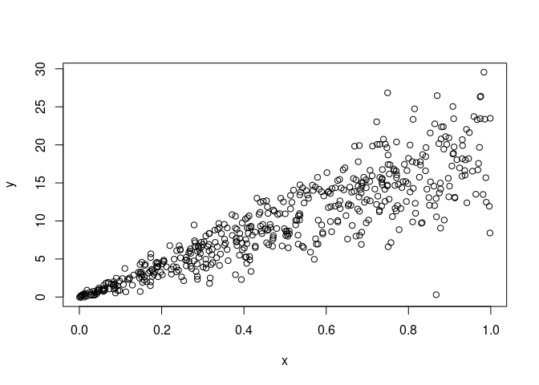

Assumptions
================
Last Updated: 01, November, 2022 at 08:26

-   <a href="#read-some-data" id="toc-read-some-data">Read some data</a>
-   <a href="#assumption-1-linearity-of-model"
    id="toc-assumption-1-linearity-of-model">Assumption 1: Linearity of
    model</a>
    -   <a href="#example-1" id="toc-example-1">Example 1</a>
    -   <a href="#example-2" id="toc-example-2">Example 2</a>
    -   <a href="#example-3" id="toc-example-3">Example 3</a>
    -   <a href="#example-4" id="toc-example-4">Example 4</a>
-   <a href="#assumption-2-normal-distribution-of-the-errors"
    id="toc-assumption-2-normal-distribution-of-the-errors">Assumption 2:
    normal distribution of the errors</a>
-   <a href="#assumption-3-homoscedasticity"
    id="toc-assumption-3-homoscedasticity">Assumption 3:
    Homoscedasticity</a>
-   <a href="#assumption-4-little-multicollinearity"
    id="toc-assumption-4-little-multicollinearity">Assumption 4: Little
    multicollinearity</a>

# Read some data

``` r
library(tidyverse)
```

    ## ── Attaching packages ─────────────────────────────────────── tidyverse 1.3.2 ──
    ## ✔ ggplot2 3.3.6     ✔ purrr   0.3.4
    ## ✔ tibble  3.1.8     ✔ dplyr   1.0.9
    ## ✔ tidyr   1.2.0     ✔ stringr 1.4.0
    ## ✔ readr   2.1.2     ✔ forcats 0.5.2
    ## ── Conflicts ────────────────────────────────────────── tidyverse_conflicts() ──
    ## ✖ dplyr::filter() masks stats::filter()
    ## ✖ dplyr::lag()    masks stats::lag()

``` r
body_data <-read_csv('data/body.csv')
```

    ## Rows: 507 Columns: 25
    ## ── Column specification ────────────────────────────────────────────────────────
    ## Delimiter: ","
    ## dbl (25): Biacromial, Biiliac, Bitrochanteric, ChestDepth, ChestDia, ElbowDi...
    ## 
    ## ℹ Use `spec()` to retrieve the full column specification for this data.
    ## ℹ Specify the column types or set `show_col_types = FALSE` to quiet this message.

``` r
vik_data <-read_csv('data/vik_table_9_2.csv')
```

    ## Rows: 12 Columns: 4
    ## ── Column specification ────────────────────────────────────────────────────────
    ## Delimiter: ","
    ## dbl (4): Person, Y, X1, X2
    ## 
    ## ℹ Use `spec()` to retrieve the full column specification for this data.
    ## ℹ Specify the column types or set `show_col_types = FALSE` to quiet this message.

# Assumption 1: Linearity of model

## Example 1

``` r
model <- lm(Y ~ X1, data = vik_data)
plot(fitted(model), resid(model))
```

<!-- -->

``` r
par(mfrow = c(2, 2))  # Split the plotting panel into a 2 x 2 grid
plot(model)
```

<!-- -->

## Example 2

``` r
x_data <- runif(100)
y_data <- x_data^3
fake <- tibble(x_data=x_data, y_data = y_data)
model <- lm(y_data ~ x_data, data = fake)
par(mfrow = c(1, 1)) 
plot(x_data, y_data)
abline(model, col='red')
```

<!-- -->

``` r
model <- lm(y_data ~ x_data, data = fake)
par(mfrow = c(2, 2))  # Split the plotting panel into a 2 x 2 grid
plot(model)
```

<!-- -->

``` r
par(mfrow = c(1, 1)) 
```

## Example 3

``` r
x1_data <- runif(100)
x2_data <- runif(100)
y_data <- x1_data^3 + x2_data^3
fake <- tibble(x1_data=x1_data,x2_data=x2_data, y_data = y_data)
model <- lm(y_data ~ x1_data + x2_data, data = fake)
par(mfrow = c(2, 2))  # Split the plotting panel into a 2 x 2 grid
plot(model)
```

<!-- -->

``` r
par(mfrow = c(1, 1))
```

## Example 4

``` r
model <- lm(Weight ~ Height, data = body_data)
par(mfrow = c(2, 2))  # Split the plotting panel into a 2 x 2 grid
plot(model)
```

<!-- -->

``` r
par(mfrow = c(1, 1)) 
```

# Assumption 2: normal distribution of the errors

``` r
model <- lm(Bicep ~ Shoulder, data = body_data)
residuals <- resid(model)
hist(residuals, 50)
```

<!-- -->

``` r
par(mfrow = c(2, 2))  # Split the plotting panel into a 2 x 2 grid
plot(model)
```

<!-- -->

``` r
par(mfrow = c(1, 1)) 
```

# Assumption 3: Homoscedasticity

``` r
n<-500
errors <-rnorm(n, sd=seq(0.1,5, length.out=n))
x<-runif(n)
x<-sort(x)
y<- (20 * x) + errors
plot(x, y)
```

<!-- -->

``` r
fake<-tibble(x=x, y=y)
model <- lm(y~x, data = fake) 
```

The model is still fitted properly!

``` r
summary(model)
```

    ## 
    ## Call:
    ## lm(formula = y ~ x, data = fake)
    ## 
    ## Residuals:
    ##      Min       1Q   Median       3Q      Max 
    ## -10.5364  -1.3715   0.0084   1.3069  15.1510 
    ## 
    ## Coefficients:
    ##              Estimate Std. Error t value Pr(>|t|)    
    ## (Intercept) -0.005425   0.270780   -0.02    0.984    
    ## x           19.843104   0.469699   42.25   <2e-16 ***
    ## ---
    ## Signif. codes:  0 '***' 0.001 '**' 0.01 '*' 0.05 '.' 0.1 ' ' 1
    ## 
    ## Residual standard error: 3.009 on 498 degrees of freedom
    ## Multiple R-squared:  0.7818, Adjusted R-squared:  0.7814 
    ## F-statistic:  1785 on 1 and 498 DF,  p-value: < 2.2e-16

``` r
plot(x, y)
abline(model, col='red')
```

<!-- -->

``` r
par(mfrow = c(2, 2))  # Split the plotting panel into a 2 x 2 grid
plot(model)
```

<!-- -->

``` r
par(mfrow = c(1, 1)) 
```

# Assumption 4: Little multicollinearity

``` r
partial<-select(body_data, Chest, Waist, Forearm, Bicep)
pairs(partial)
```

<!-- -->
