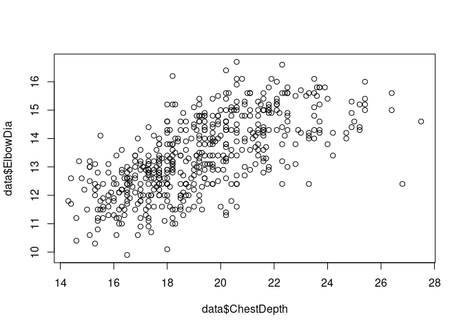
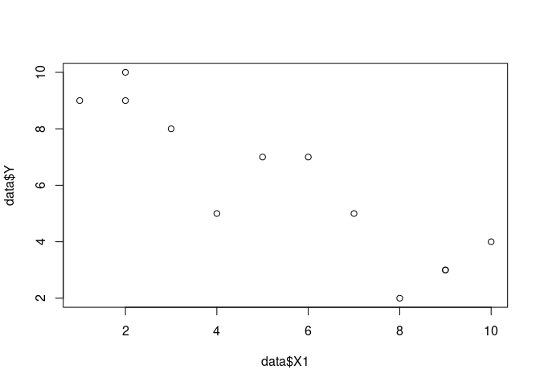
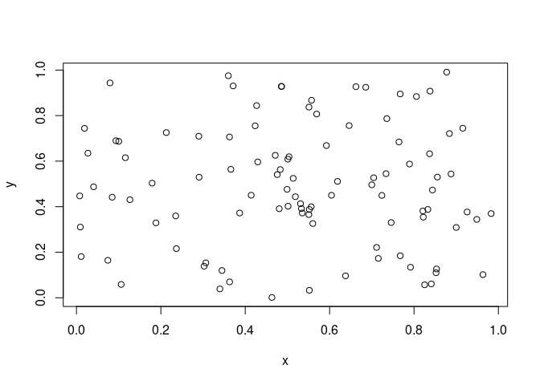

Correlation
================
Last Updated: 20, October, 2022 at 08:53

-   <a href="#correlation" id="toc-correlation">Correlation</a>

## Correlation

``` r
library(tidyverse)
```

    ## ── Attaching packages ─────────────────────────────────────── tidyverse 1.3.2 ──
    ## ✔ ggplot2 3.3.6     ✔ purrr   0.3.4
    ## ✔ tibble  3.1.8     ✔ dplyr   1.0.9
    ## ✔ tidyr   1.2.0     ✔ stringr 1.4.0
    ## ✔ readr   2.1.2     ✔ forcats 0.5.2
    ## ── Conflicts ────────────────────────────────────────── tidyverse_conflicts() ──
    ## ✖ dplyr::filter() masks stats::filter()
    ## ✖ dplyr::lag()    masks stats::lag()

``` r
data <- read_csv('data/body.csv')
```

    ## Rows: 507 Columns: 25
    ## ── Column specification ────────────────────────────────────────────────────────
    ## Delimiter: ","
    ## dbl (25): Biacromial, Biiliac, Bitrochanteric, ChestDepth, ChestDia, ElbowDi...
    ## 
    ## ℹ Use `spec()` to retrieve the full column specification for this data.
    ## ℹ Specify the column types or set `show_col_types = FALSE` to quiet this message.

``` r
cor.test(data$ChestDepth, data$ElbowDia)
```

    ## 
    ##  Pearson's product-moment correlation
    ## 
    ## data:  data$ChestDepth and data$ElbowDia
    ## t = 20.022, df = 505, p-value < 2.2e-16
    ## alternative hypothesis: true correlation is not equal to 0
    ## 95 percent confidence interval:
    ##  0.6137075 0.7111244
    ## sample estimates:
    ##       cor 
    ## 0.6652377

``` r
plot(data$ChestDepth, data$ElbowDia)
```

<!-- -->

``` r
data <- read_csv('data/vik_table_9_2.csv')
```

    ## Rows: 12 Columns: 4
    ## ── Column specification ────────────────────────────────────────────────────────
    ## Delimiter: ","
    ## dbl (4): Person, Y, X1, X2
    ## 
    ## ℹ Use `spec()` to retrieve the full column specification for this data.
    ## ℹ Specify the column types or set `show_col_types = FALSE` to quiet this message.

``` r
cor.test(data$X1, data$Y)
```

    ## 
    ##  Pearson's product-moment correlation
    ## 
    ## data:  data$X1 and data$Y
    ## t = -6.4208, df = 10, p-value = 7.627e-05
    ## alternative hypothesis: true correlation is not equal to 0
    ## 95 percent confidence interval:
    ##  -0.9710564 -0.6661805
    ## sample estimates:
    ##        cor 
    ## -0.8971007

``` r
plot(data$X1, data$Y)
```

<!-- -->

``` r
x <-runif(100)
y <-runif(100)
cor.test(x, y)
```

    ## 
    ##  Pearson's product-moment correlation
    ## 
    ## data:  x and y
    ## t = -0.15971, df = 98, p-value = 0.8734
    ## alternative hypothesis: true correlation is not equal to 0
    ## 95 percent confidence interval:
    ##  -0.2118781  0.1808598
    ## sample estimates:
    ##         cor 
    ## -0.01613134

``` r
plot(x, y)
```

<!-- -->
