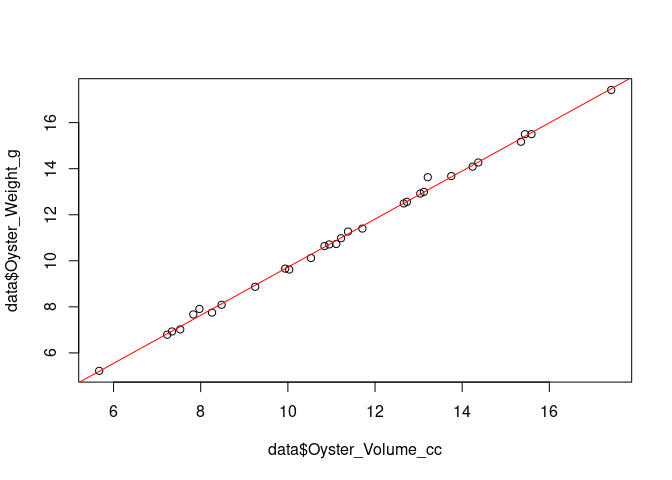
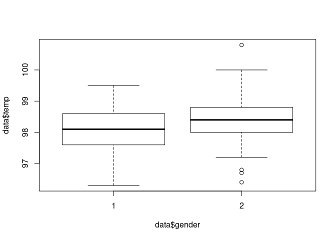
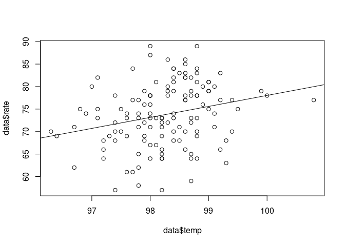
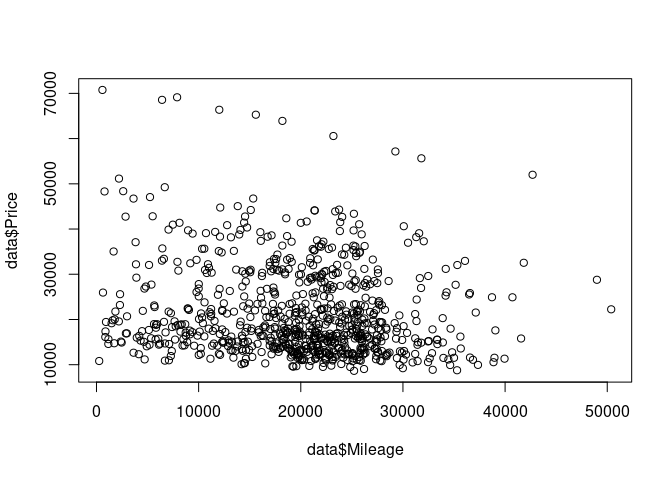

Exercises
================
Dieter
Last Updated: 10, November, 2022 at 09:54

-   <a href="#part-1-regression-anova-and-model-comparison"
    id="toc-part-1-regression-anova-and-model-comparison">PART 1:
    regression, anova, and model comparison</a>
    -   <a href="#oysters" id="toc-oysters">Oysters</a>
    -   <a href="#heart-rate" id="toc-heart-rate">Heart rate</a>
        -   <a href="#questions" id="toc-questions">Questions</a>
        -   <a href="#examples" id="toc-examples">Examples</a>
    -   <a href="#home-prices" id="toc-home-prices">Home prices</a>
        -   <a href="#questions-1" id="toc-questions-1">Questions</a>
        -   <a href="#examples-1" id="toc-examples-1">Examples</a>
    -   <a href="#cars" id="toc-cars">Cars</a>

``` r
library(tidyverse)
```

    ## ── Attaching packages ─────────────────────────────────────── tidyverse 1.3.2 ──
    ## ✔ ggplot2 3.3.6     ✔ purrr   0.3.4
    ## ✔ tibble  3.1.8     ✔ dplyr   1.0.9
    ## ✔ tidyr   1.2.0     ✔ stringr 1.4.0
    ## ✔ readr   2.1.2     ✔ forcats 0.5.2
    ## ── Conflicts ────────────────────────────────────────── tidyverse_conflicts() ──
    ## ✖ dplyr::filter() masks stats::filter()
    ## ✖ dplyr::lag()    masks stats::lag()

# PART 1: regression, anova, and model comparison

For this series, we are using data from JSE Data Archive:
<http://jse.amstat.org/jse_data_archive.htm>. I use the links to the
data so that you can directly read the data from the internet (in most
cases).

## Oysters

``` r
data <-read_table('http://jse.amstat.org/datasets/30oysters.dat.txt')
```

    ## 
    ## ── Column specification ────────────────────────────────────────────────────────
    ## cols(
    ##   Oyster_ID = col_double(),
    ##   Oyster_Weight_g = col_double(),
    ##   Oyster_Volume_cc = col_double(),
    ##   Pixels_3D = col_double(),
    ##   Pixels_2D = col_double()
    ## )

``` r
colnames(data)
```

    ## [1] "Oyster_ID"        "Oyster_Weight_g"  "Oyster_Volume_cc" "Pixels_3D"       
    ## [5] "Pixels_2D"

#### Predict weight by volume

-   Fit model
-   Plot results (scatter + regression line)

``` r
result <- lm(Oyster_Weight_g ~ Oyster_Volume_cc, data = data)
summary(result)
```

    ## 
    ## Call:
    ## lm(formula = Oyster_Weight_g ~ Oyster_Volume_cc, data = data)
    ## 
    ## Residuals:
    ##      Min       1Q   Median       3Q      Max 
    ## -0.15730 -0.06836 -0.01671  0.02052  0.55354 
    ## 
    ## Coefficients:
    ##                   Estimate Std. Error t value Pr(>|t|)    
    ## (Intercept)      -0.720926   0.109318  -6.595 3.75e-07 ***
    ## Oyster_Volume_cc  1.044466   0.009389 111.245  < 2e-16 ***
    ## ---
    ## Signif. codes:  0 '***' 0.001 '**' 0.01 '*' 0.05 '.' 0.1 ' ' 1
    ## 
    ## Residual standard error: 0.1498 on 28 degrees of freedom
    ## Multiple R-squared:  0.9977, Adjusted R-squared:  0.9977 
    ## F-statistic: 1.238e+04 on 1 and 28 DF,  p-value: < 2.2e-16

``` r
plot(data$Oyster_Volume_cc, data$Oyster_Weight_g)
abline(result, col = 'red')
```

<!-- -->

## Heart rate

``` r
data <- read_table('http://jse.amstat.org/datasets/normtemp.dat.txt', col_names = FALSE)
```

    ## 
    ## ── Column specification ────────────────────────────────────────────────────────
    ## cols(
    ##   X1 = col_double(),
    ##   X2 = col_double(),
    ##   X3 = col_double()
    ## )

``` r
colnames(data) <- c('temp', 'gender', 'rate')
```

Variables:

-   Body temperature (degrees Fahrenheit)
-   Gender (1 = male, 2 = female)
-   Heart rate (beats per minute)

### Questions

-   Is there a significant difference between males and females in
    normal temperature?
-   Is there a relationship between body temperature and heart rate?
-   Compare your findings with a correlation analysis
-   Compare a model that only uses temperature to predict heart rate
    with one that also uses gender

Some additional questions:

-   Is the distribution of body temperatures normal?
-   Is the true population mean really 98.6 degrees F?
-   At what temperature should we consider someone’s temperature to be
    “abnormal”?

### Examples

``` r
model <- lm(rate ~ temp, data = data)
summary(model)
```

    ## 
    ## Call:
    ## lm(formula = rate ~ temp, data = data)
    ## 
    ## Residuals:
    ##      Min       1Q   Median       3Q      Max 
    ## -16.6413  -4.6356   0.3247   4.8304  15.8474 
    ## 
    ## Coefficients:
    ##              Estimate Std. Error t value Pr(>|t|)   
    ## (Intercept) -166.2847    80.9123  -2.055  0.04190 * 
    ## temp           2.4432     0.8235   2.967  0.00359 **
    ## ---
    ## Signif. codes:  0 '***' 0.001 '**' 0.01 '*' 0.05 '.' 0.1 ' ' 1
    ## 
    ## Residual standard error: 6.858 on 128 degrees of freedom
    ## Multiple R-squared:  0.06434,    Adjusted R-squared:  0.05703 
    ## F-statistic: 8.802 on 1 and 128 DF,  p-value: 0.003591

``` r
plot(data$temp, data$rate)
abline(model)
```

<!-- -->

``` r
hist(data$temp)
```

<!-- -->

## Home prices

-   NAME: Modeling home prices using realtor data
-   TYPE: Random sample
-   SIZE: 76 observations, 19 variables

DESCRIPTIVE ABSTRACT:

The data file contains information on 76 single-family homes in Eugene,
Oregon during 2005. This dataset is suitable for a complete multiple
linear regression analysis of home price data that covers many of the
usual regression topics, including interaction and predictor
transformations. Whereas realtors use experience and local knowledge to
subjectively value a house based on its characteristics(size, amenities,
location, etc.) and the prices of similar houses nearby, regression
analysis can provide an alternative that more objectively models local
house prices using these same data.

SOURCES:The data were provided by Victoria Whitman, a realtor in Eugene,
in 2005. The data were used in a case study in Pardoe (2006).

VARIABLE DESCRIPTIONS:

-   id = ID number
-   Price = sale price (thousands of dollars)
-   Size = floor size (thousands of square feet)
-   Lot = lot size category (from 1 to 11)
-   Bath = number of bathrooms (with half-bathrooms counting as 0.1)
-   Bed = number of bedrooms (between 2 and 6)
-   BathBed = interaction of Bath times Bed
-   Year = year built
-   Age = age (standardized: (Year-1970)/10)
-   Agesq = Age squared
-   Garage = garage size (0, 1, 2, or 3 cars)
-   Status = act (active listing), pen (pending sale), or sld (sold)
-   Active = indicator for active listing (reference: pending or sold)
-   Elem = nearest elementary school (edgewood, edison, harris,
    adams,crest, or parker)

Edison = indicator for Edison Elementary (reference: EdgewoodElementary)
Harris = indicator for Harris Elementary (reference: EdgewoodElementary)
Adams = indicator for Adams Elementary (reference: EdgewoodElementary)
Crest = indicator for Crest Elementary (reference: EdgewoodElementary)
Parker = indicator for Parker Elementary (reference: EdgewoodElementary)

REFERENCES:Pardoe, I. (2006). Applied Regression Modeling: A Business
Approach. Hoboken, NJ: Wiley.

``` r
data <-read_table('http://jse.amstat.org/datasets/homes76.dat.txt')
```

    ## 
    ## ── Column specification ────────────────────────────────────────────────────────
    ## cols(
    ##   id = col_double(),
    ##   Y = col_double(),
    ##   X1 = col_double(),
    ##   X2 = col_double(),
    ##   X3 = col_double(),
    ##   X4 = col_double(),
    ##   X3X4 = col_double(),
    ##   year = col_double(),
    ##   X5 = col_double(),
    ##   X5sq = col_double(),
    ##   X6 = col_double(),
    ##   status = col_character(),
    ##   D7 = col_double(),
    ##   elem = col_character(),
    ##   D8 = col_double(),
    ##   D9 = col_double(),
    ##   D10 = col_double(),
    ##   D11 = col_double(),
    ##   D12 = col_double()
    ## )

### Questions

-   Does size or age influence price?
-   Do age and size interact in influencing the price?
-   Do houses near different school differ in price?

### Examples

``` r
result <- lm(Y ~ X1, data = data)
summary(result)
```

    ## 
    ## Call:
    ## lm(formula = Y ~ X1, data = data)
    ## 
    ## Residuals:
    ##      Min       1Q   Median       3Q      Max 
    ## -120.547  -40.848   -7.604   48.484  159.421 
    ## 
    ## Coefficients:
    ##             Estimate Std. Error t value Pr(>|t|)   
    ## (Intercept)   173.06      64.09   2.700  0.00858 **
    ## X1             57.21      32.34   1.769  0.08100 . 
    ## ---
    ## Signif. codes:  0 '***' 0.001 '**' 0.01 '*' 0.05 '.' 0.1 ' ' 1
    ## 
    ## Residual standard error: 59.49 on 74 degrees of freedom
    ## Multiple R-squared:  0.04058,    Adjusted R-squared:  0.02761 
    ## F-statistic:  3.13 on 1 and 74 DF,  p-value: 0.081

``` r
result <- lm(Y ~ elem, data = data)
summary(result)
```

    ## 
    ## Call:
    ## lm(formula = Y ~ elem, data = data)
    ## 
    ## Residuals:
    ##     Min      1Q  Median      3Q     Max 
    ## -92.100 -42.187  -1.602  30.206 165.242 
    ## 
    ## Coefficients:
    ##             Estimate Std. Error t value Pr(>|t|)    
    ## (Intercept)   241.83      31.81   7.604  9.8e-11 ***
    ## elemcrest      45.98      38.95   1.180   0.2418    
    ## elemedge       27.92      33.59   0.831   0.4086    
    ## elemedison     85.27      35.56   2.398   0.0192 *  
    ## elemharris     77.27      35.05   2.205   0.0308 *  
    ## elemparker     15.61      34.84   0.448   0.6554    
    ## ---
    ## Signif. codes:  0 '***' 0.001 '**' 0.01 '*' 0.05 '.' 0.1 ' ' 1
    ## 
    ## Residual standard error: 55.09 on 70 degrees of freedom
    ## Multiple R-squared:  0.2219, Adjusted R-squared:  0.1663 
    ## F-statistic: 3.992 on 5 and 70 DF,  p-value: 0.003042

## Cars

VARIABLE DESCRIPTIONS:

-   Price: suggested retail price of the used 2005 GM car in excellent
    condition. The condition of a car can greatly affect price. All cars
    in this data set were less than one year old when priced and
    considered to be in excellent condition.

-   Mileage: number of miles the car has been driven

-   Make: manufacturer of the car such as Saturn, Pontiac, and Chevrolet

-   Model: specific models for each car manufacturer such as Ion, Vibe,
    Cavalier

-   Trim (of car): specific type of car model such as SE Sedan 4D, Quad
    Coupe 2D

-   Type: body type such as sedan, coupe, etc.

-   Cylinder: number of cylinders in the engine  

-   Liter: a more specific measure of engine size

-   Doors: number of doors

-   Cruise: indicator variable representing whether the car has cruise
    control (1 = cruise)

-   Sound: indicator variable representing whether the car has upgraded
    speakers (1 = upgraded)

-   Leather: indicator variable representing whether the car has leather
    seats (1 = leather)

``` r
library(readxl)
data <- read_xls('data/kuiper.xls')
colnames(data)
```

    ##  [1] "Price"    "Mileage"  "Make"     "Model"    "Trim"     "Type"    
    ##  [7] "Cylinder" "Liter"    "Doors"    "Cruise"   "Sound"    "Leather"

#### Questions

You know what to do:

1)  Assess the predictive value of one or more predictors on price.
2)  Construct two models and compare them

#### Examples

``` r
model1 <- lm(Price ~ Mileage, data = data)
summary(model1)
```

    ## 
    ## Call:
    ## lm(formula = Price ~ Mileage, data = data)
    ## 
    ## Residuals:
    ##    Min     1Q Median     3Q    Max 
    ## -13905  -7254  -3520   5188  46091 
    ## 
    ## Coefficients:
    ##               Estimate Std. Error t value Pr(>|t|)    
    ## (Intercept)  2.476e+04  9.044e+02  27.383  < 2e-16 ***
    ## Mileage     -1.725e-01  4.215e-02  -4.093 4.68e-05 ***
    ## ---
    ## Signif. codes:  0 '***' 0.001 '**' 0.01 '*' 0.05 '.' 0.1 ' ' 1
    ## 
    ## Residual standard error: 9789 on 802 degrees of freedom
    ## Multiple R-squared:  0.02046,    Adjusted R-squared:  0.01924 
    ## F-statistic: 16.75 on 1 and 802 DF,  p-value: 4.685e-05

``` r
plot(data$Mileage, data$Price)
```

<!-- -->

Ancova. We’ll see this later…

``` r
model2 <- lm(Price ~ Mileage + Make , data = data)
summary(model2)
```

    ## 
    ## Call:
    ## lm(formula = Price ~ Mileage + Make, data = data)
    ## 
    ## Residuals:
    ##      Min       1Q   Median       3Q      Max 
    ## -11755.2  -3274.0   -701.8   1517.1  28174.1 
    ## 
    ## Coefficients:
    ##                 Estimate Std. Error t value Pr(>|t|)    
    ## (Intercept)    2.431e+04  8.182e+02  29.705  < 2e-16 ***
    ## Mileage       -1.709e-01  2.481e-02  -6.888 1.15e-11 ***
    ## MakeCadillac   1.986e+04  9.093e+02  21.844  < 2e-16 ***
    ## MakeChevrolet -4.520e+03  7.185e+02  -6.290 5.22e-10 ***
    ## MakePontiac   -2.592e+03  7.959e+02  -3.257  0.00117 ** 
    ## MakeSAAB       8.771e+03  8.381e+02  10.465  < 2e-16 ***
    ## MakeSaturn    -6.852e+03  9.813e+02  -6.983 6.10e-12 ***
    ## ---
    ## Signif. codes:  0 '***' 0.001 '**' 0.01 '*' 0.05 '.' 0.1 ' ' 1
    ## 
    ## Residual standard error: 5746 on 797 degrees of freedom
    ## Multiple R-squared:  0.6647, Adjusted R-squared:  0.6621 
    ## F-statistic: 263.3 on 6 and 797 DF,  p-value: < 2.2e-16

Compare the models using the `anova function`.

``` r
anova(model1, model2)
```

    ## Analysis of Variance Table
    ## 
    ## Model 1: Price ~ Mileage
    ## Model 2: Price ~ Mileage + Make
    ##   Res.Df        RSS Df  Sum of Sq      F    Pr(>F)    
    ## 1    802 7.6856e+10                                   
    ## 2    797 2.6312e+10  5 5.0544e+10 306.21 < 2.2e-16 ***
    ## ---
    ## Signif. codes:  0 '***' 0.001 '**' 0.01 '*' 0.05 '.' 0.1 ' ' 1
