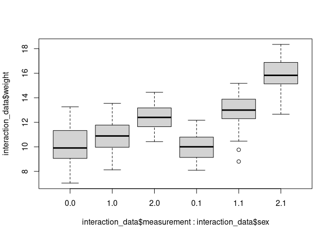

Mixed Models
================
Last Updated: 17, November, 2022 at 10:25

-   <a href="#100-populations-of-penguins"
    id="toc-100-populations-of-penguins">100 populations of penguins</a>
    -   <a href="#fit-a-mixed-model" id="toc-fit-a-mixed-model">Fit a mixed
        model</a>
-   <a href="#pre-and-post-penguins" id="toc-pre-and-post-penguins">Pre and
    Post Penguins</a>
-   <a href="#three-measures" id="toc-three-measures">Three measures</a>
-   <a href="#interaction-effects" id="toc-interaction-effects">Interaction
    effects</a>
-   <a href="#real-data-cars" id="toc-real-data-cars">Real data (cars)</a>
-   <a href="#vik-2013-chapter-18-repeated-measures-anova"
    id="toc-vik-2013-chapter-18-repeated-measures-anova">Vik 2013, Chapter
    18 (Repeated measures ANOVA)</a>

## 100 populations of penguins

``` r
sample_size <- 15
populations <- 100
variance_random_effect <- 0.25
fixed_effect <- 2.5

random_factor <- rnorm(populations, 0, sd=sqrt(variance_random_effect))


all_heights <-c()
all_weights <-c()
all_ids <-c()

for (i in 1:populations){
  heights <- rnorm(sample_size)
  errors <- rnorm(sample_size, sd=0.25)
  weights <- fixed_effect * heights + random_factor[i] + errors
  population_ids <- rep(i, times = sample_size)
  
  all_heights <- c(all_heights, heights)
  all_weights <- c(all_weights, weights)
  all_ids <- c(all_ids, population_ids)
}
 
penguin_data <- data.frame(all_ids, all_heights, all_weights)
colnames(penguin_data) <-c('id', 'height', 'weight')
```

### Fit a mixed model

``` r
v <- var(random_factor)
s <- sd(random_factor)
c(v, s)
```

    ## [1] 0.2695996 0.5192298

#### Using lme

The 1 indicates that an intercept is to be fitted for each level of the
random variable.

``` r
library(nlme)
model <- lme(weight ~ height, random=~1|id, data = penguin_data)
summary(model)
```

    ## Linear mixed-effects model fit by REML
    ##  Data: penguin_data 
    ##        AIC      BIC    logLik
    ##   546.9083 568.1559 -269.4542
    ## 
    ## Random effects:
    ##  Formula: ~1 | id
    ##         (Intercept) Residual
    ## StdDev:   0.5131968 0.251299
    ## 
    ## Fixed effects: weight ~ height 
    ##                 Value  Std.Error   DF  t-value p-value
    ## (Intercept) 0.0733414 0.05172830 1399   1.4178  0.1565
    ## height      2.4966396 0.00678282 1399 368.0829  0.0000
    ##  Correlation: 
    ##        (Intr)
    ## height -0.002
    ## 
    ## Standardized Within-Group Residuals:
    ##         Min          Q1         Med          Q3         Max 
    ## -3.22399307 -0.65531681  0.01849189  0.66026948  2.70040978 
    ## 
    ## Number of Observations: 1500
    ## Number of Groups: 100

#### Using lmer

``` r
library(lme4)
```

    ## Loading required package: Matrix

    ## 
    ## Attaching package: 'lme4'

    ## The following object is masked from 'package:nlme':
    ## 
    ##     lmList

``` r
model <- lmer(weight ~ height + (1|id), data = penguin_data)
summary(model)
```

    ## Linear mixed model fit by REML ['lmerMod']
    ## Formula: weight ~ height + (1 | id)
    ##    Data: penguin_data
    ## 
    ## REML criterion at convergence: 538.9
    ## 
    ## Scaled residuals: 
    ##     Min      1Q  Median      3Q     Max 
    ## -3.2240 -0.6553  0.0185  0.6603  2.7004 
    ## 
    ## Random effects:
    ##  Groups   Name        Variance Std.Dev.
    ##  id       (Intercept) 0.26337  0.5132  
    ##  Residual             0.06315  0.2513  
    ## Number of obs: 1500, groups:  id, 100
    ## 
    ## Fixed effects:
    ##             Estimate Std. Error t value
    ## (Intercept) 0.073341   0.051728   1.418
    ## height      2.496640   0.006783 368.083
    ## 
    ## Correlation of Fixed Effects:
    ##        (Intr)
    ## height -0.002

``` r
library(lmerTest)
```

    ## 
    ## Attaching package: 'lmerTest'

    ## The following object is masked from 'package:lme4':
    ## 
    ##     lmer

    ## The following object is masked from 'package:stats':
    ## 
    ##     step

``` r
#  To get (estimated) degrees of freedom and the p -values associated with the t -statistics and those degrees of freedom
model <- lmer(weight ~ height + (1|id), data = penguin_data)
summary(model)
```

    ## Linear mixed model fit by REML. t-tests use Satterthwaite's method [
    ## lmerModLmerTest]
    ## Formula: weight ~ height + (1 | id)
    ##    Data: penguin_data
    ## 
    ## REML criterion at convergence: 538.9
    ## 
    ## Scaled residuals: 
    ##     Min      1Q  Median      3Q     Max 
    ## -3.2240 -0.6553  0.0185  0.6603  2.7004 
    ## 
    ## Random effects:
    ##  Groups   Name        Variance Std.Dev.
    ##  id       (Intercept) 0.26337  0.5132  
    ##  Residual             0.06315  0.2513  
    ## Number of obs: 1500, groups:  id, 100
    ## 
    ## Fixed effects:
    ##              Estimate Std. Error        df t value Pr(>|t|)    
    ## (Intercept) 7.334e-02  5.173e-02 9.900e+01   1.418    0.159    
    ## height      2.497e+00  6.783e-03 1.401e+03 368.083   <2e-16 ***
    ## ---
    ## Signif. codes:  0 '***' 0.001 '**' 0.01 '*' 0.05 '.' 0.1 ' ' 1
    ## 
    ## Correlation of Fixed Effects:
    ##        (Intr)
    ## height -0.002

## Pre and Post Penguins

``` r
sample_size <- 100
variance_random_effect <- 0.25
fixed_effect <- 0.5

random_factor <- rnorm(populations, 0, sd=sqrt(variance_random_effect))

ids <- seq(sample_size)

pre_data <- rnorm(sample_size, mean = 10) + random_factor
post_data <- rnorm(sample_size, mean = 10 + fixed_effect) + random_factor


id <- c(ids, ids)
measurement<-c(rep(1, sample_size), rep(2, sample_size))
weight <-c(pre_data, post_data)

repeated_data <- data.frame(id, measurement, weight)
repeated_data$measurement <- as.factor(repeated_data$measurement)
head(repeated_data)
```

    ##   id measurement    weight
    ## 1  1           1  8.568009
    ## 2  2           1  9.840842
    ## 3  3           1  9.469965
    ## 4  4           1 10.448332
    ## 5  5           1  8.996440
    ## 6  6           1 10.454640

``` r
v <- var(random_factor)
s <- sd(random_factor)
c(v, s)
```

    ## [1] 0.1866066 0.4319799

``` r
library(lme4)
model <- lmer(weight ~ measurement + (1|id), data = repeated_data)
summary(model)
```

    ## Linear mixed model fit by REML. t-tests use Satterthwaite's method [
    ## lmerModLmerTest]
    ## Formula: weight ~ measurement + (1 | id)
    ##    Data: repeated_data
    ## 
    ## REML criterion at convergence: 594.2
    ## 
    ## Scaled residuals: 
    ##     Min      1Q  Median      3Q     Max 
    ## -2.8568 -0.5694 -0.1027  0.4984  3.4177 
    ## 
    ## Random effects:
    ##  Groups   Name        Variance Std.Dev.
    ##  id       (Intercept) 0.2027   0.4502  
    ##  Residual             0.9390   0.9690  
    ## Number of obs: 200, groups:  id, 100
    ## 
    ## Fixed effects:
    ##              Estimate Std. Error       df t value Pr(>|t|)    
    ## (Intercept)   10.0263     0.1069 191.9512  93.835   <2e-16 ***
    ## measurement2   0.3574     0.1370  99.0000   2.608   0.0105 *  
    ## ---
    ## Signif. codes:  0 '***' 0.001 '**' 0.01 '*' 0.05 '.' 0.1 ' ' 1
    ## 
    ## Correlation of Fixed Effects:
    ##             (Intr)
    ## measuremnt2 -0.641

## Three measures

``` r
sample_size <- 100
variance_random_effect <- 0.25

time_effect1 <- 0.75
time_effect2 <- 1

random_factor <- rnorm(populations, 0, sd=sqrt(variance_random_effect))
ids <- seq(sample_size)

data1 <- rnorm(sample_size, mean = 10) + 0.0000000000 + random_factor
data2 <- rnorm(sample_size, mean = 10) + time_effect1 + random_factor
data3 <- rnorm(sample_size, mean = 10) + time_effect2 + random_factor

id <- c(ids, ids, ids)
measurement<-c(rep(1, sample_size), rep(2, sample_size), rep(3, sample_size))
weight <-c(data1, data2, data3)

three_repeats_data <- data.frame(id, measurement,  weight)
three_repeats_data$measurement <- as.factor(three_repeats_data$measurement)
head(three_repeats_data)
```

    ##   id measurement    weight
    ## 1  1           1  9.533451
    ## 2  2           1  9.150010
    ## 3  3           1 11.851147
    ## 4  4           1 10.851420
    ## 5  5           1 11.981861
    ## 6  6           1  8.776240

``` r
v <- var(random_factor)
s <- sd(random_factor)
c(v, s)
```

    ## [1] 0.2369219 0.4867462

``` r
library(lme4)
model <- lmer(weight ~ measurement + (1|id), data = three_repeats_data)
summary(model)
```

    ## Linear mixed model fit by REML. t-tests use Satterthwaite's method [
    ## lmerModLmerTest]
    ## Formula: weight ~ measurement + (1 | id)
    ##    Data: three_repeats_data
    ## 
    ## REML criterion at convergence: 909.2
    ## 
    ## Scaled residuals: 
    ##      Min       1Q   Median       3Q      Max 
    ## -2.52553 -0.63295  0.01161  0.62035  2.44563 
    ## 
    ## Random effects:
    ##  Groups   Name        Variance Std.Dev.
    ##  id       (Intercept) 0.2361   0.4859  
    ##  Residual             0.9982   0.9991  
    ## Number of obs: 300, groups:  id, 100
    ## 
    ## Fixed effects:
    ##              Estimate Std. Error       df t value Pr(>|t|)    
    ## (Intercept)    9.9335     0.1111 276.7519  89.414  < 2e-16 ***
    ## measurement2   0.8918     0.1413 198.0000   6.312 1.77e-09 ***
    ## measurement3   0.9526     0.1413 198.0000   6.742 1.67e-10 ***
    ## ---
    ## Signif. codes:  0 '***' 0.001 '**' 0.01 '*' 0.05 '.' 0.1 ' ' 1
    ## 
    ## Correlation of Fixed Effects:
    ##             (Intr) msrmn2
    ## measuremnt2 -0.636       
    ## measuremnt3 -0.636  0.500

## Interaction effects

``` r
sample_size <- 100
variance_random_effect <- 0.25

random_factor <- rnorm(populations, 0, sd=sqrt(variance_random_effect))
sex <- c(rep(0, sample_size/2), rep(1, sample_size/2))
ids <- seq(sample_size)

data1 <- rnorm(sample_size, mean = 10) + 0 + sex * 0 + random_factor
data2 <- rnorm(sample_size, mean = 10) + 1 + sex * 2 + random_factor
data3 <- rnorm(sample_size, mean = 10) + 2 + sex * 4 + random_factor

id <- c(ids, ids, ids)
sex <-c(sex, sex, sex) # used when demoing interaction effects
measurement<-c(rep(0, sample_size), rep(1, sample_size), rep(2, sample_size))
weight <-c(data1, data2, data3)

interaction_data <- data.frame(id, measurement, sex,  weight)
interaction_data$measurement <- as.factor(interaction_data$measurement)
interaction_data$sex <- as.factor(interaction_data$sex)
head(interaction_data)
```

    ##   id measurement sex    weight
    ## 1  1           0   0 10.020238
    ## 2  2           0   0  8.918820
    ## 3  3           0   0 10.464567
    ## 4  4           0   0  9.472134
    ## 5  5           0   0  9.138534
    ## 6  6           0   0 10.471172

``` r
library(lme4)
model <- lmer(weight ~ measurement * sex + (1|id), data = interaction_data)
summary(model)
```

    ## Linear mixed model fit by REML. t-tests use Satterthwaite's method [
    ## lmerModLmerTest]
    ## Formula: weight ~ measurement * sex + (1 | id)
    ##    Data: interaction_data
    ## 
    ## REML criterion at convergence: 917.2
    ## 
    ## Scaled residuals: 
    ##      Min       1Q   Median       3Q      Max 
    ## -2.38248 -0.59310 -0.02224  0.72977  2.66373 
    ## 
    ## Random effects:
    ##  Groups   Name        Variance Std.Dev.
    ##  id       (Intercept) 0.1922   0.4384  
    ##  Residual             1.0587   1.0289  
    ## Number of obs: 300, groups:  id, 100
    ## 
    ## Fixed effects:
    ##                   Estimate Std. Error       df t value Pr(>|t|)    
    ## (Intercept)         9.5169     0.1582 280.7434  60.169  < 2e-16 ***
    ## measurement1        1.4738     0.2058 196.0000   7.162 1.57e-11 ***
    ## measurement2        2.2805     0.2058 196.0000  11.082  < 2e-16 ***
    ## sex1                0.6808     0.2237 280.7434   3.044  0.00256 ** 
    ## measurement1:sex1   1.5035     0.2910 196.0000   5.166 5.86e-07 ***
    ## measurement2:sex1   3.5926     0.2910 196.0000  12.345  < 2e-16 ***
    ## ---
    ## Signif. codes:  0 '***' 0.001 '**' 0.01 '*' 0.05 '.' 0.1 ' ' 1
    ## 
    ## Correlation of Fixed Effects:
    ##             (Intr) msrmn1 msrmn2 sex1   msr1:1
    ## measuremnt1 -0.651                            
    ## measuremnt2 -0.651  0.500                     
    ## sex1        -0.707  0.460  0.460              
    ## msrmnt1:sx1  0.460 -0.707 -0.354 -0.651       
    ## msrmnt2:sx1  0.460 -0.354 -0.707 -0.651  0.500

``` r
boxplot(interaction_data$weight ~ interaction_data$measurement * interaction_data$sex)
```

<!-- -->

## Real data (cars)

``` r
library(tidyverse)
```

    ## ── Attaching packages ─────────────────────────────────────── tidyverse 1.3.2 ──
    ## ✔ ggplot2 3.3.6     ✔ purrr   0.3.4
    ## ✔ tibble  3.1.8     ✔ dplyr   1.0.9
    ## ✔ tidyr   1.2.0     ✔ stringr 1.4.0
    ## ✔ readr   2.1.2     ✔ forcats 0.5.2
    ## ── Conflicts ────────────────────────────────────────── tidyverse_conflicts() ──
    ## ✖ dplyr::collapse() masks nlme::collapse()
    ## ✖ tidyr::expand()   masks Matrix::expand()
    ## ✖ dplyr::filter()   masks stats::filter()
    ## ✖ dplyr::lag()      masks stats::lag()
    ## ✖ tidyr::pack()     masks Matrix::pack()
    ## ✖ tidyr::unpack()   masks Matrix::unpack()

``` r
library(readxl)
car_data <-read_xls('data/kuiper.xls')
colnames(car_data)
```

    ##  [1] "Price"    "Mileage"  "Make"     "Model"    "Trim"     "Type"    
    ##  [7] "Cylinder" "Liter"    "Doors"    "Cruise"   "Sound"    "Leather"

``` r
car_data$Price <-scale(car_data$Price)
car_data$Mileage <-scale(car_data$Mileage)
car_model <- lmer(Price ~ Mileage + (1|Make), data = car_data)
summary(car_model)
```

    ## Linear mixed model fit by REML. t-tests use Satterthwaite's method [
    ## lmerModLmerTest]
    ## Formula: Price ~ Mileage + (1 | Make)
    ##    Data: car_data
    ## 
    ## REML criterion at convergence: 1448.2
    ## 
    ## Scaled residuals: 
    ##     Min      1Q  Median      3Q     Max 
    ## -2.0336 -0.5711 -0.1192  0.2638  4.9021 
    ## 
    ## Random effects:
    ##  Groups   Name        Variance Std.Dev.
    ##  Make     (Intercept) 1.0387   1.0191  
    ##  Residual             0.3379   0.5813  
    ## Number of obs: 804, groups:  Make, 6
    ## 
    ## Fixed effects:
    ##              Estimate Std. Error        df t value Pr(>|t|)    
    ## (Intercept)   0.20404    0.41674   4.99449   0.490    0.645    
    ## Mileage      -0.14175    0.02057 797.02317  -6.891 1.13e-11 ***
    ## ---
    ## Signif. codes:  0 '***' 0.001 '**' 0.01 '*' 0.05 '.' 0.1 ' ' 1
    ## 
    ## Correlation of Fixed Effects:
    ##         (Intr)
    ## Mileage -0.001

## Vik 2013, Chapter 18 (Repeated measures ANOVA)

In this chapter, the author performs a repeated measures ANOVA using an
idiosyncratic calculation method. Here, I run the same analysis using
the rstatix and car packages to show that the numbers correspond to what
he calculates.


Vik, P. (2013). Regression, ANOVA, and the General Linear Model. SAGE
Publications, Inc. (US).
<https://bookshelf.vitalsource.com/books/9781483316017>

``` r
vik_data <- read_xls('data/vik_repeated.xls')
vik_data <- pivot_longer(vik_data, cols = c('time1', 'time2'))
head(vik_data)
```

    ## # A tibble: 6 × 3
    ##      id name  value
    ##   <dbl> <chr> <dbl>
    ## 1     1 time1     3
    ## 2     1 time2     5
    ## 3     2 time1     5
    ## 4     2 time2     4
    ## 5     3 time1     6
    ## 6     3 time2     4

``` r
library(rstatix)
```

    ## 
    ## Attaching package: 'rstatix'

    ## The following object is masked from 'package:stats':
    ## 
    ##     filter

``` r
res.aov <- anova_test(data = vik_data, dv = value, wid = id, within = name)
get_anova_table(res.aov)
```

    ## ANOVA Table (type III tests)
    ## 
    ##   Effect DFn DFd      F     p p<.05   ges
    ## 1   name   1  23 10.991 0.003     * 0.056

Here, the same thing using a different package that also spits out the
sums of squares.

``` r
library(car)
```

    ## Loading required package: carData

    ## 
    ## Attaching package: 'car'

    ## The following object is masked from 'package:dplyr':
    ## 
    ##     recode

    ## The following object is masked from 'package:purrr':
    ## 
    ##     some

``` r
design <- factorial_design(vik_data, dv = value, wid = id, within = name)
res.anova <- Anova(design$model, idata = design$idata, idesign = design$idesign, type = 3)
summary(res.anova)
```

    ## 
    ## Type III Repeated Measures MANOVA Tests:
    ## 
    ## ------------------------------------------
    ##  
    ## Term: (Intercept) 
    ## 
    ##  Response transformation matrix:
    ##       (Intercept)
    ## time1           1
    ## time2           1
    ## 
    ## Sum of squares and products for the hypothesis:
    ##             (Intercept)
    ## (Intercept)       12696
    ## 
    ## Multivariate Tests: (Intercept)
    ##                  Df test stat approx F num Df den Df     Pr(>F)    
    ## Pillai            1  0.798893 91.36671      1     23 1.7793e-09 ***
    ## Wilks             1  0.201107 91.36671      1     23 1.7793e-09 ***
    ## Hotelling-Lawley  1  3.972466 91.36671      1     23 1.7793e-09 ***
    ## Roy               1  3.972466 91.36671      1     23 1.7793e-09 ***
    ## ---
    ## Signif. codes:  0 '***' 0.001 '**' 0.01 '*' 0.05 '.' 0.1 ' ' 1
    ## 
    ## ------------------------------------------
    ##  
    ## Term: name 
    ## 
    ##  Response transformation matrix:
    ##       name1
    ## time1     1
    ## time2    -1
    ## 
    ## Sum of squares and products for the hypothesis:
    ##       name1
    ## name1   216
    ## 
    ## Multivariate Tests: name
    ##                  Df test stat approx F num Df den Df   Pr(>F)   
    ## Pillai            1 0.3233533 10.99115      1     23 0.003017 **
    ## Wilks             1 0.6766467 10.99115      1     23 0.003017 **
    ## Hotelling-Lawley  1 0.4778761 10.99115      1     23 0.003017 **
    ## Roy               1 0.4778761 10.99115      1     23 0.003017 **
    ## ---
    ## Signif. codes:  0 '***' 0.001 '**' 0.01 '*' 0.05 '.' 0.1 ' ' 1
    ## 
    ## Univariate Type III Repeated-Measures ANOVA Assuming Sphericity
    ## 
    ##             Sum Sq num Df Error SS den Df F value    Pr(>F)    
    ## (Intercept)   6348      1     1598     23  91.367 1.779e-09 ***
    ## name           108      1      226     23  10.991  0.003017 ** 
    ## ---
    ## Signif. codes:  0 '***' 0.001 '**' 0.01 '*' 0.05 '.' 0.1 ' ' 1
