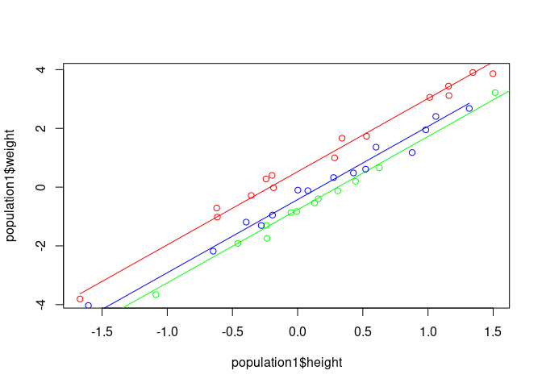
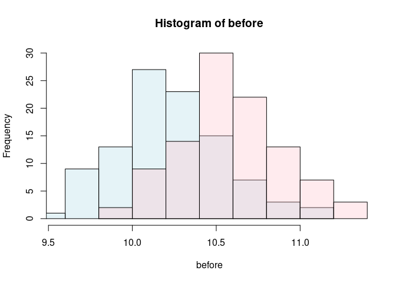
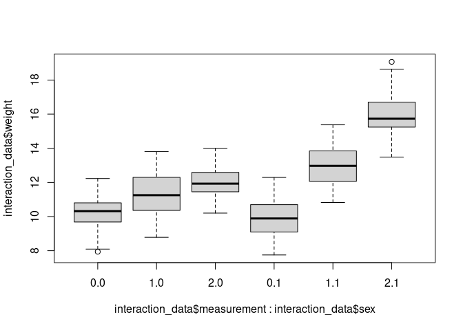
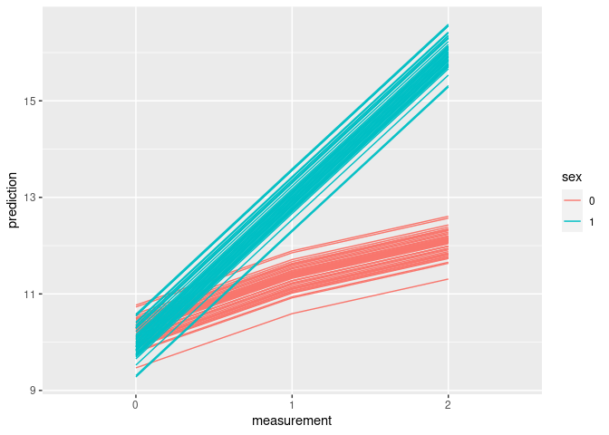
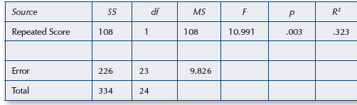

Mixed Models
================
Last Updated: 22, November, 2022 at 09:24

- <a href="#100-populations-of-penguins"
  id="toc-100-populations-of-penguins">100 populations of penguins</a>
  - <a href="#make-data" id="toc-make-data">Make data</a>
  - <a href="#fit-a-mixed-model" id="toc-fit-a-mixed-model">Fit a mixed
    model</a>
    - <a href="#fitting-the-model-using-the-lme-function"
      id="toc-fitting-the-model-using-the-lme-function">fitting the model
      using the lme function</a>
    - <a href="#intepreting-the-fitted-parameters"
      id="toc-intepreting-the-fitted-parameters">Intepreting the fitted
      parameters</a>
    - <a href="#fitting-the-model-using-the-lmer-function"
      id="toc-fitting-the-model-using-the-lmer-function">fitting the model
      using the lmer function</a>
- <a href="#pre-and-post-penguins" id="toc-pre-and-post-penguins">Pre and
  Post Penguins</a>
  - <a href="#make-data-1" id="toc-make-data-1">Make data</a>
  - <a href="#fit-model" id="toc-fit-model">Fit model</a>
  - <a href="#intepreting-the-model"
    id="toc-intepreting-the-model">Intepreting the model</a>
- <a href="#three-repeated-measures"
  id="toc-three-repeated-measures">Three repeated measures</a>
- <a href="#interaction-effects" id="toc-interaction-effects">Interaction
  effects</a>
- <a href="#real-data-cars" id="toc-real-data-cars">Real data (cars)</a>
- <a href="#vik-2013-chapter-18-repeated-measures-anova"
  id="toc-vik-2013-chapter-18-repeated-measures-anova">Vik 2013, Chapter
  18 (Repeated measures ANOVA)</a>

``` r
library(tidyverse)
```

    ## ── Attaching packages ─────────────────────────────────────── tidyverse 1.3.2 ──
    ## ✔ ggplot2 3.4.0      ✔ purrr   0.3.5 
    ## ✔ tibble  3.1.8      ✔ dplyr   1.0.10
    ## ✔ tidyr   1.2.1      ✔ stringr 1.4.1 
    ## ✔ readr   2.1.3      ✔ forcats 0.5.2 
    ## ── Conflicts ────────────────────────────────────────── tidyverse_conflicts() ──
    ## ✖ dplyr::filter() masks stats::filter()
    ## ✖ dplyr::lag()    masks stats::lag()

## 100 populations of penguins

### Make data

``` r
sample_size <- 15
populations <- 100
variance_random_effect <- 0.25
fixed_effect <- 2.5

random_factor <- rnorm(populations, 0, sd=sqrt(variance_random_effect))


all_heights <-c()
all_weights <-c()
all_ids <-c()

for (i in 1:populations){
  heights <- rnorm(sample_size)
  errors <- rnorm(sample_size, sd=0.25)
  weights <- fixed_effect * heights + random_factor[i] + errors
  population_ids <- rep(i, times = sample_size)
  
  all_heights <- c(all_heights, heights)
  all_weights <- c(all_weights, weights)
  all_ids <- c(all_ids, population_ids)
}
 
penguin_data <- data.frame(all_ids, all_heights, all_weights)
colnames(penguin_data) <-c('id', 'height', 'weight')
head(penguin_data)
```

    ##   id     height      weight
    ## 1  1  1.0132414  3.05601620
    ## 2  1 -0.1961190  0.40011681
    ## 3  1  1.1605701  3.11715018
    ## 4  1  1.4982667  3.86164382
    ## 5  1 -0.1847411 -0.02184106
    ## 6  1  0.2838344  0.99680182

### Fit a mixed model

``` r
v <- var(random_factor)
s <- sd(random_factor)
c(v, s)
```

    ## [1] 0.3173358 0.5633256

#### fitting the model using the lme function

The 1 indicates that an intercept is to be fitted for each level of the
random variable.

``` r
library(nlme)
```

    ## 
    ## Attaching package: 'nlme'

    ## The following object is masked from 'package:dplyr':
    ## 
    ##     collapse

``` r
model <- lme(weight ~ height, random=~1|id, data = penguin_data)
summary(model)
```

    ## Linear mixed-effects model fit by REML
    ##   Data: penguin_data 
    ##        AIC      BIC    logLik
    ##   621.7874 643.0349 -306.8937
    ## 
    ## Random effects:
    ##  Formula: ~1 | id
    ##         (Intercept)  Residual
    ## StdDev:   0.5618467 0.2564819
    ## 
    ## Fixed effects:  weight ~ height 
    ##                  Value  Std.Error   DF  t-value p-value
    ## (Intercept) -0.0486186 0.05657444 1399  -0.8594  0.3903
    ## height       2.4911404 0.00682139 1399 365.1954  0.0000
    ##  Correlation: 
    ##        (Intr)
    ## height 0.005 
    ## 
    ## Standardized Within-Group Residuals:
    ##         Min          Q1         Med          Q3         Max 
    ## -3.05759231 -0.65677281  0.01564323  0.64320305  3.11810783 
    ## 
    ## Number of Observations: 1500
    ## Number of Groups: 100

#### Intepreting the fitted parameters

A different intercept is fitted for each population.

``` r
coefs <-coefficients(model)
coefs$population <- seq(1, populations)
head(coefs, 15)
```

    ##     (Intercept)  height population
    ## 1   0.526867568 2.49114          1
    ## 2  -0.767752577 2.49114          2
    ## 3  -0.423889557 2.49114          3
    ## 4   0.095871919 2.49114          4
    ## 5   0.192433362 2.49114          5
    ## 6   1.101717851 2.49114          6
    ## 7   0.465020067 2.49114          7
    ## 8   0.200583753 2.49114          8
    ## 9   0.109259152 2.49114          9
    ## 10 -0.388478756 2.49114         10
    ## 11 -0.823064720 2.49114         11
    ## 12 -0.475840389 2.49114         12
    ## 13  0.687135151 2.49114         13
    ## 14  0.546711903 2.49114         14
    ## 15 -0.009223082 2.49114         15

``` r
head(penguin_data)
```

    ##   id     height      weight
    ## 1  1  1.0132414  3.05601620
    ## 2  1 -0.1961190  0.40011681
    ## 3  1  1.1605701  3.11715018
    ## 4  1  1.4982667  3.86164382
    ## 5  1 -0.1847411 -0.02184106
    ## 6  1  0.2838344  0.99680182

``` r
population1<-filter(penguin_data, id==1)
population2<-filter(penguin_data, id==2)
population3<-filter(penguin_data, id==3)

prediction1 <- coefs$`(Intercept)`[1] + coefs$height[1] * population1$height
prediction2 <- coefs$`(Intercept)`[2] + coefs$height[2] * population2$height
prediction3 <- coefs$`(Intercept)`[3] + coefs$height[3] * population3$height

plot(population1$height, population1$weight, col='red')
points(population1$height, prediction1, type='l', col='red')

points(population2$height, population2$weight, col='green')
points(population2$height, prediction2, type='l', col='green')

points(population3$height, population3$weight, col='blue')
points(population3$height, prediction3, type='l', col='blue')
```

<!-- -->

#### fitting the model using the lmer function

``` r
library(lme4)
```

    ## Loading required package: Matrix

    ## 
    ## Attaching package: 'Matrix'

    ## The following objects are masked from 'package:tidyr':
    ## 
    ##     expand, pack, unpack

    ## 
    ## Attaching package: 'lme4'

    ## The following object is masked from 'package:nlme':
    ## 
    ##     lmList

``` r
model <- lmer(weight ~ height + (1|id), data = penguin_data)
summary(model)
```

    ## Linear mixed model fit by REML ['lmerMod']
    ## Formula: weight ~ height + (1 | id)
    ##    Data: penguin_data
    ## 
    ## REML criterion at convergence: 613.8
    ## 
    ## Scaled residuals: 
    ##      Min       1Q   Median       3Q      Max 
    ## -3.05759 -0.65677  0.01564  0.64320  3.11811 
    ## 
    ## Random effects:
    ##  Groups   Name        Variance Std.Dev.
    ##  id       (Intercept) 0.31567  0.5618  
    ##  Residual             0.06578  0.2565  
    ## Number of obs: 1500, groups:  id, 100
    ## 
    ## Fixed effects:
    ##              Estimate Std. Error t value
    ## (Intercept) -0.048619   0.056574  -0.859
    ## height       2.491140   0.006821 365.195
    ## 
    ## Correlation of Fixed Effects:
    ##        (Intr)
    ## height 0.005

``` r
library(lmerTest)
```

    ## 
    ## Attaching package: 'lmerTest'

    ## The following object is masked from 'package:lme4':
    ## 
    ##     lmer

    ## The following object is masked from 'package:stats':
    ## 
    ##     step

``` r
#  To get (estimated) degrees of freedom and the p -values associated with the t -statistics and those degrees of freedom
model <- lmer(weight ~ height + (1|id), data = penguin_data)
summary(model)
```

    ## Linear mixed model fit by REML. t-tests use Satterthwaite's method [
    ## lmerModLmerTest]
    ## Formula: weight ~ height + (1 | id)
    ##    Data: penguin_data
    ## 
    ## REML criterion at convergence: 613.8
    ## 
    ## Scaled residuals: 
    ##      Min       1Q   Median       3Q      Max 
    ## -3.05759 -0.65677  0.01564  0.64320  3.11811 
    ## 
    ## Random effects:
    ##  Groups   Name        Variance Std.Dev.
    ##  id       (Intercept) 0.31567  0.5618  
    ##  Residual             0.06578  0.2565  
    ## Number of obs: 1500, groups:  id, 100
    ## 
    ## Fixed effects:
    ##               Estimate Std. Error         df t value Pr(>|t|)    
    ## (Intercept) -4.862e-02  5.657e-02  9.900e+01  -0.859    0.392    
    ## height       2.491e+00  6.821e-03  1.402e+03 365.195   <2e-16 ***
    ## ---
    ## Signif. codes:  0 '***' 0.001 '**' 0.01 '*' 0.05 '.' 0.1 ' ' 1
    ## 
    ## Correlation of Fixed Effects:
    ##        (Intr)
    ## height 0.005

## Pre and Post Penguins

### Make data

``` r
sample_size <- 100
variance_random_effect <- 0.25
fixed_effect <- 0.5

random_factor <- rnorm(populations, 0, sd=sqrt(variance_random_effect))
noise <- rnorm(populations, 0, sd=0.1)


ids <- seq(sample_size)

pre_data <- rnorm(sample_size, mean = 10) + random_factor + noise
post_data <- rnorm(sample_size, mean = 10 + fixed_effect) + random_factor + noise


id <- c(ids, ids)
measurement<-c(rep(1, sample_size), rep(2, sample_size))
weight <-c(pre_data, post_data)

repeated_data <- data.frame(id, measurement, weight)
repeated_data$measurement <- as.factor(repeated_data$measurement)
head(repeated_data)
```

    ##   id measurement    weight
    ## 1  1           1  9.891087
    ## 2  2           1  8.779557
    ## 3  3           1  9.275041
    ## 4  4           1  9.806396
    ## 5  5           1 11.578583
    ## 6  6           1  9.501858

``` r
v <- var(random_factor)
s <- sd(random_factor)
c(v, s)
```

    ## [1] 0.1918788 0.4380397

### Fit model

``` r
library(lme4)
model <- lmer(weight ~ measurement + (1|id), data = repeated_data)
summary(model)
```

    ## Linear mixed model fit by REML. t-tests use Satterthwaite's method [
    ## lmerModLmerTest]
    ## Formula: weight ~ measurement + (1 | id)
    ##    Data: repeated_data
    ## 
    ## REML criterion at convergence: 583
    ## 
    ## Scaled residuals: 
    ##      Min       1Q   Median       3Q      Max 
    ## -2.32352 -0.55351 -0.02272  0.45857  2.61415 
    ## 
    ## Random effects:
    ##  Groups   Name        Variance Std.Dev.
    ##  id       (Intercept) 0.2561   0.5061  
    ##  Residual             0.8365   0.9146  
    ## Number of obs: 200, groups:  id, 100
    ## 
    ## Fixed effects:
    ##              Estimate Std. Error       df t value Pr(>|t|)    
    ## (Intercept)   10.2303     0.1045 187.6877  97.874  < 2e-16 ***
    ## measurement2   0.3498     0.1293  99.0000   2.704  0.00806 ** 
    ## ---
    ## Signif. codes:  0 '***' 0.001 '**' 0.01 '*' 0.05 '.' 0.1 ' ' 1
    ## 
    ## Correlation of Fixed Effects:
    ##             (Intr)
    ## measuremnt2 -0.619

### Intepreting the model

It turns out that getting the variance terms is a bit tricky:

- <https://stats.stackexchange.com/questions/122218/why-do-the-estimated-values-from-a-best-linear-unbiased-predictor-blup-differ>
- <https://easystats.github.io/insight/reference/get_variance.html#ref-usage>

``` r
library(insight)
get_variance_random(model)
```

    ## var.random 
    ##   0.256094

``` r
get_variance_intercept(model)
```

    ## var.intercept.id 
    ##         0.256094

``` r
predictions <-unname(predict(model))
before <- predictions[1: sample_size]
after <- predictions[101:length(predictions)]

c1 <- rgb(173,216,230,max = 255, alpha = 80, names = "lt.blue")
c2 <- rgb(255,192,203, max = 255, alpha = 80, names = "lt.pink")

hist(before, col=c1, xlim=range(predictions), ylim=c(0, 30))
hist(after, add=TRUE, col=c2)
```

<!-- -->

## Three repeated measures

``` r
sample_size <- 100
variance_random_effect <- 0.25

time_effect1 <- 0.75
time_effect2 <- 1

random_factor <- rnorm(populations, 0, sd=sqrt(variance_random_effect))
ids <- seq(sample_size)

data1 <- rnorm(sample_size, mean = 10) + 0.0000000000 + random_factor
data2 <- rnorm(sample_size, mean = 10) + time_effect1 + random_factor
data3 <- rnorm(sample_size, mean = 10) + time_effect2 + random_factor

id <- c(ids, ids, ids)
measurement<-c(rep(1, sample_size), rep(2, sample_size), rep(3, sample_size))
weight <-c(data1, data2, data3)

three_repeats_data <- data.frame(id, measurement,  weight)
three_repeats_data$measurement <- as.factor(three_repeats_data$measurement)
head(three_repeats_data)
```

    ##   id measurement    weight
    ## 1  1           1 10.996181
    ## 2  2           1  8.874400
    ## 3  3           1  9.928699
    ## 4  4           1  9.636390
    ## 5  5           1  9.992006
    ## 6  6           1 10.053005

``` r
v <- var(random_factor)
s <- sd(random_factor)
c(v, s)
```

    ## [1] 0.2401001 0.4900001

``` r
library(lme4)
model <- lmer(weight ~ measurement + (1|id), data = three_repeats_data)
summary(model)
```

    ## Linear mixed model fit by REML. t-tests use Satterthwaite's method [
    ## lmerModLmerTest]
    ## Formula: weight ~ measurement + (1 | id)
    ##    Data: three_repeats_data
    ## 
    ## REML criterion at convergence: 904.5
    ## 
    ## Scaled residuals: 
    ##     Min      1Q  Median      3Q     Max 
    ## -3.2276 -0.6114 -0.0191  0.5081  2.8819 
    ## 
    ## Random effects:
    ##  Groups   Name        Variance Std.Dev.
    ##  id       (Intercept) 0.1981   0.4451  
    ##  Residual             1.0063   1.0031  
    ## Number of obs: 300, groups:  id, 100
    ## 
    ## Fixed effects:
    ##              Estimate Std. Error       df t value Pr(>|t|)    
    ## (Intercept)    9.9992     0.1097 281.7526  91.114  < 2e-16 ***
    ## measurement2   0.7905     0.1419 198.0000   5.572 8.15e-08 ***
    ## measurement3   0.8718     0.1419 198.0000   6.145 4.31e-09 ***
    ## ---
    ## Signif. codes:  0 '***' 0.001 '**' 0.01 '*' 0.05 '.' 0.1 ' ' 1
    ## 
    ## Correlation of Fixed Effects:
    ##             (Intr) msrmn2
    ## measuremnt2 -0.646       
    ## measuremnt3 -0.646  0.500

## Interaction effects

``` r
sample_size <- 100
variance_random_effect <- 0.25

random_factor <- rnorm(populations, 0, sd=sqrt(variance_random_effect))
sex <- c(rep(0, sample_size/2), rep(1, sample_size/2))
ids <- seq(sample_size)

data1 <- rnorm(sample_size, mean = 10) + 0 + sex * 0 + random_factor
data2 <- rnorm(sample_size, mean = 10) + 1 + sex * 2 + random_factor
data3 <- rnorm(sample_size, mean = 10) + 2 + sex * 4 + random_factor

id <- c(ids, ids, ids)
sex <-c(sex, sex, sex)
measurement<-c(rep(0, sample_size), rep(1, sample_size), rep(2, sample_size))
weight <-c(data1, data2, data3)

interaction_data <- data.frame(id, measurement, sex,  weight)
interaction_data$measurement <- as.factor(interaction_data$measurement)
interaction_data$sex <- as.factor(interaction_data$sex)
head(interaction_data)
```

    ##   id measurement sex    weight
    ## 1  1           0   0 10.056124
    ## 2  2           0   0 10.116942
    ## 3  3           0   0  9.712168
    ## 4  4           0   0  9.199921
    ## 5  5           0   0  9.932677
    ## 6  6           0   0 10.364047

``` r
v <- var(random_factor)
s <- sd(random_factor)
c(v, s)
```

    ## [1] 0.2215383 0.4706785

``` r
library(lme4)
model <- lmer(weight ~ measurement * sex + (1|id), data = interaction_data)
summary(model)
```

    ## Linear mixed model fit by REML. t-tests use Satterthwaite's method [
    ## lmerModLmerTest]
    ## Formula: weight ~ measurement * sex + (1 | id)
    ##    Data: interaction_data
    ## 
    ## REML criterion at convergence: 903.3
    ## 
    ## Scaled residuals: 
    ##      Min       1Q   Median       3Q      Max 
    ## -2.17388 -0.66227 -0.06505  0.63431  2.71681 
    ## 
    ## Random effects:
    ##  Groups   Name        Variance Std.Dev.
    ##  id       (Intercept) 0.1972   0.4441  
    ##  Residual             0.9996   0.9998  
    ## Number of obs: 300, groups:  id, 100
    ## 
    ## Fixed effects:
    ##                   Estimate Std. Error       df t value Pr(>|t|)    
    ## (Intercept)        10.2115     0.1547 278.8570  66.001  < 2e-16 ***
    ## measurement1        1.1233     0.2000 196.0000   5.617 6.58e-08 ***
    ## measurement2        1.8399     0.2000 196.0000   9.201  < 2e-16 ***
    ## sex1               -0.2271     0.2188 278.8570  -1.038      0.3    
    ## measurement1:sex1   1.8896     0.2828 196.0000   6.682 2.39e-10 ***
    ## measurement2:sex1   4.1677     0.2828 196.0000  14.738  < 2e-16 ***
    ## ---
    ## Signif. codes:  0 '***' 0.001 '**' 0.01 '*' 0.05 '.' 0.1 ' ' 1
    ## 
    ## Correlation of Fixed Effects:
    ##             (Intr) msrmn1 msrmn2 sex1   msr1:1
    ## measuremnt1 -0.646                            
    ## measuremnt2 -0.646  0.500                     
    ## sex1        -0.707  0.457  0.457              
    ## msrmnt1:sx1  0.457 -0.707 -0.354 -0.646       
    ## msrmnt2:sx1  0.457 -0.354 -0.707 -0.646  0.500

``` r
boxplot(interaction_data$weight ~ interaction_data$measurement * interaction_data$sex)
```

<!-- -->

``` r
library(ggplot2)
interaction_data$prediction <- unname(predict(model))
ggplot(interaction_data) + aes(x=measurement, y=prediction, group=id, color=sex) + geom_line()
```

<!-- -->

## Real data (cars)

``` r
library(tidyverse)
library(readxl)
car_data <-read_xls('data/kuiper.xls')
colnames(car_data)
```

    ##  [1] "Price"    "Mileage"  "Make"     "Model"    "Trim"     "Type"    
    ##  [7] "Cylinder" "Liter"    "Doors"    "Cruise"   "Sound"    "Leather"

``` r
car_data$Price <-scale(car_data$Price)
car_data$Mileage <-scale(car_data$Mileage)
car_model <- lmer(Price ~ Mileage + (1|Make), data = car_data)
summary(car_model)
```

    ## Linear mixed model fit by REML. t-tests use Satterthwaite's method [
    ## lmerModLmerTest]
    ## Formula: Price ~ Mileage + (1 | Make)
    ##    Data: car_data
    ## 
    ## REML criterion at convergence: 1448.2
    ## 
    ## Scaled residuals: 
    ##     Min      1Q  Median      3Q     Max 
    ## -2.0336 -0.5711 -0.1192  0.2638  4.9021 
    ## 
    ## Random effects:
    ##  Groups   Name        Variance Std.Dev.
    ##  Make     (Intercept) 1.0387   1.0191  
    ##  Residual             0.3379   0.5813  
    ## Number of obs: 804, groups:  Make, 6
    ## 
    ## Fixed effects:
    ##              Estimate Std. Error        df t value Pr(>|t|)    
    ## (Intercept)   0.20404    0.41674   4.99449   0.490    0.645    
    ## Mileage      -0.14175    0.02057 797.02317  -6.891 1.13e-11 ***
    ## ---
    ## Signif. codes:  0 '***' 0.001 '**' 0.01 '*' 0.05 '.' 0.1 ' ' 1
    ## 
    ## Correlation of Fixed Effects:
    ##         (Intr)
    ## Mileage -0.001

## Vik 2013, Chapter 18 (Repeated measures ANOVA)

In this chapter, the author performs a repeated measures ANOVA using an
idiosyncratic calculation method. Here, I run the same analysis using
the rstatix and car packages to show that the numbers correspond to what
he calculates.



Vik, P. (2013). Regression, ANOVA, and the General Linear Model. SAGE
Publications, Inc. (US).
<https://bookshelf.vitalsource.com/books/9781483316017>

``` r
vik_data <- read_xls('data/vik_repeated.xls')
vik_data <- pivot_longer(vik_data, cols = c('time1', 'time2'))
head(vik_data)
```

    ## # A tibble: 6 × 3
    ##      id name  value
    ##   <dbl> <chr> <dbl>
    ## 1     1 time1     3
    ## 2     1 time2     5
    ## 3     2 time1     5
    ## 4     2 time2     4
    ## 5     3 time1     6
    ## 6     3 time2     4

``` r
library(rstatix)
```

    ## 
    ## Attaching package: 'rstatix'

    ## The following object is masked from 'package:stats':
    ## 
    ##     filter

``` r
res.aov <- anova_test(data = vik_data, dv = value, wid = id, within = name)
get_anova_table(res.aov)
```

    ## ANOVA Table (type III tests)
    ## 
    ##   Effect DFn DFd      F     p p<.05   ges
    ## 1   name   1  23 10.991 0.003     * 0.056

Here, the same thing using a different package that also spits out the
sums of squares.

``` r
library(car)
```

    ## Loading required package: carData

    ## 
    ## Attaching package: 'car'

    ## The following object is masked from 'package:dplyr':
    ## 
    ##     recode

    ## The following object is masked from 'package:purrr':
    ## 
    ##     some

``` r
design <- factorial_design(vik_data, dv = value, wid = id, within = name)
res.anova <- Anova(design$model, idata = design$idata, idesign = design$idesign, type = 3)
summary(res.anova)
```

    ## 
    ## Type III Repeated Measures MANOVA Tests:
    ## 
    ## ------------------------------------------
    ##  
    ## Term: (Intercept) 
    ## 
    ##  Response transformation matrix:
    ##       (Intercept)
    ## time1           1
    ## time2           1
    ## 
    ## Sum of squares and products for the hypothesis:
    ##             (Intercept)
    ## (Intercept)       12696
    ## 
    ## Multivariate Tests: (Intercept)
    ##                  Df test stat approx F num Df den Df     Pr(>F)    
    ## Pillai            1  0.798893 91.36671      1     23 1.7793e-09 ***
    ## Wilks             1  0.201107 91.36671      1     23 1.7793e-09 ***
    ## Hotelling-Lawley  1  3.972466 91.36671      1     23 1.7793e-09 ***
    ## Roy               1  3.972466 91.36671      1     23 1.7793e-09 ***
    ## ---
    ## Signif. codes:  0 '***' 0.001 '**' 0.01 '*' 0.05 '.' 0.1 ' ' 1
    ## 
    ## ------------------------------------------
    ##  
    ## Term: name 
    ## 
    ##  Response transformation matrix:
    ##       name1
    ## time1     1
    ## time2    -1
    ## 
    ## Sum of squares and products for the hypothesis:
    ##       name1
    ## name1   216
    ## 
    ## Multivariate Tests: name
    ##                  Df test stat approx F num Df den Df   Pr(>F)   
    ## Pillai            1 0.3233533 10.99115      1     23 0.003017 **
    ## Wilks             1 0.6766467 10.99115      1     23 0.003017 **
    ## Hotelling-Lawley  1 0.4778761 10.99115      1     23 0.003017 **
    ## Roy               1 0.4778761 10.99115      1     23 0.003017 **
    ## ---
    ## Signif. codes:  0 '***' 0.001 '**' 0.01 '*' 0.05 '.' 0.1 ' ' 1
    ## 
    ## Univariate Type III Repeated-Measures ANOVA Assuming Sphericity
    ## 
    ##             Sum Sq num Df Error SS den Df F value    Pr(>F)    
    ## (Intercept)   6348      1     1598     23  91.367 1.779e-09 ***
    ## name           108      1      226     23  10.991  0.003017 ** 
    ## ---
    ## Signif. codes:  0 '***' 0.001 '**' 0.01 '*' 0.05 '.' 0.1 ' ' 1
