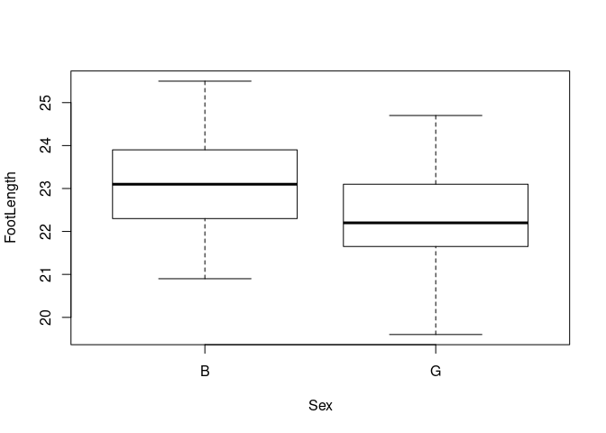

One-Way Anova
================
Last Updated: 01, November, 2022 at 19:19

-   <a href="#fake" id="toc-fake">Fake</a>
    -   <a href="#make-some-population-data"
        id="toc-make-some-population-data">Make some population data</a>
    -   <a href="#sample-from-the-populations"
        id="toc-sample-from-the-populations">Sample from the populations</a>
    -   <a href="#run-classic-anova" id="toc-run-classic-anova">Run classic
        ANOVA</a>
    -   <a href="#run-glm" id="toc-run-glm">Run GLM</a>
    -   <a href="#change-contrasts" id="toc-change-contrasts">Change
        contrasts</a>
-   <a href="#real-data-feet" id="toc-real-data-feet">Real data: feet</a>
-   <a href="#real-data-flies" id="toc-real-data-flies">Real data: flies</a>

``` r
library(reshape)
```

# Fake

## Make some population data

``` r
sample_size <- 15

population1 <- rnorm(100000, mean = 7.5, sd = 2)
population2 <- rnorm(100000, mean = 10, sd = 2)
population3 <- rnorm(100000, mean = 6, sd = 2)

hist(population1, breaks=100, col=rgb(1,0,0,0.2), main='', xlab = 'Penguin Weight')
hist(population2, breaks=100,  add=TRUE, col=rgb(0,1,0,0.2))
hist(population3, breaks=100,  add=TRUE, col=rgb(0,0,1,0.2))
title('Populations 1, 2, and 3')
```

<!-- -->

## Sample from the populations

``` r
france <- sample(population1, sample_size)
senegal <- sample(population2, sample_size)
japan <- sample(population3, sample_size)

hist(france, breaks=100, col=rgb(1,0,0,0.2), main='', xlab='Penguin Weight')
hist(senegal, breaks=100,  add=TRUE, col=rgb(0,1,0,0.2))
hist(japan, breaks=100,  add=TRUE, col=rgb(0,0,1,0.2))
title('Samples 1, 2, and 3')
```

<!-- -->

``` r
data <-data.frame(cbind(france,senegal,japan))
data<-melt(data, id.vars=c())
colnames(data) <- c('sample', 'weight')
data$sample<-factor(data$sample)
head(data)
```

    ##   sample   weight
    ## 1 france 8.382589
    ## 2 france 7.686666
    ## 3 france 6.716767
    ## 4 france 9.779120
    ## 5 france 8.297750
    ## 6 france 8.750631

``` r
tail(data)
```

    ##    sample   weight
    ## 40  japan 5.305449
    ## 41  japan 5.112406
    ## 42  japan 5.695557
    ## 43  japan 9.204709
    ## 44  japan 5.997825
    ## 45  japan 5.156102

``` r
boxplot(weight ~ sample, data = data)
```

<!-- -->

## Run classic ANOVA

``` r
result <- aov(weight ~ sample, data = data)
summary(result)
```

    ##             Df Sum Sq Mean Sq F value Pr(>F)  
    ## sample       2  33.85  16.923   4.731  0.014 *
    ## Residuals   42 150.23   3.577                 
    ## ---
    ## Signif. codes:  0 '***' 0.001 '**' 0.01 '*' 0.05 '.' 0.1 ' ' 1

## Run GLM

``` r
result <- lm(weight ~ sample, data = data)
summary(result)
```

    ## 
    ## Call:
    ## lm(formula = weight ~ sample, data = data)
    ## 
    ## Residuals:
    ##     Min      1Q  Median      3Q     Max 
    ## -3.2920 -1.3284 -0.1785  0.9751  4.2607 
    ## 
    ## Coefficients:
    ##               Estimate Std. Error t value Pr(>|t|)    
    ## (Intercept)     7.8943     0.4883  16.166   <2e-16 ***
    ## samplesenegal   0.6994     0.6906   1.013    0.317    
    ## samplejapan    -1.3875     0.6906  -2.009    0.051 .  
    ## ---
    ## Signif. codes:  0 '***' 0.001 '**' 0.01 '*' 0.05 '.' 0.1 ' ' 1
    ## 
    ## Residual standard error: 1.891 on 42 degrees of freedom
    ## Multiple R-squared:  0.1839, Adjusted R-squared:  0.145 
    ## F-statistic: 4.731 on 2 and 42 DF,  p-value: 0.01403

## Change contrasts

<https://stats.oarc.ucla.edu/r/library/r-library-contrast-coding-systems-for-categorical-variables/>

``` r
contrasts(data$sample) <- contr.sum(n = 3)
result <- lm(weight ~ sample, data = data)
summary(result)
```

    ## 
    ## Call:
    ## lm(formula = weight ~ sample, data = data)
    ## 
    ## Residuals:
    ##     Min      1Q  Median      3Q     Max 
    ## -3.2920 -1.3284 -0.1785  0.9751  4.2607 
    ## 
    ## Coefficients:
    ##             Estimate Std. Error t value Pr(>|t|)    
    ## (Intercept)   7.6649     0.2819  27.187   <2e-16 ***
    ## sample1       0.2294     0.3987   0.575   0.5682    
    ## sample2       0.9287     0.3987   2.329   0.0247 *  
    ## ---
    ## Signif. codes:  0 '***' 0.001 '**' 0.01 '*' 0.05 '.' 0.1 ' ' 1
    ## 
    ## Residual standard error: 1.891 on 42 degrees of freedom
    ## Multiple R-squared:  0.1839, Adjusted R-squared:  0.145 
    ## F-statistic: 4.731 on 2 and 42 DF,  p-value: 0.01403

# Real data: feet

``` r
library(tidyverse)
```

    ## ── Attaching packages ─────────────────────────────────────── tidyverse 1.3.2 ──
    ## ✔ ggplot2 3.3.6     ✔ purrr   0.3.4
    ## ✔ tibble  3.1.8     ✔ dplyr   1.0.9
    ## ✔ tidyr   1.2.0     ✔ stringr 1.4.0
    ## ✔ readr   2.1.2     ✔ forcats 0.5.2
    ## ── Conflicts ────────────────────────────────────────── tidyverse_conflicts() ──
    ## ✖ tidyr::expand() masks reshape::expand()
    ## ✖ dplyr::filter() masks stats::filter()
    ## ✖ dplyr::lag()    masks stats::lag()
    ## ✖ dplyr::rename() masks reshape::rename()

``` r
feet <- read_csv('data/feet.csv')
```

    ## Rows: 38 Columns: 7
    ## ── Column specification ────────────────────────────────────────────────────────
    ## Delimiter: ","
    ## chr (3): Sex, Foot, Hand
    ## dbl (4): Month, Year, FootLength, FootWidth
    ## 
    ## ℹ Use `spec()` to retrieve the full column specification for this data.
    ## ℹ Specify the column types or set `show_col_types = FALSE` to quiet this message.

``` r
head(feet)
```

    ## # A tibble: 6 × 7
    ##   Month  Year FootLength FootWidth Sex   Foot  Hand 
    ##   <dbl> <dbl>      <dbl>     <dbl> <chr> <chr> <chr>
    ## 1    10    87       23.4       8.8 B     L     L    
    ## 2    12    87       22.5       9.7 B     R     R    
    ## 3     1    88       23.2       9.8 B     L     R    
    ## 4     2    88       23.1       8.9 B     L     R    
    ## 5     3    88       23.7       9.7 B     R     R    
    ## 6     2    88       24.1       9.6 B     L     R

``` r
model <- lm(FootLength ~ Sex, data = feet)
summary(model)
```

    ## 
    ## Call:
    ## lm(formula = FootLength ~ Sex, data = feet)
    ## 
    ## Residuals:
    ##      Min       1Q   Median       3Q      Max 
    ## -2.72105 -0.73684 -0.08158  0.85789  2.37895 
    ## 
    ## Coefficients:
    ##             Estimate Std. Error t value Pr(>|t|)    
    ## (Intercept)  23.1421     0.2948  78.492   <2e-16 ***
    ## SexG         -0.8211     0.4170  -1.969   0.0567 .  
    ## ---
    ## Signif. codes:  0 '***' 0.001 '**' 0.01 '*' 0.05 '.' 0.1 ' ' 1
    ## 
    ## Residual standard error: 1.285 on 36 degrees of freedom
    ## Multiple R-squared:  0.09724,    Adjusted R-squared:  0.07216 
    ## F-statistic: 3.878 on 1 and 36 DF,  p-value: 0.05667

``` r
boxplot(FootLength ~ Sex, data = feet)
```

<!-- -->

# Real data: flies

<http://jse.amstat.org/datasets/fruitfly.txt>

``` r
flies <- read_csv('data/flies.csv')
```

    ## Rows: 125 Columns: 6
    ## ── Column specification ────────────────────────────────────────────────────────
    ## Delimiter: ","
    ## dbl (6): ID, PARTNERS, TYPE, LONGEVITY, THORAX, SLEEP
    ## 
    ## ℹ Use `spec()` to retrieve the full column specification for this data.
    ## ℹ Specify the column types or set `show_col_types = FALSE` to quiet this message.

``` r
head(flies)
```

    ## # A tibble: 6 × 6
    ##      ID PARTNERS  TYPE LONGEVITY THORAX SLEEP
    ##   <dbl>    <dbl> <dbl>     <dbl>  <dbl> <dbl>
    ## 1     1        8     0        35   0.64    22
    ## 2     2        8     0        37   0.68     9
    ## 3     3        8     0        49   0.68    49
    ## 4     4        8     0        46   0.72     1
    ## 5     5        8     0        63   0.72    23
    ## 6     6        8     0        39   0.76    83

``` r
model <- lm(LONGEVITY ~ TYPE, data = flies)
summary(model)
```

    ## 
    ## Call:
    ## lm(formula = LONGEVITY ~ TYPE, data = flies)
    ## 
    ## Residuals:
    ##     Min      1Q  Median      3Q     Max 
    ## -40.712 -14.105  -0.105  13.434  40.895 
    ## 
    ## Coefficients:
    ##             Estimate Std. Error t value Pr(>|t|)    
    ## (Intercept)  56.1050     1.8607  30.152   <2e-16 ***
    ## TYPE          0.6068     0.4567   1.329    0.186    
    ## ---
    ## Signif. codes:  0 '***' 0.001 '**' 0.01 '*' 0.05 '.' 0.1 ' ' 1
    ## 
    ## Residual standard error: 17.51 on 123 degrees of freedom
    ## Multiple R-squared:  0.01415,    Adjusted R-squared:  0.006135 
    ## F-statistic: 1.765 on 1 and 123 DF,  p-value: 0.1864

``` r
boxplot(LONGEVITY ~ TYPE, data = flies)
```

<!-- -->
