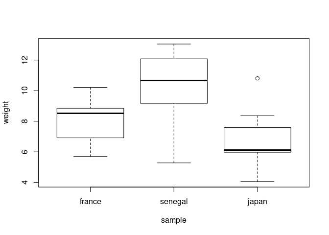

One-Way Anova
================
Last Updated: 10, November, 2022 at 08:54

-   <a href="#fake" id="toc-fake">Fake</a>
    -   <a href="#make-some-population-data"
        id="toc-make-some-population-data">Make some population data</a>
    -   <a href="#sample-from-the-populations"
        id="toc-sample-from-the-populations">Sample from the populations</a>
    -   <a href="#run-classic-anova" id="toc-run-classic-anova">Run classic
        ANOVA</a>
    -   <a href="#run-glm" id="toc-run-glm">Run GLM</a>
    -   <a href="#change-contrasts" id="toc-change-contrasts">Change
        contrasts</a>
        -   <a href="#deviation-contrasts" id="toc-deviation-contrasts">Deviation
            contrasts</a>
        -   <a href="#compare-with-data" id="toc-compare-with-data">Compare with
            data</a>
-   <a href="#real-data-feet" id="toc-real-data-feet">Real data: feet</a>
-   <a href="#real-data-flies" id="toc-real-data-flies">Real data: flies</a>

``` r
library(reshape)
```

# Fake

## Make some population data

``` r
sample_size <- 15

population1 <- rnorm(100000, mean = 7.5, sd = 2)
population2 <- rnorm(100000, mean = 10, sd = 2)
population3 <- rnorm(100000, mean = 6, sd = 2)

hist(population1, breaks=100, col=rgb(1,0,0,0.2), main='', xlab = 'Penguin Weight')
hist(population2, breaks=100,  add=TRUE, col=rgb(0,1,0,0.2))
hist(population3, breaks=100,  add=TRUE, col=rgb(0,0,1,0.2))
title('Populations 1, 2, and 3')
```

<!-- -->

## Sample from the populations

``` r
france <- sample(population1, sample_size)
senegal <- sample(population2, sample_size)
japan <- sample(population3, sample_size)

hist(france, breaks=100, col=rgb(1,0,0,0.2), main='', xlab='Penguin Weight')
hist(senegal, breaks=100,  add=TRUE, col=rgb(0,1,0,0.2))
hist(japan, breaks=100,  add=TRUE, col=rgb(0,0,1,0.2))
title('Samples 1, 2, and 3')
```

<!-- -->

``` r
data <-data.frame(cbind(france,senegal,japan))
data<-melt(data, id.vars=c())
colnames(data) <- c('sample', 'weight')
data$sample<-factor(data$sample)
head(data)
```

    ##   sample   weight
    ## 1 france 9.132046
    ## 2 france 8.866993
    ## 3 france 6.467537
    ## 4 france 6.521154
    ## 5 france 8.832558
    ## 6 france 5.692038

``` r
tail(data)
```

    ##    sample    weight
    ## 40  japan  6.029728
    ## 41  japan  6.027024
    ## 42  japan 10.800846
    ## 43  japan  8.361775
    ## 44  japan  4.057559
    ## 45  japan  6.117828

``` r
boxplot(weight ~ sample, data = data)
```

<!-- -->

## Run classic ANOVA

``` r
result <- aov(weight ~ sample, data = data)
summary(result)
```

    ##             Df Sum Sq Mean Sq F value   Pr(>F)    
    ## sample       2  100.9   50.43   15.39 9.71e-06 ***
    ## Residuals   42  137.7    3.28                     
    ## ---
    ## Signif. codes:  0 '***' 0.001 '**' 0.01 '*' 0.05 '.' 0.1 ' ' 1

## Run GLM

``` r
result <- lm(weight ~ sample, data = data)
summary(result)
```

    ## 
    ## Call:
    ## lm(formula = weight ~ sample, data = data)
    ## 
    ## Residuals:
    ##     Min      1Q  Median      3Q     Max 
    ## -5.0299 -0.7675  0.0969  1.1159  4.1190 
    ## 
    ## Coefficients:
    ##               Estimate Std. Error t value Pr(>|t|)    
    ## (Intercept)     8.0162     0.4675  17.148  < 2e-16 ***
    ## samplesenegal   2.2911     0.6611   3.466  0.00123 ** 
    ## samplejapan    -1.3343     0.6611  -2.018  0.04998 *  
    ## ---
    ## Signif. codes:  0 '***' 0.001 '**' 0.01 '*' 0.05 '.' 0.1 ' ' 1
    ## 
    ## Residual standard error: 1.811 on 42 degrees of freedom
    ## Multiple R-squared:  0.4228, Adjusted R-squared:  0.3954 
    ## F-statistic: 15.39 on 2 and 42 DF,  p-value: 9.707e-06

## Change contrasts

<https://stats.oarc.ucla.edu/r/library/r-library-contrast-coding-systems-for-categorical-variables/>

### Deviation contrasts

Here, I use deviation coding: This coding system compares the mean of
the dependent variable for a given level to the overall mean of the
dependent variable.

``` r
contrasts(data$sample) <- contr.sum(n = 3)
result <- lm(weight ~ sample, data = data)
summary(result)
```

    ## 
    ## Call:
    ## lm(formula = weight ~ sample, data = data)
    ## 
    ## Residuals:
    ##     Min      1Q  Median      3Q     Max 
    ## -5.0299 -0.7675  0.0969  1.1159  4.1190 
    ## 
    ## Coefficients:
    ##             Estimate Std. Error t value Pr(>|t|)    
    ## (Intercept)   8.3351     0.2699  30.883  < 2e-16 ***
    ## sample1      -0.3190     0.3817  -0.836    0.408    
    ## sample2       1.9722     0.3817   5.167 6.18e-06 ***
    ## ---
    ## Signif. codes:  0 '***' 0.001 '**' 0.01 '*' 0.05 '.' 0.1 ' ' 1
    ## 
    ## Residual standard error: 1.811 on 42 degrees of freedom
    ## Multiple R-squared:  0.4228, Adjusted R-squared:  0.3954 
    ## F-statistic: 15.39 on 2 and 42 DF,  p-value: 9.707e-06

``` r
data
```

    ##     sample    weight
    ## 1   france  9.132046
    ## 2   france  8.866993
    ## 3   france  6.467537
    ## 4   france  6.521154
    ## 5   france  8.832558
    ## 6   france  5.692038
    ## 7   france  7.935718
    ## 8   france 10.211630
    ## 9   france  6.008655
    ## 10  france  7.309716
    ## 11  france  7.637482
    ## 12  france  8.520361
    ## 13  france  9.652237
    ## 14  france  8.741230
    ## 15  france  8.713195
    ## 16 senegal 12.150618
    ## 17 senegal  5.277399
    ## 18 senegal 12.727207
    ## 19 senegal 13.047310
    ## 20 senegal  8.416281
    ## 21 senegal  9.801193
    ## 22 senegal 10.664118
    ## 23 senegal 10.404217
    ## 24 senegal  9.825719
    ## 25 senegal 11.230005
    ## 26 senegal  8.544779
    ## 27 senegal 12.765590
    ## 28 senegal  6.651629
    ## 29 senegal 12.010281
    ## 30 senegal 11.093289
    ## 31   japan  7.973793
    ## 32   japan  7.853446
    ## 33   japan  7.334599
    ## 34   japan  5.593767
    ## 35   japan  4.502954
    ## 36   japan  5.914364
    ## 37   japan  6.501367
    ## 38   japan  6.066000
    ## 39   japan  7.093355
    ## 40   japan  6.029728
    ## 41   japan  6.027024
    ## 42   japan 10.800846
    ## 43   japan  8.361775
    ## 44   japan  4.057559
    ## 45   japan  6.117828

``` r
model.matrix(result)
```

    ##    (Intercept) sample1 sample2
    ## 1            1       1       0
    ## 2            1       1       0
    ## 3            1       1       0
    ## 4            1       1       0
    ## 5            1       1       0
    ## 6            1       1       0
    ## 7            1       1       0
    ## 8            1       1       0
    ## 9            1       1       0
    ## 10           1       1       0
    ## 11           1       1       0
    ## 12           1       1       0
    ## 13           1       1       0
    ## 14           1       1       0
    ## 15           1       1       0
    ## 16           1       0       1
    ## 17           1       0       1
    ## 18           1       0       1
    ## 19           1       0       1
    ## 20           1       0       1
    ## 21           1       0       1
    ## 22           1       0       1
    ## 23           1       0       1
    ## 24           1       0       1
    ## 25           1       0       1
    ## 26           1       0       1
    ## 27           1       0       1
    ## 28           1       0       1
    ## 29           1       0       1
    ## 30           1       0       1
    ## 31           1      -1      -1
    ## 32           1      -1      -1
    ## 33           1      -1      -1
    ## 34           1      -1      -1
    ## 35           1      -1      -1
    ## 36           1      -1      -1
    ## 37           1      -1      -1
    ## 38           1      -1      -1
    ## 39           1      -1      -1
    ## 40           1      -1      -1
    ## 41           1      -1      -1
    ## 42           1      -1      -1
    ## 43           1      -1      -1
    ## 44           1      -1      -1
    ## 45           1      -1      -1
    ## attr(,"assign")
    ## [1] 0 1 1
    ## attr(,"contrasts")
    ## attr(,"contrasts")$sample
    ##         [,1] [,2]
    ## france     1    0
    ## senegal    0    1
    ## japan     -1   -1

### Compare with data

``` r
# Fitted coefficients
result$coefficients
```

    ## (Intercept)     sample1     sample2 
    ##   8.3351242  -0.3189541   1.9721847

``` r
all_data <- c(france, senegal, japan)
grand_mean <- mean(all_data)
mean_senegal <- mean(senegal)
mean_france <- mean(france)

delta1 <- mean_france - grand_mean
delta2 <- mean_senegal - grand_mean


# Japan is reference == assumed to be grand mean

c(grand_mean, delta1, delta2)
```

    ## [1]  8.3351242 -0.3189541  1.9721847

# Real data: feet

``` r
library(tidyverse)
```

    ## ── Attaching packages ─────────────────────────────────────── tidyverse 1.3.2 ──
    ## ✔ ggplot2 3.3.6     ✔ purrr   0.3.4
    ## ✔ tibble  3.1.8     ✔ dplyr   1.0.9
    ## ✔ tidyr   1.2.0     ✔ stringr 1.4.0
    ## ✔ readr   2.1.2     ✔ forcats 0.5.2
    ## ── Conflicts ────────────────────────────────────────── tidyverse_conflicts() ──
    ## ✖ tidyr::expand() masks reshape::expand()
    ## ✖ dplyr::filter() masks stats::filter()
    ## ✖ dplyr::lag()    masks stats::lag()
    ## ✖ dplyr::rename() masks reshape::rename()

``` r
feet <- read_csv('data/feet.csv')
```

    ## Rows: 38 Columns: 7
    ## ── Column specification ────────────────────────────────────────────────────────
    ## Delimiter: ","
    ## chr (3): Sex, Foot, Hand
    ## dbl (4): Month, Year, FootLength, FootWidth
    ## 
    ## ℹ Use `spec()` to retrieve the full column specification for this data.
    ## ℹ Specify the column types or set `show_col_types = FALSE` to quiet this message.

``` r
head(feet)
```

    ## # A tibble: 6 × 7
    ##   Month  Year FootLength FootWidth Sex   Foot  Hand 
    ##   <dbl> <dbl>      <dbl>     <dbl> <chr> <chr> <chr>
    ## 1    10    87       23.4       8.8 B     L     L    
    ## 2    12    87       22.5       9.7 B     R     R    
    ## 3     1    88       23.2       9.8 B     L     R    
    ## 4     2    88       23.1       8.9 B     L     R    
    ## 5     3    88       23.7       9.7 B     R     R    
    ## 6     2    88       24.1       9.6 B     L     R

``` r
model <- lm(FootLength ~ Sex, data = feet)
summary(model)
```

    ## 
    ## Call:
    ## lm(formula = FootLength ~ Sex, data = feet)
    ## 
    ## Residuals:
    ##      Min       1Q   Median       3Q      Max 
    ## -2.72105 -0.73684 -0.08158  0.85789  2.37895 
    ## 
    ## Coefficients:
    ##             Estimate Std. Error t value Pr(>|t|)    
    ## (Intercept)  23.1421     0.2948  78.492   <2e-16 ***
    ## SexG         -0.8211     0.4170  -1.969   0.0567 .  
    ## ---
    ## Signif. codes:  0 '***' 0.001 '**' 0.01 '*' 0.05 '.' 0.1 ' ' 1
    ## 
    ## Residual standard error: 1.285 on 36 degrees of freedom
    ## Multiple R-squared:  0.09724,    Adjusted R-squared:  0.07216 
    ## F-statistic: 3.878 on 1 and 36 DF,  p-value: 0.05667

``` r
boxplot(FootLength ~ Sex, data = feet)
```

<!-- -->

# Real data: flies

<http://jse.amstat.org/datasets/fruitfly.txt>

``` r
flies <- read_csv('data/flies.csv')
```

    ## Rows: 125 Columns: 6
    ## ── Column specification ────────────────────────────────────────────────────────
    ## Delimiter: ","
    ## dbl (6): ID, PARTNERS, TYPE, LONGEVITY, THORAX, SLEEP
    ## 
    ## ℹ Use `spec()` to retrieve the full column specification for this data.
    ## ℹ Specify the column types or set `show_col_types = FALSE` to quiet this message.

``` r
head(flies)
```

    ## # A tibble: 6 × 6
    ##      ID PARTNERS  TYPE LONGEVITY THORAX SLEEP
    ##   <dbl>    <dbl> <dbl>     <dbl>  <dbl> <dbl>
    ## 1     1        8     0        35   0.64    22
    ## 2     2        8     0        37   0.68     9
    ## 3     3        8     0        49   0.68    49
    ## 4     4        8     0        46   0.72     1
    ## 5     5        8     0        63   0.72    23
    ## 6     6        8     0        39   0.76    83

``` r
model <- lm(LONGEVITY ~ TYPE, data = flies)
summary(model)
```

    ## 
    ## Call:
    ## lm(formula = LONGEVITY ~ TYPE, data = flies)
    ## 
    ## Residuals:
    ##     Min      1Q  Median      3Q     Max 
    ## -40.712 -14.105  -0.105  13.434  40.895 
    ## 
    ## Coefficients:
    ##             Estimate Std. Error t value Pr(>|t|)    
    ## (Intercept)  56.1050     1.8607  30.152   <2e-16 ***
    ## TYPE          0.6068     0.4567   1.329    0.186    
    ## ---
    ## Signif. codes:  0 '***' 0.001 '**' 0.01 '*' 0.05 '.' 0.1 ' ' 1
    ## 
    ## Residual standard error: 17.51 on 123 degrees of freedom
    ## Multiple R-squared:  0.01415,    Adjusted R-squared:  0.006135 
    ## F-statistic: 1.765 on 1 and 123 DF,  p-value: 0.1864

``` r
boxplot(LONGEVITY ~ TYPE, data = flies)
```

<!-- -->
